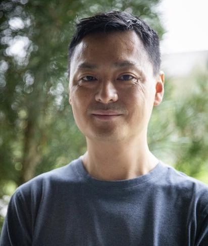

### Biosketch

  

  

  David Chiu is a Professor of Computer Science at the <a href="https://www.pugetsound.edu/academics/computer-science">University of Puget Sound</a>. He also completed a 3-year rotation as Department Chair from 2019-22. He is the inaugural advisor to the <a href="https://www.pugetsound.edu/living-learning-communities/students-color-residential-community">Students of Color Living-and-Learning Community</a>.
  

  

  David obtained a PhD in Computer Science and Engineering from  <a href="https://cse.osu.edu">The Ohio State University</a> as a member of the <a href="https://cse.osu.edu/research/systems">Systems Group</a>. He was supervised by <a href="https://scholar.google.com/citations?user=kOUPR1sAAAAJ&hl=en">Gagan Agrawal</a> (now the founding Director of University of Georgia's School of Computing), and worked on problems in the dynamic composition, system modeling, and performance optimizations of scientific workflows over cloud computing environments. He also studied under <a href="https://en.wikipedia.org/wiki/Paul_S._Wang">Paul S. Wang</a> at the Institute of Computational Mathematics at Kent State on the transmission of math education modules for his BS and MS degrees in Computer Science. He has published numerous papers in data management and cloud computing, and regularly serves on conference organization and program committees.
  

  

  David has over 20 years of college teaching experience and is heavily engaged in research with undergraduate students. He is the recipient of multiple teaching and research awards, including the <a href="https://www.pugetsound.edu/presidents-excellence-teaching-award">President's Award for Excellence in Teaching</a> (2022) and the Bartanen Research Award (2017) both from the University of Puget Sound, and the Eleanor Quinlan Award for Excellence in Teaching from The Ohio State University. He is a Member of ACM and a Senior Member of IEEE.
  

  

  

    
  

Here's a link to my [curriculum vitae](CV.pdf).

### Recent Activities
- (10/2023) Our paper, "Workload-Aware Cache Management of Bitmap Indices" has been accepted for publication at BDCAT 2023. Congratulations to my student co-author Julia Kaeppel!
- (8/2023) Appointed to serve on the Total Compensation and Benefits Project, University of Puget Sound.
- (7/2023) Serving on the PC for [BDCAT 2023](https://bdcat-conference.org/).
- (4/2023) Congrats to Julia Kaeppel on receiving a McCormick Student Research Award.
- (2/2023) Appointed to serve as the inaugural Advisor to Student of Color Residential Community (SCRC), University of Puget Sound.
- (1/2023) Featured in the ["Five Questions Series"](https://www.pugetsound.edu/stories/five-questions-university-puget-sound-professor-computer-science-david-chiu) in [Arches](https://www.pugetsound.edu/arches-magazine) magazine.
- (8/2022) Received an NSF grant to provide travel scholarships to students attending IEEE/ACM UCC 2022 and BDCAT 2022 conferences. I am also chairing the student travel awards committee.
- (8/2022) Received the President's Award for Excellence in Teaching.
- (5/2022) Co-chairing the Poster Program at IEEE/ACM [UCC 2022](https://ucc-conference.org/) and [BDCAT 2022](https://bdcat-conference.org/), both to be held in Portland, Oregon in December.
- (4/2022) Promoted to Full Professor, effective July 2022.
- (4/2022) Serving as a PC member for IDEAS 2022.
- (8/2021) Faculty Panelist (with Monica DeHart and Melvin Rouse) for the "I Am Puget Sound" student orientation program.
- (7/2021) Chairing the Demo/Short Paper Session at SSDBM 2021, and I'm also giving a talk, "Caching Support for Range Query Processing on Bitmap Indices."
- (5/2021) Our paper on bitmap caching has been accepted to SSDBM 2021 as a long paper. Congrats to Sarah McClain (BS'20), Manya Mutschler-Aldine (BS'21), and Colin Monaghan (BS'22).
- (6/2020) Elevation to IEEE Senior Member grade.
- (4/2020) Congrats to Colin Monaghan on receiving a summer research grant to study replacement policies in bitmap index caching.
- (2/2020) Our paper on optimizing GPU processing of bitmaps has been accepted for publication at DASFAA 2020.
- (10/2019) Our paper on GPU processing of bitmap-range queries has been accepted for publication at BDCAT 2019. It was nominated for the Best Paper award.
- (4/2019) Our paper on geo-diversification has been accepted for publication at IEEE CLOUD 2019 in Milan, Italy. Congrats to Jared Polonitza on his first publication.
- (4/2019) Congrats to Sarah McClain on receiving a summer research grant to work on semantic caching of bitmap indices.
- (3/2019) Serving on the PC for HiPC'19. Please consider submitting a paper.
- (10/2018) Our paper on distributed bitmap indexing has been accepted for publication at BDCAT'18. It was nominated for the Best Paper award.

### Quick Links

- Leave the CS department [some feedback](https://forms.gle/Ltassc7BQkNfnnXB7).
