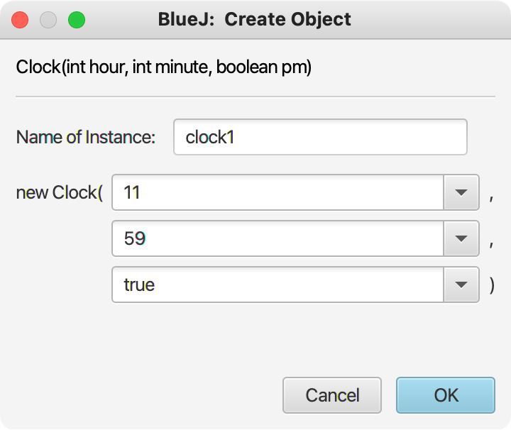
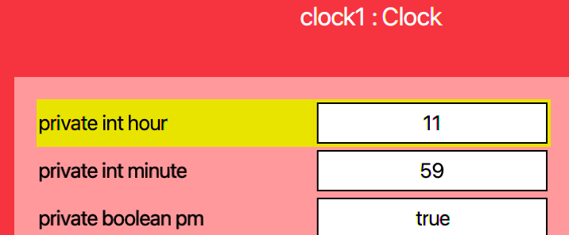
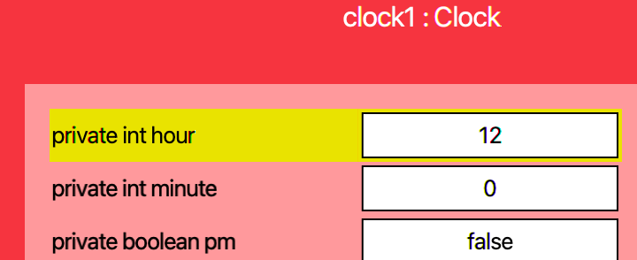

## CS 161 - Intro to Computer Science

### Homework: Clock


#### Student Outcomes

- To practice writing Java programs from scratch
- To use integer operations
- To use print statements and concatenation
- To use parameters, fields, and local variables
- To use if-else statements

#### Required Files

There are no starter files provided for this project. To create a new project, follow these instructions:   
  1. Open BlueJ. It might show you the most recently opened project, but that's okay.
  2. Click on the `BlueJ` menu (called `File` menu in Windows) on top.
  3. Select `New Project...`
  4. BlueJ will ask you for a project name. You can name it `OrcaCard` or whatever you see fit.
  5. Then it asks you for the location to store the project. Click `Choose` and I'd put it along with your other projects for this class (hopefully in a Google Drive folder).
  6. Then click `OK`. BlueJ will automatically give you a sample class. You can remove it, and start clean.


#### Instructions

In this project, you will put in the work to write a class of (alarm) Clocks.

- **Instance Variables:** What do all clocks need to remember about themselves? Well, your clocks for this project need to store the hour, minute, and whether it is am/pm. (You can ignore seconds.) For the am/pm indicator, I would use a `boolean` data type to store an instance variable called `pm`.

- **Define two constructors:** The first (default constructor) should initialize the current time to 00:00, and needs no input parameters.  The second constructor should be written to accept the hour, minute, and a boolean indicating whether the clock should be read as am or pm.

- Implement a method called `tickUp()`. It returns and inputs nothing. Calling it will tick the minute up by one. Be careful though. If the current minute is at 59, then `tickUp()` should cause the hour to increment, and reset the minute to 0. Taking this idea further, if the hour increments from 11 to 12, then the am/pm state needs to be flipped. Furthermore, if the hour increments from 12, then you need to set it back to 1! the current time is 11:59, then `tickUp()` should not only reset the minute to 0, but reset the hour to 1, as well as "flipping" am to pm, or vice versa.

  - Yes this will require you to write if-statements in order to test if your hours/minutes are in one of those boundary conditions.

  - Test by creating a clock representing 11:59pm.

    

  - Inspect the object to ensure your state is correct:

    


  - Ticking up the clock once should make it 12:00am. Inspect the object after you tick up to show:

    

  - Test out some other times (with no wraparounds), just to convince yourself that you're doing everything properly.

- Next, create a new method called `tickDown()`. It should have the opposite effect of `tickUp()`. Each call should tick the minute down by one. Again, beware of "boundary conditions" just like before.

- Now add a new method called `showTime()` that returns nothing, and inputs whether the string should be returned in military (24-hour) style. If the `military` option is `false`, this method should return the current time as a string in the following format `"hh:mm am/pm"`. Otherwise (the military option is set to `true`), you should return the current time as a string `"hh:mm`, but remember to add 12 to the hour if it's current pm.

  - Note that the format calls for you to concatenate a leading 0 to the hour or minute if the current hour or minute is single-digit.

  - For example, suppose your clock's state is set to hour = 9, minute = 4, pm = true.
    - Calling `showTime(false)` would print: `"09:04 pm"`
    - Calling `showTime(true)` would print: `"21:04"`


#### Alarm Function
When you've tested everything you've written so far, let's add some new functionalities. Specifically, we want to add an alarm function.

- We need to store more instance variables. Add 3 more instance variables, that will capture the hour, minute, and am/pm of the alarm.

- Because you added instance variables, you need to go back into your constructors to initialize them. Let's go ahead and initialize them to `-1`, `-1`, and `false`, respectively.

- Write a new method `setAlarm()` that returns nothing, but takes as input the hour, minute, and am/pm of an alarm the caller would like to set. Assign your new instance variables to the values that are input.

- Write a method called `unsetAlarm()` that returns nothing, and resets the hour, minute, and am/pm status of your alarm to `-1`, `-1`, and `false`, respectively.

- Writ a method `alarmSet()` that accepts no inputs, but returns the status of the alarm. If the hour and minute of the alarm are both set to `-1`, then this method returns `false` (that is, no alarm is set). Otherwise, this method returns `true`.

- Next, inside `tickUp()`, you'll need to add some code to check if the current time (after ticking up) matches the alarm time. If the hour, minute, and am/pm status all match, then you should print `***** BEEP BEEP BEEP *****` to the terminal. Make sure `tickDown()` also checks for the alarm to go off.

#### Grading

```
This assignment will be graded out of a total of 100pts.

[5pts] Appropriate instance variables have been defined for this class.
       No local variables are defined as instance variables.

[10pts] Both constructors are properly implemented.

[20pts] tickUp() moves the clock ahead by 1 minute, which may cause am/pm to flip. It may   
        also cause the hour and minutes to "wrap around" to the beginning.

[20pts] tickDown() moves the clock back by 1 minute, which may cause am/pm to flip. It may   
        also cause the hour and minutes to "wrap around" to the beginning.

[20pts] The showTime() method accepts an input and prints the current time in either 
        military (24-hour) time, or 12-hour time with am/pm status. If either hour or minute is single digit, then a leading 0 is appended.

[10pts] The setAlarm() and unsetAlarm() methods are properly implemented.

[10pts] tickUp() and tickDown() further print out ***** BEEP BEEP BEEP **** if the time now 
        matches the alarm that is set.

[5pts] You include sufficient inline and block comments to explain the logic of your methods.
```

#### Submitting Your Assignment

After you have completed the assignment, use the following to submit your work.
Exit BlueJ

- Open your computer's File Finder (some times called File Explorer). Locate the project folder.

- Right-click on the project folder, then:

  - If using Windows, select Send to then Zip file
  - If using MacOS, select Compress ... items
  - This step takes your selected creates a .zip file that you will submit to me.

  It's really important you got this right. If you have doubts, ask one of us to check for you! I recommend that you double-check by opening the zip file, and investigating the contents to ensure that all the files are in there.

- Navigate to our course page on Canvas and click on the assignment to which you are submitting.

- Click on Submit Assignment, and you should be able to "browse" for your file

- Select the `.zip` you just created, and click Submit Assignment again to upload it.

- You may submit as often as you'd like before the deadline. I will grade the most recent copy.

#### Credits

Adapted for use from a previous assignment by Brad Richards. Shape classes provided by BlueJ.
