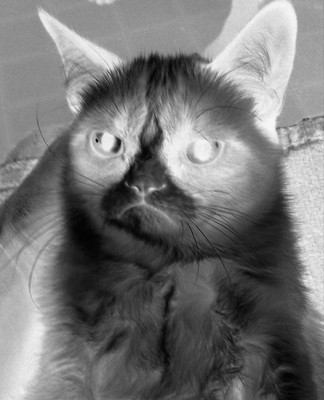

## CS 161 - Intro to Computer Science

### Homework: Fotoshop

Digital image processing is an important field of study in computer science, with 
widespread applications in medicine, space exploration, photo-editing tools (e.g., 
Photoshop), and so on. In this homework, you'll be implementing some of the basic
image-transformation techniques. 


A <b>digital image</b> can be modeled as a 2D array 
containing <code>height</code> rows
and <code>width</code> columns. Each element in the 2D array is known as a <b>Pixel</b> 
(short for <i>picture element</i>), which is just an integer ranging between black (0) 
and white (255). For example, a 2D array with the following contents:

```txt
0   128 255
255 128 0
```

Would render into the following 2 x 3 image (which has been zoomed in so it's easier to see):


As you can see, each integer in the 2D array corresponds to a gray pixel intensity value. Values closer to zero tend towards black, and closer to 255 tend towards white.

#### Student Outcomes

- More practice with nested loops and 2D arrays

#### Required Files

The following file(s) have been provided for this assignment.

- [Hwk_Fotoshop.zip](Hwk_Fotoshop.zip)

#### Instructions

- After you unzip the starter code, you'll find the following files:
  - `cat.jpg`: An image of Grumpy Cat.
  - `camera.jpg`: An grainy photo of a camera person.
  - `road.jpg`: A high resolution photo of a road.
  - `Image.java`: This is the `Image` class, which represents a greyscale image and offers services to manipulate this image. There are several methods left for you to implement.
  - `Fotoshop.java`: This is the `Fotoshop` class, which just contains the main method you would run to manipulate the image.

- Open the `Image` class that has been provided. Scroll to the bottom and you will find the following methods already implemented. **Do not modify these methods!**

  - `public void open(String filename)`: Opens the given filename and reads it into the 2D array.
  - `public void save(String targetFilename)`: Saves the current `Image` to the given filename.
  - `public String toString()`: Returns the image in String format.

- You don't need to declare any more instance variables besides the ones that are already declared. The `canvas` field will store the entire image as a 2D array of values ranging from 0 to 255. There are `height` rows, and `width` columns in this 2D array. All of these fields will be automatically populated upon calling `open()` in the constructor.

- Write a method called `inverse()`. It iterates through all pixel elements in your 2D array and negates their values. For instsance, 0 becomes 255, 1 becomes 254, 2 becomes 253, and so on. 


- Write a method called `gamma()` that takes as input a `double` named `gamma`. It loops through all Pixel elements in your 2D array and applies sets all pixel values to the value of the pixel raised to the power of `gamma`. Recall that you can raise $$a$$ to the power of $$b$$ by using the method `Math.pow(a,b)`.

Before moving on to the next section, you should test everything out to check whether everything's working so far. Check out the examples below (type into the `main` method inside the `Fotoshop` class). If successful, open up the BlueJ project folder, and double-click to open the new jpeg file after transformation. You should get the results that follow:

##### Examples of Pixel Intensity Transformations
<center>
	<table width="100%">
	<tr>
	<td width="50%">
	<code>Image cat = new Image("cat.jpg");<br/>cat.gamma(0.85);  // Darken<br/>cat.save("cat-gamma.pgm");</code><br/>
	
	</td>
	<td width="50%">
	<code>Image cat = new Image("cat.jpg");<br/>cat.inverse();<br/>cat.save("cat-inv.jpg");</code><br/>
	
	</td>
	</tr>
	</table>
</center>

#### Rotation and Flipping

- Write a method `flipHorizontal()` that will flip your 2D array along the horizontal (x) axis. The Pixels on the left-hand side of the image get swapped over to the right-hand side. For instance,

    ```txt
    for all rows y:
    canvas[y][0] should get swapped with canvas[y][width-1]
    canvas[y][1] should get swapped with canvas[y][width-2]
    canvas[y][2] should get swapped with canvas[y][width-3]
    and so on...
    ```

- Write a method `flipVertical()` that will flip your 2D array along the vertical (y) axis. The Pixels on the top of the image get swapped over to the bottom. For instance,

    ```txt
    for all columns x:
    canvas[0][x] should get swapped with canvas[height-1][x]
    canvas[1][x] should get swapped with canvas[height-2][x]
    canvas[2][x] should get swapped with canvas[height-3][x]
    and so on...
    ```


##### Examples of Flipping
<center>
	<table width="100%">
	<tr>
	<td width="50%">
	<code>Image road = new Image("road.jpg");<br/>road.flipHorizontal();<br/>road.save("road-new.jpg");</code><br/>
	
	</td>
	<td width="50%">
	<code>Image road = new Image("road.jpg");<br/>road.flipVertical();<br/>road.save("road-new.jpg");</code><br/>
	
	</td>
	</tr>
	</table>
</center>

#### Smoothing (Noise Reduction)
Some images, like the one shown below can be grainy (also called "noise"). This can happen when you take pictures in low light. A common technique that can be used is called noise reduction. This process reduces noise by making the image appear fuzzier or smoother. 

- Write a method `smooth()` that will smooth out the image. In this method, first create a new 2D array, `tempCanvas` with the same dimensions as `canvas`. For each pixel in the `canvas` array, you'll want to set it to the average value of itself and its 8 neighbors. So, for a pixel at `canvas[y][x]`, assign `tempCanvas[y][x]` to this average. After you're done, reassign `canvas` to `tempCanvas`. 

- Be careful not to go out of bounds! For instance, a pixel on the corners would only have 3 neighbors. 

##### Examples of Smoothing
In the picture to the right, notice that the graininess is less pronounced due to smoothing, but the image loses its sharpness because of it. This is a well known trade off of smoothing.
<center>
	<table width="100%">
	<tr>
	<td width="50%">
	<code>Original camera.jpg<br/><br/></code><br/>
	
	</td>
	<td width="50%">
	<code>Image cameraperson = new Image("camera.jpg");<br/>cameraperson.smooth();<br/>cameraperson.save("camera-smooth.jpg");</code><br/>
	
	</td>
	</tr>
	</table>
</center>


#### Grading

```
This assignment is graded out of 70 total pts.

[10 pts] Completion of inverse()
[10 pts] Completion of gamma()
[15 pts] Completion of flipVertical()
[15 pts] Completion of flipHorizontal()
[20 pts] Completion of smooth()
```


#### Submitting Your Assignment
Follow these instructions to submit your work. You may submit as often as you'd like before the deadline. I will grade the most recent copy.

- Navigate to our course page on Canvas and click on the assignment to which you are submitting. Click on "Submit Assignment."

- Upload all files ending in  `.java` from your project folder.

- Click "Submit Assignment" again to upload it.

#### Credits

Written by David Chiu. 2023.

#### Lab Attendance Policies

Attendance is required for lab. Unexcused absence = no credit even if you turned in the lab. Unexcused tardiness = half credit.
