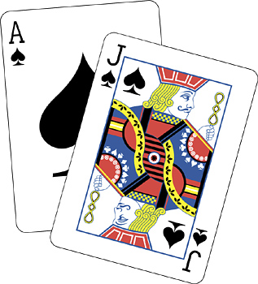

## CS 161 - Intro to Computer Science

### Final Project: Black Jack

Business at David's Casino is flourishing, but customers have been complaining that they're getting a bit bored of rock-paper-scissors, coin flipping, and guessing combinations. To scale up his business, David wants to host Black Jack, a popular game at most casinos. He wants to hire you to write an electronic Black Jack player. David offers you 5% of all Black Jack winnings if you can properly implement the game, so you agree...



#### Student Outcomes

- Use of constants, enums
- Writing the main method
- Scanning for user input

#### Required Files

The following file(s) have been provided for this assignment.

- [Hwk_BlackJack.zip](Hwk_BlackJack.zip)


#### Preliminary: Suits, Cards, and Decks
Now that we have a card and a deck of cards, we can begin thinking about how Black Jack is to be played. This assignment assumes that you have already done the work in Lab 13 to write the Suit, Card, and Deck classes. If you have not done so, you cannot continue this project until you've finished the lab.

#### BlackJack Explained
Black Jack requires users to hold a set of cards, called a "Hand." Players can add cards to their hand (called a "hit") as long as the sum of the cards (with minor exceptions) does not exceed 21. A player can never remove cards from the Hand once it's been added to their hand. The order of the cards in the hand does not matter, nor do the cards' suits.

At the beginning of the game, the player is dealt two cards to their hand from the deck. The values of these cards are added together. After evaluating the sum of their hand, the player may choose to "hit," drawing the top card from the deck and adding it to their hand. The objective is to get the sum of the hand as close to 21 as possible without exceeding it (exceeding 21 is called a bust, and you lose!). A player may also elect to "hold," which passes the turn to the dealer. The dealer then hits cards according to the same goal — getting as close to 21 as possible without busting.

A quick word on face values. The face value of each card can usually be added to the value of the hand, with a few exceptions:

- Jack (11), Queen (12), and King (13) all carry a value of **10** when added to the hand.
- A special (and slightly more complicated) exception is the Ace card, which can count as either 1 or 11 depending on the situation. Here's the rule for determining the value of an Ace in your hand:

  - The value of an Ace is *11* if it does not cause the hand to bust.
  - The value of an Ace is *1* if counting it as 11 would cause a bust.
  - You can have multiple Aces in your hand. In casinos, BlackJack is played with 8 decks, giving us 32 possible Ace cards. In the unlikely case where you end up with a hand of 21 Aces, each Ace would be counted as 1, giving you a total hand value of 21! (OK that would never happen in practice, but theoretically, it could, I guess.)
  - **Hint:** A practical way to calculate your hand value with Aces is:
    - Initially, treat each Ace as 11 by default, and add up all the rest of the cards too.
    - Then, if the total exceeds 21, subtract 10 for each Ace (changing its value from 11 to 1) until either the hand is legal (21 or less) or until you've adjusted all the Aces.
    - For example, if you had 3 Aces and a 5, you would start with 38 (11 + 11 + 11 + 5). Since 38 is over 21, subtract 10 for two of the Aces, bringing the total down to 18 (11 + 1 + 1 + 5).  

**Winning conditions:**
  - If the first two cards dealt add up to 21, the user wins immediately before the dealer even reveals their cards.
  - If the dealer's first two cards add up to 21, then the dealer wins.
  - When neither is the case, the player makes calculated decisions on whether to hit or hold, or until the hand goes bust. If the hand busts during this process, the player loses.
  - When the player holds, then the dealer must repeat this process. Generally, the dealer holds if their hand adds up to 18 or more. If the dealer busts during their hits, then the player wins.
  - When both player and dealer holds, their hands are added up and compared. Whomever has the higher value wins. The player and dealer may end the game on a tie (it's called a "push").

#### Writing the Hand Class

- This class should store an `ArrayList` of `Card`s, and also store a `Deck`, which represents all the `Card`s that have yet to be drawn by the dealer.

- Write a 1-argument constructor that takes as input a `Deck` object. Upon being called, it should remove the top two cards from the Deck, and add them to the hand.

- Write a 3-argument constructor that takes as inputs 2 `Card` objects and add them to your list. The third argument is a `Deck` object. 

- A method, `public int getValue()` which accepts no input arguments. It loops through all the `Card`s in the hand, and sums up their values, using the rules of counting the Aces described above. This sum is then returned to the caller.

- A method, `public boolean isBust()` which determines whether or not the hand is "bust." A hand is bust when value of the hand *exceeds* 21.

- A method, `public boolean isBlackJack()` which determines whether or not the current Hand holds a Black Jack. This can *only* occur when the the `Hand` holds exactly two cards, and the value of the Hand is **21**. Note that any other combination of Cards that adds up to **21** is not considered a Black Jack (e.g., three 7s is not a Black Jack).

- A method, `public void hit()` that draws the top card from the associated `Deck` instance variable and adds it to the current hand. If the hand is already bust, this method should have no effect. If the `Deck` is empty, you must call `replenish()` on it before drawing from the top.

- A method, `public boolean pushes(Hand other)` which accepts another `Hand` as input. It returns true if the current Hand's value ties the other Hand.

- A method, `public boolean defeats(Hand other)` which accepts another `Hand` as its only argument. It compares the current Hand with the given Hand, and:

  - A hand defeats the other, if the other hand is bust, and the current hand is not. It also defeats the other if neither hand is bust, and the current hand's value is higher than the other.

- The `public String toString()` method, which returns a String representing the Hand. The String should show each Card in the hand on the same line, followed by the value of the Hand and whether it is bust, and whether it is a Black Jack on the same line. See code examples below for help.

- The first example below shows the effect of counting Aces.

  ```java
  Deck dealerDeck = new Deck();
  Card c1 = new Card(Suit.CLUB, 1);
  Card c2 = new Card(Suit.DIAMOND, 1);
  Hand myHand = new Hand(c1, c2, dealerDeck);
  System.out.println(myHand);

  > <club,A> <diamond,A> (12)

  myHand.hit(); //got a queen (10)!
  System.out.println(myHand);

  > <club,A> <diamond,A> <diamond,Q> (12)

  myHand.hit(); //got another Ace (1)!
  System.out.println(myHand);

  > <club,A> <diamond,A> <diamond,Q> <heart,A> (13)

  myHand.hit(); //got a jack (10)!
  System.out.println(myHand);

  > <club,A> <diamond,A> <diamond,Q> <heart,A> <diamond,J> (23 -- Bust!)
  ```

- The following example shows a Black Jack, and some subsequent hits.

  ```java
  Deck dealerDeck = new Deck();
  Card c1 = new Card(Suit.CLUB, 1);
  Card c2 = new Card(Suit.SPADE, 12);
  Hand myHand = new Hand(c1, c2, dealerDeck);
  myHand.isBlackJack()
  > true   (boolean)

  System.out.println(myHand);
  > <club,A> <spade,Q> (21 -- Black Jack!)

  myHand.hit();
  System.out.println(myHand);
  > <club,A> <spade,Q> <heart,5> (16)

  myHand.hit();
  System.out.println(myHand);
  > <club,A> <spade,Q> <heart,5> <spade,J> (26 -- Bust!)

  myHand.hit(); //hit should have no effect since hand is bust
  System.out.println(myHand);
  > <club,A> <spade,Q> <heart,5> <spade,J> (26 -- Bust!)
  ```

- The final example shows the effect of comparing two hands.

  ```java
  //start with the same hands (both Black Jacks, in fact)
  Deck dealerDeck = new Deck();
  Hand myHand = new Hand(new Card(Suit.CLUB, 1), new Card(Suit.SPADE, 10), dealerDeck);
  Hand yourHand = new Hand(new Card(Suit.DIAMOND, 1), new Card(Suit.CLUB, 13), dealerDeck);
  myHand.defeats(yourHand)
  > false   (boolean)

  yourHand.defeats(myHand)
  > false   (boolean)

  yourHand.pushes(myHand)
  > true    (boolean)

  yourHand.hit();
  myHand.defeats(yourHand)
  > true   (boolean)

  System.out.println(yourHand);
  > <club,A> <spade,10> <heart,7> (18)

  System.out.println(myHand);
  > <club,A> <spade,10> (21 -- Black Jack!)

  myHand.hit();
  myHand.hit();
  myHand.defeats(yourHand)
  > false   (boolean)

  yourHand.defeats(myHand)
  > true   (boolean)

  System.out.println(myHand);
  > <club,A> <spade,10> <club,6> <spade,J> (27 -- Bust!)
  ```

#### Writing the Game Class

Good work! Now we need a way to play Black Jack with the computer. Do the following:

- Create a class `Game`. It will initiate the game itself when people run your program. It requires no fields. You may write as many (static) helper methods as you'd like, but you must provide a main method (below).

- Inside the `public static void main(String[] args)` method.

  - It starts by printing a "startup/welcome message" to user who will be playing against your algorithm. Then it needs to create a `Deck` and shuffle it a few times! Then create two Hands: a Hand for the AI and a Hand for the human-player. Make sure both AI and human-player Hands remember the Deck you just created.
  - If the human has a Black Jack, then the game ends. That is, neither the human nor the AI gets to hit. (The AI can push, or tie, if it also gets a Black Jack.) If the human doesn't get a Black Jack however, the game must go on.
  - Print the AI's second Card (but don't reveal the AI's first Card to the player). Also print the human's hand to the screen.
  - Prompt the user to either "hit" or "hold." Scan in the user's response. If they typed in "hit," then call `hit()` on their hand, and print out their hand again. Continue to prompt them until the human either busts or enters "hold."
  - If the user enters anything but "hit" or "hold," then you must output an error and re-prompt.
  - Afterwards, if the human is bust, then the AI doesn't need to hit. The human loses immediately. Otherwise, the AI hits until its Hand holds at least a value of 18, or they bust. After AI's action is performed, you must compare two hands (use your `defeats()` method in both directions: AI->Human and Human->AI), and either determine a winner or a tie.
  - When the game ends, you must print off both Hands and the result of the Game.

- The first example below shows the AI busting.

  ```
  *** Welcome to Black Jack! ***

  AI: <???>, <diamond,10>
  Player: <diamond,3> <heart,A> (14)

  What will you do (enter either hold or hit)?
  > hit

  AI: <???>, <diamond,10>
  Player: <diamond,3> <heart,A> <spade,5> (19)

  What will you do (enter either hold or hit)?
  > hold

  ***************************
  ***      Game Over      ***
  ***      You win!       ***
  ***************************
  AI: <diamond,4> <diamond,10> <spade,2> <club,7> (23 -- Bust!)
  Player: <diamond,3> <heart,A> <spade,5> (19)
  ```

- The second example shows that neither AI and human busts, but human wins.

  ```
  *** Welcome to Black Jack! ***
  AI: <???>, <diamond,A>
  Player: <diamond,3> <diamond,4> (7)
  What will you do (enter either hold or hit)?
  hit

  AI: <???>, <diamond,A>
  Player: <diamond,3> <diamond,4> <spade,7> (14)
  What will you do (enter either hold or hit)?
  hit

  AI: <???>, <diamond,A>
  Player: <diamond,3> <diamond,4> <spade,7> <diamond,4> (18)
  What will you do (enter either hold or hit)?
  hit

  AI: <???>, <diamond,A>
  Player: <diamond,3> <diamond,4> <spade,7> <diamond,4> <diamond,2> (20)
  What will you do (enter either hold or hit)?
  hold
  ***************************
  ***      Game Over      ***
  ***      You win!       ***
  ***************************
  AI: <diamond,8> <diamond,A> (19)
  Player: <diamond,3> <diamond,4> <spade,7> <diamond,4> <diamond,2> (20)
  ```

- The third example shows the human busting (and losing).

  ```
  *** Welcome to Black Jack! ***

  AI: <???>, <club,3>
  Player: <club,J> <heart,6> (16)
  What will you do (enter either hold or hit)?
  hit

  AI: <???>, <club,3>
  Player: <club,J> <heart,6> <diamond,6> (22 -- Bust!)

  ***************************
  ***      Game Over      ***
  ***      You lose!      ***
  ***************************
  AI: <club,3> <club,3> (6)
  Player: <club,J> <heart,6> <diamond,6> (22 -- Bust!)
  ```

- The final example shows a push (tie).

  ```
  *** Welcome to Black Jack! ***

  AI: <???>, <club,K>
  Player: <diamond,10> <heart,8> (18)
  What will you do (enter either hold or hit)?
  hold
  ***************************
  ***      Game Over      ***
  ***      You pushed     ***
  ***************************
  AI: <club,2> <club,K> <spade,5> <club,A> (18)
  Player: <diamond,10> <heart,8> (18)
  ```

#### Extensions

If you're finished and are looking for a challenge, consider the following extensions.

**Mild (and makes you look cool):** Package everything up as I showed in the slides, into a single package. Choose an icon for your BlackJack "app" and create a clickable button to start your game.

**Medium:** You might think about how you would save and restore a session. Let's say I've already started a game, and I currently have three cards, and the dealer has not revealed. I want to be able to type "save" and come back later. What do you need to store to a file so that this game can be restored at a later time?

**Medium:** Keep track of the list of top ten players. Your game would have to start by asking the player for their name. Use a file to store the list of top ten players by the number of games they've won.

**Medium:** Keep track of currency and bets. When the game starts, a user begins with some amount of money. At the beginning of each game before any cards are dealt, let the user place a bet. Do not allow this bet to exceed the user's balance (keep asking them to place a different bet until this condition is met). Then play a game. If the user wins, they receive the bet amount, and if they lose, they lose the bet. Don't just terminate the program after the game ends. Ask the user if they'd like to continue playing. If "yes" is entered, the start a new game, and terminate if "no" is entered or if the user's balance is zero. (This is even more fun if you could tie it in with the Top-10 list and with the "game saving" option mentioned above.)

**Spicy:** Allow the user to split a hand by inputting the command split from the terminal. Splitting can only occur when a hand contains two cards, and they both carry the same face value. If this condition does not hold, then you must reject the action, and continue playing the hand. If a split can occur, the current hand is split into two, each with just one of the cards from the original hand. The dealer then deals a card to both hands so that they each have two cards once more. Then the user plays and finishes a game on first hand, before finishing a game on the second hand. Yes, it is possible for an already-split hand to split again, if the second card is once again a duplicate. Hint: Use an ArrayList of hands.

#### Program Defensively

You can't control how another user or program chooses to use your methods. For each method, think critically about all the things that could go wrong and cause an unintended result (e.g., a runtime error, infinite loop/recursion, etc.). Chances are, I'll be trying all kinds of inputs (negative values, zeroes, nulls, empty-strings, etc.) when I grade your program. The mark of a good programmer is one that can anticipate such scenarios ahead of time and ensure that their program handles all sorts of errors gracefully.

#### Commenting

Each and every method should have a "javadoc-style" comment above it (the ones that use `/* ... */`). For full credit, you should use the @param and @return tags as appropriate in these method comments. Each instance variable (field) should have a brief comment as well. Don't forget the main comment at the top of the class either - I'm looking for more than just a sentence or two.

#### Grading

```
This assignment will be graded out of a total of 100pts.

Hand class
    [5pts] Both constructors are implemented.
    [20pts] getValue() properly returns the value of the hand.
    [5pts] getCardAt() is properly implemented, and checks for edge cases.
    [5pts] isBust() and isBlackJack() are implemented.
    [5pts] hit() is implemented.
    [5pts] pushes() and defeats() are implemented.
    [5pts] toString() returns the string representation of the current Hand.

Game class
    [35pts] The main method allows for user-interaction, and plays a full game of Black Jack.

Misc
    [5pts] You re-use code whenever possible.
    [5pts] You provide Javadocs style comments for any new methods implemented.
    [5pts] You include sufficient inline comments to explain the logic of your methods.
```

#### Submitting Your Assignment
Follow these instructions to submit your work. You may submit as often as you'd like before the deadline. I will grade the most recent copy.

- Navigate to our course page on Canvas and click on the assignment to which you are submitting. Click on "Submit Assignment."

- Upload all the files ending in `.java` from your project folder.

- Click "Submit Assignment" again to upload it.

#### Credits

Written by David Chiu.
