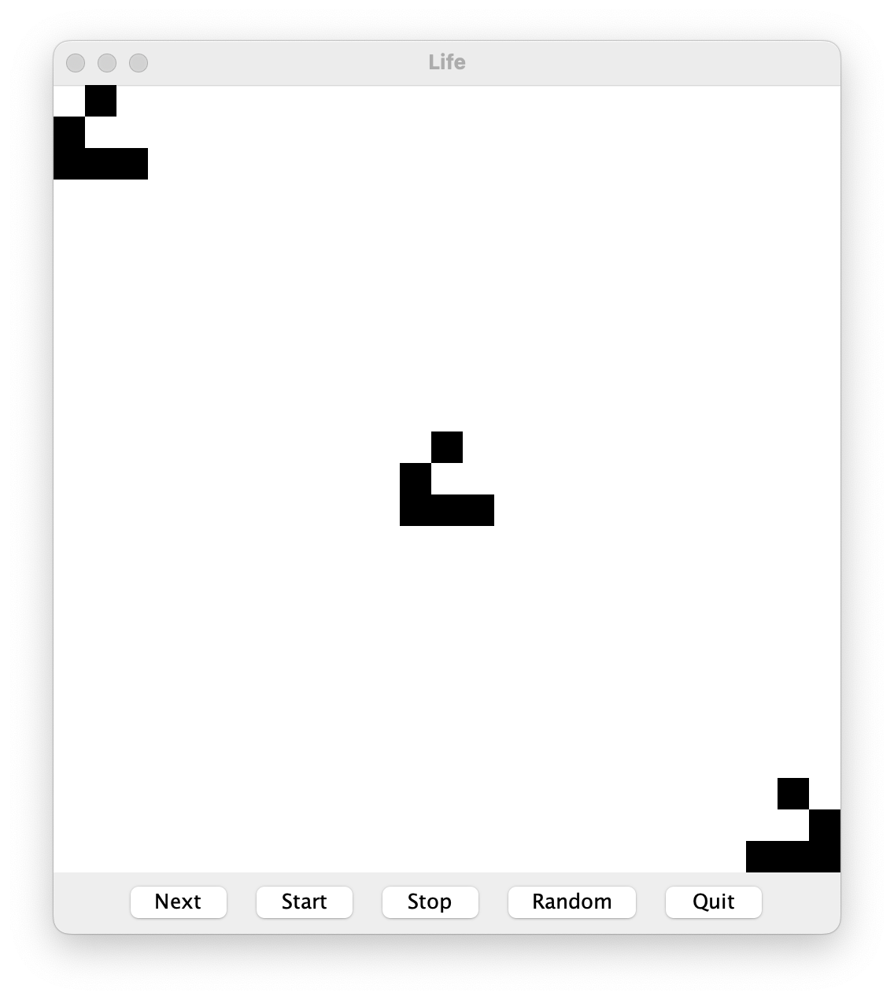

## CS 161 - Intro to Computer Science

### Lab: Conway's Game of Life
Conway's Game of Life is not just a fun curiosity (although it may have started as one). It has applications in biology (modeling evolutionary and life processes), physics (Modeling Reaction-Diffusion Systems), gaming, and artificial intelligence.

In this lab, you will implement <a href="http://conwaylife.com/" target="_new">Conway's Game of Life</a>, a classic example of a cellular automaton. The Game of Life simulates a grid-based "universe" of cells, where each cell can be either alive or inactive. The state of each cell evolves over time based on a simple set of rules that consider the states of neighboring cells. Despite its simplicity, the Game of Life can produce surprisingly complex and beautiful patterns, making it a powerful tool for exploring how complexity can emerge from simple rules.

Fun fact: The flooring in our CS student lounge inspired by "glider patterns" that emerge from playing Game of Life using hexagonal tiles instead of square tiles.

<center>&nbsp;&nbsp;
&nbsp;&nbsp;
</center>


#### Student Outcomes

- Experience with 2D arrays
- Practice with nested loops for traversing 2D arrays

#### Required Files

The following file(s) have been provided for this project.

- [Lab_Life.zip](Lab_Life.zip)


#### Part 1: Cell Class
The game is played on a square grid of cells. Each cell can either be alive or inactive, so this should be a very simple class to write.

- Create a new class `Cell`, which has a single instance variable that represents whether it is alive or inactive (a `boolean` ought to work).

- Write two constructors:

  - The default constructor has a 50%-50% chance of setting the state to inactive or alive. The `Random` class will again be useful here. It has a method called `nextBoolean()` that will randomly return `true` or `false` with 50%-50% probability.

    Recall that, to use the random number generator, you must first import it at the top of your file:
    ```java
    import java.util.Random;
    ```

    Then to use it, you need to instantiate a copy:
    ```java
    Random rng = new Random();
    // now you can call rng.nextBoolean() to return a boolean value!
    ```

  - A second constructor should allow users to input the initial value for the Cell's living state, instead of being randomly assigned.

  - Write a getter method named `state()` that takes no inputs and returns the living state of your `Cell`.

  - You can test your code from within the Code Pad:

    ```java
    Cell c = new Cell();
    c.state()
    > false  (boolean)  <--- your result may vary given 50-50 probability

    Cell anotherCell = new Cell(true);
    anotherCell.state()
    > true  (boolean)
    ```

  - After the Cell class has been implemented, the compile error in `Life` should disappear.

#### Part 2: Life Class

- Instance Variables: Because the Game of Life needs store a grid of Cell objects, you will need a 2D array of `Cells`. You should name this instance variable `board`. To declare a 2D array as an instance variable, you can use:
  ```java
  private data-type[][] array-name;
  ```

- Constructor: Fill in the constructor, which inputs the height and width of the `board`. Instantiate your `board` using these row and column dimensions. Recall that, you can use the syntax:
  ```java
  array-name = new data-type[number-of-rows][number-of-columns];
  ```
  Now after you've instantiated the `board` 2D array, call `fillSpaceShip()`. Let's test this out. Go back out to the project window, and instantiate a `LifeFrame` object. Do you see the following "spaceships?"

  &nbsp;&nbsp;


- Complete the `isAlive()` method, which inputs the `row` and `col` coordinates of the board, and returns whether the `Cell` at that location is alive. Now you need to be careful here. `row` and `col` could be given illegal values and out of bounds of the boundaries of the board. Return `false` when eitehr `row` or `col` are out of bounds. Otherwise, access the cell at position `[row][col]` and return its living status.

- Next, write the `fillRandom()` method. This method should fill your board with random `Cells` (that is randomly alive or inactive). Hey, your `new Cell()` default constructor already does that!
  - Now you need to go back to modify your constructor to call this method *after* it instantiates the empty 2D array.


- Right-click on `LifeFrame` and instantiate a new object. In the window that appears, you should see the three spaceships, but now hit the `"Random"` button to create a random community of cells. You may hit the `"Random"` button repeatedly to test whether `fillRandom()` is generating random cell communities. None of the other buttons should be working at this point. Close the window and move on to the next step.

#### Part 3: Counting Neighbors
We will now implement the methods that determine if a `Cell` should live or die. To do this, one of the key methods we need is a way to count the number of live neighbors for any given `Cell` at position `row` and `col`.

1. Complete the `countLivingNeighbors()` method, which inputs a `Cell`'s position at x and y, and returns the its number of _living_ neighboring `Cell` objects. Previously, I had you simply return 0 in this method so that we could test the code. Remove that line of code. Now, for a `Cell` object located at location `board[row][col]`, its 8 neighboring `Cells` are located at:

    1. `row-1` and `col-1`
    2. `row-1` and `col`
    3. `row-1` and `col+1`
    4. `row` and `col-1`
    5. `row` and `col+1`
    6. `row+1` and `col-1`
    7. `row+1` and `col`
    8. `row+1` and `col+1`

    Recall that you can ask an individual Cell to see if it's alive or not, by using the `isAlive()` method that you wrote earlier. Therefore, you can write something like:

      ```java
      if (isAlive(x-1, y-1)) {
        // we've got a live one to the north-west!
      }
      ```

2. It's important to test the `countLivingNeighbors()` method, because everything from here on will rely on it. Right click on the `TestNeighbors` class, and choose to run `testCountNeighbors()`. Here's what it does. It creates an internal Life board filled with the 3 spaceships. Then for each Cell at `[row][col]`, it counts the number of neighbors and if there's more than 0, it prints the count to the terminal. If your `countLivingNeighbors()` method is working properly, you *should* get the following results:
  ```
  Neighbors at [0][0]: 2
  Neighbors at [0][1]: 1
  Neighbors at [0][2]: 1
  Neighbors at [1][0]: 3
  Neighbors at [1][1]: 5
  Neighbors at [1][2]: 3
  Neighbors at [1][3]: 1
  Neighbors at [2][0]: 2
  Neighbors at [2][1]: 3
  Neighbors at [2][2]: 1
  Neighbors at [2][3]: 1
  Neighbors at [3][0]: 2
  Neighbors at [3][1]: 3
  Neighbors at [3][2]: 2
  Neighbors at [3][3]: 1
  Neighbors at [10][11]: 1
  Neighbors at [10][12]: 1
  Neighbors at [10][13]: 1
  Neighbors at [11][10]: 1
  Neighbors at [11][11]: 2
  Neighbors at [11][12]: 1
  Neighbors at [11][13]: 1
  Neighbors at [12][10]: 2
  Neighbors at [12][11]: 3
  Neighbors at [12][12]: 5
  Neighbors at [12][13]: 3
  Neighbors at [12][14]: 1
  Neighbors at [13][10]: 2
  Neighbors at [13][11]: 2
  Neighbors at [13][12]: 3
  Neighbors at [13][13]: 1
  Neighbors at [13][14]: 1
  Neighbors at [14][10]: 1
  Neighbors at [14][11]: 2
  Neighbors at [14][12]: 3
  Neighbors at [14][13]: 2
  Neighbors at [14][14]: 1
  Neighbors at [21][22]: 1
  Neighbors at [21][23]: 1
  Neighbors at [21][24]: 1
  Neighbors at [22][22]: 1
  Neighbors at [22][23]: 1
  Neighbors at [22][24]: 2
  Neighbors at [23][21]: 1
  Neighbors at [23][22]: 3
  Neighbors at [23][23]: 5
  Neighbors at [23][24]: 3
  Neighbors at [24][21]: 1
  Neighbors at [24][22]: 1
  Neighbors at [24][23]: 3
  Neighbors at [24][24]: 2
  ```

3. Compare your test output to mine, and if things don't match up, there's likely a bug somewhere in either `countLivingNeighbors()` or inside `isAlive()`.

4. Now complete the `nextGeneration()` method that updates the state of the `board` by:

    - First, declare and instantiate a _local_ 2D array of Cells. It should be the same dimensions as your current `board` instance variable. You can call this temporary 2D array `nextGenBoard`.

    - Iterate (zig-zag) through all cells in  your `board` array: for each individual Cell at `board[row][col]`, call the `countLivingNeighbors()` method on it to determine whether the cell should be living or inactive in the "next generation." The rules are:

      - Any *living* cell with fewer than two *living* neighbors dies in the next generation (due to underpopulation).
      - Any *living* cell with more than three *living* neighbors dies in the next generation (due to overcrowding).
      - By inference, any *living* cell with exactly two or three *living* neighbors stays alive.
      - Any *inactive* cell with exactly three *living* neighbors becomes alive in the next generation (slightly awkward reproduction).

    - Record the new living status of this Cell by updating its corresponding position in `nextGenBoard`. To do this, you simply have to create a `new Cell(...)` assign it to the `nextGenBoard[row][col]`.

    - When you're done, and the whole `nextGenBoard` has been populated, simply re-assign `board` to point to `nextGenBoard`. This replaces your board with the new one!

5. Okay, if you did this properly, everything should be working! Hit the `"Next"` button to see a single generation (every time you hit the `"Next"` button, your `nextGeneration()` method is called.) You could also use the `"Start"` and `"Stop"` buttons to run through generations continuously to see your board evolve! Try running the game multiple times (or hitting `"Random"` to reset the board). Does everything die out? Or does it keep going for a long time? Does it eventually settle into a steady state? Or alternate between two closely related states?

6. Although it's random, if your board stabilizes after only 4-5 generations, something is probably a bit off in your `nextGeneration()` code. Our results consistently either never converges to a steady state, or takes  dozens of generations to settle.


#### Part 4: Gliders, Spaceships, and Oscillators --- Oh my!
There are known patterns that produce interesting results over time. 

- Instead of calling `fillRandom()`, write a another method called `fillMyPattern()`, and only activate certain cells to your liking!
  - Instead of calling `fillRandom()` inside the Life constructor, call `fillMyPattern()`.

- For instance, one class of patterns you might try are known as [Gliders](https://en.wikipedia.org/wiki/Glider_(Conway%27s_Game_of_Life)), perpetually move across the screen.

- Explore [other patterns](https://conwaylife.appspot.com/library/), including spaceships, oscillators, and other gliders.

- **Resizing the grid:** You may want to make your board larger than 25x25 to really appreciate their lifecycle though!
  - To do this, change `DEFAULT_SIZE` constant in the Life class to something large, say 200.
  - Then, in LifePanel, change the `BOARD_WIDTH` and `BOARD_HEIGHT` instance variables to 200 as well.

- **Changing the colors:** For fun, you can also change the color of the cells inside `LifePanel`. Look towards the bottom:
  ```java
  g.setColor(Color.BLACK);  // try Color.RED, Color.BLUE, Color.YELLOW, Color.MAGENTA, ... 
  ```

#### Grading

```
This assignment will be graded out of 2 points, provided that:
- You were in attendance and on-time.
- Completed all required methods.
```


#### Submitting Your Assignment
Follow these instructions to submit your work. You may submit as often as you'd like before the deadline. I will grade the most recent copy.

- Navigate to our course page on Canvas and click on the assignment to which you are submitting. Click on "Submit Assignment."

- Upload all files ending in  `.java` from your project folder.

- Click "Submit Assignment" again to upload it.

#### Credits

Written by David Chiu, Phil Howard, Joel Ross.

#### Lab Attendance Policies

Attendance is required for lab. Unexcused absence = no credit even if you turned in the lab. Unexcused tardiness = half credit.
