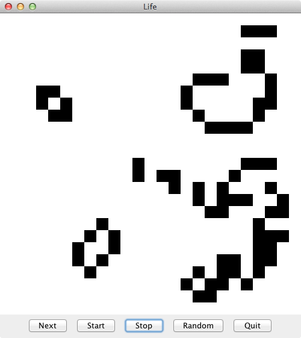
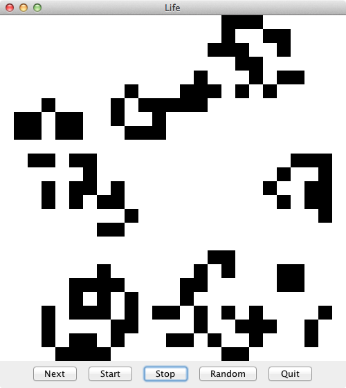
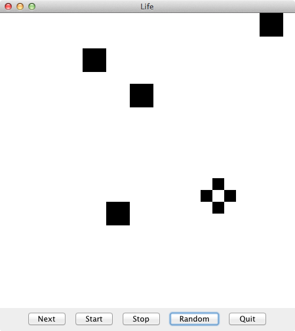
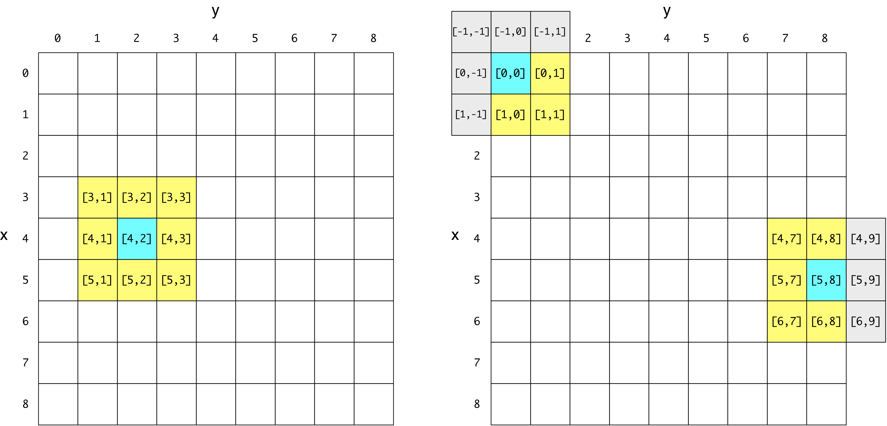

## CS 161 - Intro to Computer Science

### Lab: Conway's Game of Life

In this lab, you will explore <a href="http://conwaylife.com/" target="_new">Conway's Game of Life</a>. The Game of Life is a board displayed as a square grid of cells. Each cell may either be "alive" or "inactive" depending on the state of their neighboring cells. Over time each cell may come to life, or become inactive, which results in interesting patterns on the board.
</ol>
</p>
<center>&nbsp;&nbsp;
&nbsp;&nbsp;
</center>


#### Student Outcomes

- Experience with 2D arrays
- Practice with nested loops for traversing 2D arrays

#### Required Files

The following file(s) have been provided for this project.

- [Lab_Life.zip](Lab_Life.zip)


#### Part 1: Cells
The game is played on a square grid of cells. Each cell can either be alive or inactive, so this should be a very simple class to write.

- Create a new class `Cell`, which has a single instance variable that represents whether it is alive or inactive (a `boolean` ought to work).

- Write two constructors:

  - The default constructor has a 50%-50% chance of setting the state to inactive or alive. The `Random` class will again be useful here. It has a method called `nextBoolean()` that will randomly return `true` or `false`.

  - An overloaded constructor should input and assign an initial value for the Cell's living state.

- Write a getter method named `isAlive()` that takes no inputs and returns the state of your `Cell`'s living status


```java
Cell c = new Cell();
c.isAlive()
> false  (boolean)

Cell anotherCell = new Cell(true);
c.isAlive()
> true  (boolean)
```

#### Part 2: Life Class
You will need to modify the `Life` class in order to make things work. Important: In our board, the axes are flipped: `x` refers to the vertical axis, and `y` refers to the horizontal axis. Please remember this!

- Instance Variables: Because the Game of Life needs store a grid of Cell objects, you will need a 2D array of `Cells`. You should name this instance variable `board`.

- Constructor: Fill in the constructor, which inputs the height and width of the `board`. Instantiate your `board` using these dimensions. Recall that, when creating 2D arrays, the first dimension refers to the number of rows and the second dimension refers to the number of columns.

- Complete the `isAlive()` method, which inputs the `x` and `y` coordinates of the board, and returns whether the `Cell` at that location is alive.

- Next, write the `fillRandom()` method. This method should fill your board with random `Cells` (that is randomly alive or inactive).

- Now you need to go back to modify your constructor to call this method after it instantiates the 2D array.

- Remember to test your code! When you try compiling... the compiler complains that `countLivingNeighbors()` isn't implemented. Just have it return 0 for now, and take it out after you've tested the following: Compile the classes, right-click on `LifeFrame` and instantiate a new object.

- In the window that appears, hit the "Random" button to create a random community of cells. You may hit the "Random" button repeatedly to test whether `fillRandom()` is generating random cell communities. None of the other buttons should be working at this point. Close the window and move on to the next step.


#### Part 3: Life or Death
We will now implement the methods that determine if a `Cell` should live or die. To do this, one of the key methods we need is a way to count the number of live neighbors for any given `Cell` at position `x` and `y`.

1. Complete the `countLivingNeighbors()` method, which inputs a `Cell`'s coordinates x and y, and returns the its number of living neighboring `Cell` objects. Previously, I had you simply return 0 in this method so that we could test the code. Remove that line of code. Now, for a `Cell` object at any location `board[x][y]`, its 8 neighboring `Cells` are located at positions:

    1. `board[x-1][y-1]`
    2. `board[x-1][y]`
    3. `board[x-1][y+1]`
    4. `board[x][y-1]`
    5. `board[x][y+1]`
    6. `board[x+1][y-1]`
    7. `board[x+1][y]`
    8. `board[x+1][y+1]`

2. However, depending on where the current cell is positioned, some of those 8 neighbors may be out of bounds (or, _invalid_). 

    - In the left figure below, we're examining the number of neighbors for the `Cell` at `board[4,2]` (marked in blue). All eight of its neighbors are in valid range and therefore can be checked on whether they are living or dead. Tally up a count for each neighbor determined to be alive, and return the count.

    - In the right figure below, we see two cases where a `Cell` lies along one or two borders of the board. They therefore have fewer neighbors within range (the invalid `Cells` are greyed out). You  need to skip over the invalid neighbor when counting, because attempting to access its x,y position would result in a runtime error! Observe that all invalid `Cells` share the characteristic that one or both of its coordinates are out-of-range of the dimensions of the board. 

	

3. Complete the `nextGeneration()` method that updates the state of the `board` by:

    - First declaring and instantiating yet another _local_ 2D array of the same dimensions as your `board`. You can call this temporary 2D array `tempBoard`.

    - Iterating over all cells in `board`, and for each cell, determining whether the cell should be living or inactive in the next "generation." Rules are:

      - Any living cell with fewer than two living neighbors dies (due to underpopulation or loneliness).
      - Any living cell with more than three living neighbors dies (due to overcrowding).
      - By inference, any living cell with exactly two or three living neighbors stays alive.
      - Any inactive cell with exactly three living neighbors becomes alive! (slightly awkward reproduction).

    - Use the `countLivingNeighbors()` method you just implemented to get number of living neighbors for the purposes of updating the corresponding cell in the new `tempBoard`.

    - Record the new living status of the current cell by updating the corresponding position in `tempBoard`. You simply have to construct a `new Cell(..)` given the living state and assign it to the same position in `tempBoard`.

    - When that is done, re-assign `board` to `tempBoard`. This replaces your board with the new one!

4. Remember to test your code! At this point, you should be able to hit the "Next" button to see a single generation (everytime you hit the "Next" button, your `nextGeneration()` method is called.) You could also use the "Start" and "Stop" buttons to run through generations continuously to see your board evolve! Try running the game multiple times (or hitting "Random" to reset the board). Does everything die out? Or does it keep going for a long time? Does it eventually "settle" into a steady state? Or alternate between two closely related states?

5. Although it's random, if your board always stops changing after only 4-5 generations, something is probably a bit off in your `countNeighbors()` code. Our results consistently either never converges to a steady state, or takes over dozens of generations to settle.


#### Grading

```
Attendance is necessary to receive credit for lab.
```

#### Grading

```
This assignment will be graded out of 2 points, provided that:
- You were in attendance and on-time.
- Completed all required methods.
```


#### Submitting Your Assignment
Follow these instructions to submit your work. You may submit as often as you'd like before the deadline. I will grade the most recent copy.

- Navigate to our course page on Canvas and click on the assignment to which you are submitting. Click on "Submit Assignment."

- Upload all files ending in  `.java` from your project folder.

- Click "Submit Assignment" again to upload it.

#### Credits

Written by David Chiu and Joel Ross.

#### Lab Attendance Policies

Attendance is required for lab. Unexcused absence = no credit even if you turned in the lab. Unexcused tardiness = half credit.
