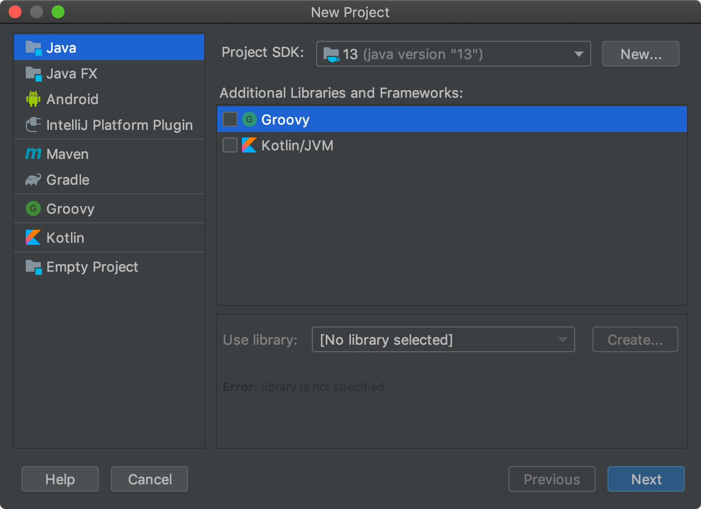
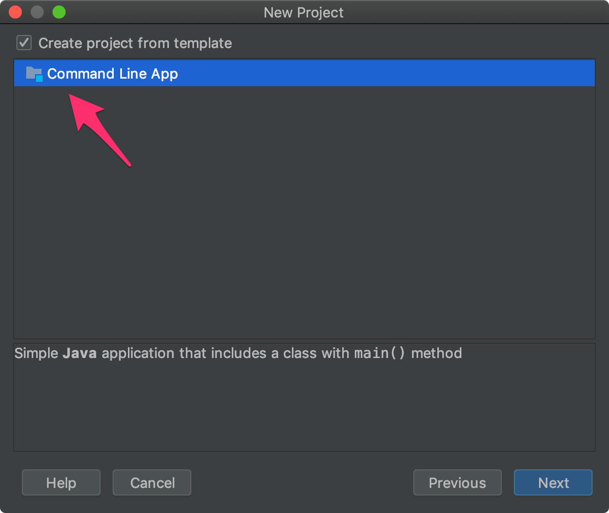
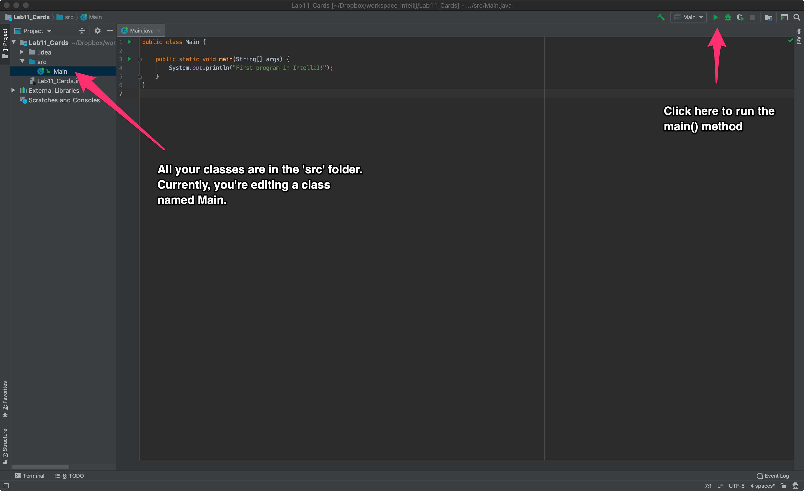
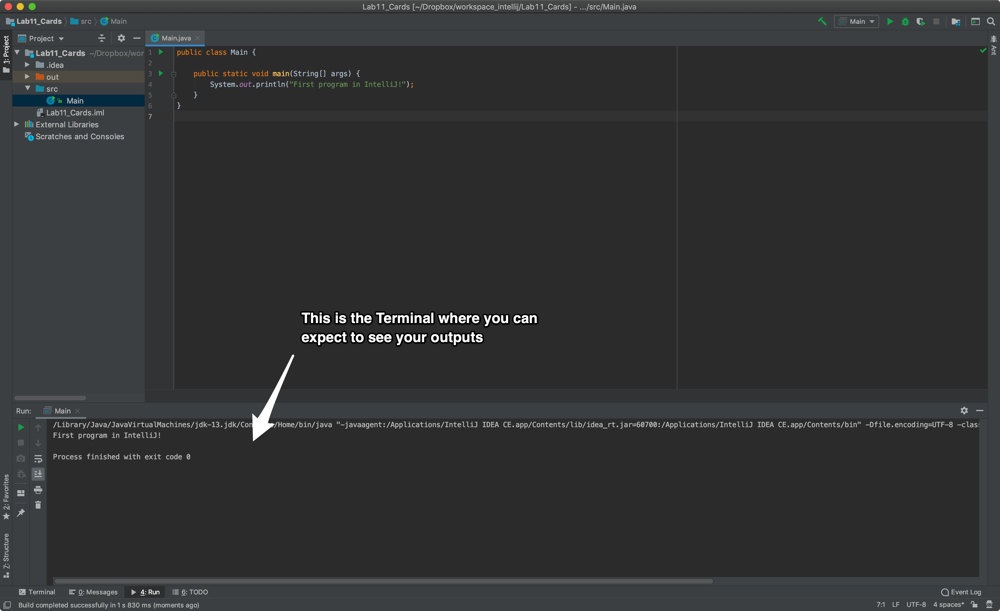
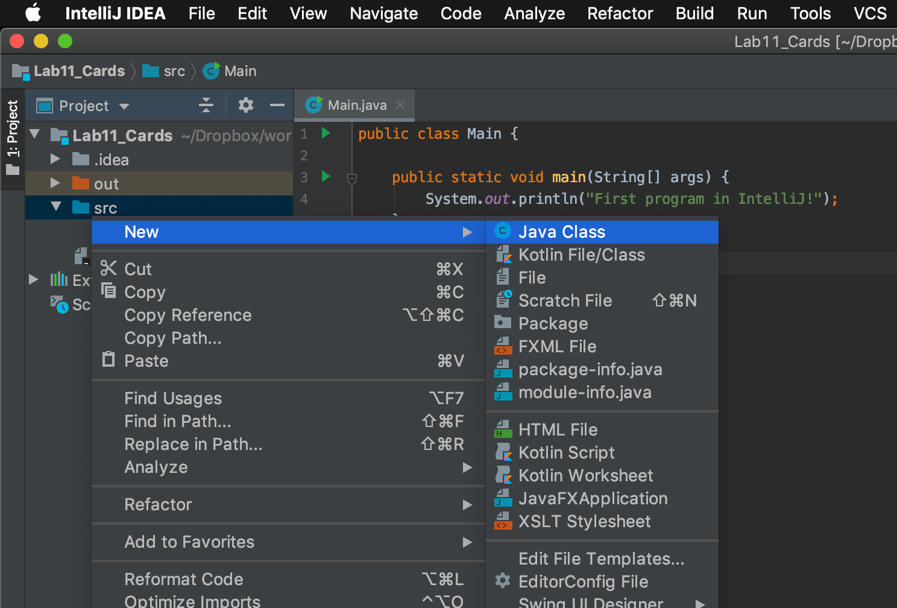
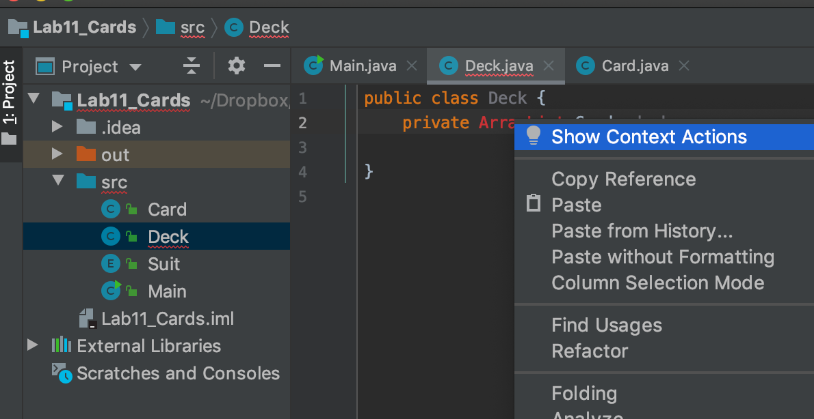
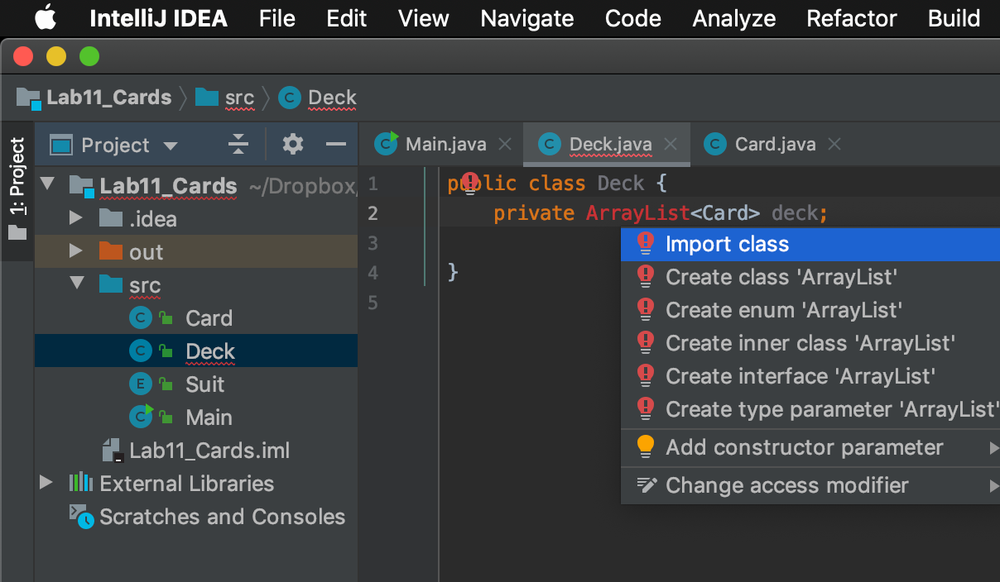

## CS 161 - Intro to Computer Science

### Lab 13: Playing Cards and Decks


In this lab, you will create classes that model playing cards and decks of playing
cards. You will practice using files, enum classes, and the `main()` method. You'll be
writing the "DeckPro" program, which is a simple app to generate a random
deck of cards. 

#### Student Outcomes

- Practice reading files
- Practice writing/using `enum` classes
- Practice writing the `main()` method


#### Required Files

The following file(s) have been provided for this homework.

- [Lab13_DeckPro.zip](Lab13_DeckPro.zip)


<!--
#### Required Files

The following file(s) have been provided for this homework.

- [Download IntelliJ IDEA](https://www.jetbrains.com/idea/)
-->

#### Helpful APIs

The API handout that you'll want to have in front of you:

- [ArrayList](../api/ArrayListAPI.pdf)
- [Random](../api/RandomAPI.pdf)

<!--

#### Part 1: Running a Simple Program in IntelliJ

If you haven't already, download and install IntelliJ. When you run IntelliJ for the first time, it will ask you where to place its "workspace". This is the folder in which it wants to store all of your coding projects. I'd recommend choosing a folder in your Google Drive, so that things are backed up!

- Once installed, you should get a dialog window (shown below). Select "Create a new project."

  

- Make sure that Java is selected on the left panel. Under "Project SDK" you may or may not be running "Java version 13" (as shown), but if the option is empty or can't be found, then let me know right away! Do not select anything under "Additional Libraries" and click "Next."

  

- Select "Create project from template" on the next screen, and click "Next" again.

  

- In the following window, name your project Lab_Cards, leave `"Base Package"` blank (erase what's already in there), wand hit `"Finish."`

- This should bring up the editor, with a `Main` class already open. It has also provided you with the `main()` method. Print out some dummy message within main. Save it, and to run the program, look for the green "play" button on the top-right corner of your editor. Important: There's no more object workbench or point-and-click menus to run methods. Anything you want to do involving your objects must be scripted in the `main()` method so that it can be run.

  

- Once you run your program for the first time, the terminal with the output should appear on the
  bottom panel.

  

- Now, let's create a new class. Right click on the `src` folder (shown below) and select `New -> Java Class`. Name your class `Card`, and follow the rest of the instructions..

  

-->


#### Part 1: Card Class and Suit Enum Class

- Create a new `Enum` class called `Suit`. Click on the "New class" button in BlueJ and choose `Enum`. Name it `Suit` and simply define `CLUB`, `SPADE`, `HEART`, `DIAMOND` to be the four suits. That's all you need to do here!

- Now let's focus on writing the `Card` class. Each `Card` carries a face value and a suit.

  - The `cardVal` is of type `int`.
  - The `cardSuit` is of type `Suit`.

- Back in the `Card` class,  you need to implement the constructor:

  - The constructor takes as input a suit and a face value. If the given face value is not legal (that is, not 1 to 13), then you should print out an error message, and instead assign it a random *legal* face value. (Why don't you need to check to see whether the given suit is legal?)

- Implement the following methods. Remember to write-and-test, write-and-test!

  - `public int getFaceValue()`: Getter for this card's face value.
  - `public Suit getSuit()`: Getter for this card's suit
  - `public boolean isRed()`: Returns true if this card is a diamond or heart.
  - `public boolean isBlack()`: Returns true if this card is a club or spade.
  - `public boolean isFaceCard()`: Returns true if this card is a face card (Jack, Queen, or King).
  - `public boolean equals(Card other)`: Returns true if this card has same face value and suit as another given card. Seems like there's code that can be re-used here...
  - `public boolean outRanks(Card other)`: Returns true if this card has greater face value than another given card. This one can be a tiny bit tricky, because an Ace (face value of 1) outranks all other face values, except other Aces.

- Here's what should happen if you typed the following in the code pad. Notice an *illegal* card entered into the constructor below. Notice how the constructor generated a random face value instead. You do not need to randomize the suit.

  ```java
  Card card1 = new Card(Suit.CLUB, 15);
  System.out.println(card1.getSuit());
  System.out.println(card1.getFaceValue());
  ```

  ```
  > Illegal card entered. Generating random card.
  > CLUB
  > 7
  ```

- In the following example, legal cards have been created.

  ```java
  Card card1 = new Card(Suit.SPADE, 1);
  System.out.println(card1.getFaceValue());
  System.out.println(card1.getSuit());
  System.out.println(card1.isRed());
  System.out.println(card1.isBlack());

  Card card2 = new Card(Suit.DIAMOND, 5);
  System.out.println(card2.outRanks(card1));
  System.out.println(card2.equals(card1));
  ```

  ```
  > ------------ HERE IS THE OUTPUT -------------
  > 1
  > SPADE
  > false
  > true
  > false
  > false
  ```

- Write the `public String toString()` to return the card as a String containing the suit and face value. The face value must replace a face-value of 1 with "A", 11 with "J", 12 with "Q", and 13 with "K". I chose to enclose the suit and value pair inside a set of angle brackets (see below).

  ```java
  Card card1 = new Card(Suit.DIAMOND, 1);
  System.out.println("This card is: " + card1);
  ```
  ```
  > This card is: <DIAMOND,A>
  ```

- Important: Notice how we don't even need to call `card1.toString()` (that would also work). This is because `toString()` is considered to be special -- it is called *automatically* by Java whenever an object is used in the context of a `String`.

#### Part 2: The Deck Class

- Now let's create the `Deck` class. This class stores a private `ArrayList` of `Cards`. Go ahead and create that instance variable now.

<!--
Here's where a professional editor like IntelliJ shines: Try declaring the field without first importing the `java.util.ArrayList` class. You'll see that `ArrayList` is in red. Right-click on Array`List, and you'll see `"Show Context Actions"` shown below.

  

- When you choose "Show Context Actions," you'll see a list of suggested actions. Select the
  the action, "Import Class." The class will be imported for you automatically. Cool! In fact,
  whenever you a term highlighted in <font color="red">red</font>, you can right click on it
  to see a list of suggestions. They might not always be correct, but they're usually quite on-point.

  

-->

- The default constructor should simply instantiate the internal `ArrayList` of cards, nothing more. You now essentially would have created an empty Deck.

- Implement and document the following methods. Remember to write-and-test, write-and-test!

  - `public boolean isEmpty()`: Returns whether this deck is empty. (You just need to check the size of the internal `ArrayList`.)


  - `public void replenish(String filename)` that takes as input the name of a file that contains a listing of cards. This method tries to open the given file, and fills the deck with the cards listed!

    - A file containing just five cards has been given to you, but you're more than welcome to add more to it!
    - You need to take note of the file's format to plan how you're going to process this file, then read in each row line-by-line, construct the corresponding `Card` and put it in your list!
      ```txt
      3 of CLUB
      1 of SPADE
      5 of SPADE
      8 of HEART
      13 of DIAMOND
      ```
    - After you reach each line from the file, you need to split it up using `" of "` as your delimiter.
    - **Reminder** You need to import `java.io.*` as well as `java.util.Scanner`
    - **Reminder 2** To open a file:
      ```java
      try {
        Scanner fileIn = new Scanner(new File(filename));
        while (fileIn.hasNext()) {
          // grab a line from the file!
          String line = fileIn.nextLine();

          // split() that line up into tokens!

          // create that Card object!

          // add the Card to the ArrayList!
        }
      } catch(FileNotFoundException e) {
        System.out.println("Could not open file " + filename);
      }
      ```

  - `public void replenish()`: No matter what the state of the `Deck` is, replenish all 52 cards to the deck the following order:
    - Spade: 1 (A), 2, 3, ..., 10, 11 (J), 12 (Q), 13 (K)
    - Club: 1 (A), 2, 3, ..., 10, 11 (J), 12 (Q), 13 (K)
    - Diamond: 1 (A), 2, 3, ..., 10, 11 (J), 12 (Q), 13 (K)
    - Heart: 1 (A), 2, 3, ..., 10, 11 (J), 12 (Q), 13 (K)

    First, clear your list of cards. Now, how do you loop through the four `Enum` values? You can do this using a nested loop. For each suit, loop from 1 through 13, and create a Card using those suit and value combinations. Here's how to loop through the Enum values:

    ```java
    for (Suit s : Suit.values()) {
        // s will be Suit.SPADE, Suit.CLUB, Suit.DIAMOND, and Suit.HEART
        // Now loop through 1 to 13 and create Card objects, and add to your list
    }
    ```

  - `public void shuffle()`: Randomly shuffles the cards around. One idea is to loop through all cards (don't use a for-each loop!) in the `ArrayList`, and swap it to a random position back into the list! You can do this by first `remove()` it, and then use the 2-argument `add()` to insert it back.

  - `public Card discard()`: Removes the first Card in the deck and returns it. However, if the deck was empty, you must first replenish the deck to a full set of 52 cards, shuffled..

  - `public String toString()`: Builds then returns a string containing each card in the current `Deck` on a separate line. As you're building the string, you can use the special character `"\n"` to specify a "new line".

- Here's what it should look like when you create a deck from the given file, and print it.

  ```java
  Deck myDeck = new Deck();
  myDeck.replenish("starterDeck.txt")
  System.out.println(myDeck);
  ```

  ```txt
  <CLUB,3>
  <SPADE,A>
  <SPADE,5>
  <HEART,8>
  <DIAMOND,K>
  ```

- Here's what it might look like after shuffling.

  ```java
  Deck myDeck = new Deck();
  myDeck.replenish("starterDeck.txt")
  myDeck.shuffle();
  System.out.println(myDeck);
  ```

  ```txt
  <CLUB,3>
  <SPADE,5>
  <DIAMOND,K>
  <HEART,8>
  <SPADE,A>
  ```


#### The main() Method
The main() method is actually where every Java program "starts." It turns out BlueJ's just been making our lives easy this whole time! Everything you want to do in order to run your program  needs to happen within the main method. 

- Create a new class called `DeckPro`. Inside the class, copy and paste the segment below:

  ```java
  import java.util.Scanner;

  public static void main(String[] args) {
    System.out.println("DeckPro Version 1.0");
    System.out.println("Please enter one of the fllowing options:");
    System.out.println("load: if you want to load a deck from a file");
    System.out.println("full: if you want to create a full deck of 52 cards");

    Scanner keyboard = new Scanner(System.in);
    Deck myDeck = new Deck();
    String input = keyboard.nextLine();
    if (input.equalsIgnoreCase("full")) {
      myDeck.replenish();
    }
    else if (input.equalsIgnoreCase("load")) {
      System.out.println("What is the file name?");
      String filename = keyboard.nextLine();
      myDeck.replenish(filename);
    }
    myDeck.shuffle();
    System.out.println("Here's your deck!");
    System.out.println(myDeck);
    System.out.println("Thanks for using Deck Pro! Good bye!");
  }
  ```

- To use `DeckPro`, you just need to right click on it, and choose `void main(String[] args)`.

#### Grading

```
This assignment will be graded out of 2 points, provided that:
- You were in attendance and on-time.
- Completed all required methods.
```


#### Submitting Your Assignment
Follow these instructions to submit your work. You may submit as often as you'd like before the deadline. I will grade the most recent copy.

- Navigate to our course page on Canvas and click on the assignment to which you are submitting. Click on "Submit Assignment."

- Upload all files ending in  `.java` from your project folder.

- Click "Submit Assignment" again to upload it.

#### Credits

Written by David Chiu.

#### Lab Attendance Policies

Attendance is required for lab. Unexcused absence = no credit even if you turned in the lab. Unexcused tardiness = half credit.
