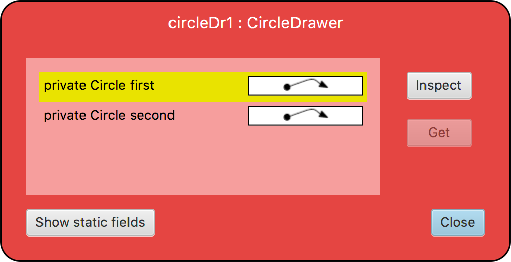
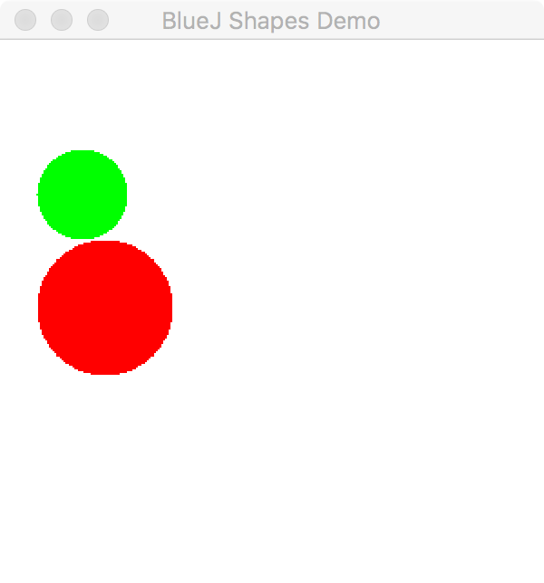

## CS 161 - Intro to Computer Science

### Lab: Circle Drawer

This assignment is all about conditionals and object references! We'll work with the `CircleDrawer` class that is given to you. Along the way you'll write code that uses and manipulates object references, and requires more complex boolean expressions than you've written previously.

#### Student Outcomes

- Practice object interaction (puppeteering)
- Practice using object references
- Practice returning values across objects
- Working with null reference testing

<!-- 
#### Working with Partners (Please Read)

You are required to work _together_ on labs. As I mentioned the first day of class, some of you may have had some prior programming experience, and this lab may come more naturally for you. Please be humble and be supportive to one another, and don't leave your partner behind. Labs are _very_ low-stakes, and you'll get full credit for being here, working through it, and being a good citizen. We'll be around to help.

Here are your assigned partners for today's lab.

```
[Jones, B, Jones, S]
[Steller, L, Culpepper, A]
[Camblin, F, Strash, K]
[Beardsley, M, Murphy, C, Rodriguez, C]
[Brown, A, Grey, E]
[Roppolo, G, Murayama, E]
[Wissing, A, Miller, D]
``` 
-->


#### Required Files

The following file(s) have been provided for this homework.

- [Lab_CircleDrawer.zip](Lab_CircleDrawer.zip)

#### Instructions

1. Download the `CircleDrawer` project from the link above and extract its contents, then start BlueJ and open the project. See how a `CircleDrawer` contains two instance variables of type Circles (named `first` and `second`). This demonstrates that classes like `Circle` can serve as a variable's data type!

2. Notice that the `CircleDrawer` class has two constructors. The *default* constructor just sets both instance variables to `null`. The secondary constructor takes to two `Circle` objects as arguments, and it sets both instance variables appropriately.

    - Using the menus in BlueJ, instantiate two `Circle`s. You can name them `c1` and `c2`.
    - Change `c1` to green, change size to `50`.
    - Change `c2` to red, change size to `75`. Then move it down by `50` pixels.
    - Now create a new `CircleDrawer` using its secondary constructor . Input `c1` and `c2` to be your arguments. The new `CircleDrawer` will now "control" the two circles.
    - Inspect the `CircleDrawer` object, and you see that `first` and `second` store references (see those *arrows?*). Double-clicking on one of the arrows, and it opens the inspector to the Circle you just created!

      

    - Call the `drawCircles()` method on the drawer, and notice that both Circles appear. (If you call `eraseCircles()` both disappear.)

      

    - This gives us some idea about what a `CircleDrawer` does. It's basically a "puppet master" that bosses around one or two assigned Circles.

    - That's an example of **Object Aliasing** that we talked so much about in class! `first` is aliased to `c1` and `second` is aliased to `c2`.

3. Now go back in the `CircleDrawer` source code and take a look at `drawCircles()` and `eraseCircles()`. Calling them will make both circles visible or invisible, but that's assuming that `first` and `second` actually refer to actual `Circle` objects, and not a `null` reference.

    - Create a `CircleDrawer` object using its default constructor (that's the one with no input arguments).
    - Inspect it, and see how `first` and `second` both point to `null`.
    - Try calling `drawCircles()` or `eraseCircles()`. The program should **crash** with a `"NullPointerException."` That's bad news -- it means our code isn't all that robust.

4. **Add necessary changes** to `drawCircles()` and `eraseCircles()` so that no action is taken if either `first` or `second` is equal to `null`. To do this, use an if-statement to check if each field is `==` or `!=` to the keyword `null`. Make sure you test these out after you're done.

5. Now **modify** the `drawCircles()` method so that it only draws circles with **radii** strictly greater than `20` and strictly less than `50`.

    - But how do you get a `Circle`'s radius? An easy way is to go into `Circle` source code and making the `diameter` *public* instead of *private*. However this is usually considered prohibitive because it exposes `diameter` to unwanted changes. You should instead add a method in the `Circle` class that simply returns its `diameter`. 
    - Again, test this out. Ahem -- if your Circle's diameter is say, **41**, it *should* be drawn. If you just can't get yours to draw, write some code to print out the calculated radius. Are you falling victim to integer divide?

6. Go back in the `CircleDrawer` class. **Add a method** called `drawLarger()` that draws only the larger of the two circles. The smaller one should be hidden. If there's a tie, then you should draw both of them. 
    - Beware of null pointer exceptions!

7. **Add a method** in `CircleDrawer` called `sizeRatio()` that returns the ratio of the two circle's diameters as a `double`. If one circle has a diameter of 10 and another has a diameter of 3, then this method returns 0.333... You should always divide the smaller diameter by the larger.

   - Now, if *either* circle is `null` then you can simply return 1 in this method.
   - Are you getting a zero when you're expecting to get a fraction? It could be due to integer divide...

8. **Add a method** in `CircleDrawer` called `addCircle()` that inputs a `Circle` object, and it doesn't return. This method must first first erase both `Circles` (Yep, just call `eraseCircles()` instead re-writing all that code). Now:
    - If *either* of the two circles are `null`, then simply assign the new `Circle` to that field.
    - If *neither* of the two are pointing to `null`, then promote the second `Circle` to the `first`, then set the newly-input `Circle` to be the `second`.
    - After you're done with all that, make both Circles visible.
    - To test this method, I would create 3 circles in BlueJ. Then create a CircleDrawer using the default constructor so that both `first` and `second` are `null`. Then call `addCircle()` 3 consecutive times (on the 3 circles you created).
    - Here, we see *another* example of **object aliasing!** The new Circle that you input is now also referenced by your input parameter!

9. **Add a method** called `swapCircles()` that inputs and returns nothing. Calling this method will cause  `first` to now point to whatever `second` held, and vice versa. In other words, they exchange whatever they're pointing at (even if they're pointing to `null`). To do this correctly, you'll need to declare a local variable of type `Circle` to temporarily hold one of them so it doesn't get overwritten. 

10. **Add a method** called `replaceSmallest()` that takes a `Circle` as input. 
    - If *either* of the two circles are `null`, simply add the new circle into the empty slot. 
    - If *neither* of the two are pointing to `null`, this method must replace the *smaller* circle with the new, given one. We need to respect seniority, though:
      - If `first` is smaller, we'll first promote `second` to take its place, and assign the new circle in `second`'s place.
      - If `second` is smaller, we'll just replace it with the new circle. In the case of a tie, replace second.
    - This method seems to have quite a bit of similarities to `addCircle()`. You don't need to, but kudos if you can figure out how to utilize `addCircle()` and `swapCircles()` to simplify writing this method.


<!-- 

- Finally, add a method to `CircleDrawer` called `drawWhenEquals()` that draws both `Circles` if they are "equal" in _content_. Hide both of them if they aren't "equal." Before you can write the method, you need to add an `equals()` method in the `Circle` class.

  - Let's say that two `Circle`s are equal in content if they have the same size and (x,y) positioning. Refer back to the "content (deep) equality" notes, if you need a reminder on how these `equals()` methods are written.

-->


#### Grading

```
This assignment will be graded out of 2 points, provided that:
- You were in attendance and on-time.
- Completed all required methods.
```


#### Submitting Your Assignment
Follow these instructions to submit your work. You may submit as often as you'd like before the deadline. I will grade the most recent copy.

- Navigate to our course page on Canvas and click on the assignment to which you are submitting. Click on "Submit Assignment."

- Upload all files ending in  `.java` from your project folder.

- Click "Submit Assignment" again to upload it.

#### Credits

Written by Brad Richards with modifications.

#### Lab Attendance Policies

Attendance is required for lab. Unexcused absence = no credit even if you turned in the lab. Unexcused tardiness = half credit.
