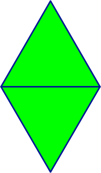

## CS 161 - Intro to Computer Science

### Lab 6: Diamonds (Abstraction)
David is a Rihanna super fan. While rocking to *"Diamonds"*, he was mortified to recall that diamonds aren't a part of the _shapes_ toolkit he provides his CS 161 students. Instead of creating diamonds from scratch (and saving ourselves from copying and pasting other shape classes), David made a keen observation that a diamond can be constructed using two triangles -- only that one of the triangles needs to be flipped upside down and placed right below the other, as shown below. Given that we already have a `Triangle` class in our toolkit, it will vastly simplify our work.

  

This lab is all about abstraction and object interaction. 

#### Student Outcomes

- Practice abstract thinking
- More practice with object interaction (dot notation)

<!-- 
#### Working with Partners (Please Read)

You are required to work _together_ on labs. As I mentioned the first day of class, some of you may have had some prior programming experience, and this lab may come more naturally for you. Please be humble and be supportive to one another, and don't leave your partner behind. Labs are _very_ low-stakes, and you'll get full credit for being here, working through it, and being a good citizen. We'll be around to help.

Here are your assigned partners for today's lab.

```
[Strash, K, Steller, L, Jones, S]
[Roppolo, G, Culpepper, A]
[Rodriguez, C, Jones, B]
[Murphy, C, Beardsley, M]
[Grey, E, Brown, A]
[Miller, D, Murayama, E]
[Wissing, A, Camblin, F]
``` -->

#### Required Files

The following file(s) have been provided for this homework.

- [Lab_Diamonds.zip](Lab_Diamonds.zip)


#### Before You Get Started (Syntax Review)
You will want to remember the following pieces of syntax for object interation:

- **Object Variable Declaration:** To store objects like Circles, Triangles, Strings, you need to declare an object variable. For instance, if I wanted a variable that points to a Circle, I can use:
    ```java
    Circle circ;
    ```
    Or if it's an instance variable,
    ```java
    private Circle circ;
    ```
    However, after this declaration, `circ` is merely a box containing a pointer to `null`. That's not very useful. You'd usually want to point it to a Circle object that you can tell what to do.

- **Instantiation:** So then, how do you construct a new object using code? Here's how to do it:
    ```java
    circ = new Circle();
    ```
    This will call the `Circle()` default constructor, and assign the `circ` variable to point to it. If the `Circle` class defined more constructors, you can construct those instead by passing the right input arguments. 

- **Dot-Notation:** What can you do with object variable (like `circ`) after instantiation? Call methods on it to boss it around! The syntax to call methods on an object is called "dot notation." Say you want to change circ's color and move it down by 30. You need to first identify which `Circle` methods do these actions.
    ```java
    circ.changeColor("red");
    circ.moveVertical(30);
    ```


#### Preliminary: An Improved Triangle Class

You'll find that there's a slightly improved `Triangle` class. This `Triangle` sports a new method called `flip()`. Play around with it to see it in action. As you flip the triangle, notice that it is flipped "in place." That is, it doesn't just turn over downwards and displace from its old position. You'll need to keep that fact in mind for later...

#### Part I: Diamonds

Our objective is to create a new class that can create  `Diamond`s with the same set of methods as all the other shapes we've seen thus far. But as you know, there is code in the other shape classes that we still don't know how to read or what they do underneath the hood. But behold the power of abstraction: *We don't need to know all the implementation details of Triangles!* Let's get started...

1. **Create a new class called `Diamond`.** A diamond can be formed using two Triangles, with one flipped upside down and positioned properly. For now, your `Diamond` class only needs to store instance variables pointing to these two `Triangles`. Because of their placement, I would name them `top` and `bottom`.

    - You might as well go ahead and store a diamond's `height` and `width` as instance variables too. They are both integers.

2. **Write a constructor** that  accepts two inputs: the `height` and `width` of the new Diamond object. (I suggest that you call these input parameters `h` and `w` so we don't confuse them with the instance variables?).

    - Go ahead and store these given dimensions (`h` and `w`) inside your instance variables.

    - It needs to *instantiate* both `top` and `bottom` triangles, so the arrows don't simply point to `null`. You should recall that, to instantiate an object of a class, you can use the syntax, `new ClassName()`. Therefore, `top = new Triangle()` would assign `top` a pointer to a new Triangle!
    
    - Don't forget to resize the triangles so that, when combined, they satisfy the given height and width of the diamond. You need to make each triangle **half** of the given height of the new diamond, and they each should have the same width as the diamond.
        - (How nice is it that Triangles already have a `changeSize()` method we can use...)
    
    - Next you need to flip the bottom triangle and move it vertically into place so that the *bases* of the triangles touch. (Hey, remember that Triangle objects also supports a `moveVertical(int distance)` method? Use it!)

    - Make the whole diamond visible before leaving the constructor.
    
    - To test, create a few diamonds with various dimensions. Make sure the two triangles are always connected at the base regardless of your diamond's given dimensions.


3. Next, write the `makeInvisible()` and `makeVisible()` methods to toggle visibility of the diamond. Then move on to `changeColor(String newColor)` to change the color of the diamond. As you write these two methods, you should notice how satisfying it is to be able to call on the individual triangle's methods.

    - **Abstraction is about trust and delegation**. Notice that, to get the diamond to perform these actions, we don't even have to know about *how* each Triangle goes about performing its own actions. All we need to do is **trust** that it works, and we simply delegate to them when we need to!

    - In each of these methods, you should not be writing more than two lines of code to get the job done!

4. Now write in `moveVertical(int distance)` and `moveHorizontal(int distance)`. Again, the work you have to do should be minimal.

#### Part II: Change Size

Let's move on to something trickier: `changeSize(int newHeight, int newWidth)`. You'll need to change the sizes of the two triangles in such a way that the sum of the heights is equal to `newHeight` and the `width` is adjusted to `newWidth`. Okay, easy enough with a couple calls to the Triangles' `changeSize()` method. 

- However, this will introduce a new problem. The triangles, upon changing their size, may overlap each other or they could be spread farther apart!

- Let's try to understand what's happening. When you make a diamond smaller, the two triangles are both trimmed from the bottom up. That means the top triangle will have its "base" trimmed upward, and the bottom triangle will have its southern tip pulled upward.

    - Likewise, when you're making a diamond larger, it's the bottom of these triangles that are moving downward.

- Knowing that, you now need to move the bottom triangle up or down to adjust for this overlap (or gap). But how much do you move it by? **(Hint: it's a good thing we stored the old height of the diamond as instance variables... you need to find the difference between those and the new dimensions)** Recall that when you re-size a triangle, the top of that triangle never changes along the vertical axis -- it's the base of the triangle that moves. Draw on a piece of paper to gain insight into when you'd need to move the bottom one up and when you'd need to move the bottom one down (and by how much).

- Don't forget to save the *new* height and width in your instance variables *afterward*!

#### Reflections: Problem Decomposition and Thinking Abstractly
Hopefully, through this lab, you can see how useful it is to think abstractly. We broke down a bigger problem ("How to build a diamond") and made the key insight that diamonds are nothing more than just 2 triangles, whose code we already have. Then the rest is just a matter of bossing around the triangles so that together, they look and act like a diamond! Knowing this, it's easy to see how we might create new shapes and add them to our toolkit.

You must also apply this idea to larger, more complex projects downstream.

#### Extra Challenge (Optional)
Can you create a **parallelogram** with two diamonds? Can you create a restricted **rectangle** with two squares? How about a **wand** using a skinny rectangle and a circle on top? How about a Pacman (recall it's just 2 circles and a white triangle!), and you can slow move it, close and open its mouth, and so on.

#### Grading

```
This assignment will be graded out of 2 points, provided that:
- You were in attendance and on-time.
- Completed all required methods.
```


#### Submitting Your Assignment
Follow these instructions to submit your work. You may submit as often as you'd like before the deadline. I will grade the most recent copy.

- Navigate to our course page on Canvas and click on the assignment to which you are submitting. Click on "Submit Assignment."

- Upload all files ending in  `.java` from your project folder.

- Click "Submit Assignment" again to upload it.

#### Credits

Written by David Chiu. 2023.

#### Lab Attendance Policies

Attendance is required for lab. Unexcused absence = no credit even if you turned in the lab. Unexcused tardiness = half credit.
