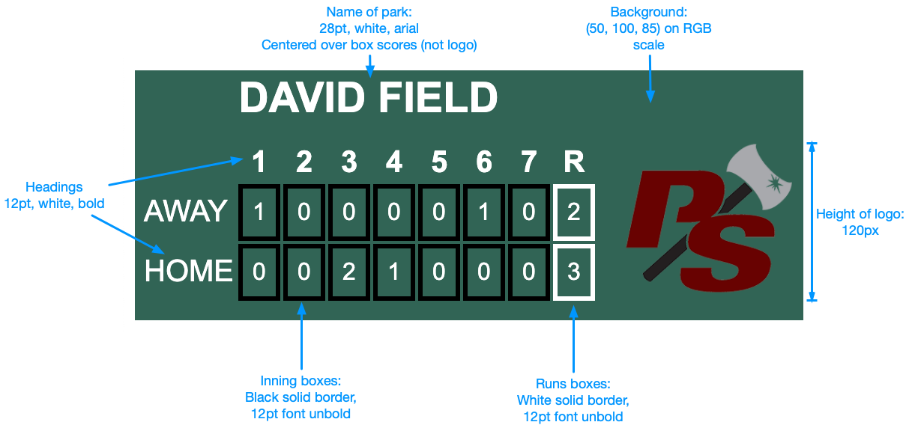
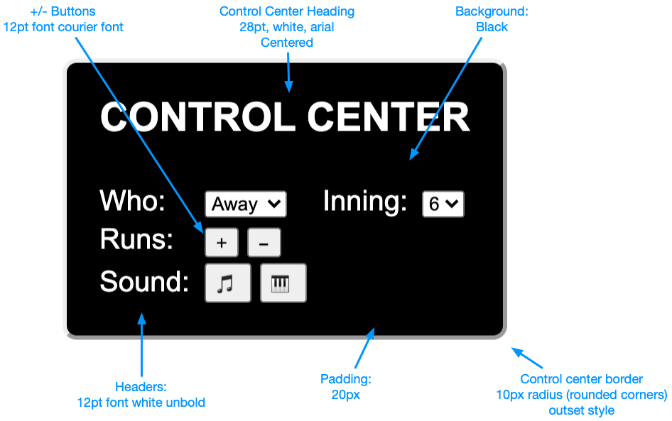

## CS 240 - Software Engineering

### Homework: Scoreboard Operator

In this assignment you will be building a scoreboard and its control panel using what we've learned so far. Specifically, we'll build a scoreboard for softball (or baseball). If you're not familiar with the scoring system of this game, here's a feeble attempt at describing it. In an official game, the two teams play seven innings (nine, if baseball). Each team gets three outs per inning to try to score runs (which counts the number of players who reach home plate). After seven innings the runs are added together, and the winner is determined.


The status (and result) of the game is called a box score. During a game, the box score is tracked on a giant scoreboard at the ballpark, and it is constantly updated by a scorekeeper. In addition to tracking the score accurately, they also try keep the crowd entertained by playing music, sound effects, and displaying images next to the box score.

In this assignment, you will create a scoreboard and control center.

#### Student Outcomes

- Use of HTML + CSS to structure and style page elements
- Manipulating existing DOM objects
- Use of event listeners and callbacks

#### Starter Code and Git

Starter code for this assignment is provided in the github repo [https://github.com/davidtchiu/cs240-hwk-scoreboard](https://github.com/davidtchiu/cs240-hwk-scoreboard). Go to my github repo, and _*fork*_ this repository to your github account to obtain your own copy on github. Copy the Github URL to _your_ newly forked project. Then from your local machine, open a terminal, navigate to your directory for this class, and _*clone*_ your forked Github repo down to your local working directory. After you've done this, you can work freely in VS Code. Remember to commit when appropriate with substantive messages. Branch early and often. Push your `main` branch up to your github repo for backing up your work. I also will be checking out your Github's `main` branch for grading!

<!-- ### Media Files

Download these files into your project directory.

- [Image: Puget Sound Logo](ups.png)
- [Image: San Diego Chicken](sdchicken.jpg)
- [Image: Megaphone](megaphone.png)
- [MP3: Chicken Dance](chickendance.mp3)
- [MP3: Charge](charge1.mp3)
- [MP3: Charge (variation)](charge2.mp3)
- [MP3: Build Up](buildup.mp3) -->

#### Working Solution

[Click here](demo/) for my working solution of this App.

#### Program Requirements

For full credit, your project should observe the following requirements.

- There are no starter files given for this assignment, but you will owe me at least 3 files: an HTML file; a CSS file; and a JS file.

- I would start with creating the HTML and CSS files - you should work on them concurrently. When creating your page, you can name the field to whatever you like, but all other HTML elements must conform to my standards (see below). Give each box in the box score a unique `name` or `id` so that you can link them up to your JS code later. Similarly, name or identify all "toggle-able" elements and buttons in the control center. As you're not submitting any values, the input fields and buttons of the control center do not need to be enclosed in a `<form>` element. After your page looks like a static, non-working version of what I have specified, then move on to the JavaScript portion of this assignment.

- Scoreboard Style Guide
  

- Control Center Style Guide
  

- **Control center:** you need a dropdown menu for "Who" and "Inning." The allowable values for "Who" are "Away" and "Home" and the values for "Inning" can range from 1-7. With the "Who" and "Inning" selected, the scorekeeper can press on the + or - button to update the runs for the specified box on the scoreboard. Be careful not to let the runs go negative. As the runs are updated, so should the "R" box on the far-right end of the box score, which totals up all the runs for each team.

- JavaScript: Some tips for you.

  - For this assignment, you should **never** have to create a node and append it to the DOM, or remove nodes from the DOM. In all of our exercises, we will only be changing the inner HTML content of the existing HTML elements that you provided in the previous section. (This will change in future assignments, where we actually start with minimal HTML page, and generate all HTML content using JS.)

  - I'd start by ensuring that each box in the box score has an identifier or is uniquely named. To access the DOM, query for all the boxes, and store them in an appropriate data structure so that they're easily identified and updated later in your code. I think a JS object makes sense here, but that I'll leave it up to you.

  - After you've got DOM access to all the boxes, run some test code to see if you can get the values to change. For instance, just set a node's `innerHTML` property to a different value.

  - Now move on to the control center. Run a query for the 6 manipulable elements. Recall that each option in a drop-down menu is specified in the `value` attribute.

- Images and Sounds: To play sounds using JavaScript is quite simple: look into the [Audio class](https://developer.mozilla.org/en-US/docs/Web/API/HTMLAudioElement/Audio). Four music files (mp3) have been provided to you.
  - When the left button (the one with music notes) is pressed, randomly play one of: charge1.mp3, charge2.mp3, or buildup.mp3. Also randomly display one of the images to the right of the box score.
  - When the right button (the one with a keyboard) is pressed, play the Chicken Dance: chickendance.mp3, and always display the sdchicken.jpg to the right of the box score.
    Pressing on another button before the song has finished may cause the music to overlap. This is okay (for now) because we don't know how to wait for the song to end.

#### Optional Extensions

Have some free time? Add the following features:

- Maybe a random sound effect isn't specific enough. Add a button for each sound effect so the operator can be more selective. Feel free to add more sounds and pictures too.
- Add a text input to the control panel. Whatever you type in that field should show up on the scoreboard.

#### Submission

Assignment submission is simple. Simply make sure that the latest code is committed and pushed into your forked `cs240-hwk-scoreboard` on github (before the 12am deadline). Then send me the link to your repository on [canvas](https://canvas.pugetsound.edu).

#### Grading

```
CS 240 Homework (Scoreboard Operator)


----------------------------------------------------------
[20/20pts] HTML + CSS

> The design and feel of your Scoreboard app looks exactly as
  is specified in the description. The exception is if you
  added a few more buttons if you completed some of the
  "extra" items.

----------------------------------------------------------
[30/30pts] DOM and Events

> Your program queries for, and reads in all "inning" and "runs"
  boxes as DOM nodes, storing them in an appropriate data
  structure for easy access.

> Pressing + or - will make the appropriate scoring changes
  in the box currently specified by the "Inning" and "Who" values.
  Additionally, the total runs in the "R" column should reflect
  the new scores.

> Ensure that runs never go negative.

> The music buttons play sound effects and updates images as
  as described.

----------------------------------------------------------
[5/5pts] Implementation and Efficiency

> Your program should demonstrate reasonable runtime
  efficiency of all algorithms. Appropriate data structures
  should be used.

----------------------------------------------------------
[5/5pts] Comments

> You include sufficient block comments for each class and method.

> You include sufficient inline comments in your methods.


----------------------------------------------------------
[0pts] Misc. Deductions
> Late?

----------------------------------------------------------
Suggestions (No Deductions)


Total: 60 pt
```
