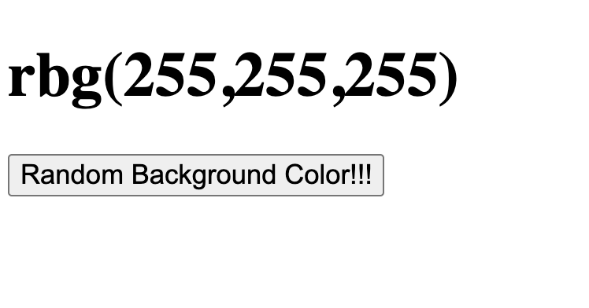

## CS 240 - Software Engineering

### In-Class Exercise: DOM and Event Handling (~20min)

In this exercise you will get some practice working with DOM elements. This exercise assumes that you are familiar with using objects and callbacks.

#### Student Outcomes

- Learn how to query for certain DOM elements
- Learn how to manage event listeners

#### Solution/Demo

- [Link to Demo](demo/)

#### Instructions

- Create a new project directory in VS Code, called `cs240-lab-js2`. You don't have to manage it using git for this lab, but there's also nothing stopping you!

- Create an `index.html` file. In it, simply paste the following:

  ```html
  <!DOCTYPE html>
  <html>
    <body>
      <h1 id="colorText">rgb(255,255,255)</h1>
      <button id="changeButton">Random Background Color!!!</button>
      <script src="app.js"></script>
    </body>
  </html>
  ```

- It shouldn't take long, so study the HTML you just pasted. There are only 2 visible elements: the h1 and the button. You can view it by right-clicking on `index.html` on the left-hand panel, and choose `Open with Live Server`. You should see something that looks like the following:

  

  Clicking on the button does nothing currently. Let's change that!

- The end goal is that, we want each button-press to do two things:

  - Set the text contents of the `h1` element to `rgb(rrr,ggg,bbb)` where `rrr`, `bbb`, and `ggg` are random integers between 0 and 255.
    - Aside: The combination of those three integers will result in some color in our visible spectrum.
  - Next, you'll want to set the page's background color to that `rgb(rrr,ggg,bbb)` string you just generated.

- Create a new file, `app.js`.

  - The first thing we need to is to write a function that returns a random `rgb(rrr,ggg,bbb)` string. You're reminded that `Math.random()` returns a value between 0 (inclusive) and 1 (exclusive). You can use the `Math.floor(x)` method to round down to the nearest integer.

  - Once you're sure that your function works, we need to tell our button what even to listen for, and what to do if it senses it. We'll start by grabbing the `<button>` node using:

    ```javascript
    let node = document.querySelector(pattern);
    ```

    where `pattern` is an HTML element, a `.class` or an `#id`. In our case, the `<button>` element does carry an id attribute.

  - After the button has been selected, we can attach an event listener as follows:

    ```javascript
    node.addEventListener("eventName", callbackFunc);
    ```

  The `eventName` in our case is just `click` and you'll need to input a callback function to perform all the actions:

      - Query for update the `<h1>` node object, so that it displays a randomly generated `rgb(rrr,bbb,ggg)` string. You can modify a node's text content by assigning to its `.innerHTML` property.

      - Query for and update the `<body>` node, and change its `.style.backgroundColor` to the `rgb(rrr,ggg,bbb)` string.

- If you have time,
