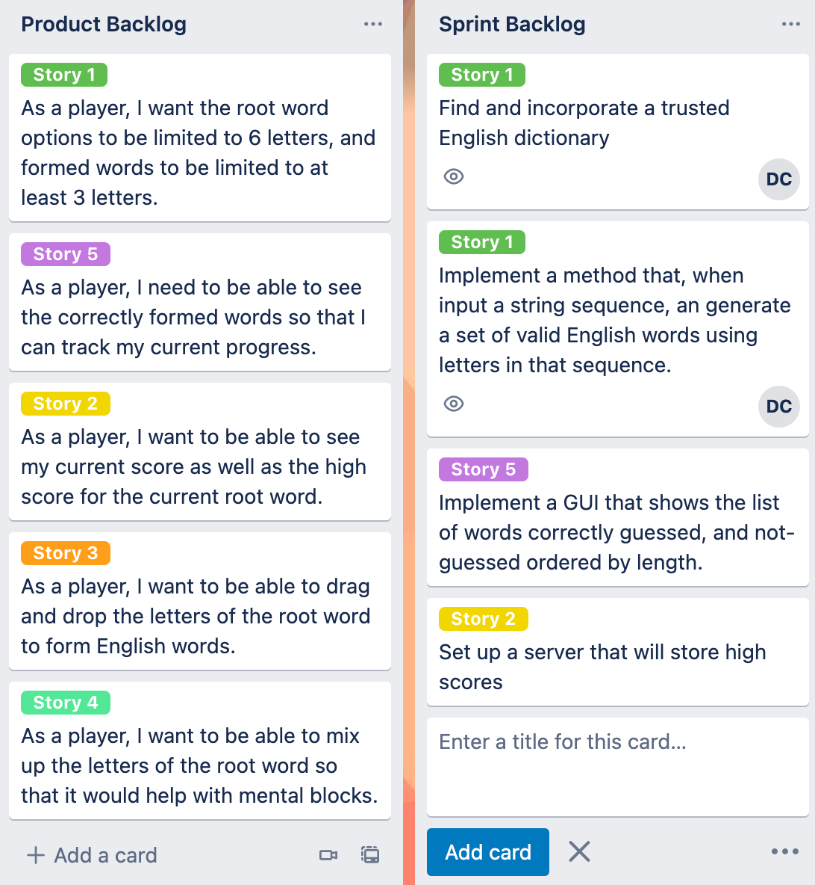

## CS 240 - Software Engineering

### In-Class Exercise: User Stories and Sprint Planning

As your team continues to develop personas and scenarios by which they interact with your software, we can begin refining some user stories for development. This lab is meant to help you jumpstart the requirements needed for Project 1.

#### Student Outcomes

- To identify and write user stories
- To practice the agile design process: sprint planning

#### Preliminary - Trello

- Each of you will need to create a [Trello](https://trello.com/). Go ahead and do so now, and please use your `pugetsound.edu` email so that I can invite you to later to my workspace.

- Have one of you create a new Workspace. The title of this workspace should be the name of your team or software application.

- When creating a new "board," select the `Engineering-IT` category, which will display some templates. Choose the `Agile Spring Board` template to create a new board, but de-select the options to keep all existing cards and card templates. This board is where you will be putting your product backlog and sprint backlog.

- Invite your team members to contribute to this board.

#### Part 1 - User Stories

- Refer back to your scenario(s) from the previous lab (and your work outside of class) and begin identifying user stories. Look for action verbs in the scenarios, and highlight where you think it could result in user stories.

- Use the following templates for writing your user stories.

  ```
  As a <role>, I <want|need> to <do something>
  ```

  ```
  As a <role> I <want|need> to <do something> so that <reason>
  ```

  - Keep in mind that scenarios are not the only source for producing user stories, but they should do a good enough job covering the various ways your personas use your system. Stories can also be newly defined through the personas themselves, and sometimes you might even discover the need for a new kind of user, with a whole new set of scenarios... the process is cyclical.

- In Trello, create a new _list_ called `Product Backlog`, and for each user story you write, create a new _card_ that stores it.

  - Then assign a `Label` to it. You can access the labels by selecting the "edit" button to the right of the list.
  - Give your label a unique color, and name it `Story <X>` where `X` is just some unique identifier.

- Reorder the cards by priority. I would start by prioritizing the stories that refer to software features that are "core" to your system. Remember that your goal is to develop a prototype of the system quickly, so I wouldn't start with tackling subsystems (like a login) until much later.

- Here's an example of my Product Backlog for the game we wrote earlier in the semester, Wordplay:

  

#### Part 2 - Sprint Planning

- Create a new list on Trello called `Sprint Backlog`.

- Assuming that our _sprints_ are two weeks long, try your best to estimate the number of user stories you hope to implement in that time. (Maybe, since this is our first sprint, we should just try to implement 1-2 stories).

- From the user stories that you've selected for this sprint, talk through all the individual "programming tasks" that you think are involved in implementing it. Put each "task" in the Sprint Backlog.

  - Each task should be a functional unit of work, and may have implementation details associated with it.

  - Assign a label to the task, so that you can associate it with its corresponding User Story.

  - Assign it to the team member(s) responsible for implementing it in the sprint. You can assign a task by selecting the "edit" button to the right of a task card, and choose `Change members`.

  - The amount of work that everyone takes on should be relatively equal. As tasks vary in size, it's normal for some team members to be assigned more tasks than others. (I know it can be subjective and hard to predict right now, and that's okay!)

- Here's what my product backlog and sprint backlog looks like for the initial sprint of Wordplay.

  

  - In this example my first user story expanded into two disparate tasks, both assigned to "DC."
  - You can ignore expanding other user stories into tasks for now. Just focus on the current sprint.

- **Invite me!** As this is a living document to help you manage your project, there's no set number of tasks that you have to create and assign before the end of lab. However, I do require you to use and update your Trello board over the course of your project. To track your sprints and your progress, I want you to invite me to your board. Press the `Invite` button and search for me using `david.t.chiu@gmail.com`.
