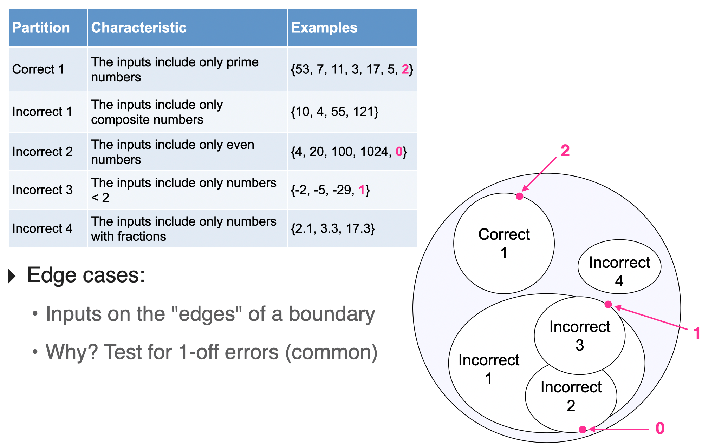
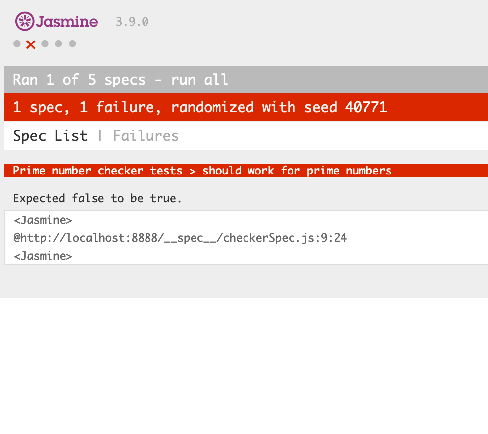

## CS 240 - Software Engineering

### In-Class Exercise: Unit Testing (Jasmine)

As your team continues to develop personas and scenarios by which they interact with your software, we can begin refining some user stories for development. This lab is meant to help you jumpstart the requirements needed for Project 1.

#### Student Outcomes

- To identify and write user stories
- To practice the agile design process: sprint planning

#### Starter Code and Git

Starter code for this assignment is provided in the github repo [https://github.com/davidtchiu/cs240-lab-testing](https://github.com/davidtchiu/cs240-lab-testing). On my github repo, _fork_ this repository to your github account to obtain your own copy. Then _clone_ your copy down to your local working directory. After you've done this, you can work freely in VS Code. Remember to commit when appropriate, with substantive messages.

#### Part 1 - Getting Started with Jasmine

- Open up the `cs240-lab-testing` project with VS Code. Check out the code (stored inside the `src/` directory) before doing anything. All that's there is an `app.js` file, and there are a couple functions, whose correctness are dubious and need to be tested, and a third function that needs to be implemented.

- Next, open up the integrated Terminal, because we will be using node to install jasmine. Type the following:

  ```
  npm install geckodriver
  npm install --save-dev jasmine-browser-runner
  npx jasmine-browser-runner init
  ```

  This will download and initialize Jasmine for this project.

- Next, run:

  ```
  npx jasmine-browser-runner serve
  ```

  This command shouldn't return on the terminal as long as it's running. It starts up the Jasmine web interface that shows you the results of your tests.

- To get to the Jasmine web interface, point to your browser to [http://localhost:8888/](http://localhost:8888/). You should see a Jasmine page that says something to the order of `Incomplete: No specs found, , randomized with seed ...`. That's good news! Jasmine is running, but we just haven't written any tests (specs) yet!

#### Part 2 - Exploring the Jasmine Testing Framework

In Jasmine, a **suite** lets us group together related specs (or unit tests). To make a test suite,

1. First, create a file called `checkerSpecs.js` inside the `specs/` directory. It's important to note that _all_ test suite files must end in either `spec.js` or `Spec.js`, and they must be placed inside the `specs/` directory in order for Jasmine to find them. (Similarly, any code you wish to test must be in the `src/` directory.)

2. **Test Suite**: In the `checkerSpecs.js` file, we will use the `describe()` function to create a new test suite. The `describe()` function has the following syntax:

   ```js
   describe("Name of Suite", function () {
     // spec 1
     // spec 2
     // spec 3
     // ...
   });
   ```

3. Each **spec** (or unit test) is declared using the `it()` function, which has the following format:

   ```js
   it("should work for...", function () {
     // assertion (or expectation) statements
   });
   ```

   One of the nice things about the Jasmine framework is that, it's super intuitive to read. Every test and assertion code should read like English. The string argument to the `it()` function usually starts with `"should ...` and it's up to the tester to complete that sentence with the expected behavior.

4. When unit testing, we're interested in finding out whether certain inputs to a function lead to expected outputs (conversely, we're also interested in knowing whether incorrect inputs lead to incorrect outputs.) Such statements are called **assertions** or **expectations** in unit testing. For instance, if we're testing our prime number checker, we would **expect** that an input of `11` would return `true`, and conversely, we would also expect that `20` would return `false`. Writing assertions is done using the `expect()` method:

   ```js
   expect(expression1).toBe(expression2);
   ```

   Again, each assertion statement is designed to be very human-readable. For instance, an assertion that states `5+10` should be `15` can be made as follows,

   ```js
   expect(5 + 10).toBe(15);
   ```

   There's a `not` keyword that can also be used to flip the logic:

   ```js
   expect(10 + "10").not.toBe("20");
   ```

5. Let's put it all together by writing some tests for the Prime Number Checker (`isPrime()`) function that is provided to you in the code. Copy and paste the following specs in the `checkerSpec.js` file.

   ```js
   describe("Prime number checker tests", function () {
     it("should work for prime numbers", function () {
       expect(isPrime(53)).toBe(true);
       expect(isPrime(7)).toBe(true);
       expect(isPrime(11)).toBe(true);
       expect(isPrime(3)).toBe(true);
       expect(isPrime(17)).toBe(true);
       expect(isPrime(5)).toBe(true);
       expect(isPrime(2)).toBe(true);
     });

     it("should work for composite numbers", function () {
       expect(isPrime(4)).toBe(false);
       expect(isPrime(10)).toBe(false);
       expect(isPrime(55)).toBe(false);
       expect(isPrime(121)).toBe(false);
     });

     it("should work for even numbers", function () {
       expect(isPrime(4)).toBe(false);
       expect(isPrime(20)).toBe(false);
       expect(isPrime(100)).toBe(false);
       expect(isPrime(1024)).toBe(false);
       expect(isPrime(0)).toBe(false);
     });

     it("should work for numbers less than 2", function () {
       expect(isPrime(-2)).toBe(false);
       expect(isPrime(-5)).toBe(false);
       expect(isPrime(-29)).toBe(false);
       expect(isPrime(-1)).toBe(false);
     });

     it("should work for numbers with fractions", function () {
       expect(isPrime(2.1)).toBe(false);
       expect(isPrime(3.3)).toBe(false);
       expect(isPrime(17.3)).toBe(false);
     });
   });
   ```

6. Read through the specs, and note that the input values come directly from the input partitions we decided during class:
   

7. Okay let's run the tests, and it's as simple as refreshing your browser, which is pointing to [http://localhost:8888/](http://localhost:8888/). You should see some errors!
   
   In this case, it tells you that the error is on **line 9** of your `checkerSpec.js` file, and a quick inspection tells us that `2` (which should be prime) did not pass your test. This means there's a bug in `isPrime()` that should be fixed.

8. Go ahead and fix the bug in `isPrime()` and try running the tests again. After you've fixed it, refresh the page again, and it should say that all 5 specs passed the test!

9. **Infinite loops and the Halting Problem** Comment out the initial if-statement that checks if the number is an integer and is greater than 1. Run the tests again and see what happens. Your browser should hang, and eventually, it may clue you in that it's actually running code and stuck in a loop! If you look at the `isPrime()` implementation now, there are actually several ways that you can induce an infinite loop. One way is to input a negative number. Another way is to give it a floating point number. Obviously, both cases were tested in our suite. When you see this behavior, you should hit "stop" on your browser, and look for the tests that induced this behavior, then fix the code to avoid infinite loops. (For us, just go ahead and uncomment the conditional, but I wanted to show you what this looked like.)

So, you may wonder why Jasmine isn't smart enough to know that it's stuck in an infinite loop, and break out of it to report the error. This is hitting on a fundamental problem in computer science theory called the _Halting Problem_. Basically it states that a monitoring application can't decide whether the monitored program will ever stop. In other words, there are plenty of algorithms that take a _really_ long time to process -- and that they will eventually terminate. But a monitoring program can't tell those apart from programs that buggy and stuck in a loop. So while we can always answer "yes" to whether a program halts, it is not possible to answer "no."

#### Part 3 - Other "Matchers"

1. The

#### Part 4 - Writing Specs (Unit Tests)

1. Now it's your turn!
