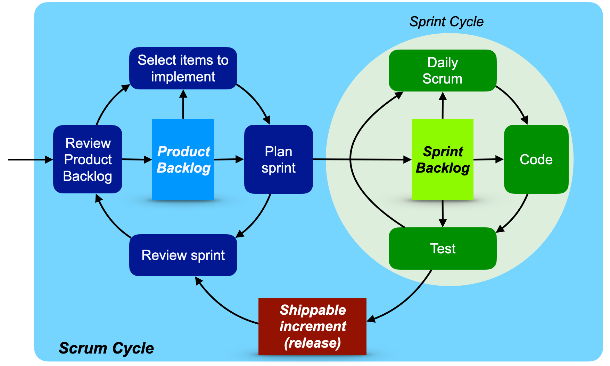

## CS 240 - Software Engineering

### Project 2: Agile Development

#### Student Outcomes

- To practice the agile design process: scrum

#### Weekly Sprints

Once your team is in agreement with the current sprint backlog, you can start developing! Here's the workflow I expect:

- You should develop under the same Github project that was created earlier: `cs240-term-project`.

  - Rename the `master` branch to `main` as we've been doing.

- Recall the scrum/sprint cycle below and try to pinpoint where we're at in the process. We've developed a product backlog, and we're currently transitioning into the right-hand side of the figure, for our first sprint iteration.
  

- **Election**: At the beginning of each weekly sprint cycle, you will elect a new project manager. You should do so now.

- There are 3 daily stages of the sprint: scrum meeting, coding, and testing.

  - **Daily Scrum**: _Every morning_, the project manager must hold a quick meeting in person, over slack, or email. The Trello board should be in the background of this meeting. The meeting is short and informal, driven by 3 questions, to which every member must respond. The project manager records responses in a log, and also moderates light discussion over the day's work, and solicits advice for overcoming challenges.

    - Project managers:
      - [Click here to access](https://docs.google.com/document/d/1qmWLSw8S4UfYVMEIToDqK4T4hrBufaWzlFpEmIrPRbU/) the daily scrum log template. Make a copy of it and add to it every day.
      - During the daily scrum meeting, the project manager in consultation with the team, might update the Trello board so that it reflects the tasks that's been done (archive them), or they may even add to the task list. However, it's important that new tasks aren't added to the current sprint backlog. You could either add to the product backlog, or create a new sprint backlog for next week.
      - At end of the week, the project manager must assign each team member a score from 0 to 3 using the rubric provided in the appendix of the provided template. Please note that scores of 3 are considered rare, resulting in extra credit for rewarding extraordinary effort for the week's sprint.
      - Take this responsibility seriously! The scrum log is vital for me to determine your individual contributions toward the project.

  - **Coding/Testing**:

    - The coding and testing phases go hand-in-hand. A reasonable amount of progress should be made by each team member daily towards their sprint goals, though I completely understand that people carry different schedules and workloads, and I ask that the project manager be sensitive to that.
    - If you're performing unit testing, which is _strongly recommended_, then test-writing is absolutely considered a substantive activity.
    - Git workflow:
      - Each team member is reminded to create branches if working on a new feature, and commit when appropriate.
      - Each night, push your commits up to github.
      - If you're requesting to merge your branch to the `main` branch, create a pull request. The project manager should do a code review, ask for input, and resolve pull requests in the next morning's scrum meeting.

  - You'll complete these activities every day, for a week. At the end of the week, the project manager should:

    - Remind every team member to commit and push their code to Github.
      - It is normal to have unfinished or halfway finished tasks. Do not extend the sprint.
    - Run an election for a new project manager for the next sprint.
    - Assign and record a "grade" for each team member in the scrum log.

  - **If you're the next project manager**, you should create a new sprint backlog (DO NOT REMOVE THE CURRENT ONE).

#### Submissions

At the end of the each week (sprint), the project manager must submit to me the following on canvas:

1. Their scrum log with scores for each team member, and a quick justification for the score.
2. A link to your github project page, which is why it's important that everyone commits and pushes.
3. A link to your team's Trello board.

#### Grading

```
I will assign each of you a grade (from 0 to 3) after each sprint. Though I take it into consideration,
Your sprint grade is not just based on your project manager's rating. I base your grade on your commit
history also, and I will be doing code reviews to ensure that you're making substantive commits each
sprint.
```
