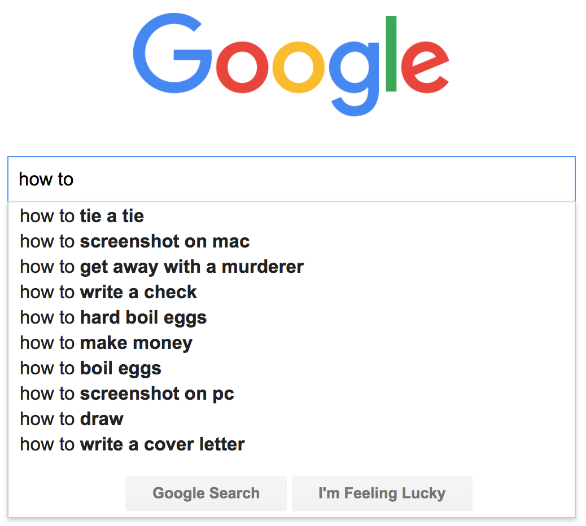

## CS 261 - Computer Science II

### You Complete Me

Autocompletion is pervasive in modern applications. As the user types, the program predicts the complete query (typically a word or phrase) that the user intends to type. Autocomplete is most effective when there are a limited number of likely queries. For example, the Internet Movie Database uses it to display the names of movies as the user types; search engines use it to display suggestions as the user enters web search queries; cell phones use it to speed up text input.

<center>

&nbsp;&nbsp;

&nbsp;&nbsp;

</center>

In these examples, the application predicts how likely it is that the user is typing each query and presents to the user a list of the top-matching queries, in descending order of weight. These weights are determined by historical data, such as box office revenue for movies, frequencies of search queries from other Google users, or the typing history of a cell phone user. For the purposes of this assignment, you will have access to a set of all possible queries and associated weights (and these queries and weights will not change).

For this assignment, you will implement autocomplete by sorting the terms by query string; searching to find all query strings that start with a given prefix; and sorting the matching terms by weight.

#### Student Objectives
- Designing a project from scratch.
- Catching exceptions.
- Exposure to interfaces.
- Comparing objects.

#### Required Files

The following file(s) have been provided for this homework.

- [wiktionary.txt](wiktionary.txt) - contains the 10,000 most common words in [Project Gutenberg](https://www.gutenberg.org/), with their frequencies.

#### Object-Oriented Design
In this assignment you'll be responsible for coming up with your own object oriented design. That is, read and understand the problem you need to solve. 

Get a sheet of paper, design the UML class diagram. What classes do you think you'll need? What methods do they need to provide? How do they relate to each other What are the client classes? Are there opportunities for inheritance? Do any of them need to implement `Comparable` or any other interface? 

Projects containing only one class will probably not be a good idea. Think modularly. Decompose the overall problem, into smaller, manageable classes when possible. Think back to our lectures in which I showed you the UML diagram of the Farm project. Just by examining the UML diagram, it should be rather intuitive to understand each class' roles, and how your code is going to work together.

It is a very bad idea to start coding before complete your design. Feel free to come talk to me or your tutors about your initial design.

You do need to implement one standalone class, so I can grade your program:

- `UserInterface` -- This class simply contains the `main()` method, which I will run and expect kind of interaction shown in the beginning of this assignment. (I'll explain later exactly what this method needs to do). You should work this class into your UML diagram.

- For comparison, my program has 4 classes including `UserInterface`.


#### Instructions

1. The first thing you need to do is to understand the data that I've provided you with. Open the "training file" that comes with this project. Each line represents a term and the number of occurrences (frequencies) of that term, separated by tab. The terms are in no particular ordering. Caution: some the frequencies are too big to store in an `int` variable. I would store those in a `long` instead. You should also only store the lower-case versions of each term.

2. After you are able to open the training file, you need to keep a list of unique terms, along with each term's corresponding frequencies. (Perhaps a separate class that encapsulates this pair of values?)

3. When the user types in a query, which may be only the prefix of a word of interest, you must search through your List of terms and return a List of all terms whose prefixes match the given prefix. For instance, if the query was How then your List might contain: how, howdy, howl, howling, howitzer, and so on.

4. The list of autocompleted terms must then be sorted in descending order of the terms' frequencies. Just like when you type into Google's search bar, the list that you return would have the "most-likely" match ranked first. You may use Collections.sort() for this step, but how do you now sort the list of terms by frequency? (Hint: Do you remember the Comparable interface?)

5. You must provide a `UserInterface` class, that contains a single method, `public static void main(String[] args)`. If there are other static methods in this class, they must be made private so that they're hidden from the user. The main method should simply instantiate and start your program.

6. When your program starts,  it should prompt the user for the name of the "training file," (i.e., `wiktionary.txt`). Your program should then attempt to open this file and read in its contents, but you must use a try-catch clause to handle checked exception `FileNotFoundException` that is thrown. As long as the file cannot be opened, re-prompt the user for the name of the file. Your program should not move on until this is resolved. After reading the training file contents into your list, your then enters an infinite loop, requesting for a *query* until the user enters `.quit`. After the user types in a query, you extract the last word in the query and use it to do your autocompletion routine. Print out the first 10 matches, if there are that many.


#### Sample Output

```
Please select your training file:
> wooktionary.txt

Sorry, wooktionary.txt was not found!
Please select your training file:
> wiktionary.txt

Instructions: Type in the first few letters of your query, and I'll
try to guess what it is! Type .quit to exit the program.

> h
879975500   his
839720500   he
613933600   had
520250100   her
434650000   have
397199700   him
160232900   has
86347800    himself
77060300    how
72982900    here

> hi
879975500   his
397199700   him
86347800    himself
26667200    high
14195800    history
9437910 hill
7928030 higher
6647580 hills
6606600 highest
4568010 highly

> good
96660200    good
4573540 goods
981718  goodly
509253  good-looking

> boo
17973900    book
12582700    books
2530760 boots
727922  boot
673967  boon
528240  booty

> computer sci
5796010 science
2998400 scientific

> ze
2316830 zeal
757669  zealous
690185  zeus

> zee

> .quit
```

#### Grading
```
CS 261 Homework  (You Complete Me)


----------------------------------------------------------
[15pts] Class design

> Your class design demonstrates good modularity.

> Demonstrates good use of inheritance and interfaces,
  if applicable.


----------------------------------------------------------
[5pts] Exception handling

> Your program gracefully handles FileNotFoundException by
try-catch and reprompting the user for the file name.


----------------------------------------------------------
[30pts] Implementation

> Your program opens and reads term-frequency
data from a text file.

> Your program finds all terms that begin with the given
prefix.

> Your program ignores all terms in the query preceding
the final term.

----------------------------------------------------------
[20pts] Sorting results by frequency

> Your program sorts and displays the first 10 results
in descending order of frequency.


----------------------------------------------------------
[5pts] UserInterface class

> Your program repeatedly asks user for a review after
finishing a prediction.

> Your program exits when .quit is given.


----------------------------------------------------------
[5pts] Comments

> You include sufficient Javadocs comments for each class and method.

> You include sufficient inline comments in your methods.

Total: 80
```

#### Submitting Your Assignment
Follow these instructor to submit your work. You may submit as often as you'd like before the deadline. I will grade the most recent copy.

- Navigate to our course page on Canvas and click on the assignment to which you are submitting. Click on "Submit Assignment."

- Upload all the files ending in `.java` from your project folder.

- Click "Submit Assignment" again to upload it.

#### Credits

Written by Brad Richards.
