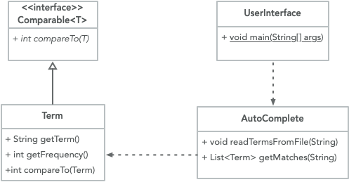

## CS 261 - Computer Science II

### Homework 3: You Complete Me

Auto-completion is a pervasive feature in modern applications. As the user types, the program predicts the complete query (typically a word or phrase) that the user intends to type.  For example, the Internet Movie Database uses it to display the names of movies as the user types; search engines use it to display suggestions as the user enters web search queries; cell phones use it to speed up text input.

<center>

&nbsp;&nbsp;

</center>

In these examples, the application predicts how likely it is that the user is typing each query and presents to the user a list of the top-matching queries, in descending order of weight. These weights are determined by historical data, such as box office revenue for movies, frequencies of search queries from other Google users, or the typing history of a cell phone user. For the purposes of this assignment, you will have access to a set of all possible queries and associated weights (and these queries and weights will not change).


#### Student Objectives
- Designing an object-oriented project from scratch.
- Reading from files.
- Exposure to interfaces.
- Implementing the Comparable interface.

#### Required Files

The following file(s) have been provided for this homework.

- [wiktionary.txt](wiktionary.txt) - contains the 10,000 most common words in [Project Gutenberg](https://www.gutenberg.org/), with their frequencies.

#### Object-Oriented Design
We need to start removing the scaffolding that I provide with each assignment in prescribing you the overall structure of the classes.  We'll ease into this over the course of the semester, so we'll start slow --  I'll provide the class diagram below, but you'll need to fill in the rest. You should expect that future assignments might only provide the class diagram, and it's up to you to interpret it. 

- Examine the class diagram given below. (Note the `Comparable` interface is built into Java, and won't actually show up in your project diagram!)

  


- `Term` -- This class encapsulates a term-frequency pair (given as each row in the input file). 

- `Autocomplete` -- This is the heart of your project. Among other things, this class stores a list of term-frequency objects and provides functionalities for searching through the list for terms that match the user's "query." Objects of this class must open a given training file and read the file's contents into its list. Because searching through terms ought to be fast, you should add items to its term-frequency  in alphabetical order.

- `UserInterface` -- This class simply contains the `main()` method, which I will run and expect kind of interaction shown in the beginning of this assignment. Prompt the user the for the training file (possibly repeatedly). Instantiates an `Autocomplete` object and calls a method to populate it with the contents from the file that was given in the prompt. Then repeatedly prompt the user for the next "query" and search the `Autocomplete` object for a list of results. This repeats until `.quit` is input, which exits the program.


#### Instructions

0. The first class you should work on is `Term`.
   - This class stores just two instance variables -- the term and its corresponding frequency. It needs just one constructor that inputs both of these arguments. You should also provide getter methods for the term and frequency portions, respectively.

    - Here's the gig. We eventually want a list of `Term`s need to be sorted alphabetically. Therefore, this class also needs to `implement` the `Comparable<Term>` interface and `@Override` the `public int compareTo(Term other)` method. Write it so that `this` Term should come before the `other` Term if its string precedes the other term in alphabetical order. (You might recall that you can compare two strings to see which comes before which.)

1. Next, you need to understand the file that I've provided you with. Open the "training file" called `wiktionary.txt` that comes with this project. Each line represents a term and the number of occurrences (frequencies) of that term, separated by tab. The terms are in no particular ordering. Caution: some the frequencies are too big to store in an `int` variable. I would store those in a `long` instead. You should also only store the lower-case versions of each term.

2. Now work on the `Autocomplete` class. This is the core of your project!
    - It should store an ArrayList of `Term`s, and its default constructor simply instantiates an empty list.
    - Work on the `public void readTermsFromFile(String filename)` method next. It should attempt to open the given file and read it line-by-line. You need to parse the information on each line into a term (String) and frequency (long), and create a `Term` object using these. Then put the new `Term` in your list!
      - You might recall how to read files -- to do this. One way is to use a `Scanner` object to open the file, which would then allow you to read it line-by-line. If you don't remember how to do this, ask our [AI tutor](https://chatgpt.com/g/g-6865afb2a07481918f072a3db92a74e6-puget-sound-cs-2-tutor) or go back to your notes!
      - You might also recall that you can split (tokenize) up a string into smaller parts by using its built-in `public String[] split(String delim)` method.
      - Finally, to parse a string containing a number using the static method `Long.parseLong("1136460")`, which would return 1136460 as a `long`.
      - Once you've "parsed" each line into a `Term` object, add it to your list!
      - After all the terms have been loaded, simply call `Collections.sort(your_list)` to sort the ArrayList alphabetically. (How convenient!)

  - Exception Handling of `readTermsFromFile(String filename)`
      - If the `FileNotFoundException` is thrown when you attempt to open the file, do not try to catch it! That is a major user error and we don't want to handle it here. Simply propagate it up to the caller.
      - Once the file is open, attempt to read each line of input, parsing the first token into a `long`. 
        - If the `NumberFormatException` is caught from calling `Long.parseLong()`, you'll also just need to ignore alert the user by printing out the line that contained the bad input. Your code should continue processing the remaining file!
        - In some cases, a badly formatted line of the file might only contain one token! Handle those exceptions gracefully as well.
        - In either case, print out the bad row number, and the row itself, but keep processing the remaining file (that is, the program shall not crash!)
      - For every 1000 lines read, print out a progress status: `Terms Processed: x`, where `x` is the number of lines that's been read.

    - Next, work on the `public List<Term> getMatches(String query)`.  When the user types in a "query," which may be only the prefix of a word of interest, you need search through your list of terms and return a list of all terms whose prefixes match the given prefix. For instance, if the query was "How" then your returned list of terms might contain: how, howdy, howl, howling, howitzer, and so on (and since you're returning a list of `Term`s, each term comes with their frequencies too -- that'll be useful soon!)

3. **Comparing Terms Revisited!** Just like when you type into Google's search bar, the list that you return would have the "most-likely" match ranked first. To have that same effect, your list of auto-completed terms must be sorted in descending order of the their frequencies. To do this, you should call the `Collections.sort(..)` method on the ArrayList of matched terms.
    - But we have a conundrum -- Terms are already implemented such that if you sorted them, they will come out in alphabetical order.

    - To write this method, we need to define a second way to sort Terms (by descending frequency ordering instead). No worries, this is quite simple.

    - Do some research into Java's built-in `Comparator<T>` interface ([link here](https://www.geeksforgeeks.org/java/java-comparator-interface/)). It's a lot like the `Comparable<T>` interface. Create a new class, called `TermFreqComparator<Term>` and implement `Comparator<Term>`. You just need to write the `public int compare(Term t1, Term t2)` method. The rules of returning are the same as in `Comparable`:
      - Return a negative integer if t1 should go before t2.
      - Return 0 if both objects are equal.
      - Return a positive integer if t1 should go after t2.

    - Remember, you want to order these terms in *descending* order of their frequency. So, if `t1` has a frequency of 10 and `t2` has a frequency of 20, then calling `compare(t1, t2)` should yield a positive number, placing `t1` *behind* `t2`.

    - After you're done implementing this class, try sorting your list using this new comparator you wrote: `Collections.sort(matched_list, new TermFreqComparator());`


4. Finally, you must provide a `UserInterface` class, that contains `public static void main(String[] args)`. If you make other `static` methods in this class, they must be made private so that they're hidden from the user.
  - The main method should instantiate a copy of `Autocomplete`.
  - Prompt the user for the file to process then call `readTermsFromFile(filename)`.
    - But remember, `readTermsFromFile(filename)` is risky, because there's a chance that a `FileNotFoundException` is thrown. If thrown, catch it and alert the user that it was a bad file. Then reprompt the user for the file. Do this until a good file has been loaded.
   - Next, your main method should continuously prompt the user for a keyword prefix (called a *query*) until the user types `.quit`.
   - After you scan in a query, call `getMatches()` on it. Sort the returned list by descending order of frequency and display it!
     - In the case where a user query contains multiple words, you only need to get matches on the *last* word they entered.
   - Print out at most 10 matches, if there are that many.

<!-- 5. When your program starts,  it should prompt the user for the name of the "training file". Note that any method that attempts to open a file can't compile until you've thrown or caught a *file not found exception*. The easiest way to do this is to add the following `throws` suffix to your method:

    ```java
    public void method-that-opens-file() throws FileNotFoundException {
      // code to open and read a file
    }
    ```

  After reading the training file contents into your list, your then enters an infinite loop, requesting for a  *query* until the user enters `.quit`. After the user types in a query, you extract the last word in the query and use it to do your autocompletion routine. Print out the first 10 matches, if there are that many. -->

<!--
5. When your program starts,  it should prompt the user for the name of the "training file," (i.e., `wiktionary.txt`). Your program should then attempt to open this file and read in its contents, but you must use a try-catch clause to handle checked exception `FileNotFoundException` that is thrown. As long as the file cannot be opened, re-prompt the user for the name of the file. Your program should not move on until this is resolved. After reading the training file contents into your list, your then enters an infinite loop, requesting for a *query* until the user enters `.quit`. After the user types in a query, you extract the last word in the query and use it to do your autocompletion routine. Print out the first 10 matches, if there are that many.

-->

#### Behavior when Attempting to Open Bad Files
Here, I'm having the `main()` method open `wooktionary.txt`, which doesn't exist. Then again `weektionary.dat`. The main method catches the `FileNotFoundException` thrown by `parseTermsFromFile()` and repeated prompts for another file.
```
Enter filename: wooktionary.txt
Could not open file 'wooktionary.txt'. Please try again.
Enter filename: weektionary.dat
Could not open file 'weektionary.dat'. Please try again.
Enter filename: 
```

#### Behavior when Opening Good File
A successful load of `wiktionary.txt.` The output below shows the progress of all the terms loading. You can see that exceptions were caught four times by `parseTermsFromFile()`, and reported to the terminal. Notice that the program clears these exceptions and continues running to completion.
```
Enter filename: wiktionary.txt
Terms Processed: 1000
Bad input on line 1117 - first token is not an integer: 1,136,460 baggage
Bad input on line 1394 - first token is not an integer: david messing with you
Bad input on line 1416 - first token is not an integer: LOL
Terms Processed: 2000
Terms Processed: 3000
Terms Processed: 4000
Terms Processed: 5000
Terms Processed: 6000
Terms Processed: 7000
Terms Processed: 8000
Terms Processed: 9000
Bad input on line 9989 - expected two tokens: 3994948
Terms Processed: 10000
```


#### Sample Interaction Output
After your file loads, your main method should immediately prompt for queries.
```
Instructions: Type in the first few letters of your query, hit "enter", and I'll
try to guess what it is! Type .quit to exit the program.

> She ha
613933600 	had
434650000 	have
160232900 	has
64822700 	hand
41535500 	having
38508100 	hands
29386600 	half
19645800 	hard
16210500 	happy
14581700 	hair

> hi
879975500   his
397199700   him
86347800    himself
26667200    high
14195800    history
9437910 hill
7928030 higher
6647580 hills
6606600 highest
4568010 highly

> ig
3832170	ignorant
3515240	ignorance
727606	ignored
521515	ignore
394855	ignoble

> good
96660200    good
4573540 goods
981718  goodly
509253  good-looking

> boo
17973900    book
12582700    books
2530760 boots
727922  boot
673967  boon
528240  booty

> computer sci
5796010 science
2998400 scientific

> ze
2316830 zeal
757669  zealous
690185  zeus

> zee

> .quit
```

#### Grading
```
CS 261 Homework  (You Complete Me)

----------------------------------------------------------
[30pts] Autocompletion Algorithm: Get Matches

> Given a word's prefix, your program finds all terms that 
begin with the given prefix. Can you exploit the fact that
terms are sorted alphabetically in your list?

> Only the last term in the query needs autocompleted.

----------------------------------------------------------
[15pts] Comparing and Sorting

> Your program sorts and displays the first 10 results
in descending order of frequency.

> Your program sorts the internal array list of terms in
alphabetical order.

----------------------------------------------------------
[15pts] Exception Handling

> Your parseTermsFromFile(filename) method propagates (does not catch)
a FileNotFoundException.

> Your parseTermsFromFile(filename) method catches any exceptions raised
via file parsing. The two obvious ones are `NumberFormatException` and
`ArrayIndexOutOfBoundsException`. Catch these, report to the terminal, but
continue processing the remaining file.

> Your parseTermsFromFile(filename) method must increment the row count 
regardless of whether an exception is thrown for that row. (Think: 'finally')

----------------------------------------------------------
[15pts] UserInterface class: Main method

> The main() method should prompt for a file to load. If it caught a 
FileNotFoundException, reprompt the user for another file. Your main() method 
shall not throw FileNotFoundException to the JVM.

> Your program repeatedly asks user for a query. Only the last word that
was given in the query shall be  used to find matches.

> Your program exits when .quit is given.


----------------------------------------------------------
[5pts] Comments

> You include sufficient Javadocs comments for each class and method.

> You include sufficient inline comments in your methods.

Total: 80
```

#### Submitting Your Assignment
Follow these instructions to submit your work. You may submit as often as you'd like before the deadline. I will grade the most recent copy.

- If this is a team assignment, please ensure that you listed all of your team members in a Javadocs comment at the top of each `.java` file.

- Navigate to our course page on Canvas and click on the assignment to which you are submitting. Click on "Submit Assignment."

- Upload all the files ending in `.java` from your project folder.

- Click "Submit Assignment" again to upload it.
