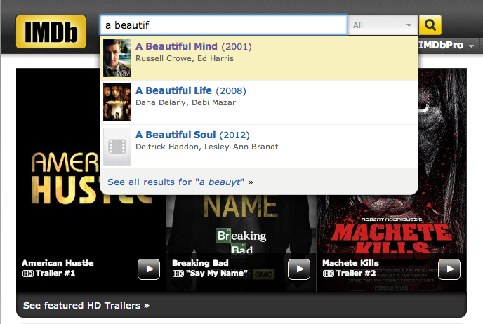

## CS 261 - Computer Science II

### Homework 3: You Complete Me

Auto-completion is a pervasive feature in modern applications. As the user types, the program predicts the complete query (typically a word or phrase) that the user intends to type.  For example, the Internet Movie Database uses it to display the names of movies as the user types; search engines use it to display suggestions as the user enters web search queries; cell phones use it to speed up text input.

<center>

&nbsp;&nbsp;

</center>

In these examples, the application predicts how likely it is that the user is typing each query and presents to the user a list of the top-matching queries, in descending order of weight. These weights are determined by historical data, such as box office revenue for movies, frequencies of search queries from other Google users, or the typing history of a cell phone user. For the purposes of this assignment, you will have access to a set of all possible queries and associated weights (and these queries and weights will not change).


#### Student Objectives
- Designing an object-oriented project from scratch.
- Reading from files.
- Exposure to interfaces.
- Implementing the Comparable interface.

#### Required Files

The following file(s) have been provided for this homework.

- [wiktionary.txt](wiktionary.txt) - contains the 10,000 most common words in [Project Gutenberg](https://www.gutenberg.org/), with their frequencies.

#### Object-Oriented Design
We need to start removing the scaffolding that I provide with each assignment in prescribing you the overall structure of the classes.  We'll ease into this over the course of the semester, so we'll start slow --  I'll provide the class diagram below, but you'll need to fill in the rest. You should expect that future assignments might only provide the class diagram, and it's up to you to interpret it. 

- Examine the class diagram given below. (Note the `Comparable` interface is built into Java, and won't actually show up in your project diagram!)

  


- `Term` -- This class encapsulates a term-frequency pair (given as each row in the input file). 

- `Autocomplete` -- This is the heart of your project. Among other things, this class stores a list of term-frequency objects and provides functionalities for searching through the list for terms that match the user's "query." Objects of this class must open a given training file and read the file's contents into its list. Because searching through terms ought to be fast, you should add items to its term-frequency  in alphabetical order.

- `UserInterface` -- This class simply contains the `main()` method, which I will run and expect kind of interaction shown in the beginning of this assignment. Prompt the user the for the training file (possibly repeatedly). Instantiates an `Autocomplete` object and calls a method to populate it with the contents from the file that was given in the prompt. Then repeatedly prompt the user for the next "query" and search the `Autocomplete` object for a list of results. This repeats until `.quit` is input, which exits the program.


#### Instructions

0. The first class I'd work on is `Term`.
   - This class stores just two instance variables -- the term and its corresponding frequency. It needs just one constructor that inputs both of these arguments. You should also provide getter methods for the term and frequency portions, respectively.

    - Objects of this class need to be ordered by decreasing frequency. Therefore, this class needs to implement the `Comparable<Term>` interface and override the `public int compareTo(Term other)` method. 

1. Next, you need to understand the file that I've provided you with. Open the "training file" called `wiktionary.txt` that comes with this project. Each line represents a term and the number of occurrences (frequencies) of that term, separated by tab. The terms are in no particular ordering. Caution: some the frequencies are too big to store in an `int` variable. I would store those in a `long` instead. You should also only store the lower-case versions of each term.

2. Now work on the `Autocomplete` class. This is the core of your project!
    - It should store a list of `Term`s.
    - First, work on the `public void readTermsFromFile(String filename)` method. It should attempt to open the given file and read it line-by-line. You need to parse the information on each line into a term (String) and frequency (long), and create a `Term` object using these. Then put the new `Term` in your list!
    - You should recall how to read files -- to do this, you can use a `Scanner` object to open the file, but you need to handle the `FileNotFoundException`. If you don't remember how to do this, ask our [AI tutor](https://chatgpt.com/g/g-6865afb2a07481918f072a3db92a74e6-puget-sound-cs-2-tutor)!
    - Next, work on the `public List<Term> getMatches(String query)`.  When the user types in a "query," which may be only the prefix of a word of interest, you need search through your list of terms and return a list of all terms whose prefixes match the given prefix. For instance, if the query was "How" then your returned list of terms might contain: how, howdy, howl, howling, howitzer, and so on (and since you're returning a list of `Term`s, each term comes with their frequencies too -- that'll be useful soon!)

3. Just like when you type into Google's search bar, the list that you return would have the "most-likely" match ranked first. To have that same effect, your list of auto-completed terms must be sorted in descending order of the their frequencies. To do this, you should call the `Collections.sort(..)` method (you need to first import `java.util.Collections`) prior to printing out the list of matched terms, and if you implemented the `Comparable` interface correctly in `Term`, your results should be sorted in descending frequency after calling `Collections.sort(..)`.

4. Finally, you must provide a `UserInterface` class, that contains a single static method, `public static void main(String[] args)`. If there are other static methods in this class, they must be made private so that they're hidden from the user. The main method should simply instantiate a copy of `Autocomplete` and start your program.
   - It should continuously prompt the user for a keyword prefix (the query) until the user types `.quit`.
   - After you scan in a query, call `getMatches()` on it. Sort the returned list and display it!

<!-- 5. When your program starts,  it should prompt the user for the name of the "training file". Note that any method that attempts to open a file can't compile until you've thrown or caught a *file not found exception*. The easiest way to do this is to add the following `throws` suffix to your method:

    ```java
    public void method-that-opens-file() throws FileNotFoundException {
      // code to open and read a file
    }
    ```

  After reading the training file contents into your list, your then enters an infinite loop, requesting for a  *query* until the user enters `.quit`. After the user types in a query, you extract the last word in the query and use it to do your autocompletion routine. Print out the first 10 matches, if there are that many. -->

<!--
5. When your program starts,  it should prompt the user for the name of the "training file," (i.e., `wiktionary.txt`). Your program should then attempt to open this file and read in its contents, but you must use a try-catch clause to handle checked exception `FileNotFoundException` that is thrown. As long as the file cannot be opened, re-prompt the user for the name of the file. Your program should not move on until this is resolved. After reading the training file contents into your list, your then enters an infinite loop, requesting for a *query* until the user enters `.quit`. After the user types in a query, you extract the last word in the query and use it to do your autocompletion routine. Print out the first 10 matches, if there are that many.

-->

#### Sample Output

```
Instructions: Type in the first few letters of your query, hit "enter", and I'll
try to guess what it is! Type .quit to exit the program.

> h
879975500   his
839720500   he
613933600   had
520250100   her
434650000   have
397199700   him
160232900   has
86347800    himself
77060300    how
72982900    here

> hi
879975500   his
397199700   him
86347800    himself
26667200    high
14195800    history
9437910 hill
7928030 higher
6647580 hills
6606600 highest
4568010 highly

> ig
3832170	ignorant
3515240	ignorance
727606	ignored
521515	ignore
394855	ignoble

> good
96660200    good
4573540 goods
981718  goodly
509253  good-looking

> boo
17973900    book
12582700    books
2530760 boots
727922  boot
673967  boon
528240  booty

> computer sci
5796010 science
2998400 scientific

> ze
2316830 zeal
757669  zealous
690185  zeus

> zee

> .quit
```

#### Grading
```
CS 261 Homework  (You Complete Me)

----------------------------------------------------------
[45pts] Implementation

> Your program opens and reads term-frequency
data from a text file.

> Your program finds all terms that begin with the given
prefix.

> Your program ignores all terms in the query preceding
the final term.

----------------------------------------------------------
[20pts] Sorting results by frequency

> Your program sorts and displays the first 10 results
in descending order of frequency.


----------------------------------------------------------
[10pts] UserInterface class

> Your program repeatedly asks user for a review after
finishing a prediction.

> Your program exits when .quit is given.


----------------------------------------------------------
[5pts] Comments

> You include sufficient Javadocs comments for each class and method.

> You include sufficient inline comments in your methods.

Total: 80
```

#### Submitting Your Assignment
Follow these instructions to submit your work. You may submit as often as you'd like before the deadline. I will grade the most recent copy.

- If this is a team assignment, please ensure that you listed all of your team members in a Javadocs comment at the top of each `.java` file.

- Navigate to our course page on Canvas and click on the assignment to which you are submitting. Click on "Submit Assignment."

- Upload all the files ending in `.java` from your project folder.

- Click "Submit Assignment" again to upload it.
