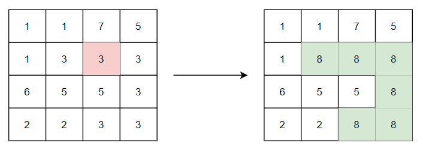

## CS 261 - Computer Science II

### Homework 6: Recursion Exercises

In this assignment, you'll be working with recursion. This assignment can be quite challenging, so start early. Don't get too frustrated if you can't figure out how to write a method. Use the design approaches that you've learned in class. Seek tutoring or office-hours help from me.

For full credit, all methods must be static, and recursive. To be clear, this doesn't necessarily mean that loops can't exist at all in your algorithms. In fact, in two of the problems below (findPrimeFactors and permute), you will need recursion and loops.

#### Student Outcomes

- Writing recursive algorithms of varying degrees of difficulty.

#### Instructions

Create a new project and create a class called `Recursion`. Put all of the following static methods in this class.


1. (Mild) Write a static method called `public static<E> Queue<E> reverseQueue(Queue<E> queue)` that reverses the content of the given queue before returning it. Note that the reversal of an empty queue is the queue itself. Hint: In the recursive case, remove the head, reverse remaining queue, then offer head to the tail of the queue.

	 ```java
	 Queue<Double> q0 = new LinkedList<>();
	 System.out.println(q0);
	 > []
	 System.out.println(Recursion.reverseQueue(q0));
	 > []

	 Queue<String> q1 = new LinkedList<>();
	 q1.add("A");
	 q1.add("B");
	 q1.add("C");
	 q1.add("D");
	 q1.add("E");
	 System.out.println(q1);
	 > [A, B, C, D, E]

	 System.out.println(Recursion.reverseQueue(q1));
	 > [E, D, C, B, A]

	 Queue<Integer> q2 = new LinkedList<>();
	 q2.add(100);
	 q2.add(200);
	 q2.add(300);
	 System.out.println(q2);
	 > [100, 200, 300]

	 System.out.println(Recursion.reverseQueue(q2));
	 > [300, 200, 100]

	 System.out.println(Recursion.reverseQueue(q2));
	 > [100, 200, 300]
	 ```

2. (Mild) Write a static method, `public static void printPrimeFactors(int x)` that prints all prime factors of the given integer. If your code is working, it should list all prime integers such that their product is equal to `x`. **Hint:** Any value of `x` that is less than 2 by definition does not have any prime factors. Otherwise, start by finding the smallest integer greater than 1 that divides evenly into `x` and print it ... (what should happen to `x` now?)

	 ```java
   System.out.println("Prime factors of 0");
   Recursion.printPrimeFactors(0);
	 > (no output)

   System.out.println("Prime factors of 2");
   Recursion.printPrimeFactors(2);
	 > 2

   System.out.println("Prime factors of 4");
   Recursion.printPrimeFactors(4);
	 > 2
	 > 2

   System.out.println("Prime factors of 6");
   Recursion.printPrimeFactors(6);
	 > 2
	 > 3

   System.out.println("Prime factors of 7");
   Recursion.printPrimeFactors(7);
	 > 7

   System.out.println("Prime factors of 99");
   Recursion.printPrimeFactors(99);
	 > 3
	 > 3
	 > 11

   System.out.println("Prime factors of 121");
   Recursion.printPrimeFactors(121);
	 > 11
	 > 11

   System.out.println("Prime factors of 1024");
   Recursion.printPrimeFactors(1024);
	 > 2
	 > 2
	 > 2
	 > 2
	 > 2
	 > 2
	 > 2
	 > 2
	 > 2
	 > 2
	 ```

3. (Medium) Write a static method, `public static String dec2binary(int x)` that converts a decimal integer to its binary string (e.g., `5` converts to `101`). Here's the intuition. If `x` is `0` or `1` then simply return the string `"0"` or `"1"` respectively. Otherwise, test to see if `x` is an odd integer. If it's odd, then `x` must end with `1`. Otherwise, it ends with `0`. Then concatenate that bit as a string to the right of the binary representation of `x/2`.

	```java
	System.out.println(Recursion.dec2binary(1));
	 > 1

   	System.out.println(Recursion.dec2binary(0));
	 > 0

   	System.out.println(Recursion.dec2binary(12));
	 > 1100

   	System.out.println(Recursion.dec2binary(1023));
	> 1111111111

	 System.out.println(Recursion.dec2binary(21845));
	 > 101010101010101
	 ```

4. (Medium) If you've ever used a tool like Photoshop, you may be familiar with the **Flood Fill (Paint Can) utility**, which allows you to fill an entire segment of the image with a  color of  choice. For example, say you flood-filled the cell at `A[1][2]` with a replacement value of 8 (image below on the left). Since it's a "fill," you might also need to change the values of any adjacent cells if they contain the same original value. So, not only does `A[1][2]` need to change from 3 to 8, but so might all of its four directional neighbors (to its north, east, south, and west), and their neighbors, and theirs, and so on. If this process is applied recursively, then the fill will be correctly propagated. Beware of accessing elements beyond any of the four boundaries of the 2D array (in which you'd want to avoid coloring -- hey that sounds like a terminating base case!)

	 

   Write a method `public static void floodFill(int[][] A, int i, int j, int r)` that flood fills the given 2D array starting from `A[i][j]` with the value  `r`. In the outputs below, assume that `print2DArray()` is a static method that prints out 2D arrays. (You should probably define this method so that you can see the contents, but it's not part of the assignment.)

   ```java
	 int[][] img1 = {
      {1, 1, 7, 5},
      {1, 3, 3, 3},
      {6, 5, 5, 3},
      {2, 2, 3, 3}
   };

   System.out.println("Before filling:");
   Recursion.print2DArray(img1);
   >	1       1       7       5
   >	1       3       3       3
   >	6       5       5       3
   >	2       2       3       3

   Recursion.floodFill(img1, 1, 2, 8);

   System.out.println("After filling:");
   Recursion.print2DArray(img1);
   >	1       1       7       5
   >	1       8       8       8
   >	6       5       5       8
   >	2       2       8       8
   ```

5. (Medium) Given a positive integer `n`, `n` is prime if and only if it is only divisible evenly by 1 and itself. Write a static method, `public static boolean isPrime(int n)` that tests if `n` is prime. Hint: I would first create a private helper method that inputs `n` and a counter `k` that is initially input as 2 by the public-facing `isPrime()` method. There are two base cases in this helper method: (1) when counter `k` reaches `n` that means `n` is prime, or (2) when `n` is evenly divisible by `k` then `n` is not prime. The recursive case of the helper method simply calls itself on `k+1`, moving the counter a step closer to `n`.

	```java
	System.out.println(Recursion.isPrime(13));
	> true

	System.out.println(Recursion.isPrime(66));
	> false

	System.out.println(Recursion.isPrime(2));
	> true

	System.out.println(Recursion.isPrime(1));
	> false
	```

6. (Spicy) Given a 2D array of integers, write a method `public static void printPaths(int[][] grid)` to print out all valid paths from cell (0, 0) to the bottom-right cell (rows - 1, cols - 1). The only legal moves at each step are: 
	- Move one cell to the right
	- Move one cell down
	Your method should print each full path as soon as it reaches the destination cell. 

	```java
	int[][] grid = {
		{1, 2},
		{3, 4}
	};
	Recursion.printPaths(grid);
	> 1 2 4
	> 1 3 4

    int[][] grid2 = {
        {1, 2, 3},
        {4, 5, 6}
    };
    Recursion.printPaths(grid2);	
	> 1 2 3 6
	> 1 2 5 6
	> 1 4 5 6
	```
	Hint: You should define a recursive helper method:
	```java
	private static void printPathsHelper(int[][] grid, int i, int j, String path)
	```
	where `i` and `j` are the current indices in traversing `grid`. At each step, pass along the current path (as `String path`) to accumulate the values. Your base case should detect when the bottom-right cell has been reached, at which case you simply print `path`. The recursive case should be when `i` and `j` are both not yet at the bottom-right cell, at which point you should make two recursive calls to move one step to the right, or one step down. If either `i` or `j` are out of bounds, do nothing.


7. (Spicy) A _permutation_ is a sequencing of the elements in a given collection. For instance, given a string `"abc"` there are 6 possible permutations of this string: `"abc"`, `"acb"`, `"bac"`, `"bca"`, `"cab"`, `"cba"`. The intuition goes like this: split the input string up by removing the first character, and recursively return a list of permutations of the remaining substring. Then for each string in the returned list, insert the first character back into every position of the string and add each to the list. Return the list when finished. Here's an example. Suppose you're finding all permutations of `"abc"`.

	 - Split `"abc"` by chopping `"a"` off, and recursively find the list of permutations of the remaining substring, `"bc"` (yep, call yourself on `"bc"` to obtain this list).
	 - Insert `"a"` back into every possible position for each substring in the returned list. In our example, the previous step returns `["bc", "cb"]`. For `"bc"` this yields: `"abc"`, `"bac"`, and `"bca"`. For `"cb"` this yields: `"acb"`, `"cab"`, and `"cba"`. Create a new list and add each of these permutations and return it.

		Write a static method called `public static List<String> permute(String str)` that takes as input a string and returns a `ArrayList<String>` of all permutations of that string.  Similarly, the only permutation of a single-character string is that character. **Hint:** Base case: If your string is shorter than two letters, then create a `ArrayList<String>`, add the string to it, and return the list. It should be noted that the permutation of an empty string is just an empty string.

		Below, my results are sorted alphabetically so that it's easier on the eyes, but that is not a requirement for full credit. You could sort the returned list for easier checking. To sort an ArrayList, use `Collections.sort(nameOfYourList);`

		```java
		System.out.println(Recursion.permute("a"));
		> [a]

		System.out.println(Recursion.permute("ab"));
		> [ab, ba]

		System.out.println(Recursion.permute("ba"));
		> [ab, ba]

		System.out.println(Recursion.permute("abc"));
		> [abc, acb, bac, bca, cab, cba]

		System.out.println(Recursion.permute("abcd"));
		> [abcd, abdc, acbd, acdb, adbc, adcb, bacd, badc, bcad, bcda, bdac, bdca, cabd, cadb, cbad, cbda, cdab, cdba, dabc, dacb, dbac, dbca, dcab, dcba]
		```

	- Fun fact: If your string is of length $$n$$, then you have a list of $$n! = n \times (n-1) \times (n-2) \times ... \times 2 \times 1$$ permutations. Because this algorithm needs to find all permutations, it runs in $$O(n!)$$ time. Yikes!

#### Additional Challenge: 🐍🐍🐍🐍 SnakeFill (Ssssssspicy) 🐍🐍🐍🐍

Write a method `public static void snakeFill(int n)` that prints out an $$n × n$$ grid of integers filled from 1 to $$n^2$$ in a diagonal “snake” pattern:

	- Start with 1 at the top-left (0,0).
	- Move right one (if possible).
	- Then alternate between diagonally up-right and diagonally down-left runs.

When a diagonal hits a boundary, take one step either right (if you hit the top or bottom edge and can move right) or down (if you hit the left or right edge and can move down), then switch diagonal direction and continue. Continue until the grid is filled; then print the grid (row by row, single spaces between numbers).

Hint: The way to go about this is to fill an $$n x n$$ 2D array and then print it out. I would write a helper method that inputs this 2D array, among other inputs, and recursively fills it up. The original (outer) method should then simply print this 2D array.


```java
Recursion.snakeFill(5);
1	2	6	7	15	
3	5	8	14	16	
4	9	13	17	22	
10	12	18	21	23	
11	19	20	24	25

Recursion.snakeFill(4);	
1	2	6	7	
3	5	8	13	
4	9	12	14	
10	11	15	16

Recursion.snakeFill(3);	
1	2	6	
3	5	7	
4	8	9	
```

<!-- public static void snakeFill(int n) {
        int[][] A = new int[n][n];
        diag(A, 0, 0, 1, true);
        for (int[] row : A) {
            for (int x : row) {
                System.out.print(x + "\t");
            }
            System.out.println();
        }
    }
    
    public static void diag(int[][] A, int row, int col, int num, boolean up) {
        if (row >= 0 && row < A.length && col >= 0 && col < A.length && A[row][col] == 0) {
            A[row][col] = num;

            if ((row == 0 && up) || (row == A.length-1 && !up)) {
                // reached top edge, go right, turn down
                diag(A, row, col+1, num+1, !up);
            }
            if ((col == 0 && !up) || (col == A.length-1 && up)) {
                // reached right edge, go down, turn down
                diag(A, row+1, col, num+1, !up);
            }

            int offsetR = (up) ? -1 : 1;
            int offsetC = -offsetR;
            diag(A, row+offsetR, col+offsetC, num+1, up);
        }
    }
-->

#### Program Defensively

You can't control how another user or program chooses to use your methods. For each method, think critically about all the things that could go wrong and cause an unintended result (e.g., a runtime error, infinite loop/recursion, etc.). Chances are, I'll be trying all kinds of inputs (negative values, zeroes, nulls, empty-strings, etc.) when I grade your program. The mark of a good programmer is one that can anticipate such scenarios ahead of time and ensure that their program handles all sorts of errors gracefully.

#### Commenting

Each and every method should have a "javadoc-style" comment above it (the ones that use `/* ... */`). For full credit, you should use the @param and @return tags as appropriate in these method comments. Each instance variable (field) should have a brief comment as well. Don't forget the main comment at the top of the class either - I'm looking for more than just a sentence or two.

#### Grading

```
This assignment will be graded out of a total of 105.

[15 pts x 7] Each problem is worth 15 pts regardless of "spiciness" level.
```

#### Submitting Your Assignment
Follow these instructions to submit your work. You may submit as often as you'd like before the deadline. I will grade the most recent copy.

- Navigate to our course page on Canvas and click on the assignment to which you are submitting. Click on "Submit Assignment."

- Upload all the files ending in `.java` from your project folder.

- Click "Submit Assignment" again to upload it.

#### Credits

Written by David Chiu.
