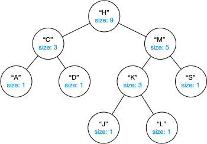

## CS 261 – Computer Science II  
### Homework 7: CityTracker - Queries with BSTs


#### Introduction
<center>

</center>

Your job in this assignment is to build a **CityTracker** that stores information about cities and their populations. Specifically, you'll need to:

- Insert cities into a data structure
- Quickly determine the city with **median population**
- Count how many cities fall **below a certain population**
- Retrieve all cities in a **population range**

These are the perfect use case for a binary search tree, because it can support some of these operations more efficiently than lists. We'll represent cities using a new `City` class (given and shown below), and store these objects in a **Binary Search Tree**, ordered by population.

#### Student Outcomes
By completing this assignment, you should be able to:
- Design and implement recursive algorithms to perform rank-based queries (get, getRank, rangeOf)
- Recognize when to extend the BST to support new functionality (e.g., realizing CityTracker needs more from the base version of the BST)
- Demonstrate good object-oriented design practices, including encapsulation and method decomposition

#### Required Files
- [Hwk7_CityBST.zip](Hwk7_CityBST.zip)


#### Part 1: BinarySearchTree Enhancements
Start by adding the following modifications to our `BinarySearchTree` class. 

1. **Size Caching:** One problem that we have not yet discussed is the efficiency of the `size()` and `sizeHelper()` methods we used to recursively determine the number of nodes in a (sub)tree. Unfortunately, our recursive implementation (and even the iterative version) runs in $$O(n)$$ time, where $$n$$ is the number of nodes in the tree, because we need to traverse the whole tree in order to count them! This is a problem if `size()` or `sizeHelper()` are called repeatedly in other methods that may rely on them! Because the size of a (sub)tree should be known as we insert and remove elements, we should cache it within each node, so with a bit of work we can make `size()` run in $$O(1)$$. We wish to modify our BST so that it has the following node structure:

<center>

</center>

Recall that every node in a BST serves as the root of its own subtree, so we want each node to store its corresponding subtree's size. Start by adding a `size` instance variable to the `Node<E>` inner class that is defined inside the `BinaryTree<E>` superclass. In the `Node` constructor, simply set `size` to 1.

- In `BinarySearchTree`, modify the `sizeHelper()` method so that it simply returns the new size field of the `localRoot` node. Next, modify `add()` so that it takes no action if the item is already in the tree. Then, modify `addHelper()` so that it increments the size. Similarly, modify `remove()` so that it takes no action if the target is not in the tree. Then, modify `removeHelper()` so that it decrements the size prior to returning.

- Test this method to ensure it's working before moving on. Make sure that the size is correct for not only the root node, but for *all* nodes.

Next, we want to add a few more BST methods that'll make our lives easier to complete this project. As with most of our other BST methods, you should write these methods recursively by having a private helper method do all the recursive traversal. Recall that the recursive helper method usually has this look: `private helperMethod(Node<E> localRoot, ...)`, where `localRoot` is the current root of the subtree that's to be explored.

2. Implement a `public E get(int index)` method that returns the element whose in-order position is at the given `index`. For example, when `index = 0` it returns the _smallest_ element in the tree. When `index = 1` it returns the _second smallest_ element, and so on. If `index` is invalid (less than zero or greater than `size()-1`), then this method simply returns `null`.

    - Your recursive helper method should have this signature:
        ```java
        private E getHelper(Node<E> localRoot, int index)
        ```

    - Recursive Strategy: 
        ```txt
        Return null if the local root is null
        Otherwise,
            Compute the size of the left subtree  // You call call the O(1)-time sizeHelper()!!
            if index == sizeOfLeftSubtree,
                return current root's data (Base case)
            if index < sizeOfLeftSubtree,
                // The element is in the left subtree
                Recurse left
            if index > sizeOfLeftSubtree,
                // The element is in the right subtree.
                Recurse right with (index - sizeOfLeftSubtree - 1)
        ```

    - Here's an example usage:

        ```java
        BinarySearchTree<Integer> tree = new BinarySearchTree<>();
        tree.add(40);
        tree.add(20);
        tree.add(60);
        tree.add(10);
        tree.add(30);
        tree.add(50);
        tree.add(70);
        System.out.println(tree.get(0));   // 10
        System.out.println(tree.get(3));   // 40
        System.out.println(tree.get(6));   // 70
        System.out.println(tree.get(7));   // null
        ```

3. Implement another method `public int getRank(E target)` that returns the number of elements in the BST that are _strictly smaller_ than the `target`.

    - This method should simply pass the current local "oot node and the `target` to a recursive helper method (below)
        ```java
        private int getRankHelper(Node<E> localRoot, E target)
        ```


    - Recursive Strategy:
        ```txt
        Return 0 if the local root is null
        if target == local root, 
            // It's larger than all nodes in the left subtree
            // So its rank must be the size of the left subtree
            return the size of the left subtree
        if target < local root,
            // target is in the left subtree
            recurse down the left subtree to find target's rank
            return that rank
        if target > local root,
            // target's rank is more than all nodes in the left subtree
            // and the local root.
            recurse down the right subtree to find its rank
            add 1 + sizeOfLeftSubtree + the rank returned from the recursion
            return this sum
        ```

    - Here's an example usage, assuming the same elements added as the code snippet given above: 
        ```java
        System.out.println(tree.getRank(25));  // 2 (10, 20 are less than 25)
        System.out.println(tree.getRank(40));  // 3 (10, 20, 30 are less than 40)
        System.out.println(tree.getRank(5));   // 0
        ```

4. Finally, write the `public List<E> rangeOf(E begin, E end)` method that returns a list of all elements in the BST that fall within the specified range inclusive of the endpoints. The elements are returned in sorted (in-order) order. If no elements fall within the given range, return an empty list.

    - This method should construct an `ArrayList<E>` and pass it to the helper method, defined below. The helper method will populate this list, and then you can return it.

    - Your recursive helper method should have this signature:
        ```java
        private void rangeOfHelper(Node<E> localRoot, E begin, E end, List<E> list)
        ```

    - Strategy:
        ```txt
        if local root == null, do nothing.

        if begin < local root,
            // starting point is smaller than root, so
            // there might be more elements down the left
            recurse down left subtree
        if begin <= local root <= end,
            // the root is within the specified range! Add to list.
            add local root's data to the list
        if begin > local root,
            // end point is larger than root, so
            // there might be more elements down the right
            recurse down right subtree
        ```    

    - Here's an example usage, assuming the same elements added as the code snippet given above: 
        ```java
        System.out.println(tree.rangeOf(15, 55));  // [20, 30, 40, 50]
        System.out.println(tree.rangeOf(100, 200));  // []
        ```


#### Part 2: City and CityTracker
Now we can work on tracking various cities and answering queries!

- Note that a `City` class has been provided to you, and you do not need to make any changes to it.
    - It provides getters for a city's name and population. Curiously, it provides a default constructor that creates a `null` city, with a population. You'll use this later for searches.

    - Now check out the `compareTo()` method and notice that cities are compared by their populations, and not by their names. So, this defines the way that a BST would internally order your cities!

- Open `CityTracker`. It manages a set of cities inside a binary search tree. Write the following methods for `CityTracker`. All the methods below should be really easy to write because we've already done the hard work!

    1. `public void addCity(String name, int population)`: This method needs to construct a new City object to encapsulate the the given arguments, and add it to the BST. 

        ```java
        CityTracker tracker = new CityTracker();

        tracker.addCity("Seattle", 737015);
        tracker.addCity("Olympia", 55919);
        tracker.addCity("Spokane", 228989);
        tracker.addCity("Tacoma", 219346);
        tracker.addCity("Bellevue", 151854);
        tracker.addCity("Redmond", 76995);
        tracker.addCity("Bellingham", 92489);

        // notice that cities are listed in order of population
        tracker.listCities();   // [Olympia (55919), Redmond (76995), Bellingham (92489), Bellevue (151854),
                                //    Tacoma (219346), Spokane (228989), Seattle (737015)]
        ```

    2. `public City medianCity()`: This method returns city with the median population. Let's say there are 5 cities stored in the tree, ordered by population. The median city is the one that would appear third in sorted order. In case of an even number of cities, where there's a tie for the middle, return the smaller one to the left of the middle. This method is easy to write using the new `get(index)` method we added previously. If you did this right, it should just be a couple-liner.

        ```java
        System.out.println(tracker.medianCity()); 
        // Bellevue (151854)
        ```

    3. `public int numCitiesBelow(int population)`: This method returns the number of cities with a population strictly less than the given population. It seems like you should be using `getRank(city)` here, but inputs a `City` object. Ah -- use the 1-argument City constructor to create a "dummy" city with the given population to input into `getRank(city)`. If you did this right, it should just be a one-liner.

        ```java
        System.out.println(tracker.numCitiesBelow(200000); 
        // 4  <--- (That is: Olympia, Redmond, Bellingham, Bellevue!)
        ```

    4. `public List<City> citiesInRange(int lower, int upper)`: This method returns a list of cities with a population that's between `lower` and `upper`, inclusive. If you did this right, it should just be a one-liner.

        ```java
        System.out.println(tracker.citiesInRange(80000, 230000));
        // [Bellingham (92489), Bellevue (151854), Tacoma (219346), Spokane (228989)]
        ```

    5. `public List<City> kNearestCities(int population, int k)`: This method implements the famous **"K-Nearest Neighbors (kNN)"** search routine. This method returns a list of `k` cities whose populations are closest to the given population. If `k` is greater than the number of cities in the tracker, then all cities should be listed in the order from nearest to farthest from the given population. This one take a bit more work than the previous few methods. I would start by getting the rank of a dummy city with the given population, to see where it would be located. Next, "widen" your search to the left and to the right of that location until `k` cities are identified.

        ```java
        System.out.println("k = 3, " + tracker.kNearestCities(0, 3));
        // k = 3, [Olympia (55919), Redmond (76995), Bellingham (92489)]

        System.out.println("k = 4, " + tracker.kNearestCities(0, 4));
        // k = 4, [Olympia (55919), Redmond (76995), Bellingham (92489), Bellevue (151854)]

        System.out.println("k = 3, "  + tracker.kNearestCities(999_999, 3));
        // k = 3, [Seattle (737015), Spokane (228989), Tacoma (219346)]

        System.out.println("k = 5, "  + tracker.kNearestCities(100_000, 5));
        // k = 5, [Bellingham (92489), Redmond (76995), Olympia (55919), Bellevue (151854), Tacoma (219346)]

        System.out.println("k = 10, "  + tracker.kNearestCities(100_000, 10));
        // k = 10, [Bellingham (92489), Redmond (76995), Olympia (55919), Bellevue (151854), Tacoma (219346), Spokane (228989), Seattle (737015)]
        ```


#### Program Defensively

You can't control how another user or program chooses to use your methods. For each method, think critically about all the things that could go wrong and cause an unintended result (e.g., a runtime error, infinite loop/recursion, etc.). Chances are, I'll be trying all kinds of inputs (negative values, zeroes, nulls, empty-strings, etc.) when I grade your program. The mark of a good programmer is one that can anticipate such scenarios ahead of time and ensure that their program handles all sorts of errors gracefully.

#### Commenting

Each and every method should have a "javadoc-style" comment above it (the ones that use `/* ... */`). For full credit, you should use the @param and @return tags as appropriate in these method comments. Each instance variable (field) should have a brief comment as well. Don't forget the main comment at the top of the class either - I'm looking for more than just a sentence or two.

#### Grading

```
## How this assignment will be graded (100 points total):

You will receive points based on the correctness and structure of your solution. Recursive structure is required for full credit on all tree methods. Iterative solutions may receive partial credit at most.


======================================
Enhanced BinarySearchTree Methods (60 pts total)

- size-caching is implemented correctly. All nodes now additionally
  store the size of its corresponding subtree.
  - 12 pts full credit

- get(int index) implemented recursively and correctly:
  - 16 pts full credit
  - 12 pts mostly correct, minor off-by-one or subtree bug
  - 6 pts iterative or inefficient solution

- getRank(E value) implemented recursively and correctly:
  - 16 pts full credit
  - 12 pts mostly correct, off-by-one or traversal issue
  - 6 pts iterative or inefficient

- rangeOf(E begin, E end) implemented recursively and correctly:
  - 16 pts full credit
  - 12 pts mostly correct, mishandled bounds
  - 6 pts if not recursive or relies on full traversal without pruning


======================================
CityTracker Logic (20 pts total)
- `addCity()` inserts cities correctly into BST: 2 pts
- `medianCity()` correctly uses `get(size/2)` logic: 2 pts
- `numCitiesBelow()` calls `getRank()` with constructed dummy City: 2 pts
- `citiesInRange()` calls `rangeOf()` with constructed dummy Cities: 2 pts
- `kNearestCities()`: 12 pts

======================================
Style and Design (10 pts total)
- Reasonable use of method decomposition and helper logic
- Clear formatting, comments, and naming

======================================

[-0pts] Misc. deductions

======================================


Total:  100
```

#### Submitting Your Assignment
Follow these instructions to submit your work. You may submit as often as you'd like before the deadline. I will grade the most recent copy.

- Navigate to our course page on Canvas and click on the assignment to which you are submitting. Click on "Submit Assignment."

- Upload all the files ending in `.java` from your project folder.

- Click "Submit Assignment" again to upload it.

#### Credits

Written by David Chiu, with help from course AI course assistant.
