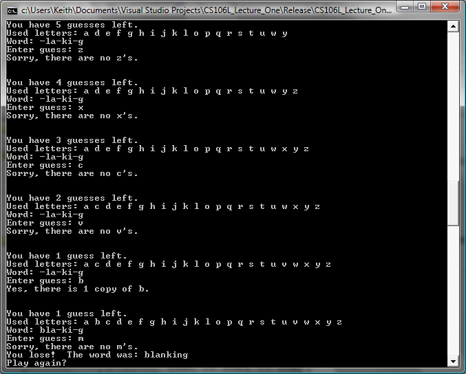

## CS 261 - Computer Science II

### Homework 8: Evil Hangman (Bonus!)

It's hard to write computer programs to play games. When we as humans sit down to play a game, we can draw on past experience, adapt to our opponents' strategies, and learn from our mistakes. Computers, on the other hand, blindly follow a preset algorithm that (hopefully) causes it to act somewhat intelligently. Though computers have bested their human masters in some games, most notably checkers and chess, the programs that do so often draw on hundreds of years of human game experience and use extraordinarily complex algorithms and optimizations to out-calculate their opponents...




While there are many viable strategies for building competitive computer game players, there is one approach that has been fairly neglected in modern research – cheating. Why spend all the effort trying to teach a computer the nuances of strategy when you can simply write a program to play dirty and win handily all the time? In this assignment, you will build a mischievous program that bends the rules of Hangman to trounce its human opponent time and time again. In doing so, you'll cement your skills with abstract data types and iterators, and will hone your general programming savvy. Plus, you'll end up with a piece of software which will be highly entertaining. At least, from your perspective.


#### Student Learning Objectives
- Apply abstract data types to solve a nontrivial problem, including choosing appropriate collections for representing evolving game state (e.g., sets of guessed letters, lists of words, maps from word families to word lists).

- Use HashMap effectively to group, categorize, and retrieve structured data, specifically to partition dictionary words into word families based on dynamically changing letter guesses.

- Design and implement algorithms that adapt data structures in response to user input, such as pruning the master word list, selecting the largest word family, and updating the exposed pattern of letters.


#### Required Files

The following file(s) have been provided for this homework.

- [dictionary.txt](dictionary.txt)
- [HangmanInterface.java](HangmanInterface.java)
- [EvilHangman.java](EvilHangman.java)
- [EvilHangmanDriver.java](EvilHangmanDriver.java)


#### Overview of Hangman

In case you aren't familiar with the game Hangman, the rules are as follows:

- One player chooses a secret word, then writes out a number of dashes equal to the word length.
- The other player begins guessing letters. Whenever she guesses a letter contained in the hidden word, the first player reveals each instance of that letter in the word. Otherwise, the guess is wrong.
- The game ends either when all the letters in the word have been revealed or when the guesser has run out of guesses.

Fundamental to the game is the fact the first player accurately represents the word she has chosen. That way, when the other players guess letters, she can reveal whether that letter is in the word. But what happens if the player doesn't do this? This gives the player who chooses the hidden word an enormous advantage. For example, suppose that you're the player trying to guess the word, and at some point you end up revealing letters until you arrive at this point with only one guess remaining: `DO_BLE`.

There are only two words in the English language that match this pattern: `"doable"` and `"double"`. If the player who chose the hidden word is playing fairly, then you have a fifty-fifty chance of winning this game if you guess `'A'` or `'U'` as the missing letter. However, if your opponent is cheating and hasn't *actually committed* to either word, then there is no possible way you can win this game. No matter what letter you guess, your opponent can claim that they had picked the other word, and you will lose the game. That is, if you guess that the word is "doable," they can pretend that they actually committed to "`double`" the whole time, and vice-versa.

#### Word Families
Let's illustrate this technique with an example. Suppose that you are playing Hangman and it's your turn to choose a word, which we'll assume is of length 4. Rather than committing to a secret word, you instead compile a list of every four-letter word in the English language. For simplicity, let's assume that English only has a few 4-letter words, all of which are reprinted here:

ALLY    BETA    COOL    DEAL    ELSE    FLEW    GOOD    HOPE    IBEX


Now, suppose that your opponent guesses the letter `'E'`. You now need to tell your opponent which letters in the word you've "picked" are E's. Of course, you haven't picked a word, and so you have multiple options about where you reveal the E's. Here's the above word list, with E's highlighted in each word:

ALLY    B**E**TA    COOL    D**E**AL    **E**LS**E**    FL**E**W    GOOD    HOP**E**    IB**E**X

If you'll notice, every word in your word list falls into one of the following “word families:”

- `----`, which contains the words ALLY, COOL, and GOOD
- `-E--`, which contains B**E**TA and D**E**AL
- `--E-`, which contains FL**E**W and IB**E**X
- `E--E`, which contains **E**LS**E**
- `---E`, which contains HOP**E**

**(Hint: Say, that that looks like a `HashMap` that maps word families (strings) to a list of words within that family!)**

Since the letters you reveal have to correspond to some word in your word list, you can choose to reveal any one of the above five families. There are many ways to pick *which* word family to reveal – perhaps you want to steer your opponent toward a smaller family with more obscure words, or toward a larger family in the hopes of keeping your options open. In this assignment, in the interests of simplicity, we'll adopt the latter approach and always choose the largest of the remaining word families. In this case, it means that you should choose to commit to the word family `----`. This reduces your word list down to:

ALLY    COOL    GOOD

and since you didn't reveal any letters, you would tell your opponent that their guess was wrong. Let's see a few more examples of this strategy. Given this 3-word word list, suppose your opponent now guesses the letter `O`, then you would further break your word list (of ALLY, COOL, and GOOD) down into two families:

- `-OO-`, which contains C**OO**L and G**OO**D
- `----`, which contains ALLY

The first of these word families is larger than the second, and so you choose it, revealing two `O`'s in the word and reducing your list down to:

COOL    GOOD

But what happens if your opponent guesses a letter that doesn't appear anywhere in your word list? For example, what happens if your opponent now guesses `'T'`? This isn't a problem. If you try splitting these words apart into word families, you'll find that there's only one family, the family `----` in which `T` appears nowhere and which contains both `COOL` and `GOOD`. Since there is only one word family here, it's trivially the largest family, and by picking it you'd maintain the word list you already had.

There are two possible outcomes of this game. First, your opponent might be smart enough to pare the word list down to one word and then guess what that word is. In this case, you should congratulate them – that's an impressive feat considering the scheming you were up to! Second, and by far the most common case, your opponent will be completely stumped and will run out of guesses. When this happens, you can pick any word you'd like from your list and say it's the word that you had chosen all along. The beauty of this setup is that your opponent will have no way of knowing that you were dodging guesses the whole time – it looks like you simply picked an unusual word and stuck with it the whole way.

#### Instructions

Your assignment is to write a computer program which plays a game of Hangman using this “Evil Hangman” algorithm. In particular, your program should do the following:

- Download all the starter files above.

    - The file `dictionary.txt` contains the full contents of the Official Scrabble Player's Dictionary, Second Edition. This word list has over 120,000 words, which should be more than enough for our purposes. 
    - The file `HangmanInterface.java` is just a Java interface I created that you need to implement. This contract makes grading easier on me, and it gives you some scaffolding for how to piece out the methods.
    - The file `EvilHangmanDriver.java` contains the main method. You shouldn't need to make changes to this file.
    - The file `EvilHangman.java` is where all of your logic should go. To save you time (and because it's not really the purpose of this assignment), I have given you the `initDictionary(file)` method that scans all the words from the dictionary file.

- **Instance Variables** First, you need to think about what state you need to store to play this game, and what data structures you will use to store them.
    
    - First, let's talk about the master word list. I contend that you would not want to store all the words in the dictionary inside a giant `List`. My rationale is this: You start the game by asking the user how many letters are in the secret word. To filter out just the word candidates, you'd have to traverse the entire list and test each word against the given length. I propose a better organization strategy. Store a `HashMap<Integer,List<String>>` that maps the word length (keys) to a List of words having that length. Then, when the user says they want to guess a 6 letter word, you just have to grab the corresponding list off the map!
    
    - Tracking the current set of word families also makes perfect use of `HashMap`s. You could, use the word-family string pattern (e.g., `"_ _ R _ _"`) as the key, and it maps to a list of words that fall into that family (say, `LORDS`, `DARTS`, `FIRST`, and so on). When the game starts, HashMap has only a single entry: `"_ _ _ _ _"` (that is, however many blanks) that maps to the list of *all* the words with the given length.

    - The list of guessed letters needs to be output in alphabetical order after each guess. Again, you'll want to avoid using a data structure that would require you to re-sort the list after each guess. Seems like a good opportunity use of a data structure that automatically maintains order on its elements.

    - You are allowed to use the Java-provided classes that represent these data structures. In other words, you don't have to use the trees, lists, and maps that we wrote in lab/class.

    - Besides these data structures, you also need to store some basic accounting info: how many guesses are left? What's the current word family that is revealed to the user? Etc.


- **Methods:** Move on to implementing each of the abstract methods listed in the interface. I would probably save `play()` for last.

    - The `public HashMap<String, List<String>> buildWordFamilies(char guess)` method needs to input a guessed character from and returns an updated HashMap of word families. For instance, let's say the current 5-letter HashMap of word families has a bunch of entries, like:
        ```txt
        "AB___" -> [ABREW, ANEST]
        "A___Y" -> [ALLOY, ANNOY, ABBEY, ALLEY, AREFY]
        "(some others)"
        ```
        Say the currently revealed word family is `"A___Y"`, so the current list of words associated with that family contains `[ABBEY, AREFY, ALLEY, ALLOY, ANNOY]`. Now suppose the input guessed letter was 'e'. Then you would build off of this current list and return a new HashMap containing these word-family entries:
        ```txt
        "A___Y" -> [ALLOY, ANNOY]
        "A__EY" -> [ABBEY, ALLEY]
        "A_E_Y" -> [AREFY]
        ```

    - The `public String nextWordFamily(char guess)` method calls the previous `buildWordFamilies(guess)` method to generate a whittled down list of mappings. This method then selects the word family containing the largest list. Here, it's a toss-up between "A___Y" and "A__EY" because they both refer to lists containing just two words. Pick one of those keys to return as the newly revealed word family. Also, don't forget to update your current word-family Hashmap instance variable to the one that `buildWordFamilies(guess)` returned!

    - Now you can focus on `public void play()`. It plays a game of Hangman using the Evil Hangman algorithm, as described below:

        - Print out how many guesses the user has remaining, along with any letters the player has guessed (in alphabetical order) and the current blanked-out version of the secret word, which is just the currently revealed "word family." If we are in "debug mode" (see the driver class), then print out the list of possible words too.

        - Prompt the user for a single letter guess, re-prompting until the user enters a letter that she hasn't already guessed. Your `makeGuess()` method should perform that reprompting logic. Make sure that the input is exactly one character long and that it's a letter of the English alphabet.

        - Using their guessed letter, call your earlier method `nextWordFamily(guess)` to narrow down the next word family. If the word family didn't change, then that means they made a bad guess, so decrement the number of guesses they have left.Output the current word family (that was returned by this method) to show the player the current state of their game.

        - If the player has run out of guesses, then they have lost. Pick a random word from the current word list (simply lookup the currently revealed word family in your HashMap) and display it as the word that the computer initially “chose” (har har -- evil laughter!).

        - If the player correctly guesses the word, congratulate them.


#### Sample Output
Here is a sample run of my program:

```
Currently: ________
Used letters: []
You have 10 guesses remaining.
Input your guess: a

Currently: ________
Used letters: [a]
You have 9 guesses remaining.
Input your guess: e

Currently: ________
Used letters: [a, e]
You have 8 guesses remaining.
Input your guess: s

Currently: ________
Used letters: [a, e, s]
You have 7 guesses remaining.
Input your guess: t

Currently: ________
Used letters: [a, e, s, t]
You have 6 guesses remaining.
Input your guess: n

Currently: ______n_
Used letters: [a, e, n, s, t]
You have 6 guesses remaining.
Input your guess: r

Currently: ______n_
Used letters: [a, e, n, r, s, t]
You have 5 guesses remaining.
Input your guess: l

Currently: ____l_n_
Used letters: [a, e, l, n, r, s, t]
You have 5 guesses remaining.
Input your guess: b

Currently: ____l_n_
Used letters: [a, b, e, l, n, r, s, t]
You have 4 guesses remaining.
Input your guess: p

Currently: ____l_n_
Used letters: [a, b, e, l, n, p, r, s, t]
You have 3 guesses remaining.
Input your guess: q

Currently: ____l_n_
Used letters: [a, b, e, l, n, p, q, r, s, t]
You have 2 guesses remaining.
Input your guess: i

Currently: ____lin_
Used letters: [a, b, e, i, l, n, p, q, r, s, t]
You have 2 guesses remaining.
Input your guess: d

Currently: ____lin_
Used letters: [a, b, d, e, i, l, n, p, q, r, s, t]
You have 1 guesses remaining.
Input your guess: v

You lose!
The secret word is: muzzling
```

#### Grading
Students who complete this bonus assignment will achieve enlightment and unlock +10 bonus points to be applied on either:
your lowest exam (cannot exceed 100), or lowest homework assignment, whichever is more beneficial to your final grade!


<!-- ```
CS 261 Homework (Evil Hangman)

======================================

[10/10pts] Inputting the dictionary file.

======================================

[10/10pts] Your program prompts the user for a word length, and reprompts the user when given
an invalid input.

======================================

[10/10pts] Your program prompts the user for a number of guesses, and reprompts the user when given
an invalid input.

======================================

[10/10pts] Your program prompts the user she wants to have a running total of the number of words
remaining in the word list, and displays the list after each guess.

======================================

[10/10pts] Your program stores the set of letters already guessed, and does not allow more guesses
on the same letter to be made. The determination of whether a letter is already guessed should be
efficient.

======================================

[10/10pts] Your program stores the number of guesses-made and quits when this number of guesses
has been reached, or congratulates the player if they successfully guessed the secret word.

======================================

[30/30pts] Word family partitioning: Your program identifies the word family and all
words that match the word family, given the current guesses. After each guess, the largest word
family is chosen.

======================================

[10/10pts] Use of hashmaps for storing word families.

======================================

[+5pts bonus] Two methods should be written recursively.

======================================

[-0pts] Misc. deductions
> None.

======================================


Total: 100

``` -->

#### Submitting Your Assignment
Follow these instructions to submit your work. You may submit as often as you'd like before the deadline. I will grade the most recent copy.

- If this is a team assignment, please ensure that you listed all of your team members in a Javadocs comment at the top of each `.java` file.

- Navigate to our course page on Canvas and click on the assignment to which you are submitting. Click on "Submit Assignment."

- Upload all the files ending in `.java` from your project folder.

- Click "Submit Assignment" again to upload it.
