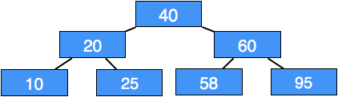
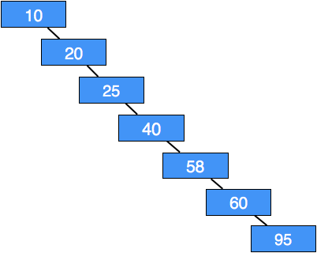
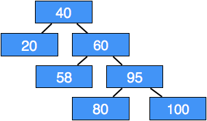
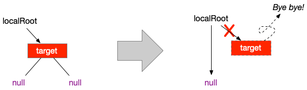
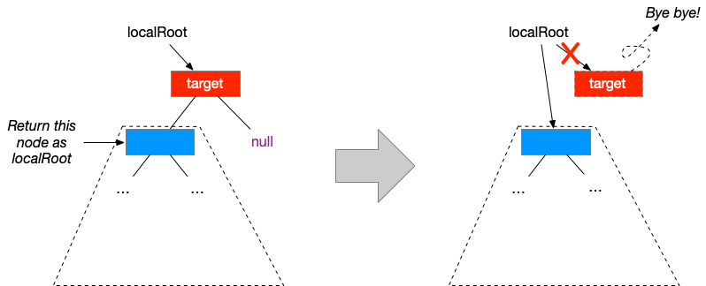
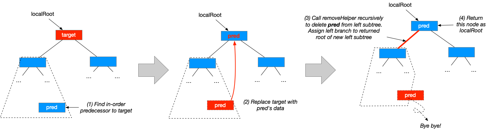

## CS 261 - Computer Science II

### Lab 12: Binary Search Trees

A Binary Search Tree (BST) is arguably the most important data structure in the field of computer science. They are used to efficiently manage a collection of objects in sorted order, which can help simplify searches. We've seen the important methods in lecture, and in this lab you will be implementing a few more BST methods. Before you get started, you should recall the **BST Properties**:

- It is a binary tree: every node can have at most 2 children
- Root node is greater than all nodes in the left subtree
- Root node is smaller than all nodes in the right subtree
- No duplicate values allowed

Here are some examples of valid BSTs:





#### Objectives
- To understand the recursive structure of BSTs
- To implement BST methods recursively
- More practice with recursion and recursive data structures

#### Required Files
The following file(s) have been provided for this lab.
- [Lab_BSTLab.zip](Lab_BSTLab.zip)


#### Part I
I've created a new project to get you started. Please download and open it. First, you'll notice that there's now a `SearchTree<E>` interface that your `BinarySearchTree<E>` class must implement. Browse through this interface to read up on the methods' documentations. 

- Now browse through the `BinarySearchTree<E>` class. Have a gander at the inner `Node<E>` class, and then take some time to trace through the code for `add()` and `contains()` to remind yourself of what they do, and how the code accomplishes what you saw in lecture.

- Run the following code either in the `Tester` class or inside the code pad, and check out the output:

  ```java
  // Build a balanced tree
  BinarySearchTree<Integer> my_bst = new BinarySearchTree<>();
  my_bst.add(3);
  my_bst.add(4);
  my_bst.add(1);
  my_bst.add(5);
  my_bst.add(2);
  System.out.println(my_bst.toString());
  > 3
  >   1
  >     null
  >     2
  >       null
  >       null
  >   4
  >     null
  >     5
  >       null
  >       null
  ```

  Yes the print-out of the tree is a little strange, so follow along carefully: Note that `3` is at the root, so it is printed out first, with no indentation. It has a left child `1` and right child `4`, which are printed out next, and on the same indentation levels. The node containing `1` does not have a left child, so `null` is displayed first, but it does have a right child `2`, which is a leaf. Similarly, the node `4` does not have a left child but has a right child `5`, which is also a leaf.

  Now consider building a worst-case tree below. Observe how the print-out looks like nothing more than a glorified linked list.

  ```java
  // Build a worst case tree
  BinarySearchTree<Integer> my_bst2 = new BinarySearchTree<>();
  my_bst2.add(1);
  my_bst2.add(2);
  my_bst2.add(3);
  my_bst2.add(4);
  my_bst2.add(5);
  System.out.println(my_bst2.toString());
  > 1
  >   null
  >  2
  >    null
  >    3
  >      null
  >      4
  >        null
  >        5
  >          null
  >          null
  ```

- Take a look at all those BST pictures in the preamble of this lab assignment, and take note of where the largest element must be located in any BST. Implement the `private E largestHelper(Node<E> localRoot)` method which returns the largest item in the BST rooted on the given `Node`, or `null` if the given root node is `null`. Try implementing this one recursively.

  - **Hint:** Base case: if the `localRoot` has is non-null and has no right child, then the largest value must be stored inside the `localRoot`'s data field. What's the general case?


- Now implement a method `public int numLeaves()` that counts the number of leaves in the tree. Recall that leaf nodes are ones without either child (that is, they both reference `null`). Before you look at the hint below, check out the `size()` method to see how I implemented that (which counts *all* nodes, not just the leaf nodes). 

  - **Hint:** I have provided the skeleton code for a private helper method `private int numLeavesHelper(Node<E> localRoot)` that `numLeaves()` simply has to call and return. This helper method returns the number of leaves for any BST rooted at the given `localRoot` node. Base case #1: if the `localRoot` is `null` then clearly, the number of leaves is 0, since the tree is empty. Base case #2: if the `localRoot` is not `null`, then check if it's a leaf. If so, then return 1. General case: if the local root is not null and not a leaf, then the number of leaves in its BST is the sum of the number of the count of leaves in both of `localRoot`'s subtrees.

  - Make sure you test it before moving on.

  ```java
  BinarySearchTree<Integer> my_bst = new BinarySearchTree<>();
  my_bst.add(3);
  my_bst.add(4);
  my_bst.add(1);
  my_bst.add(5);
  my_bst.add(2);
  System.out.println(my_bst.toString());
  > 3
  >   1
  >     null
  >     2
  >       null
  >       null
  >   4
  >     null
  >     5
  >       null
  >       null

  System.out.println(my_bst.numLeaves());
  > 2  // indeed, node 5 and node 2 are the only leaves in this BST

  BinarySearchTree<Integer> my_bst2 = new BinarySearchTree<>();
  my_bst2.add(1);
  my_bst2.add(2);
  my_bst2.add(3);
  my_bst2.add(4);
  my_bst2.add(5);
  System.out.println(my_bst2.toString());
  > 1
  >   null
  >   2
  >     null
  >     3
  >       null
  >       4
  >         null
  >         5
  >           null
  >           null

  System.out.println(my_bst2.numLeaves());
  > 1 // indeed, only node 5 is a leaf
  ```


- Implement the `public boolean isFull()` method which tests to see if the tree is full. Recall that a BST is full if every node has 0 or 2 child nodes. You'll want to use the recursive helper pattern that you've been seeing so far: an empty tree (i.e., `localRoot` is `null`) is not full, so return `false`. Otherwise, if `localRoot` is a leaf node (no children), then clearly the tree it roots must be full, so return `true`. If the `localRoot` has only one child, the tree is not full, so return `false`. Otherwise, the given `localRoot` node must have *two* children, and it's full if both of its subtrees are *also* full ... so call your helper method recursively on the two children and check what they return!

  ```java
  BinarySearchTree<Integer> my_bst = new BinarySearchTree<>();
  my_bst.add(3);
  my_bst.add(4);
  my_bst.add(1);
  System.out.println(my_bst.toString());
  > 3
  >  1
  >    null
  >    null
  >  4
  >    null
  >    null

  System.out.println(my_bst.isFull());
  > true

  BinarySearchTree<Integer> my_bst2 = new BinarySearchTree<>();
  my_bst2.add(1);
  my_bst2.add(2);
  my_bst2.add(3);
  my_bst2.add(4);
  my_bst2.add(5);
  System.out.println(my_bst2.toString());
  > 1
  >   null
  >  2
  >    null
  >    3
  >      null
  >      4
  >        null
  >        5
  >          null
  >          null

  System.out.println(my_bst2.isFull());
  > false
  ```

- Implement the `public int height()` method which returns the height of the current tree. Recall that the *height of a tree* is the *longest* number of edges from the root to any leaf node. Remember when I said in class that the reason you'd use recursion is to simplifying programming? This is one of those algorithms that's notoriously difficult to implement iteratively, but has a very simple recursive solution. Again, you only need to fill in the helper method that I've provided. Start by defining your base cases. When does the height of a BST become obvious? (There are two base cases.)

  ```java
  BinarySearchTree<Integer> my_bst = new BinarySearchTree<>();
  my_bst.add(3);
  my_bst.add(4);
  my_bst.add(1);
  my_bst.add(5);
  my_bst.add(2);
  System.out.println(my_bst.toString());
  > 3
  >  1
  >    null
  >    2
  >      null
  >      null
  >  4
  >    null
  >    5
  >      null
  >      null

  System.out.println(my_bst.height());
  > 2

  BinarySearchTree<Integer> my_bst2 = new BinarySearchTree<>();
  my_bst2.add(1);
  my_bst2.add(2);
  my_bst2.add(3);
  my_bst2.add(4);
  my_bst2.add(5);
  System.out.println(my_bst2.toString());
  > 1
  >   null
  >  2
  >    null
  >    3
  >      null
  >      4
  >        null
  >        5
  >          null
  >          null

  System.out.println(my_bst2.height());
  > 4
  ```

- For this last one, I strongly suggest you going back to the notes to remind yourselves how node removal works. The `public void remove(E target)` method attempts to remove the node containing the given key. You need to first find the "victim." Because this is a little more complicated, I'll give you some hints on what you need to do.

  Create a helper method `private Node<E> removeHelper(Node<E> localRoot, E target)`. It removes the `target` value from the subtree that is rooted by `localRoot` and returns the new root of the subtree after the node's removal. That's a super important point to remember, and worth repeating. This method returns the ROOT of the subtree after removal of the target.

  - Base case #1: if `localRoot` is `null`, then the subtree is empty, and you won't find the target here, so return `null`.

  - Base case #2: if the `localRoot` holds the target data, you need to deal with three cases:

    - Case #2a: `localRoot` is a leaf: If the `localRoot` node has neither children, then the root of the subtree after removal of the `localRoot` must be `null`. Simply return `null` to "remove" the current `localRoot`.

      

    - Case #2b: `localRoot` has one child: If the `localRoot` node has no right child, then the left child of the `localRoot` becomes the new root of this subtree. Therefore, you just need to `return` the left child of `localRoot`. If the `localRoot` node has no left child, then `return` the right child.

      

    - Case #2c: `localRoot` has both children: Replace the `localRoot`'s data with the data stored in its in-order predecessor (hmm, I _did_ have you write `largestHelper(...)` moments earlier!) Next, make a recursive call to remove the in-order predecessor from the left subtree of the `localRoot` (yup, just call the same helper method you're currently writing on the current left subtree!). Don't forget to join-up the modified left subtree with the current `localRoot` by setting `localRoot.left` to whatever this recursive call returns. Return `localRoot` when this is done.

      

  - Recursive case #1: if data at `localRoot` is smaller than the target data, then you need to call `removeHelper()` on the current right subtree (`localroot.right`), and then set `localRoot.right` to whatever that returns. Return `localRoot`.

  - Recursive case #1: if data at `localRoot` is larger than the target data, then you need to call `removeHelper()` on the current left subtree (`localroot.left`), and then set `localRoot.right` to whatever that returns. Return `localRoot`.

  - Here's a sample output:

    ```java
    BinarySearchTree<Integer> my_bst = new BinarySearchTree<>();
    my_bst.add(3);
    my_bst.add(4);
    my_bst.add(1);
    my_bst.add(5);
    my_bst.add(2);
    my_bst.remove(3);
    System.out.println(my_bst.toString());
    > 2
    >   1
    >     null
    >     null
    >   4
    >     null
    >     5
    >       null
    >       null

    my_bst.remove(1);
    System.out.println(my_bst.toString());
    > 2
    >   null
    >   4
    >     null
    >     5
    >       null
    >       null

    my_bst.remove(5);
    System.out.println(my_bst.toString());
    > 2
    >   null
    >   4
    >     null
    >     null
    ```


#### Grading

```
This assignment will be graded out of 2 points, provided that:

- You were in attendance and on-time.
- Your classes are fully implemented.
```

#### Submitting Your Assignment
Follow these instructions to submit your work. You may submit as often as you'd like before the deadline. I will grade the most recent copy.

- Navigate to our course page on Canvas and click on the assignment to which you are submitting. Click on "Submit Assignment."

- Upload all the files ending in `.java` from your project folder.

- Click "Submit Assignment" again to upload it.

#### Credits

Written by David Chiu. 2017.

#### Lab Attendance Policies

Attendance is required for lab. Unexcused absence = no credit even if you turned in the lab. Unexcused tardiness = half credit.
