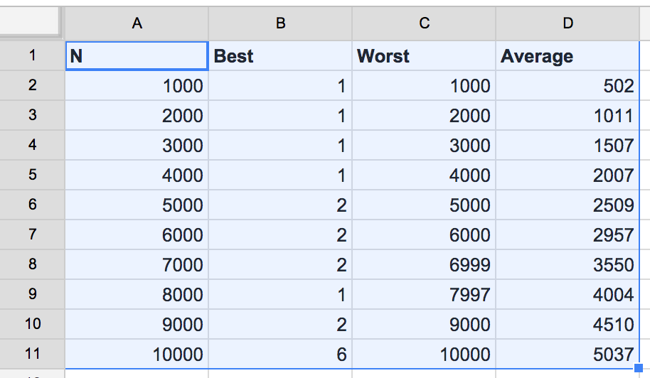
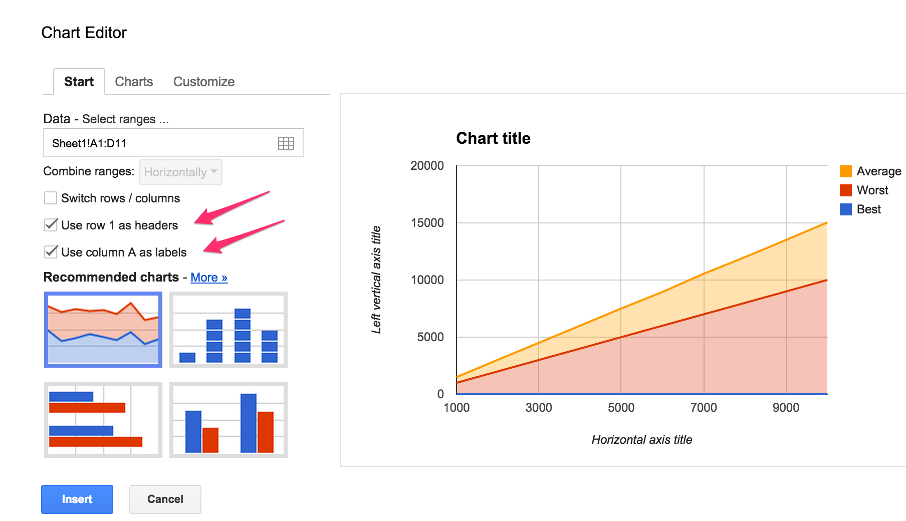
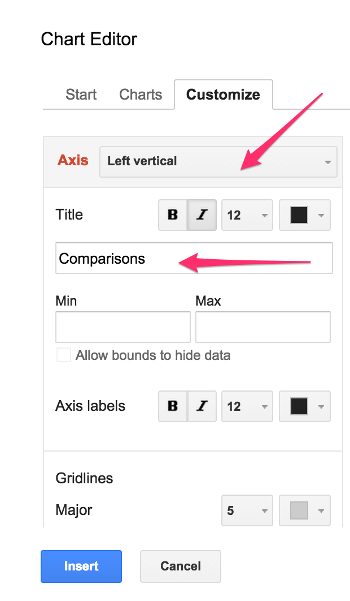
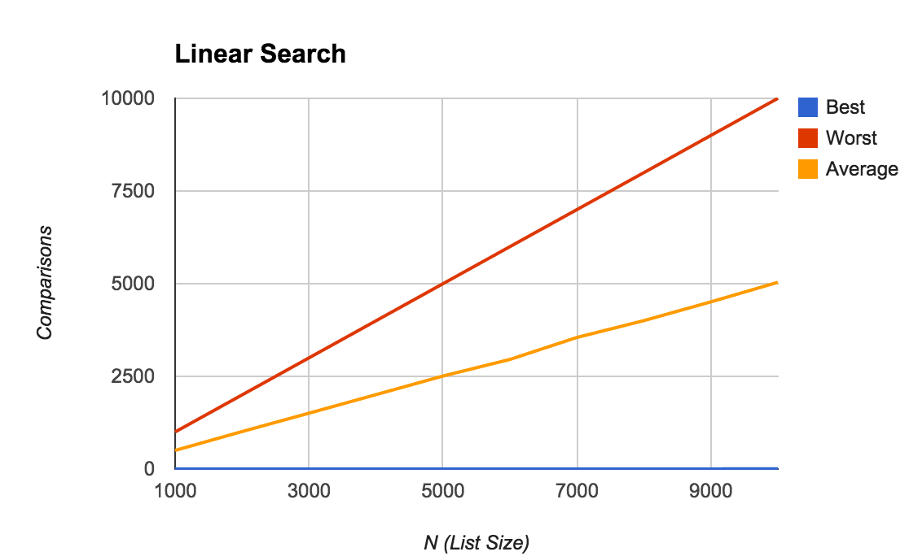

## CS 261 - Computer Science II

### Lab: Complexity Analysis

In this lab, you'll form hypotheses about the time complexity (running time) of various algorithms, and validate/reject those hypotheses through experimentation, analysis of its results, and drawing conclusions. You will be generating plots and be providing a Lab Report.

In the lab, all algorithms that you need to analyze are list-based, but clearly, the analysis of algorithms extend beyond lists. I chose list processing as a vehicle, because they're easier to visualize.

#### Student Outcomes

- To apply critical and scientific thinking to the analysis of algorithms
- Experience putting together a CS lab report

#### Required Files

The following file(s) have been provided for this homework.

- [Lab5_BigO.zip](Lab5_BigO.zip)
- [Lab Report](https://docs.google.com/document/d/1Wyc7Se_UGlwKwYhME2n8XBjPaPT7Q44EmC7mB8fBwi4/edit?usp=sharing)


#### Preliminary

Open the Lab Report and create your own copy of it. Go to `File` and `Make a copy`, then put it somewhere in your drive where you won't forget.

Download the project from the link given above. After you unzip it into your working directory, navigate into the folder. Inside, you'll find a Word document called `Lab_Report.docx`. Open up the package and you'll see the following classes: `RuntimeTester` and `PerformanceTester`.

<center></center>

#### Part 1: Generating Test Data

To investigate the performance of our algorithms, we need to first generate some test data. Open the `RuntimeTester` class. You should see that there is only a single field -- an array of ints. Let's play around with it so you know what it provides. 

1. In BlueJ's codepad (or, if you're using Eclipse/IntelliJ, put this inside main()). An example in Codepad is shown below. The constructor creates an internal array of integers of the given length. For now, it just populates the array with zeroes.

    ```java
    RuntimeTester runner = new RuntimeTester(10);
    System.out.println(runner);
    > [0, 0, 0, 0, 0, 0, 0, 0, 0, 0]

    runner = new RuntimeTester(5);
    System.out.println(runner);
    > [0, 0, 0, 0, 0]
    ```

2. There are two ways to populate that array, and both are through the call to `generateData(boolean orderedList)`. If you input `true`, then the array will be filled with values 0, 1, 2, ..., n-1 (i.e., in sequential order). If you entered `false`, then those integers will be mixed up instead.

    ```java
    RuntimeTester runner = new RuntimeTester(10);
    System.out.println(runner);
    > [0, 0, 0, 0, 0, 0, 0, 0, 0, 0]

    runner.generateData(true);
    System.out.println(runner);
    > [0, 1, 2, 3, 4, 5, 6, 7, 8, 9]

    runner.generateData(false);
    System.out.println(runner);
    > [5, 9, 2, 6, 0, 3, 1, 8, 4, 7]
    ```

#### Part 2: Counting Simple Statements

In this lab, we assume that the time complexity of an algorithm is the number of simple statements it has to run, as a function of the problem size (i.e., list size in most of our examples).

##### Review: Linear Search

1. Still inside the `RuntimeTester` class, find the `linearSearch()` method. You should already be familiar with this algorithm, but read through the code again to remind yourself. 

2. You do not need to make changes to this algorithm, but as you read through it, notice that I added a line of code to help us count the number of simple statements executed. 

3. In class, we learned that the time complexity of this method varies based on the elements inside the list, as well as the key you're searching for. Specifically, if $$n$$ is defined to be the size of your list, we estimated that it would take $$1$$, $$n$$, and
   $$\dfrac{n+1}{2}$$ comparisons for the best-case, worst-case, and average case, respectively. Also recall the scenarios under which these cases are exhibited:

   - Worst Case: triggered when the key is not found. This is what we typically pay attention to in class.
   - Best Case: triggered when the key is found in the first element of the list. Rare.
   - Average Case: Assuming the key is in fact inside the list somewhere, then over many runs, the key's location is generally near the middle of the list.

4. Though we wouldn't lie to you, it still would be cool to verify these cases. If you type out the following in code pad, your outputs should look _exactly_ like the mine:

   ```java
   RuntimeTester runner = new RuntimeTester(10);
   runner.generateData(true);
   System.out.println(runner);
   > [0, 1, 2, 3, 4, 5, 6, 7, 8, 9]

   runner.resetStatements();
   runner.linearSearch(7);
   System.out.println(runner.getStatements());
   > 8

   runner.resetStatements();
   runner.linearSearch(56);
   System.out.println(runner.getStatements());
   > 10

   runner.resetStatements();
   runner.linearSearch(0);
   System.out.println(runner.getStatements());
   > 1
   ```


#### Review: Binary Search

1. Now find the `binarySearch()` method. Read through it to get a basic understanding of what it does. Recall the caveat that binary search only works if the list is already sorted in ascending order! This method takes an integer `key` as input. It then compares the middle element in the list to the key. If the middle element is larger, then it "throws away" the latter half of the list from further consideration, and vice-versa if the element was instead smaller. These steps continue until the key is found, or if there is no more elements to throw away, in which case, the key is not found.

2. We saw that the time complexity of this method varies based on the elements inside the list, as well as the key you're searching for. Specifically, if $$n$$ is the size of your list, we calculated that it would take 1 and $$\log_2{n}$$ comparisons for the best-case and worst-case, respectively. Also recall the scenarios under which these cases are exhibited:

   - Best Case: triggered when the key is found in the middle of the original list. Super rare.
   - Worst Case: triggered when the key is not found in the list.
   - Average Case: ?? it's unclear how this algorithm behaves on the average. We'll find  find out in the next section. 

3. If you type out the following in code pad, your outputs should look _exactly_ like the mine:

   ```java
   RuntimeTester runner = new RuntimeTester(8);
   runner.generateData(true);
   System.out.println(runner.toString());
   "[0, 1, 2, 3, 4, 5, 6, 7]"   (String)

   runner.binarySearch(0);
   System.out.println(runner.getStatements());
   > 3

   runner.resetStatements();
   runner.binarySearch(1);
   System.out.println(runner.getStatements());
   > 2

   runner.resetStatements();
   runner.binarySearch(2);
   System.out.println(runner.getStatements());
   > 3

   runner.resetStatements();
   runner.binarySearch(3);
   System.out.println(runner.getStatements());
   > 1

   runner.resetStatements();
   runner.binarySearch(68);
   System.out.println(runner.getStatements());
   > 4
   ```

#### Part 3: Experimentation and Analysis

Now that your search methods can count comparisons, let's test to see if our hypotheses on their time complexity are sound. The `PerformanceTester` class has a constant defined called `NUM_RUNS = 1` (that you will change later), and a few `static` methods (already implemented - you do not need to edit these). Each of them is really just a "shell" method that calls another private method to do all the work. You do not need to worry about the implementation details of any of these methods, but you should know what each of them does, explained below:

   - `testLinearSearch(int N, boolean orderedList)`: This method inputs the list size N, and a boolean on whether it should run over an ordered list or unordered list. It runs linear search over the same list `NUM_RUNS`  times, searching for a random key during each run.

   - `testBinarySearch(int N)`: This method creates an ordered list of size N, and it will run `binarySearch()` over the same list `NUM_RUNS` times, searching for a random key during each run.

   - `testMedian(int N, boolean orderedList)`: This method inputs the list size N, and a boolean on whether it should run over an ordered list or unordered list. It finds the median over the same list `NUM_RUNS` times.

   - `testStdDev(int N)`: This method inputs the list size N. It finds the standard deviation over the same list `NUM_RUNS` times. The list order does not affect standard deviation.


_Important:_ A static method means that it belongs to the class, not to its instances (objects). That is, you don't need to instantiate any objects to call them. When you right-click on the PerformanceTester class, you'll find that the static methods are available under this menu. If you prefer to call them from the Code pad, you could use something like `PerformanceTester.testBinarySearch(1000);` to run binary search over a list of N=1000 elements directly.

##### Linear Search Analysis

1. Try running testLinearSearch(1000, true). This call will generate an unordered list of
   N = 1000 numbers, and run `linearSearch` on random keys over this list. If you implemented everything properly in the previous section, you should get an output similar to the following:

   ```java
   PerformanceTester.testLinearSearch(1000, true);
   > LINSEARCH
   > n=1000, best=376 (expected 1), worst=376 (expected 1000), avg=376 (expected 500)
   ```   
   Your results will be different from mine.

2. Let's actually spend a little bit of time understanding the report we just generated above. Recall our hypothesis that the best case, worst case, and average case comparisons for linear search is $$1$$, $$n$$, and $$n/2$$, respectively.

In the print-out, the best, worst, and average number of comparisons are all the same because `linearSearch()` was only run once. As a result, the quality of these results are very low, and as computer scientists, we know that results from a single experiment cannot be taken at face value. A good scientist would repeat the experiment multiple times to obtain a larger sample from which to draw conclusions.

3. Okay, lesson-learned. Let's get the simulator to run `linearSearch()` multiple times over randomly generated keys. Repeating the experiment 10 times seems reasonable, so go inside `PerformanceTester` and change `NUM_RUNS` to 10.

   ```java
   PerformanceTester.testLinearSearch(1000, true);
   > LINSEARCH
   > n=1000, best=176 (expected 1), worst=897 (expected 1000), avg=564 (expected 500)
   ```

   Well, this time the results look a bit closer to what we were expecting, but it's still not quite there.

4. We wonder what would happen if you ran more than 10 tests (runs)? Closer still, to our expectations? 100 runs? Hmm.. what if the size of the list was also increased? Might a longer list require more experimental trials for you to obtain a good, representative results? Don't be afraid to try running 1000 or more times!

##### Generating Plots

We'd like to generate some charts to better visualize our results.

1. Run the `testLinearSearch()` experiments for N = 1000, then 2000, then 3000, ..., to 5000 (feel free to do more though). Remember to use the value that worked best for you as `NUM_RUNS` (it should be pretty large... a number likely in the thousands), and to use an unordered list. We recorded the following results from all these runs:

   ```
   LINSEARCH
   N=1000, best=1 (expected 1), worst=1000 (expected 1000), avg=502 (expected 500)
   N=2000, best=1 (expected 1), worst=2000 (expected 2000), avg=1011 (expected 1000)
   N=3000, best=1 (expected 1), worst=3000 (expected 3000), avg=1507 (expected 1500)
   N=4000, best=1 (expected 1), worst=4000 (expected 4000), avg=2007 (expected 2000)
   N=5000, best=2 (expected 1), worst=5000 (expected 5000), avg=2509 (expected 2500)
   ```

2. It sure would be nice to summarize this data in a plot. Open up your favorite spreadsheet tool. The following example shows how to generate charts using *Sheets* on Google Docs.

   - Head over to [Google Docs](https://docs.google.com). You'll need to sign in using your UPS ID. Once in, click on the striped-lines button on the top-left corner, and select `Sheets`. Next, click on the `+` button on the bottom-right corner and it should generate a new blank spreadsheet. Let us know if you have troubles getting this far. 

   - After you've got a blank sheet in front of you, start plugging the numbers for N, Best Case, Worst Case, and Average Case as follows
      <center></center><br/>

   - Double-check that all of your data is entered correctly. Then select your data (including the first row containing labels). Then from the menu bar, click `Insert` > `Chart`... This will bring up a new dialog box that looks like the following. Make sure you place checkmarks in Use `Row 1` as Headers and Use `Column A` as Labels
      <center></center><br/>

   - Now we need to decide the best kind of graph to visualize our data. For our results, we want a simple line-graph. From the dialog, click on the Charts tab. Make sure Line is selected on the left-hand panel, then select top option:
      <center></center><br/>

   - Inside the same dialog, click on the Customize tab. Give your chart a title, then scroll down half way to find Axis:

     - Label your Horizontal Axis to be "N (List Size)"
     - Label your Left Vertical Axis to be "Comparisons"
     <center>
     &nbsp;&nbsp;</center><br/>

   - Click the Insert button on the bottom, and you should see the Chart!
      <center></center><br/>

   - Click on the chart, and on the top-right hand corner you should see a triangle button. Click on this button, and click Save Image. This will download the chart as a PNG file. Finally, open it and copy-and-paste this Chart into the appropriate place in your Lab Report under Linear Search Time Complexity Plot (Unordered Lists).


3. Now run the experiment and plot the results again for ordered lists and paste it into the lab report. 

4. **Important** After you generate the plots, take some time to appreciate what it shows. Look at the gap between the "best-case" line and the other two. As the list increases in size, the gap gets larger and larger. What about the gap between the average case and the worst case? If you were able to "zoom out" further and further back, will that gap disappear? What about the gap between the average/worst lines and the best-case line?

5. As you think about these questions, answer Q1 in the lab report.

##### Review: Big-O Notation
On the lab report, you'll also see that I'll ask you to put the running times of the best, worst, and average cases into their Big-O classifiers. For each "case", you may have a different $$T(n)$$. Fill in the empty spots in the tables in the report. Then, use the simple technique you learned in class to turn $$T(n)$$ into its corresponding Big-O notation.


##### Binary Search Analysis

1. Now try experimenting with testBinarySearch(). This method has no boolean flag to indicate whether it should generate an ordered or unordered list. It always generates an ordered list, because binary search relies on this ordering to work!

2. Try running this test with the same number of trials you found that worked best from the linear search experiments. Again, vary N=1000,2000,3000,...,5000.

3. Open your spreadsheet program, and generate another plot, with the best, worst, and average-case as the series. Again, drop it into the proper place in your **Lab Report**. Juxtapose the two Charts (between Linear Search and Binary Search) and you can see the power of Binary Search. Also, what can you glean about the average-case time complexity of binary search? Is it more like the best-case, or the worst-case?


#### Part 4. Writing and Analyzing Algorithms
Let's try something different. One of the objects of this class is to get you into the habit of writing your own algorithms, and then analyzing its running time, which may in turn cause you to improve upon it. Here's a method that's often used in statistics and requires a couple passes over your data, and shouldn't be super difficult to code up. 

You might've already noticed that there's a method in `RuntimeTester` that you need to implement called `standardDeviation()`. The standard deviation, which can be denoted using $$\sigma$$, measures the average distance an element in your list is from the average (mean). Standard deviation is calculated as follows:

$$\sigma = \sqrt{\frac{1}{N} \sum_{i=0}^{n-1} (x_i - \mu)^2} = \sqrt{\frac{1}{N} ((x_0 - \mu)^2 + (x_1 - \mu)^2 + ... + (x_{n-1} - \mu)^2)}$$

where $$\mu$$ is the mean value of the list and $$x_i$$ refer to each individual value in the list. To find the standard deviation of the values in the list, here are the steps you need to follow.

First, you need to find the average, $$\mu$$. Next, find the sum of the squared differences between $$\mu$$ and all the elements in the list. You can square a value using `Math.pow(val, 2)`. Finally, multiply with $$1/n$$ and take the square root using `Math.sqrt()`. Don't forget to increment `this.numStatements` whevever a simple statement is run. (Importantly, look inside your loops.) For this task, you may assume that `Math.pow()` and `Math.sqrt()` cost 1 simple-statement each.

1. If you feel confident about your code, test it to see if it works. Here are my tests, and yours should match mine:

   ```java
   RuntimeTester runner = new RuntimeTester(100);
   runner.generateData(false);
   System.out.println(runner.stdDev());
   > 28.86607004

   RuntimeTester runner = new RuntimeTester(28443);
   runner.generateData(false);
   System.out.println(runner.stdDev());
   > 8210.786848
   ```

2. Once you're satisfied with your code, try running `PerformanceTester.testStdDev()` vary N=1000,2000,3000,...,5000. Make a plot and place it the plot in the lab report, and answer the questions in the document.


As you progress in this course (and in the major/minor), you'll need to be more and more attuned to the running times of the algorithms you write. The process you saw in this section demonstrates how computer scientists have to think!


#### Part 5. Last Problem!
Finally, let's try analyzing a tougher one. Open up the `RuntimeTester` class, and look for the `median()` method.Read the algorithm thoroughly to understand how it calculates the median element in a given list. The *median* is defined to be the element with an equal number of elements less than, and greater than, itself.  For instance, the median of [5,3,2,7,1,9,0] is 3 because [0, 1, 2] are less than 3, and [5, 7, 9] are greater than 3. Try to see how the algorithm determines count of elememts on each "side" for every value in the list. In cases where the number of elements in the list is even, and there are two elements that could both serve as the median, this algorithm chooses the smaller one. So, if the list is [4,2,7,1,9,0] then the choice of median is between either 2 or 4. The algorithm chooses 2. It's important to note that, as soon as the counts are found to be the same on each side, the median is found and returned. In other words, the algorithm may finish early depending on where the median actually is.


1. Hypothesize what the best, worst, and average cases of this algorithm would be for both ordered and unordered lists.  Now open your Lab Report back up. For each best/worst/average case, write down: (A) the scenario under which that case would be observed, and (B) the corresponding running time function, $$T(n)$$.

2. Run some experiments by once again increasing N = 1000, 2000, ..., 5000 for both unordered and ordered lists. Open your spreadsheet program, and generate another plot, with the best, worst, and average-case. Insert the plot in your Lab Report, and answer the final questions.

3. Finally hypothesize whether the list ordering affects the complexities of this method. Run a final set of experiments to confirm/reject your hypothesis. (It's okay to be wrong!)

#### Grading

```
This assignment will be graded out of 2 points, provided that:
- You were in attendance and on-time.
- Completed all required methods.
```


#### Submitting Your Assignment
Follow these instructions to submit your work. You may submit as often as you'd like before the deadline. I will grade the most recent copy.

- Navigate to our course page on Canvas and click on the assignment to which you are submitting. Click on "Submit Assignment."

- Upload your lab report.

- Upload all files ending in `.java` from your project folder.

- Click "Submit Assignment" again to upload it.

#### Credits

Written by David Chiu.

#### Lab Attendance Policies

Attendance is required for lab. Unexcused absence = no credit even if you turned in the lab. Unexcused tardiness = half credit.
