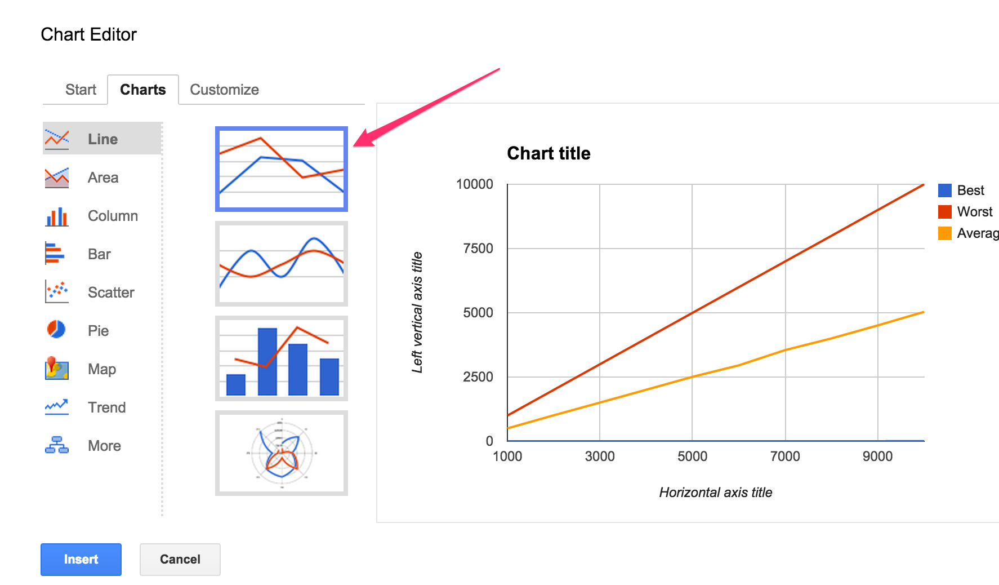
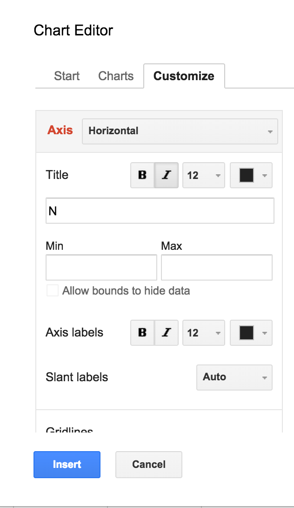

## CS 261 - Computer Science II

### Lab 5: Complexity Analysis

In this lab, you'll form hypotheses about the time complexity (running time) of various algorithms, and validate/reject those hypotheses through experimentation, analysis of its results, and drawing conclusions. You will be generating plots and be providing a Lab Report.

In the lab, all algorithms that you need to analyze are list-based, but clearly, the analysis of algorithms extend beyond lists. I chose list processing as a vehicle, because they're easier to visualize.

#### Student Outcomes

- To apply critical and scientific thinking to the analysis of algorithms

#### Required Files

The following file(s) have been provided for this homework.

- [Lab5_BigO.zip](Lab5_BigO.zip)
- [Lab Report](https://docs.google.com/document/d/1Wyc7Se_UGlwKwYhME2n8XBjPaPT7Q44EmC7mB8fBwi4/edit?usp=sharing)


#### Preliminary

Open the Lab Report and create your own copy of it. Go to `File` and `Make a copy`, then put it somewhere in your drive where you won't forget.

Download the project from the link given above. After you unzip it into your working directory, navigate into the folder. Inside, you'll find the following classes: `AbstractRuntimeTester` (don't edit), `RuntimeTester` and `Expr`. 

#### Part 1: Generating Test Data

To investigate the performance of our algorithms, we need to first generate some test data. Open the `RuntimeTester` class.

1. An example of how to use this class is shown below. The constructor creates an internal array of ints of the given length. For now, it just populates the array with zeroes.

    ```java
    RuntimeTester runner = new RuntimeTester(10);
    System.out.println(runner);
    > [0, 0, 0, 0, 0, 0, 0, 0, 0, 0]

    runner = new RuntimeTester(5);
    System.out.println(runner);
    > [0, 0, 0, 0, 0]
    ```

2. There are two ways to fill that array with non-zero values, and both are through a call to `generateData(boolean orderedList)`. If you input `true`, then the array will be filled with values [0, 1, 2, ..., n-1]. If you entered `false`, then those integers will be mixed up in some random order.

    ```java
    RuntimeTester runner = new RuntimeTester(10);
    System.out.println(runner);
    > [0, 0, 0, 0, 0, 0, 0, 0, 0, 0]

    runner.generateData(true);
    System.out.println(runner);
    > [0, 1, 2, 3, 4, 5, 6, 7, 8, 9]

    runner.generateData(false);
    System.out.println(runner);
    > [5, 9, 2, 6, 0, 3, 1, 8, 4, 7]
    ```


#### Part 2: Experimentation and Analysis

Let's test to see if our hypotheses on the search algorithms' time complexity are sound. The `Expr` class has a constant defined called `NUM_RUNS = 1` (you will change this later), and a few `static` methods (already implemented - you do not need to edit these). Here's what they do:

   - `testLinearSearch(int N, boolean orderedList)`: This method inputs the list size N, and a boolean on whether it should run over an ordered list or unordered list. It runs linear search over the same list `NUM_RUNS`  times, searching for a random key during each run.

   - `testBinarySearch(int N)`: This method creates an ordered list of size N, and it will run `binarySearch()` over the same list `NUM_RUNS` times, searching for a random key during each run.

   - `testMedian(int N, boolean orderedList)`: This method inputs the list size N, and a boolean on whether it should run over an ordered list or unordered list. It finds the median over the same list `NUM_RUNS` times.

   - `testStdDev(int N)`: This method inputs the list size N. It finds the standard deviation over the same list `NUM_RUNS` times. The list order does not affect standard deviation.

_Important:_ In BlueJ when you right-click on the `Expr` class, you'll find that the static methods are available under this menu. If you prefer to call them from the code pad or from a main method, you could call something like `Expr.testBinarySearch(2300)` to run binary search over a list of N=2300 elements.

##### Linear Search Analysis

1. Try running testLinearSearch(1000, true). This call will generate an unordered list of
   N = 1000 integers, and run `linearSearch` on random keys over this list (the random keys are guaranteed to be in the list). You should get an output similar to the following:

   ```java
   Expr.testLinearSearch(1000, true);
   > LINSEARCH
   > n=1000, best=376 (expected 1), worst=376 (expected 1000), avg=376 (expected 500)
   ```   
   Your results will  likely be different from mine.

2. Let's actually spend a little bit of time understanding this line we just generated. Recall our hypothesis that the best case, worst case, and average case comparisons for linear search is $$1$$, $$n$$, and $$n/2$$, respectively.

In the print-out, the best, worst, and average number of comparisons are all the same because `linearSearch()` was only run once (`NUM_RUNS` was set to 1 the `Expr` class!). We need to adhere to **the law of large numbers** which says: if you repeat the experiment many times under the same conditions—say, searching for random keys in random arrays—the average number of executed statements will converge to the theoretical expectation.

3. Okay go inside `Expr` and increase `NUM_RUNS` to 10 and try again.

   ```java
   Expr.testLinearSearch(1000, true);
   > LINSEARCH
   > n=1000, best=176 (expected 1), worst=897 (expected 1000), avg=564 (expected 500)
   ```

   Well, this time the results look a *bit* closer to what we were expecting, but it's still not quite there.

4. I wonder what would happen if you ran more than 10 runs? Closer still, to our expectations? 100 runs? Hmm.. what if the size of the list was also increased? Might a longer list require more experimental trials for you to obtain a good, representative results? Don't be afraid to try running 1000 or more times! (I have found 5000 to be sufficient).

##### Generating Plots

We'd like to generate some charts to better visualize our results.

1. Run the `testLinearSearch()` experiments for list sizes N = 1000, then 2000, then 3000, ..., to 5000 (feel free to do more though). Use an unordered list first. We recorded the following results from all these runs:

   ```
   LINSEARCH
   N=1000, best=1 (expected 1), worst=1000 (expected 1000), avg=502 (expected 500)
   N=2000, best=1 (expected 1), worst=2000 (expected 2000), avg=1011 (expected 1000)
   N=3000, best=1 (expected 1), worst=3000 (expected 3000), avg=1507 (expected 1500)
   N=4000, best=1 (expected 1), worst=4000 (expected 4000), avg=2007 (expected 2000)
   N=5000, best=2 (expected 1), worst=5000 (expected 5000), avg=2509 (expected 2500)
   ```

2. For your reference, I put the  theoretical expectation in parentheses. Your results should get close to matching the expected results if your `NUM_RUNS` is sufficiently large.

3. It sure would be nice to visualize this data in a plot. Open up your favorite spreadsheet tool. The following example shows how to generate charts using *Sheets* on Google Docs.

   - Head over to [Google Sheets](https://sheets.google.com). You'll need to sign in using your UPS ID. Once in, click on the striped-lines button on the top-left corner, and select `Sheets`. Next, click on the `+` button on the bottom-right corner and it should generate a new blank spreadsheet. Let us know if you have troubles getting this far. 

   - After you've got a blank sheet in front of you, start plugging your numbers (not my expected results) for N, Best Case, Worst Case, and Average Case as follows (again, you don't have to go all the way up to N = 10,000 like in the figure below):
      <center></center><br/>

   - Double-check that all of your data is entered correctly. Then select your data (including the first row containing labels). Then from the menu bar, click `Insert` > `Chart`... This will bring up a new dialog box that looks like the following. Make sure you place checkmarks in Use `Row 1` as Headers and Use `Column A` as Labels
      <center></center><br/>

   - Now we need to decide the best kind of graph to visualize our data. For our results, we want a simple line-graph. From the dialog, click on the Charts tab. Make sure Line is selected on the left-hand panel, then select top option:
      <center></center><br/>

   - Inside the same dialog, click on the Customize tab. Give your chart a title, then scroll down half way to find Axis:

     - Label your Horizontal Axis to be "N (List Size)"
     - Label your Left Vertical Axis to be "Comparisons"
     <center>
     &nbsp;&nbsp;</center><br/>

   - Click the Insert button on the bottom, and you should see the Chart!
      <center></center><br/>

   - Click on the chart, and on the top-right hand corner you should see a triangle button. Click on this button, and click Save Image. This will download the chart as a PNG file. Finally, open it and copy-and-paste this Chart into the appropriate place in your Lab Report under "Linear Search Time Complexity Plot (Unordered Lists)".

4. Now run the experiment and plot the results again for **ordered lists** and paste it into the lab report too. 

5. **Important** After you generate the plots, take some time to appreciate what it shows. Look at the gap between the "best-case" line and the other two lines. As the list increases in size, the gap gets larger. What about the gap between the average case and the worst case? If you were able to "zoom out" farther and farther back, will that gap disappear? What about the gap between the average/worst lines and the best-case line?

5. As you think about these questions, answer Q1 in the lab report.

##### Review: Big-O Notation
On the lab report,  I ask you to put the running times of the best, worst, and average cases into their Big-O notation. For each "case", you may have a different $$T(n)$$. Fill in the empty spots in the tables in the report. Then, use the simple technique you learned in class to turn $$T(n)$$ into its corresponding Big-O notation.


##### Binary Search Analysis

1. Now try experimenting with `Expr.testBinarySearch(int size)`. It always generates an ordered list, because binary search relies on it to work!

2. Try running this test with the same number of trials you found that worked best from the linear search experiments. Again, vary N=1000,2000,3000,...,5000.

3. Open your spreadsheet program, and generate another plot, with the best, worst, and average-case as the series. Again, drop it into the proper place in your **Lab Report**. Juxtapose the two Charts (between Linear Search and Binary Search) and you can see the power of Binary Search. Also, what can you glean about the average-case time complexity of binary search? Is it more like the best-case, or the worst-case?


#### Part 3. Writing and Analyzing Algorithms
One of the objectives of this class is to get you into the habit of writing your own algorithms, and then to analyze its running time, which may in turn prompt you to improve upon it. Here's a method that's often used in statistics and requires a couple passes over your data, and shouldn't be super difficult to code up. 

You might've already noticed that there's a method in `RuntimeTester` that you need to implement called `standardDeviation()`. The standard deviation, which can be denoted using $$\sigma$$ (read "sigma"), measures the average distance an element in your list is from the average (mean). Standard deviation is calculated as follows:

$$\sigma = \sqrt{\frac{1}{n} \sum_{i=0}^{n-1} (x_i - \mu)^2} = \sqrt{\frac{1}{n} ((x_0 - \mu)^2 + (x_1 - \mu)^2 + ... + (x_{n-1} - \mu)^2)}$$

where $$n$$ is the length of your list, $$\mu$$ is the mean value of the list, and $$x_i$$ refer to the ith  value in the list. To find the standard deviation of the values in the list, here are the steps you need to follow.

- First, you need to find the average, $$\mu$$. You should write a private method, `private double average()` that returns the average of the elements in the list. You can now use this method for helping write `standardDeviation()`.

- Now write the `standardDeviation()`. Find the sum of the squared differences between $$\mu$$ and all the elements in the list. You can square a value using `Math.pow(val, 2)`. Finally, multiply with $$1/n$$ and take the square root using `Math.sqrt()`. Don't forget to increment `this.numStatements` whevever a simple statement is run. (Importantly, look inside your loops.) For this task, you may assume that `Math.pow()` and `Math.sqrt()` cost 1 simple-statement each.

1. If you feel confident about the correctness of your code, test it to see if it works. Here are my tests, and yours should match mine:

   ```java
   RuntimeTester runner = new RuntimeTester(100);
   runner.generateData(false);
   System.out.println(runner.stdDev());
   > 28.86607004

   RuntimeTester runner = new RuntimeTester(28443);
   runner.generateData(false);
   System.out.println(runner.stdDev());
   > 8210.786848
   ```

2. Once you're satisfied with your code, try running `Expr.testStdDev()` vary list size N = 1000, 2000, ...,5000. Make a plot and put it in place in the lab report. Answer the questions in the document.

3. You don't need to replot here, but what would you suspect your plot to look like if you called `average()`

#### Part 4. Finding the Median
Finally, let's try analyzing a tougher one. Open back up the `RuntimeTester` class, and look for the `median()` method.Read the algorithm thoroughly to understand how it calculates the median element in a given list. The *median* is defined to be the element with an equal number of elements less than, and greater than, itself.  For instance, the median of [5,3,2,7,1,9,0] is 3 because [0, 1, 2] are less than 3, and [5, 7, 9] are greater than 3. Try to see how the algorithm determines count of elememts on each "side" for every value in the list. In cases where the number of elements in the list is even, and there are two elements that could both serve as the median, this algorithm chooses the smaller one. So, if the list is [4,2,7,1,9,0] then the choice of median is between either 2 or 4. The algorithm chooses 2. It's important to note that, as soon as the counts are found to be the same on each side, the median is found and returned. In other words, the algorithm may finish early depending on where the median actually is.


1. Hypothesize what the best, worst, and average cases of this algorithm would be for both ordered and unordered lists.  Now open your Lab Report back up. For each best/worst/average case, write down: (A) the scenario under which that case would be observed, and (B) the corresponding running time function, $$T(n)$$.

2. Run some experiments by once again increasing list size N = 1000, 2000, ..., 5000 for **both** unordered and ordered lists. A word of warning -- this will take some time, especially once your list size is in the 4000 to 5000 mark.  Open your spreadsheet program, and generate another plot, with the best, worst, and average-case. Insert the plot in your Lab Report, and answer the final questions.

3. Finally, hypothesize whether the list ordering affects the complexities of this method. Run a final set of experiments to confirm/reject your hypothesis. (It's okay to be wrong!)


#### Grading

```
This assignment will be graded out of 2 points, provided that:
- You were in attendance and on-time.
- Completed all required methods.
```


#### Submitting Your Assignment
Follow these instructions to submit your work. You may submit as often as you'd like before the deadline. I will grade the most recent copy.

- Navigate to our course page on Canvas and click on the assignment to which you are submitting. Click on "Submit Assignment."

- Upload your lab report.

- Upload all files ending in `.java` from your project folder.

- Click "Submit Assignment" again to upload it.

#### Credits

Written by David Chiu.

#### Lab Attendance Policies

Attendance is required for lab. Unexcused absence = no credit even if you turned in the lab. Unexcused tardiness = half credit.


<!-- 
#### Part 2: Counting Operations

In this lab, we assume that the time complexity of an algorithm is the number of simple statements an algorithm has to run as a function of the problem (list) size.

##### Review: Linear Search

1. Still inside the `RuntimeTester` class, find the `linearSearch()` method. You might read through the code again just to remind yourself of how it behaves. Notice that I added a line of code to help us count the number of simple statements executed. 

2. We learned that the time complexity of this method varies based on the elements inside the list, as well as the key you're searching for. Specifically, if $$n$$ is  the size of your list, we estimated that it would take $$1$$, $$n$$, and $$\dfrac{n+1}{2}$$ comparisons for the best, worst, and average cases, respectively. Also recall the scenarios under which these cases are exhibited:

   - Worst Case:  when the key is not found. The worst case is often what we pay attention.
   - Best Case:  when the key is found in the first element of the list. Rare.
   - Average Case: assuming the key is in the list, then over many runs, the key's location averages out to be in middle, therefore requiring around $n/2$ statements on average.

4. We wouldn't lie to you, but it would be good to verify these results. If you type out the following in code pad, your outputs should look _exactly_ like the mine:

   ```java
   RuntimeTester runner = new RuntimeTester(10);
   runner.generateData(true);
   System.out.println(runner);
   > [0, 1, 2, 3, 4, 5, 6, 7, 8, 9]

   runner.resetStatements();
   runner.linearSearch(7);
   System.out.println(runner.getStatements());
   > 8

   runner.resetStatements();
   runner.linearSearch(56);
   System.out.println(runner.getStatements());
   > 10

   runner.resetStatements();
   runner.linearSearch(0);
   System.out.println(runner.getStatements());
   > 1
   ```

#### Review: Binary Search

1. Now find the `binarySearch()` method. Read through it to get a basic understanding of what it does. Recall the caveat that binary search only works if the list is already sorted in ascending order! This method takes an integer `key` as input. It then compares the middle element in the list to the key. If the middle element is larger, then it "throws away" the latter half of the list from further consideration, and vice-versa if the element was instead smaller. These steps continue until the key is found, or if there is no more elements to throw away, in which case, the key is not found.

2. We saw that the time complexity of this method varies based on the elements inside the list, as well as the key you're searching for. Specifically, if $$n$$ is the size of your list, we calculated that it would take 1 and $$\log_2{n}$$ comparisons for the best-case and worst-case, respectively. Also recall the scenarios under which these cases are exhibited:

   - Best Case:  when the key is found in the middle of the sorted list. Super rare.
   - Worst Case: when the key is not found in the list.
   - Average Case: ? It's unclear how this algorithm behaves on the average. We'll find out in the next section. For now, treat it as a mystery. 

3. If you type out the following in code pad, your outputs should look _exactly_ like the mine:

   ```java
   RuntimeTester runner = new RuntimeTester(8);
   runner.generateData(true);
   System.out.println(runner.toString());
   "[0, 1, 2, 3, 4, 5, 6, 7]"   (String)

   runner.binarySearch(0);
   System.out.println(runner.getStatements());
   > 3

   runner.resetStatements();
   runner.binarySearch(1);
   System.out.println(runner.getStatements());
   > 2

   runner.resetStatements();
   runner.binarySearch(2);
   System.out.println(runner.getStatements());
   > 3

   runner.resetStatements();
   runner.binarySearch(3);
   System.out.println(runner.getStatements());
   > 1

   runner.resetStatements();
   runner.binarySearch(68);
   System.out.println(runner.getStatements());
   > 4
   ```
   
-->