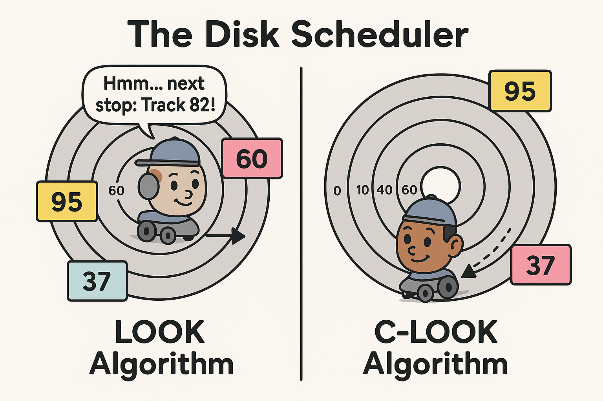

## CS 455 - Principles of Database Systems

### Hwk 5: Disk Scheduling Simulator
In this assignment you will write a program in Java or Python to simulate disk scheduling algorithms. This project will help you practice implementing scheduling policies covered in lecture (FCFS, SSTF, LOOK, C-LOOK).



#### Background
A rotating hard disk consists of N tracks numbered from 0 to N-1. The disk head services a queue of pending requests, each given as a track number. You are to write a program that accepts user input interactively, and simulates the following disk-scheduling policies: FCFS, SSTF, LOOK, and C-LOOK. Let's take a moment to review each policy:

- **FCFS (First-Come-First-Served):** The scheduler services each track based solely on their arrival order in the disk request queue.
- **SSTF (Shortest-Seek-Time-First):** This is a "greedy approach" in the sense that the disk scheduler always services the request that is closest to the current location of the head.
- **LOOK:** Starting from the current head position, the scheduler moves in the same direction that the head was last traveling. (At program start, you may assume this direction is in ascending order.) It services all outstanding requests in that direction, ignoring any requests that are behind the current head position. When the head reaches the last pending request in that direction, it reverses and services the remaining requests in the opposite direction.
- **C-LOOK (Circular LOOK):** This is the same as LOOK except that the head only services requests in one direction (ascending order). When the reaches the last request, it heads back to the lowest requested track to service the rest.


#### Student Outcomes
By the end of this assignment, you should be able to:
- Describe how disk scheduling algorithms (FCFS, SSTF, LOOK, C-LOOK) determine the order of servicing I/O requests.
- Simulate each of these algorithms and trace the head movement across disk tracks.
- Compute and compare quantitative performance metrics, including total seek distance, total seek time, and turnaround time.
- Explain how scheduling policies trade off between throughput, fairness, and average response time.

#### Requirements

1. You can write this program using a language of your choice. Your program must compile and run without modifications. No separate write-up is required for this assignment.

2. Upon starting, your program should prompt for two user inputs: the initial head position, and a listing of outstanding track requests. Here's an example of what that might look like:

    ```txt
    *** DISK SCHEDULING SIMULATOR ***

    Enter initial head position: 2150
    Enter the track numbers (separated by space): 
    2069 1212 2296 2800 544 1618 356 1523 4965 3681
    ```

3. Once you've read in the inputs, your program will simulate each of the four scheduling algorithms. After each algorithm is done simulating, your program reports the results of that policy, including:
- The exact schedule of tracks visited (i.e., order of service).
- The total seek distance (number of tracks traversed).
- The average seek distance per request (round down to the nearest hundredth).
See the example outputs below for examples.

4. Note the following:
- You may assume that the lowest track is 0.
- You may assume that well-formed inputs will be given. For example, I won't test with a negative initial head position, no negative track requests, and nothing besides integers would be input in the prompts.
- The resulting schedule always starts on the user-given "initial head position."
- Please print arrows `->` to separate head movements in the schedule.

### Example Interaction (1)
If your program is correct, your outputs should match mine.

```txt
*** DISK SCHEDULING SIMULATOR ***
Enter initial head position: 50
Enter the request queue (track numbers separated by space):
82 170 43 140 24 16 190

FCFS
Schedule: 82 -> 170 -> 43 -> 140 -> 24 -> 16 -> 190
Total Seek Distance: 642 (avg = 91.71 tracks per seek)

SSTF
Schedule: 43 -> 24 -> 16 -> 82 -> 140 -> 170 -> 190
Total Seek Distance: 208 (avg = 29.71 tracks per seek)

LOOK
Schedule: 82 -> 140 -> 170 -> 190 -> 43 -> 24 -> 16
Total Seek Distance: 314 (avg = 44.86 tracks per seek)

C-LOOK
Schedule: 82 -> 140 -> 170 -> 190 -> 16 -> 24 -> 43
Total Seek Distance: 341 (avg = 48.71 tracks per seek)
```

### Example Interaction (2)
If your program is correct, your outputs should match mine.

```txt
*** DISK SCHEDULING SIMULATOR ***
Enter initial head position: 100
Enter the request queue (track numbers separated by space):
23 89 132 42 187 

FCFS
Schedule: 23 -> 89 -> 132 -> 42 -> 187
Total Seek Distance: 421 (avg = 84.20 tracks per seek)

SSTF
Schedule: 89 -> 132 -> 187 -> 42 -> 23
Total Seek Distance: 273 (avg = 54.60 tracks per seek)

LOOK
Schedule: 132 -> 187 -> 89 -> 42 -> 23
Total Seek Distance: 251 (avg = 50.20 tracks per seek)

C-LOOK
Schedule: 132 -> 187 -> 23 -> 42 -> 89
Total Seek Distance: 317 (avg = 63.40 tracks per seek)
```

### Example Interaction (3)
If your program is correct, your outputs should match mine.

```txt
*** DISK SCHEDULING SIMULATOR ***
Enter initial head position: 3030                                           
Enter the request queue (track numbers separated by space):
2069 1212 2296 2800 544 1618 356 1523 4965 3681

FCFS
Schedule: 2069 -> 1212 -> 2296 -> 2800 -> 544 -> 1618 -> 356 -> 1523 -> 4965 -> 3681
Total Seek Distance: 13891 (avg = 1389.10 tracks per seek)

SSTF
Schedule: 2800 -> 2296 -> 2069 -> 1618 -> 1523 -> 1212 -> 544 -> 356 -> 3681 -> 4965
Total Seek Distance: 7283 (avg = 728.30 tracks per seek)

LOOK
Schedule: 3681 -> 4965 -> 2800 -> 2296 -> 2069 -> 1618 -> 1523 -> 1212 -> 544 -> 356
Total Seek Distance: 6544 (avg = 654.40 tracks per seek)

C-LOOK
Schedule: 3681 -> 4965 -> 356 -> 544 -> 1212 -> 1523 -> 1618 -> 2069 -> 2296 -> 2800
Total Seek Distance: 8988 (avg = 898.80 tracks per seek)
```

#### Grading

```
This assignment will be graded out of 80 points.

[10pts] Input/Output handling
    - Prompts user interactively and output matches specified format.
    - Handles reasonable user inputs gracefully.

[10pts] Style and Commenting
    - Code is well-structured, readable, and commented where appropriate.
    - Functions / methods separate algorithm logic from input/output.
    - Code duplication is minimized.

[60pts] 
    - Correctness of FCFS (10 pts)
    - Correctness of SSTF (20 pts)
    - Correctness of LOOK (15 pts)
    - Correctness of C-LOOK (15 pts)
```

#### Submitting Your Assignment

After you have completed the homework, use the following to submit your work on Canvas. There are two options to submit your work.

1. If you pushed all your code to a Github repository. Make sure your repo is public, and simply submit the URL to your repo on Canvas.
2. Alternatively, you can zip up all your files and submit the `.zip` file on Canvas.
3. You may submit as often as you'd like before the deadline. I will grade the most recent copy.

#### Credits

Written by David Chiu. 2025.
