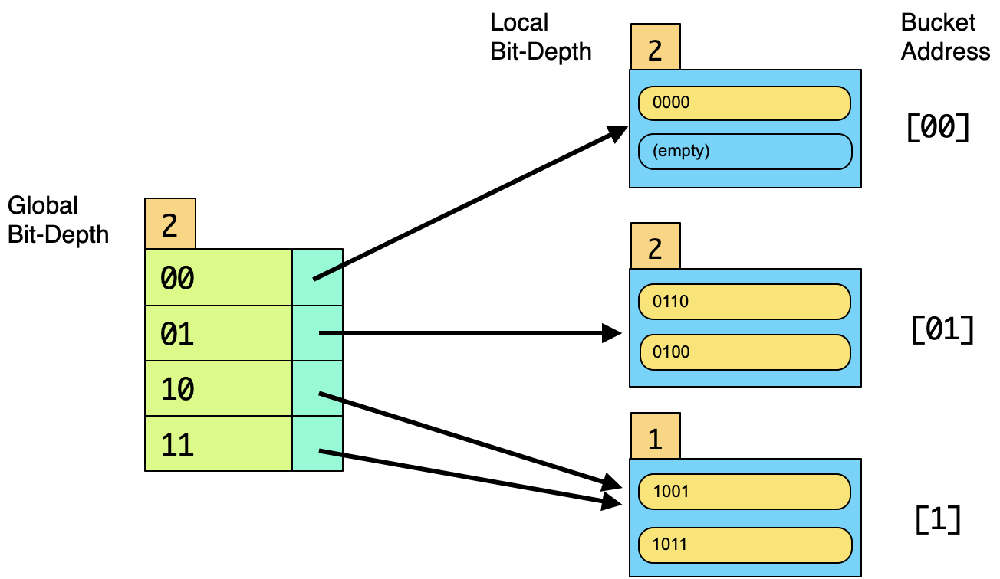

## CS 455 - Principles of Database Systems

### Hwk: Extendible Hashing
In this assignment, you will build a program that simulates the search and insertion of search keys into an extendible hash indexing structure. You may use Java or Python, though I'd recommend an object-oriented solution.


#### Student Outcomes

- To gain an understanding of extendible hashing.


#### Program Requirements

1. Upon running your program, your main method must accept a single command-line argument:
    - Local bucket size (integer): This is the maximum number of tuples that can be stored per block.
    <!-- - Maximum key value (integer), $$k$$: This means your bit strings would be a maximum of $$\lceil\log_2 k\rceil$$ bits. -->

2. After receiving the above input, create a default extendible hash index, with global index ($$i$$) and local index ($$j$$) initialized to 0, which means you will have $$2^i = 1$$ entry in your global index that points to the sole local bucket, which is empty.

3. Your program should now wait for instructions of the following format:
    - `i <x>` Inserts the key `x` given as a binary string, such as `"i 11010"`, which prints `SUCCESS` or `FAILED`. An insert fails if `x` already exists in the hash index.
    - `s <x>` Searches the index for key `x`, given as a binary string. Prints `x FOUND` or `x NOT FOUND`.
    - `p` Prints out your extendible hash index (you must abide by the format given below.)

4. When printing out your hash index, it must follow the format below:

    ```txt
    Global(<i>)
    <B>: Local(j)[<b>] = [key1, key2, ...]
    ...
    ```

    In the format above, `<i>` is the integer bit-depth of the global directory. `<B>` is an bit string representation of a global address. `<j>` is the integer bit-depth of the local directory. `<b>` is the bit string representation of the local bucket's address. Finally, the binary keys that are stored in that bucket are listed in no particular order.

    Here's an example below for a local bucket size of 2 tuples. The global bit-depth is 2, so there are four addresses (entries) in the global directory: `00`, `01`, `10`, and `11` (one listed on per row). The global address `00` points to a local bucket (also addressed `00`) which stores a single key, `0000`. Both global entries `10` and `11` point to the _same_ local bucket. We know they're the same because the local bit depth in those buckets is only `1` (well, and also because they store the same keys). If you work this out on paper, you should get this result from inserting `0000`, `1001`, `0110`, `1011`, and `0100`, in that order.

    ```
    Global(2)
    00: Local(2)[00] = [0000, null]
    01: Local(2)[01] = [0110, 0100]
    10: Local(1)[1] = [1001, 1011]
    11: Local(1)[1] = [1001, 1011]
    ```

    The corresponding drawing looks like:
    

5. If taking an object oriented approach, I would have 3 classes: global directory, bucket, and a class that runs the main method.


#### Example Output

```txt
$ java ExtHash
> Usage: java ExtHash <number of tuples per block>

$ java ExtHash 2
i 00011
> SUCCESS

p
> Global(0)
> : Local(0)[] = [00011, null]

i 00101
> SUCCESS

p
> Global(0)
> : Local(0)[] = [00011, 00101]

s 00011
> 00111 FOUND

i 00111
> SUCCESS

i 00101
> FAILED

p
> Global(3)
> 000: Local(3)[000] = [00011, null]
> 001: Local(3)[001] = [00101, 00111]
> 010: Local(2)[01] = [null, null]
> 011: Local(2)[01] = [null, null]
> 100: Local(1)[1] = [null, null]
> 101: Local(1)[1] = [null, null]
> 110: Local(1)[1] = [null, null]
> 111: Local(1)[1] = [null, null]

i 01001
> SUCCESS

p
> Global(3)
> 000: Local(3)[000] = [00011, null]
> 001: Local(3)[001] = [00101, 00111]
> 010: Local(2)[01] = [01001, null]
> 011: Local(2)[01] = [01001, null]
> 100: Local(1)[1] = [null, null]
> 101: Local(1)[1] = [null, null]
> 110: Local(1)[1] = [null, null]
> 111: Local(1)[1] = [null, null]

i 01011
> SUCCESS

p
> Global(3)
> 000: Local(3)[000] = [00011, null]
> 001: Local(3)[001] = [00101, 00111]
> 010: Local(2)[01] = [01001, 01011]
> 011: Local(2)[01] = [01001, 01011]
> 100: Local(1)[1] = [null, null]
> 101: Local(1)[1] = [null, null]
> 110: Local(1)[1] = [null, null]
> 111: Local(1)[1] = [null, null]

s 01011
> 01011 FOUND
```


#### Grading

```
This assignment will be graded out of 80 points.

[20pts] Implementation of findSuperKeys() exhaustively generates all superkeys
of a given relational schema and its FD set. You throw an exception if there is an 
FD that refers to an unknown attribute in the given schema. Ensure that, when 
the FD set is empty, then all attributes in the given schema serves as the only superkey.

[10pts] Implementation of isBCNF(). It returns true if the left-hand side of all
non-trivial FDs is a superkey.

[40pts] Implementation of BCNFDeompose(). It returns a set of relational schemas that
satisfy BCNF. At every split point, you output the schema being split, the violating FD,
the superkeys for that schema. Also print the same information for the two schemas after
the split. 

[5pts] Immutability and no-side effects: None of the methods should modify the content of 
any input structure.

[Misc] Your program must be written in Java. Non-Java programs will be returned
without a grade.
```

#### Submitting Your Assignment

After you have completed the homework, use the following to submit your work on Canvas. There are two options to submit your work.

1. If you pushed all your code to a Github repository. Make sure your repo is public, and simply submit the URL to your repo on Canvas.
2. Alternatively, you can zip up all your files (minus the `.class` files) and submit the `.zip` file on Canvas.
3. You may submit as often as you'd like before the deadline. I will grade the most recent copy.

#### Credits

Written by David Chiu. 2022.
