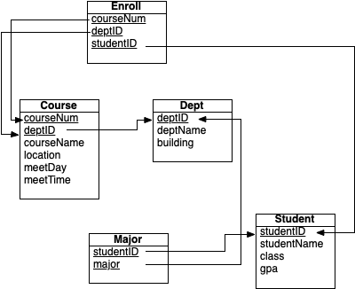

## CS 455 - Principles of Database Systems

### SQL Queries for the University Database!

We're finally to ready to get some hands on experience with a SQL database! The data set, although synthetic, is an analog to the real data found in any university's database. The queries I'm having you run are very similar to (or even the same as) the ones that we actually have to run when generating year-end reports!


#### Student Outcomes

- To write SQL queries for the retrieval of data.

#### Required Files
The following file have been provided for this assignment.

- [university.db](university.db)

#### Browse your Database!
Start by downloading the database file, and open it up in [DB Browser](https://sqlitebrowser.org/). Open the `university.db` file that is provided to you, and browse its contents to gauge the schema and where all the data is stored.<br/><br/>



#### Writing SQL Queries
For each of the following problems, write an SQL query to return the expected results. Your queries should work in general, regardless of what data is currently stored in this instance of the University database. In other words, don't hard code your queries to work for only the given database instance!

#### Basic Queries


1. Return the list of first-year (freshman) students. Sort results by descending order of GPA.

   ```
   studentID   name     rank        gpa
   ---------   ----     ----        ---
   1501        Jessica  Freshman    3.3
   1510        Jordan   Freshman    3.0
   1225        Sarah    Freshman    2.9
   1282        Kelly    Freshman    2.5
   1661        Logan    Freshman    0.5
   ```

2. Return a list of departments that are housed in any building starting with the letter `"T"`. Order by `dept ID`.

   ```
   deptID      deptName                        building
   -------     --------                        --------
   CSCI        School of Computer Science      Thompson Hall
   MATH        Department of Mathematics       Tower of Babel
   ```

3. Get all courses being taught by the `MATH` department that start in the afternoon. You may assume that time is in 24-hour format and that single-digit hours are prefixed with `"0"` (e.g., `"07:00"` not `"7:00"`). Order the results by course number.

   ```
   CourseNum   deptID      CourseName  Location    meetDay     meetTime
   ----------  ----------  ----------  ----------  ----------  ----------
   120         MATH        Algebra     MH 10       MW          12:00
   230         MATH        Linear Alg  HH 308      TR          15:00
   460         MATH        Calculus 3  WEY 102     TR          12:30
   ```

4. Return David's, course schedule. Assume you don't know David's student ID off-hand, so you have to search by his name. (Yes you may assume he's the only one with that name in this database). Only `Course`'s attributes should be projected. Order by `DeptID` then by `Course Number`.

   ```
   deptID      CourseNum   CourseName        Location    meetDay     meetTime
   ----------  ----------  ----------------  ----------  ----------  ----------
   CSCI        351         Database Systems  TH 19       MW          12:00
   CSCI        453         Capstone in Comp  TH 398      MWF         16:00
   MATH        230         Linear Algebra    HH 308      TR          15:00
   ```

5. Return a list of courses taught by departments housed in Wyatt Hall. This is not the same as asking for a "list of courses taught in Wyatt Hall." For instance, note that ENGL 520 is listed, because it's taught out of Department of English, despite being held in `HH`.

   ```
   101	SOAN	Sociology 1    WY 105	MWF	08:00	Department of Anthropology	Wyatt Hall
   102	SOAN	Sociology 2    WY 205	MTWRF	09:00	Department of Anthropology	Wyatt Hall
   101	ENGL	How to Read    WY 100	MWF	13:00	Department of English	Wyatt Hall
   102	ENGL	How to Write	   WY 100	MWF	14:00	Department of English	Wyatt Hall
   520	ENGL	Shakespeare Was Da Bomb	HH 20	TR	13:00	Department of English	Wyatt Hall
   ```

6. Haley's advisor wants to know what courses she's taking in her major(s). Assume you don't know what her major off hand, so your query needs to involve the `Major` table. Perhaps you should start by joining together the student and the majors table to see what her majors are.

   ```
   deptID   courseNum
   ------   ---------
   MATH	   120
   MATH	   230
   ```

7. Return a list of all students who are still undeclared (without a major). Project their student ID and their name. Sort results by `studentID`.

   ```
   studentID   studentName
   ----------  -----------
   1001        Lia
   1225        Sarah
   1282        Kelly
   1629        Brad
   1640        Adam
   ```

#### More Fun
These don't yield any points, but you will be happier that you did them.

1. (mild) If you used a left outer join to in the last query, do it again using a set difference (EXCEPT) instead. Otherwise, use a left outer join instead.

2. (medium) List all students (sorted by name) who are not enrolled in any courses. Project their ID, name, and class rank.

   ```
   studentID   studentName	      class
   ---------   -----------       -----
   1640	      Adam	      Senior
   1629	      Brad	      Senior
   1641	      Brittany	      Senior
   1487	      Erin	      Sophomore
   1468	      Kris	      Sophomore
   1001	      Lia	      Junior
   1381	      Tiffany	      Junior
   ```

   <!-- select *
   from Student where studentID NOT IN (select studentID from Enroll)
   order by studentName; -->

3. (spicy) List all courses in Andrew's major that he is not currently taking.

   ```
   CourseNum      deptID	CourseName	Location	meetDay	meetTime
   ---------      ------   ----------     -------- -------  --------
   122	         BUS	   Economics	   WY 30	   MW	      13:30
   351	         BUS	   Finance	   WY 29	   TR	      12:00
   ```


   <!-- WITH hisMajor as (select major from student natural join major where studentName='Andrew')
   select * from Course where course.deptID IN hisMajor
   except
   select coursenum,deptid,coursename,location,meetday,meettime
   from student natural join enroll natural join course
   where course.deptID IN hisMajor and studentName = 'Andrew'; -->


#### Grading

```
[35pt] Basic queries Q1 - Q7 (5pts each)

Total: 35pts
```


#### Submitting Your Assignment
Please submit all queries in a single `.txt` file. Please clearly label each query by its assigned number using a `--comment`.


#### Credits

Written by David Chiu.