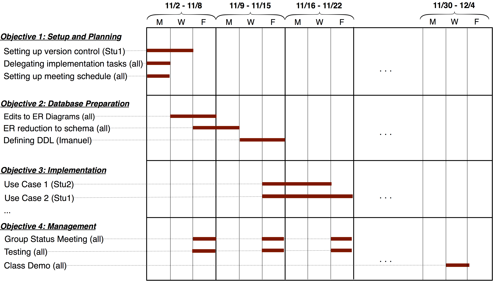

## CS 455 - Principles of Database Systems

### Project 3: Project Planning

#### Overview

By now, you've gotten some practice administering a web server, and you've also had significant experience writing some dynamic database-backed web pages. Now it's time to put these skills to use. In this project, you will be playing a software consulting firm. You will think up a development idea, and then start planning for its implementation.

#### Student Learning Objectives

Students will:

- Prepare design documentation and a project plan

#### Part 1: Planning

If your team would rather work on your own ideas, you're welcome to! Get together with your group and brainstorm over a project you wish to implement. As you do this activity, imagine that you're working for an organization with web-programming needs, which require database support. This could be a real project you create for an organization on campus in need (which has been done several times). In the past, interesting projects included:

    - An **online voting system** for campus-wide elections. Users with accounts can create any election or poll for people to vote on. Once it goes online, any user with an account can make a vote. Users can change their vote as long as the election has not closed. Once the election closes, the votes can no longer be made or changed, and the results are displayed.

    - A **campus bike-sharing and tracking site**. Anyone with a browser can view the available bikes for rent and where they are located. Integration with Google Maps is a requirement (of course, without real GPS, you'll just simulate bikes and their locations). Users can login and check bikes in/out for a fixed cost per hour.

    - A **grocery-delivery company** -- needs to track deliveries, employees, delivery stations, and routes. Users with a tracking ID can get status updates on the location of their groceries. Based on the distances between stations and the availability of delivery vehicles, the organization can provide estimated shipping times.

    - A **music-sharing app** -- allows users to upload and stream MP3s. Users on the website can upvote/downvote songs. They can also tag, search, and comment on various songs.

    - An **online auction house** -- any user can create an account and post items (including descriptions and images) for auction. Every auction has an end-time and end-date, at which the highest bidder wins the coveted item. After winning, the organization must provide secured payment options.

These are just examples from the past couple semesters. You're clearly not bound to any of these, and you are encouraged to be as creative as possible. They give you an idea of the scope and expectations of this project.

Caution: I recommend that the team comes to a consensus on the project vision, so that everyone is bought-in and invested equally. Project visions borne out of one or two students generally doesn't work well. Something like this has happened in the very recent past... A student was really into Pokemon cards. They convinced the rest of their team members to write a web app to organize all the Pokemon cards in the world, and so that users can manage which cards they own and even trade them and _battle_ each other. Other teammates didn't understand how the battles were played out, which was more complicated than they first thought, but went along with it anyway. The other members were never really invested enough to stay motivated to work on the project, and it didn't end well.

#### Part 2: Project Proposal (2-3 pages)

Please submit a short proposal with the following required elements:

- **Section I: Introduction** -- Describe your project briefly. Discuss your client's requirements and summarize why you believe a database solution is necessary.

- **Section II: Product Features** -- Define 2-3 features per team member. Here are a few example use-cases for a package-shipping company:

  - Feature 1: Users can login to our system with a username and password, which are both encrypted in the database. The login form has a checkbox option to "Remember me today." If this option is checked upon a successful login, the website will remember them for a 24-hour period (without requiring login if they leave and return to the site later). If not checked, the site will only remember them for a 1-hour period.
  - Feature 2: To provide added security, we will block out an account after 5 unsuccessful login attempts, after which the user must reset their password by following a link that is emailed to the addressed stored in the database for the given the username.
  - Feature 3: Users with proper credentials can manually add a new package by date, and assign that company's container to a specific delivery vehicle.
  - Feature 4: Any user can view the company's shipping routes by date, but users with proper credentials can also adjust (add/delete/update) any shipping routes.
  - Feature 5: Users with proper credentials can generate reports on the company's earnings aggregated by day, month, and year.

- **Section III: Project Management** -- In this section, you will define each team member's role by assigning features to specific team members. Clearly, not all features are the same size and time-commitment, so it's common for a team member to be assigned more features than others. You must outline how you will manage the shared code in your project through a version control system like Git. You should also summarize how you intend to communicate to your team members (e.g., physical meeting frequency and online meeting frequency). Finally, you must produce a Gantt Chart that communicates your timeline and milestones. Throughout the weeks of your project's implementation, I will hold you accountable based on your proposed timeline. Here is an example:

    

#### Miscellanea

- Your project must be hosted on the server to which you have access.
- If you're interested in trying out another database system like MySQL/MariaDB/PostgreSQL, you're more than welcome to. The only requirement is that the database system you choose must be relational in nature.
  - You cannot use document-object storage systems like MongoDB and CouchDB.
  - You're also reminded that different implementations may support different "flavors" of SQL. That means there may be significant variations to the syntax you're already familiar with.
- Backend programming using PHP and HTML is sufficient for this project.
  - However, if you know JavaScript, you're welcome to integrate that into your code.
    Make sure the language you ultimately choose is one that everyone is comfortable using. This is why a PHP-only option is still recommended for all teams.
  - You have to do the bulk of the work, so heavy reliance on pre-made libraries and other web toolkits are discouraged. If you're not sure, run it past me first.
- Code sharing: I strongly recommend everyone getting onboard with using git and hosting their code on github to manage your source code. It will also make project submission easy!

#### Submission

Create a page that links to: (1) the new-passenger form, (2) the passenger listing. List the group membership on this page. Go to [canvas](https://canvas.pugetsound.edu) and submit the URL to this page under Project 2.

#### Grading

```
This assignment will be graded out of 40 points:
[5pt] An form that allows users to input data on a new or exiting passenger.
[5pt] A secure PHP page, createPassenger.php, that inserts new passengers
      (with data input from the aforementioned form) into the passengers table.
[5pt] On success, createPassenger.php redirects users back to the passenger
      list with a "success" message.
[5pt] On failure, createPassenger.php redirects users back to the user-input
      form page, indicating all error(s).
[5pt] The update link now redirects users back to the createPassenger.php page,
      with exiting data already filled in the boxes. The submit button now
      reads "Update Info"
[5pt] Clicking on "Update Info" will take users to a secure PHP page,
      updatePassenger.php, which updates the specific passenger with the new
      data from the previous form.
[5pt] On update success, updatePassenger.php redirects users back to passenger list.
[5pt] On update failure, updatePassenger.php redirects users back to the form,
      indicating all error(s).
[-15pt] I can successfully inject SQL statements.
```
