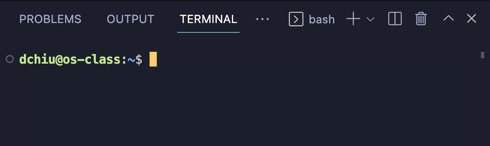

## CS 475 - Operating Systems

### Hwk: Remote Development

In this ungraded "preliminary assignment," we will set you up to develop on a remote server. Here's why we must do this, instead of developing on your own machines. C is highly dependent on the  environment on which it compiles and executes. This is everybody's worst nightmare: turning in an assignment you spent hours on, only to have it not compile or execute on your instructor's machine. In fact, having a common runtime environment was what made Java (and the Java Virtual Machine, JVM) so successful when it was introduced in the mid-90s.

It's therefore important that we all code a common environment, so I've prepared a remote server for everyone to log into.

#### Student Outcomes
- Setting up VS code for remote development on a Linux server
- Learning the basics on how to navigate Linux using the command line
- Compiling and running your first C program

#### Installing Development Tools

- Download and install [VS Code](https://code.visualstudio.com/) if you don't already have it installed on your computers. This is what we'll be using for writing all our assignments for this class.

- Open VS Code and click on the **"Extensions"** tab on the left hand side. You'll want to search for and install the following packages:
  - **C/C++** by Microsoft
  - **C/C++ Themes** by Microsoft
  - **Remote Development** by Microsoft

- You may have to restart VS Code after installing each of those extensions. Go ahead and do so.

#### Getting Connected to the Remote Server

- I've set up a Linux server for you to connect to and develop on. Make a note of the following information:
  ```
  Server IP Address: 149.165.174.87
  Your Username: yourPugetSoundUsername
  Your Password: yourPugetSoundID
  ```
  The IP address and your username will not change during this class, but  you *can* change your password later. 

- Back in VS Code, check out the menu up on top, and click on `View -> Command Palette`. Then type: `Remote-SSH: Add New SSH Host...`. It should autocomplete after typing the first few letters. Choose to run this command. In the box that pop up, enter:
  ```
  ssh yourPugetSoundUsername@IPAddress
  ```
  For example, mine would look something like:
  ```
  ssh dchiu@149.165.174.87
  ```

- Next, VS Code may ask you to choose an SSH configuration file. Just select the one that's highlighted.

- You'll then be prompted for your password. Enter the one that I assigned you.

- VS Code will then ask you what platform the remote server is using. Select `Linux` in the option menu. Then it's going to take a bit of time to install the necessary files to get you set up.

- Once everything is set up, you should see an empty VS Code editor. On the left-side panel, click on the button called `Open Folder`. Choose `/home/yourUsername` (which should be the default option). Important: This "path" `/home/yourUsername` is known as your **home directory** on the server. Only you (and I) have access to it. Think of it as your private, personal folder on the server. This is where all your code will go.

-  You may be prompted for your password again, followed by a prompt to trust and accept the secure certificate. Click yes on this screen.

- If you did all the steps correctly, you should see the contents of your home directory on the left-side panel. Here's what mine looks like:

  

  If you see this, congrats, you're all set up. If not, let me know.

#### Using the Terminal (Shell) and Editor
- You only have to do the steps listed in the previous section that one time. Let's get a feel for how to start up the coding environment from this point forward.

- Quit VS Code, and start it back up again.

- On the left-hand, you'll see a new button on the far left called **Remote Explorer**. Click on it, then click on the profile you want to connect. It should simply be `/home/yourUserName`.

  

- You will be prompted for your password, and afterwards, you should see the contents of your home directory once again.

- The command-line terminal (also called a _shell_) should show up on the bottom of your screen. Here's what mine looks like:

  

  Before "windows" were invented, the shell was the _only_ user interface to operating systems. We use it to do everything that you can do with windows: accessing your files and folders, running and quitting programs, editing files, etc. Because the Linux server that I provided is "headless" (i.e., stripped down OS that doesn't support windows and graphical interfaces), so you will need to do a lot of things on the shell.
  
- **Pro Tips:** I assume you've have a basic working knowledge of the command-line shell, but here are some time-saving tips. 

  | Tip |  |
  | :--- | :--- |
  | `[tab]` and `[tab]+[tab]`| Type the first few letters of a file or directory, and hit `[tab]` to auto-complete. When the result is ambiguous, hit `[tab]` twice. |
  | `up`/`down` keys | Hitting the `up` key will display the most recently-run command. You can hit `up` multiple times. |
  | `history` | Shows you a list of recently-run commands. |
  | `ctrl + c` | Will interrupt the currently-running command, and return the shell prompt. |

#### Our First C Program


#### Running Programs

- `mkdir <name>`: creates directory called name in current working directory

    - **Pro Tip: Tab Completion** Most shells provide a useful tool called tab-completion. 


#### Credits

Written by David Chiu. 2022.
