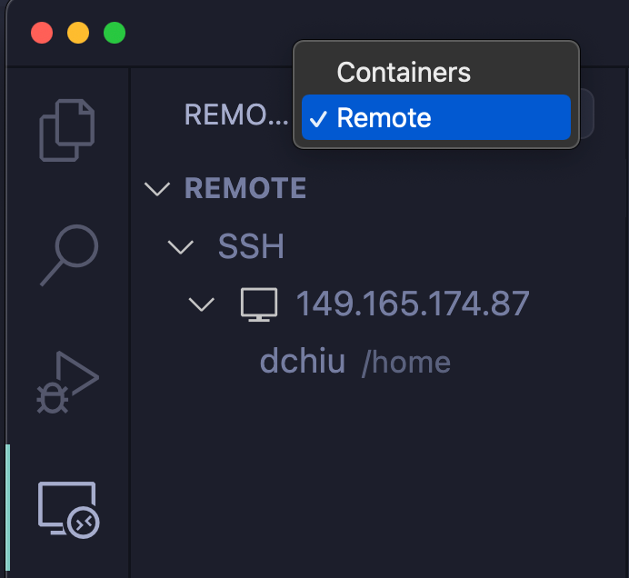
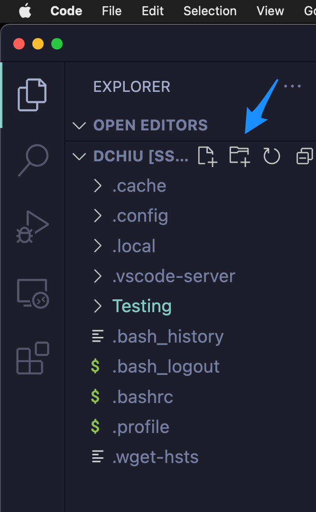

## CS 475 - Operating Systems

### Hwk: Remote C Development

In this tutorial, we will set you up to develop on a remote server. Here's why we have to do this, instead of developing on your own machines. C is a very finicky language, and is highly dependent on the  environment on which it compiles and executes. This is everybody's worst nightmare: turning in an assignment you've spent hours on, only to have it not compile or execute on your professor's machine. Indeed, having a common compiling and runtime environment was what made Java (and the Java Virtual Machine  JVM) so successful when it was introduced in the mid-90s. Today, most languages have a common runtime environment, and C has certainly made significant efforts to being more portable across systems, but alas I find that it's still very system dependent.

It's therefore important that we all code in a common environment, so I've prepared a remote server for everyone to log into, including myself. This means we're all coding and running on the same machine, which leads to more predictable and repeatable results!

#### Student Outcomes
- Setting up VS code for remote development on a Linux server
- Setting up git and github remote connection
- Compiling and running our first C program

#### Installing C Development Tools

- Download and install [VS Code](https://code.visualstudio.com/) if you don't already have it installed on your computers. This is what we'll be using for writing all our assignments for this class.

- Open VS Code and click on the **"Extensions"** tab on the left hand side. You'll want to search for and install the following packages:
  - **C/C++ (required)** by Microsoft
  - **Remote Development (required)** by Microsoft
  - **C/C++ Themes (optional)** by Microsoft 

- You may have to restart VS Code after installing these extensions.

#### Connecting to the Remote Server

- I've set up a Linux server for you to connect to and develop on. Make a note of the following information:
  ```
  Server IP Address: 149.165.172.59
  Your Username: <your-pugetsound-username>
  Your Password: <given-in-class>
  ```  

- Open up VS Code, then click on the `View` menu and select `Command Palette`. Then type: `Remote-SSH: Add New SSH Host...`. It should auto-complete after typing the first few letters. Choose to run this command. In the box that pops up, enter:
  ```
  ssh  <your-pugetsound-username>@IPAddress
  ```
  For example, mine would look like:
  ```
  ssh dchiu@149.165.172.59
  ```

- Next, VS Code may ask you to choose an SSH configuration file. If it asks, just select the one that's already selected. 

- Now click on the **"Remote Explorer"** icon the left-hand panel, shown below. Near the top left, select the `Remote` (or `SSH Target` on older versions) option from the pull-down menu that may have "Containers" selected currently. Now you should see the `149.165.172.59` and your username below it. Click on the arrow next to your username to connect.

  

- You'll be prompted for your password in a box at the top (it's easy to miss). Enter the one that I assigned.

- VS Code may ask you what platform the remote server is using. Select `Linux` from the option menu if asked. It's going to take a couple minutes for it to install the necessary packages to get you set up.  Once everything is installed, you should see a front page with some information and options on it. Go ahead and exit out of this page to show an empty VS Code editor. 

  - From the left-hand panel, click on the **"Explorer"** icon that looks like like two sheets of paper. Then click on the button called `Open Folder`. Choose `/home/<your-pugetsound-username>` (which should be the default option). Important: This path is your **home directory** on the server. Only you (and I) have access to it. This is where all your code will go for this class.

-  You may be prompted for your password again up on the top of the screen, followed by a prompt to trust and accept the secure certificate. Click the check box then select `Yes` on this dialog box.

- If you did all the steps correctly, you should see the contents of your home directory on the left-hand panel. Here's what mine looks like:

  


- **Important:** Now, change your password to something more secure. From the terminal (command-line) window on the bottom of your screen, enter `passwd`, and follow the instructions. When you type of your password, the screen will remain blank, but your input is registered. That is normal.


#### Using the Terminal (Shell) and VS Code Editor
- You only have to do all those steps listed in the previous section that one time. Let's get a feel for how to start up the coding environment from this point forward, so go ahead and **quit** VS Code.

  - Before getting started again, keep in mind that, because we're coding on a remote server, a stable internet connection is essential. This means it will not be possible to develop while you're offline or only have an intermittent wifi connection (e.g., on a plane), so plan wisely throughout the semester.

  - **Pro Tip: Save Often** Anytime you lose wifi connection or close down your computer, you *will* sever your connection to the remote server and lose any unsaved work! As you're developing, save often! (It's just `ctrl+s` on Windows and `command+s` on a mac.)

- **Open** VS Code back up. If you don't see a new, blank window, then choose the `File` menu and select `New Window`. Click on **Remote Explorer** icon, then choose the profile you want to connect. It should simply be called `/home/<your-pugetsound-username>`.

  

- Enter your new password, and you should see the contents of your home directory once again. If you do, then you're connected back to the server! Happy programming!

- **Accessing the Terminal** The command-line terminal (also called a _shell_) should show up on the bottom of your VS Code editor. If it's not already there, go to the `Terminal` menu on the top of your screen and select `New Terminal`. Here's what mine looks like:

  

  
- I assume you have a working knowledge of the command-line shell, but here are some time-saving tips. 

  | Tip |  |
  | :--- | :--- |
  | `[tab]` | Type the first few letters of a file or directory, and hit `[tab]` to auto-complete. When the there are multiple matches, hitting `[tab]` will do nothing. However, hit `[tab]` twice in succession will reveal all the matches. |
  | `up` and `down` keys | Hitting the `up` key will display the most recently issued command. You can hit `up` continuously to scroll through your command history. |
  | `ctrl + c` | Will interrupt the currently-running command, and return the shell prompt. I suspect you'll be using this one a lot! You use it to terminate a process that you ran.|
  | `ctrl + u` | Will delete from your cursor to the beginning of the line.  |
  | `ctrl + k` | Will delete from your cursor to the end of the line.  |
  | `ctrl + l` | Will clear out the terminal window. (Same as the `clear` command). |


- If you need a refresher on how to work on the shell, here are some resources (Strongly recommended)
  - [Linux Command Cheatsheet](https://www.guru99.com/linux-commands-cheat-sheet.html)
  - [The Linux command line for beginners](https://ubuntu.com/tutorials/command-line-for-beginners#1-overview)

#### Setting up Git and Github

To download and submit your homework assignments for this class, you'll need to get connected to github and configure it all to work with this server. Follow these steps.

1. Open your browser, and go to [github.com](https://github.com). If you don't already have an account,  create one now.

2. Navigate to [https://github.com/settings/tokens](https://github.com/settings/tokens) to create a new "personal access token." You can also get there via `Settings > Developer Settings`. 

3. Click to generate new a (classic) token. On the next screen, give your new token a good *note*, like "For OS assignments" or "CS 475" so you know what it is later. Assign it an expiration period that will take you to the end of the course, and it may be easier to just give it no expiration.

4. Below that, select the boxes: `repo`, `admin:org`, and `admin:public_key`. 

5. Click the `Generate token` button on the bottom of the page, and take note (save) the token in a secure place. Don't share it. Treat this like your password.

6. Go back into your VS Code's terminal window. Type:
    ```bash
    $ gh auth login
    ```

7. Follow the prompts in this program. Use your up/down keys to choose the following selections to their questions:

    ```
    ? What account do you want to log into? 
    > GitHub.com

    ? What is your preferred protocol for Git operations?
    > HTTPS

    ? How would you like to authenticate GitHub CLI?
    > Paste an authentication token
    ```

    Finally, get your github access token ready for pasting:
    ```
    ? Paste your authentication token: ****************************************
    ```

8. Now run this to complete the setup.
    ```bash
    $ gh auth setup-git
    ```

9. That should set you up for authentication to github. We can start our homework.


#### Our First C Program


1. From your browser, find my code repository here: [https://github.com/davidtchiu/os-first](https://github.com/davidtchiu/os-first). 

    - Click on the green **Use this template** button  and select the **Create new repository** option. In the next page, give your repository a good name (the "suggestion" they give is fine). My only request is that you *don't* name it to be the same as mine. This is hide your homework solution from Google searches.

    - Leave your repository with public visibility.

    - Copy the URL of your new from the browser window.

2. Now from VS Code, open a terminal, and _*clone*_ your new Github repository down to your local working directory using:

    ```bash
    $ git clone <your-github-repo-url>
    ```

3. You will be prompted in the terminal for your github username and password. Enter those now -- however, you will use the "access token" we previously generated as your password. Do not attempt to use your regular github login password here. If successful, it will download a directory called `os-first`. 


4. Navigate into the new directory you just cloned. Inside, create a new directory create a new file called `hwk1.c`:

    ```bash
    $ cd ~
    $ cd os-first
    $ code hwk1.c
    ```

    - The first command `cd ~` changes your current-working-directory to your home directory. You should remember that `~` is a shortcut to your home directory!

    - The second command `cd os-first` changes your current-working-directory to the `os-first` directory that git just cloned in the previous steps.

    - Finally, `code hwk1.c` opens a new file called `hwk1.c` inside your VS code editor.

    - Of course, you could've done all that using VS Code's file explorer on the left-hand panel, but it's important to make sure that your terminal is opened *in* that new project directory when you're ready to compile. 

2. With `hwk1.c` open in your editor, type in the following "hello world" code and save it. 

    ```c
    #include <stdio.h>

    int main(int argc, char *argv[]) {
      const int n = 10;   // n is declared to be constant (read only)
      for (int x = 0; x < n; x++) {
        printf("Hello world %d of %d!\n", x+1, n);
      }
      return 0;
    }
    ```

3. Go back down to the terminal window to compile and run it:

    ```bash
    $ gcc -Wall -g hwk1.c
    ```
    Here, `gcc` invokes the gnu c compiler (gcc). The `-Wall` flag instructs the compiler to display any warnings (even if the code compiles.) The `-g` flag generates debugging information for debuggers that we'll use later on.

    The runnable executable file that is produced is called `a.out`. Type `ls` on the terminal to make sure it's there. If you don't see `a.out`, that means the compilation failed and there was a syntax error that need to fix. To run it, use the command `./<executable-file>`

    ```bash
    $ ./a.out
    Hello world 1 of 10!
    Hello world 2 of 10!
    Hello world 3 of 10!
    Hello world 4 of 10!
    Hello world 5 of 10!
    Hello world 6 of 10!
    Hello world 7 of 10!
    Hello world 8 of 10!
    Hello world 9 of 10!
    Hello world 10 of 10!
    ```

4. It seems a bit odd that your executable file would be named `a.out` by default. To instruct the compiler to output the executable under a different name, you can use the `-o executable-name` flag: 

    ```bash
    $ gcc -Wall -g -o helloworld hwk1.c
    ```

    This would output the binary as `helloworld`, and you can run it using `./helloworld` on the terminal.

5. After you're done, commit and push the `hwk1.c` file to github for grading. From the terminal,

    ```bash
    $ git add hwk1.c
    $ git commit -m "<write-a-commit-msg>"
    $ git push origin main
    ```

6. It may ask you for your github credentials again. Enter it now -- remember once again to use your "access token" for the password. (You should only have to do this once for the initial push, and all subsequent github actions should bypass this step.)

7. Navigate to your github repository from your browser to make sure that `hwk1.c` exists. If so, you have successfully committed your code and pushed to github! This is how you will submit all assignments in this course.

<!-- 
#### Make Utility and Makefiles: Multi-File Compiling


1. As your programs grow in complexity, good programming practice teaches us to split the program into multiple files (as you do in Java). The problem is that, unlike Java,  `gcc` does not automatically resolve file dependencies. If a file `AAA.c` uses functions that are defined  in `BBB.c`, then `BBB.c` must be compiled first into an object file (ends with `.o`) before `AAA.c` can be compiled.
  - That means you may need to run gcc multiple times, and in the right order, just to compile the program! What a pain!

2. To manage dependencies, you can create a file called `Makefile` and it's usually put in the same directory as all your source code. A `Makefile` contains rules and allows you to determine the order in which files are compiled. They are absolutely imperative for managing larger C projects. 


3. Let's see an example. Suppose we're writing a project that contains the following files (no, I did not provide these files to you -- it's just an example for this narrative):
  - `queue.h` -- contains the shared variables, constants, and function declarations of queues
  - `queue.c` -- contains the implementation of queue functions
  - `defs.h` -- contains some other declarations, like structs and other constants unrelated to the queue
  - `main.c`-- contains the `main()` method and uses the things declared in `queue.h` and `defs.h`
  
4. Here's an example `Makefile`, with 3 rules (`all`, `queue.o`, and `clean`). Each rule has the following syntax:
  
    ```makefile
    <ruleName>: <list of dependencies>
        command
    ```
  
    Let's take a look at the following `Makefile`, which is used to compile this program:
  
    ```makefile
    all: main.c queue.h defs.h queue.o
          gcc -Wall -o simu main.c queue.o

    queue.o: queue.h queue.c
          gcc -Wall -c queue.c

    clean:
          rm -f simu *.o
    ```

5. **Important** If the `Makefile` is present, then running the command `make [rule]` in the same directory will attempt to compile the program. If the rule is not given, then the first rule will be run.

6. Back in the `Makefile`, the `all` rule says that, for it to run, it must first check for the existence of `main.c`, `queue.h`, `defs.h`, and `queue.o`. If all these files exist, then it will run the associated command below it to produce the `simu`  file. However, if any of those files are missing, then the `make` utility will search for a rule that produces the missing dependency.

7. In this case, the `queue.o` is missing, so `make` searches for the `queue.o` rule and tries to resolve that first. The `queue.o` rule requires the `queue.h` and `queue.c` files (which are both present in the current working directory). Thus, it runs:

    ```bash
    gcc -Wall -c queue.c
    ```

    The `-c` flag produces a corresponding object file, `queue.o`. This file is not executable, but contains the compiled binary for the code found in `queue.h` and `queue.c`.

8. If your queue files compile, then `queue.o` will be generated by the compiler. Now that `queue.o` is present, the `make` utility will now return to the `all` rule. This time, it will have all the necessary dependencies resolved for compiling `main.c` into the `simu` executable.

    Here's what it would look like if they were all successfully compiled:

    ```bash
    $ make
    gcc -Wall -c queue.c
    gcc -Wall -o simu main.c queue.o
    ```

9. You might have noticed the unused rule `clean` on the bottom of the `Makefile`. Notice that it has no dependencies, and is basically a shortcut for deleting any file ending in `.o` and the file named `simu`. In other words, `make clean` would remove all the binary files. This is usually done right before a submission, or before uploading to github. Those `.o` files take up space, and no one really wants those temporary files anyway.

    ```bash
    $ make clean
    rm -f simu *.o
    ```


10. Here's the good and bad news. Good: I will provide you with a `Makefile` for every assignment, so that you can just type `make` to compile your program. The bad: You need to follow my file structure, or learn how to edit your `Makefile` to include your own files. This leads to less flexibility, and, not everyone agrees with my way of splitting the files apart. All in all, and I would say that it's good form to learn how to write `Makefile`s if you're a serious C programmer, but I'll leave it to be an external exercise.
 -->

#### Submission
To prove that you have logged in successfully:
1. Change your password on the server using `passwd`. Yep, I will login using 
the old password just to check.

2. Commited and pushed your git repository. Make sure your repo is public.

3. On canvas, simply submit the URL to your Github repo. No other form of submission is accepted.

#### Credits

Written by David Chiu. 2022. Updated 2024.
