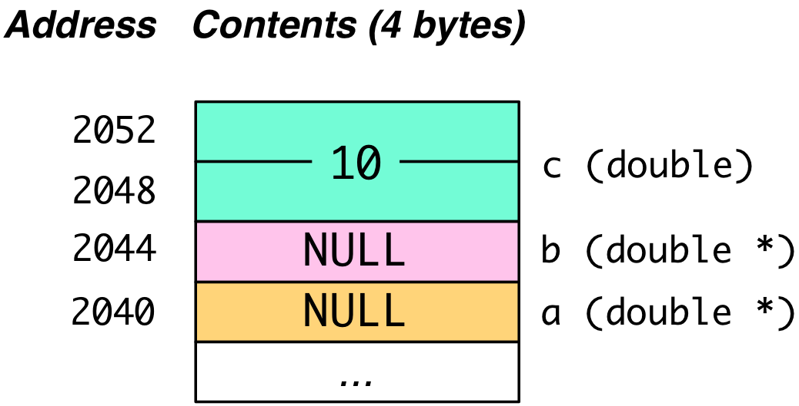
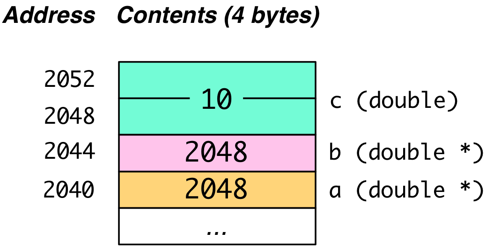
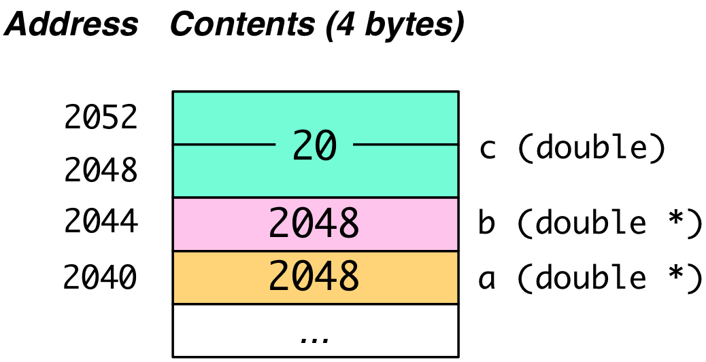

## CS 161 - Intro to Computer Science

### Hwk: Addressing and Pointers

This is the second part of a multi-part primer on C. In this tutorial-assignment, you'll gain an appreciation for the way values and variables are stored in memory. You'll be introduced to pointers, as well as the connection between pointers and arrays.

#### ZyBooks Reading

- Chap 9: pointers

#### Student Outcomes

- To understand how values and variables are stored in memory.
- To be familiar with pointers and references.
- To understand the relationship between pointers and arrays.

#### Instructions

Open your virtual machine, and log in. Open up a Terminal window to the shell. If you don't know what I'm referring to, complete [Hwk 0](../hwk0.vb).

##### Part 1: Understanding Variables - Data Types

A variable is a symbol that is associated with: (a) its data type and (b) its location in memory. To understand pointers, we need to have a grasp on both. We'll start discussion with the former. Consider the following code snippet:

```c
int main() {
    char letter = 'p';
    int days = 365;
    double amt = 90000.75;

    //(more code omitted)
}
```

Although high-level languages like C, Java, etc., hide it from us, the three variables exist somewhere in memory. Let's take a look at a make-believe snapshot of my computer's memory as it runs the code shown above.

You might recall from your architecture class that a **word** is the basic unit of data transfer between memory and CPU. In these tutorials, we'll assume that a word is a block of four contiguous bytes (i.e., 32-bits), though it is worth mentioning that many CPUs now fully support 8-byte words (i.e., 64-bits).

In the figure to the left, only the word's start address is shown, but it should be noted that each byte within the word is also addressable. When a CPU requests the byte located at a certain address, say 1117, the full word ranging from address 1116 to 1119 is retrieved from memory and brought into one of the CPU's registers. The CPU then extracts the desired byte from the word as needed.\
 

**Important Operator: `sizeof()`**
Notice from the figure I drew above that I somehow knew that an `int` takes up four contiguous bytes, a `char` requires just one byte, and a `double` requires eight. The specific space requirements for each data type actually vary across architectures. **So how did I know these storage requirements apply to my computer?** provides an important operator `sizeof()` for this purpose. It inputs the name of a variable, a data type, or an expression, and returns the size in bytes that it occupies. Let's see what it does.

    ```c
    #include <stdio.h>

    int main()
    {
        char letter = 'p';
        int days = 365;
        double amt = 90000.75;
        double nums[10];

        printf("\n*** sizes of data types ***\n");
        printf("size of char: %lu bytes\n", sizeof(char));
        printf("size of short: %lu bytes\n", sizeof(short));
        printf("size of int: %lu bytes\n", sizeof(int));
        printf("size of long: %lu bytes\n", sizeof(long));
        printf("size of float: %lu bytes\n", sizeof(float));
        printf("size of double: %lu bytes\n", sizeof(double));
        printf("size of long double: %lu bytes\n", sizeof(long double));

        printf("\n*** sizes of vars ***\n");
        printf("size of letter: %lu bytes\n", sizeof(letter));
        printf("size of days: %lu bytes\n", sizeof(days));
        printf("size of amt: %lu bytes\n", sizeof(amt));
        printf("size of nums array: %lu\n", sizeof(nums));

        printf("\n*** sizes of constants and expressions ***\n");
        printf("size of 50: %lu bytes\n", sizeof(50));
        printf("size of '#': %lu bytes\n", sizeof('#'));
        printf("size of 54.999: %lu bytes\n", sizeof(54.999));
        printf("size of hello: %lu bytes\n", sizeof("hello"));
        printf("size of 3/2: %lu bytes\n", sizeof(3/2));
        printf("size of 0.5 * 400 / 2: %lu bytes\n", sizeof(0.5 * 400 / 2));

        return 0;
    }
    ```

- When I compile and run it, I get the following output.

  ```
  *** sizes of data types ***
  size of char: 1 bytes
  size of short: 2 bytes
  size of int: 4 bytes
  size of long: 8 bytes
  size of float: 4 bytes
  size of double: 8 bytes
  size of long double: 16 bytes

  *** sizes of vars ***
  size of letter: 1 bytes
  size of days: 4 bytes
  size of amt: 8 bytes
  size of nums array: 80

  *** sizes of constants and expressions ***
  size of 50: 4 bytes
  size of '#': 4 bytes
  size of 54.999: 8 bytes
  size of hello: 6 bytes
  size of 3/2: 4 bytes
  size of 0.5 * 400 / 2: 8 bytes
  ```

1. The integer that is returned by `sizeof()` is the number of bytes required to store that data. A couple other things worth pointing out about the code:

   <!-- - The `%lu` specifier means unsigned long integer, which is what is returned by `sizeof()`. In fact, if you dig into `sizeof()`, you'll see that it actually returns a type called size_t, which is an alias to an unsigned long. -->

   - **Lines 10-17**: We're now introduced to a few more data types (`short`, `long`, `long double`), which are all variants of the four original primitives. These are not unlike their counterparts in Java.

     ```c
     printf("\n*** sizes of data types ***\n");
     printf("size of char: %lu bytes\n", sizeof(char));
     printf("size of short: %lu bytes\n", sizeof(short));
     printf("size of int: %lu bytes\n", sizeof(int));
     printf("size of long: %lu bytes\n", sizeof(long));
     printf("size of float: %lu bytes\n", sizeof(float));
     printf("size of double: %lu bytes\n", sizeof(double));
     printf("size of long double: %lu bytes\n", sizeof(long double));
     ```

   - Line 23: shows how `sizeof()` can be used to determine the size of the array `nums` in bytes: 80, or `(10 * sizeof(double))` bytes.

     ```c
     printf("size of nums array: %lu\n", sizeof(nums));
     ```

   <!-- - Line 27: a character constant is represented as an `int` (4 bytes on my machine). -->

   - Line 28: shows that a hardcoded floating-point constant is treated as a `double`, not a `float`. This is also true in Java.
     ```c
      printf("size of 54.999: %lu bytes\n", sizeof(54.999));
     ```
   - Line 29: the string literal `"hello"` occupies 6 bytes (not 5!), because it includes the terminating `\0` character.

     ```c
     printf("size of hello: %lu bytes\n", sizeof("hello"));
     ```

   - Line 30: holds the result of an integer expression, which is an `int` (same as Java)

     ```c
     printf("size of 3/2: %lu bytes\n", sizeof(3/2));
     ```

   - Line 31: holds the result of a mixed expression, which is a `double` (same as Java)

     ```c
     printf("size of 0.5 * 400 / 2: %lu bytes\n", sizeof(0.5 * 400 / 2));
     ```

2. Important: Remember the `sizeof()` operator; it is important to pointer-arithmetic, and will also be used in a big way when we discuss dynamic memory allocation.

3. One of the benefits of a typed language like C and Java should be somewhat apparent now. When a programmer declares a variable's type, the executable knows exactly how many contiguous bytes to read and write memory. This is in contrast to languages like Python, JavaScript, and PHP, where the type of a variable is allowed to change during runtime, and requires a bit of overhead to interpret, or juggle their storage requirements. This type-juggling overhead accounts for much of the reason why compiled programs usually run faster than interpreted programs.

4. **Practice Questions (not graded):**

   - Although a char requires just one byte of storage, most CPUs will insist on wasting, or "padding" the remaining 3 bytes (see figure above). Why do you think CPUs prefer this, instead of, say, having `amt` start from address 1117 to save space? (Hint: A unit of transfer between memory and CPU is a word...)

   - What is an `unsigned` number? What is the point of an unsigned integer, and when would it be useful? Does Java support unsigned numbers?

   - If a `struct X` element was declared to contain a `char`, a `long`, and an array of 100 `doubles`, what is the size of each instance of `struct X`?

##### Part 2: Understanding Variables - Addressing

We've seen one side of a variable, which is how its value is stored and the number of bytes that its value occupies depending on its data type. The other side to a variable is its **location** in memory. This section focuses on the support for working with a variable's location in C.

1. Let's now consider the code below. Study it before moving on.

   ```c
   char letter = 'p';
   int days = 365;
   double amt = 90000.75;

   int *ptr;       //declare pointer to an int
   ptr = &days;    //point ptr at days
   printf("There are %d days\n", days);
   printf("There are %d days\n", *ptr);

   (*ptr)--;   //decrement days by 1
   printf("There are now %d days\n", days);
   printf("There are now %d days\n", *ptr);

   //print addresses
   printf("Location of days: %p\n", &days);
   printf("Location of ptr: %p\n", &ptr);
   printf("Value of ptr: %p\n", ptr);
   ```

2. In this simplified example, we'll assume that the operating system places `days` in bytes **1112** to **1115**, `letter` in byte **1116**, and `amt` in bytes **1120** to **1127**.\
   

3. Here is an example output when this program is executed.

   ```
   There are 365 days
   There are 365 days
   There are now 364 days
   There are now 364 days
   Location of days: 0x458
   Location of ptr: 0x8A2C
   Value of ptr: 0x458
   ```

4. Let's now go back and explain the source code.

   - On **Line 5**, we see a new kind of variable-declaration syntax

     ```c
     int *ptr;       //declare pointer to an int
     ```

     This declares a new variable named `ptr`, and unlike anything we've seen before, it holds a memory address, which references an `int` value. In other words, `ptr` is a pointer to an integer. Of course, `ptr` is itself a variable that requires storage, and our figure shows that `ptr` itself is located in byte addresses `35372` to `35375`.

   - On **Line 6**:

     ```c
     ptr = &days;    //point ptr at days
     ```

     Recall that the unary operator `&var` determines the address of the variable, `var`. Even though day occupies four bytes because it is an `int`, only the address of the first byte (i.e., **1112**) is returned. Thus, `ptr = &days` will therefore assign address **1112** to `ptr`.

   - **Line 8** introduces an important operation, called **dereferencing**.

     ```c
     printf("There are %d days\n", *ptr);
     ```

     Dereferencing is used when we're interested in the _content_ that is being referenced by `ptr`. If we simply output the value of `ptr`, we'd get **1112**, which is just the location of the value we're actually interested in. Therefore, the objective is to "follow" the pointer to its destination. To do this, C provides the unary dereferencing operator `*var`, where `var` is a pointer variable.

   - On **Line 10**:

     ```c
     (*ptr)--;   //decrement days by 1
     ```

     `ptr` is first dereferenced to get the content `365`. It is then decremented to `364` and written back.

   - On **Lines 15-17**: shows that we can use the output specifier, `%p` to print an address (in hexadecimal).

     ```c
     printf("Location of days: %p\n", &days);
     printf("Location of ptr: %p\n", &ptr);
     printf("Value of ptr: %p\n", ptr);
     ```

     The addresses of `days` (0x458 == 1112) and `ptr` (0x8A2C == 35372) are first printed. This is followed by printing the contents of `ptr`, which unsurprisingly, stores the address of `days`.

   - In the example above, we showed that the `&` operator returns just address of the first byte of `days`, even though `days` also occupies the following three bytes. When we dereference `*ptr` on Lines 8 and 12, the runtime was smart enough to know that the next three bytes are part of the value. Had the program read anymore than three more bytes, we would've gotten a much larger number, and had it read fewer than three bytes, we would've truncated our number. How does our program know that exactly three more bytes (and not zero, or one, or seven) trailed first byte? (Hint: It's why we declare data types!)

##### Practice Problems (not graded)

- We know that a pointer to an int (that is, `int*`) occupies 4 bytes on my machine by calling `sizeof(int*)`. What would the size be for a pointer to a `char`, or a pointer to a `double`, or a pointer to some `struct X` on my machine? (Hint: Does the maximum size of an address ever change?)

- You can also create a pointer to a `void` data type. Do some searching on the web, and figure out what a `void*` pointer means, and why it's useful.

##### Part 3: Pointer Basics

Now that we have a good handle on data types and addressing, let's put everything together. There are three basic C concepts you need to master:

1. Address-of Operator: Given a variable var, `&var` returns the address of var's location in memory.

2. A pointer variable stores the address of some data. This data can be a variable, an array, another pointer... To declare a pointer, you use the following syntax:

   ```c
   dataType *ptr;          //pointer to a dataType
   dataType *ptr1, *ptr2, *ptr3;   //multiple pointers
   ```

   When assigning a pointer q to another pointer p, it causes them both to point to the same data. In Java-speak, they're just references to some data in another location in memory.

   ```c
   double *a = NULL, *b = NULL, c = 10;
   b = &c; //point b at c
   a = b;  //point a at c
   ```

   - Memory contents after the declaration:\
     

   - Memory contents after the assignment statements on Line 2 and 3.\
     

   - `NULL` is just like the null keyword in Java, representing a pointer (or reference) to nothing. You must first `#include <stdlib.h>` to get access to the `NULL` constant.

3. Dereference Operator: Given a pointer ptr, we use `*ptr` to access the value at the location referenced by `ptr`. I know, I know, it's awful. They really should've used a different syntax for dereferencing, because `*ptr` already has a different meaning!
   ```c
   double *a = NULL, *b = NULL, c = 10;
   b = &c; //point b at c
   a = b;  //point a at c
   *b = 15;
   *a += 5;
   ```

- Memory contents after Line 4's assignment statement `*b = 15`.
  

- Memory contents after Line 5.
  

##### Practice Questions (not graded):

- What value does the `NULL` constant hold? Try printing out. What happens to your program when you try to dereference a pointer to `NULL`?

- Write a function `compareAndAssign(int n, int m, int *larger, int *smaller)` that puts the larger of `n` and `m` in `larger` and the smaller value in `smaller`.

##### Important: Output Parameters

1. Consider the following function used to swap the values of two integer variables:

   ```c
   void swap(int *x, int *y) {
     int tmp = *x;
     *x = *y;
     *y = tmp;
   }
   ```

   How would you call this function? Trace execution of calling `swap()` by drawing out the memory contents like you saw in earlier examples.

2. Consider this version of swap:

   ```c
   void swap2(int *x, int *y) {
       int *tmp = x;
       x = y;
       y = tmp;
   }

   //(code omitted)
   //...
   int a = 4, b = 3;
   swap2(&a, &b); //swap?
   ```

   Will this method work? Trace its execution.

3. Consider a final version of swap:

   ```c
   void swap3(int x, int y) {
       int *x_ptr = &x;
       int *y_ptr = &y;
       int tmp = *x_ptr;
       *x_ptr = *y_ptr;
       *y_ptr = tmp;
   }

   //(code omitted)
   //...
   int a = 4, b = 3;
   swap3(a,b); //swap?
   ```

   Will this method work? Trace its execution.

4. **"Output Parameters"**: Try using the first `swap()` method in Java. You'll see that the contents of the variables aren't swapped at all after calling it, but it works in C! It is quite common in C for functions to have so-called "output parameters". An output parameter refers to a pointer that is input into a function, and the function modifies its contents. After the function call, one just needs to deference the pointer to obtain the updated value(s). It's convenient for functions like `swap()`, where there's not really a return value that makes any sense, but we expect some side-effects to occur.

   - You've also seen it in action already with `scanf()`. For example, when `scanf("%d", &var);` is used, we input the address of `var` (i.e., a pointer), and we expect the contents of `var` to have changed afterwards.

   - Output parameters are quite dangerous, but useful. I strongly recommend that you clearly name and comment when a parameter is an output parameter. For instance (it's not pretty):

     ```c
     void sum(int inX, int inY, int* outSum) {
       *outSum = inX + inY;
     }
     ```

   - In practice you might even see functions written like this:

     ```c
     void sum(
       int x,    /* IN */
       int y,    /* IN */
       int* sum  /* OUT */
       ) {
       *sum = x + y;
     }
     ```

   - Here's another example:

     ```c
     #include <stdio.h>

     typedef struct Student {
     float gpa;
     char name[25];
     } Student;

     /**
     * Clears a GPA to 0
     * @param gpaOut (OUT) A pointer to the GPA to be cleared
     */
     void clearGPA(float *gpaOut) {
       //de-reference pointer, clear the value
       *gpaOut = 0.0;
     }

     int main() {
       Student stu;

       printf("Enter a name: ");
       scanf("%s", &stu.name);  //value expected in stu.name
       printf("Enter a GPA: ");
       scanf("%f", &stu.gpa);

       printf("Name: %s, GPA: %.2f\n", stu.name, stu.gpa);
       clearGPA(&stu.gpa);  //stu.gpa gets cleared
       printf("Name: %s, GPA: %.2f\n", stu.name, stu.gpa);

       return 0;
     }
     ```

     ```
       Enter a name: David
       Enter a GPA: 4.0
       Name: David, GPA: 4.00
       Name: David, GPA: 0.00
     ```

#### Grading

```

This assignment will be graded out of 20 points:

[1pt] Appropriate constants have been defined

[1pt] Array(s) and strings are created using a constant size

[3pt] Your program is multi-file, contains multiple well-defined functions.
A Makefile must be included with all and clean targets defined.

[5pt] Your program handles multiple-word inputs

[4pt] Your program updates counts and histogram appropriately

[3pt] Your program prints a vertical (not horizontal) histogram

[1pt] Basic error checking is handled, such as entering invalid menu options.

[1pt] Your program runs repeatedly until sentinel inputs are entered

[1pt] Your program observes good style and commenting.

```

#### Submitting Your Assignment

After you have completed the homework, use the following to submit your work on Canvas. I assume you wrote your program inside your virtual machine. There are two options to submit your work.

1. If you pushed all your code to a Github repository. Make sure your repo is public, and simply submit the URL to your repo on Canvas.
2. If you'd rather submit a "zipped" file on Canvas, do the following:

   - From the Terminal in your virtual machine,
   - Navigate to the directory that contains your homework directory.
   - Zip up your homework directory: `tar -czvf <file_name>.tar.gz <homework_dir>`

     - For example, if my homework directory is called `hwk1/`, and I want the zipped file to be called `hwk1.tar.gz`, use: `tar -czvf hwk1.tar.gz hwk1/`
     - You can un-zip this file later using: `tar -xzvf <file_name>.tar.gz`

   - Navigate to our course on Canvas, and find the assignment submission box.

   - Click on Submit Assignment, and you should be able to "browse" for your file

   - When you've selected the proper file, click Submit Assignment again to upload it.

3. You may submit as often as you'd like before the deadline. I will grade the most recent copy.

#### Credits

Written by David Chiu. 2022.

```

```

```

```
