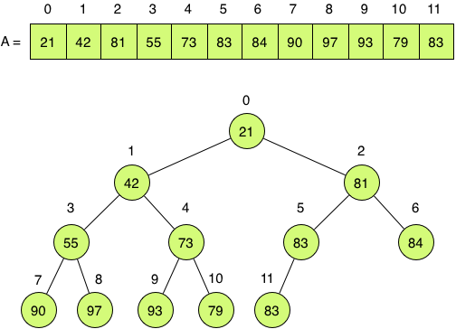
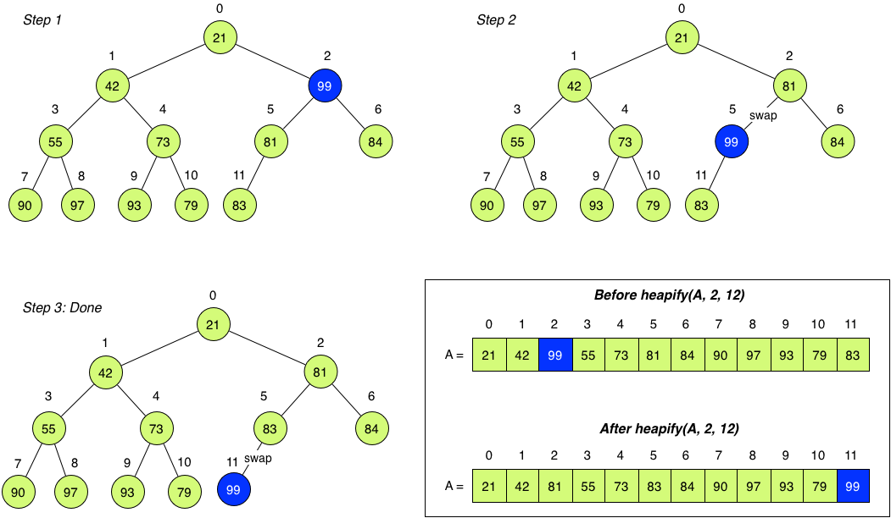

## CS 475 - Operating Systems

### Hwk 1: Sorting


#### Related Reading

- [Dive into Systems Chapter 2.1-2.3](https://diveintosystems.org/book/C2-C_depth/index.html)


#### Instructions

Open your VS Code and get connected to your Remote Development environment. If you don't know what I'm referring to, complete [Hwk 1](../hwk1.vscode).

  - Once you're logged in, you can open a terminal from the `Terminal` menu.


##### Assignment: HeapSort (Graded)

Your tasked with providing a list of employees sorted in _descending_ order of their salaries. Luckily, you remember Heapsort from your Algorithms or CS II class, and decide to use it...

Heaps are a projection of a balanced binary tree onto arrays. They serve many purposes, but are perhaps most well known as the basis for Heapsort. Heaps are also the backbone for Priority Queues, an important data structure which finds uses in many applications (including in OS). Your goal is to implement Heapsort using a min-heap. A min-heap is an array of n elements `A[0]`,...,`A[n−1]` that can be viewed as a binary tree (not necessarily a binary search tree), with the following properties:

- The root of the heap is `A[0]`.
- For an array index `i`,
  - `parent(i) = (i-1)/2` (except for the root, which has no parent)
  - `left_child(i) = 2(i+1)−1`
  - `right_child(i) = 2(i+1)`
- The _min-heap property_: Every node's value must be less-than-or-equal-to the value of its children. That is, `A[parent(i)] <= A[i]` for all `i`. The figure below shows an example of a min-heap of size 12.

   

###### Starter Code

Starter code for this assignment is provided on the github repo. You are not required to submit your code to me on Github, but it's strongly recommended that you do.

- **This step is imperative:** Login to github, and go here: [https://github.com/davidtchiu/cs475-hwk2-heapsort](https://github.com/davidtchiu/cs475-hwk2-heapsort). Choose to _*fork*_ this repository over to your github account to obtain your own copy. Copy the Github URL to _your_ newly forked project. Then follow the rest of the instructions below. From your VS Code remote development environment, open a terminal, and _*clone*_ your forked Github repo down to your local working directory using:

  ```
  git clone <your-github-url-for-this-project>
  ```


- This should download the starter code in a directory called `cs475-hwk2-heapsort`. After you've done this, you can work freely from VS Code or any other editor. You should see these files inside your new homework directory:

###### Working Solution

I have included a working solution of my program along with the starter code. The binary executable file is called `heapsortSol`. You can run it from the terminal by first navigating in to the Hwk directory and typing the command `./heapsortSol`.

###### Program Requirements

1. Inside the project directory, you should find the following files:

   - `Makefile`
   - `employee.h` contains the definition of the Employee struct
   - `heap.h` contains the function declarations related to the heap
   - `heap.c` contains the stubs for the functions defined in `heap.h`
   - `main.c ` contains the `main()` function

2. Implement the following functions inside `heap.c`:

   - `void heapify(Employee *A, int i, int n)`: This function inputs a pointer to an array
     `A`, an index `i`, and the size of the array `n`. The function assumes the trees that rooted at
     `left_child(i)` and `right_child(i)` already satisfy the min-heap property, but that `A[i]`
     may be larger than its children. This function should trickle `A[i]`
     down in place such that the tree rooted at `i` satisfies the min-heap property.

     In the figure below, you can see how `heapify()` works. Here, `A[2]` violates the min-heap property, and a call to
     `heapify(A, 2, 12)` is made to produce the following:

      

   - In Step 2, the out-of-place element `A[2]` is swapped with the smaller of the two children, `A[5]`. However, the tree rooted at
     `A[5]` no longer satisfies min-heap property. Thus, a recursive call to heapify on
     `A[5]` corrects the subtree. You should therefore recursively correct the subtrees until you hit a leaf.

   - `void buildHeap(Employee *A, int n)`: Given a pointer to an array
     `A` of size `n`, this function will leave the tree rooted at `A[0]` satisfying the min-heap property. Because leaf nodes trivially satisfy the property, only the non-leaf nodes need to be heapified. It's pertinent to know that the last non-leaf node is located at
     index `n/2`. Run `heapify()` on `A[n/2]` down to `A[0]`.

     The before-and-after of this function call is shown below:

      

   - `void swap (Employee *e1, Employee *e2)`: Inputs pointers to two Employees, and swaps them.

   - `void printHeap(Employee *A, int n)`: Prints all values in the array referenced by pointer `A`.

   - `void heapsort(Employee *A, int i, int n)`: This function inputs a pointer to an unsorted array of Employees and the size of that array and sorts it in descending order of their salary. Here's the sketch:
     ```
     Build min-heap over A
     Repeat the following until n < 0:
       Swap root of heap with element n−1.
       Now smallest element is sorted into place.
       Heapify up to element n−1
       Decrement n by 1
     ```

3. Implement the following inside `main.c`:

   - Define a constant called `MAX_EMPLOYEES` that will serve as the maximum length of your array.

   - `int main()`: The driver function should create an array of `MAX_EMPLOYEES` elements, and fill it with values from the user. Below, a sample interaction for `MAX_EMPLOYEES` of 5.

4. Here's a sample output:

   ```
   Name: David
   Salary: 60000

   Name: Gabe
   Salary: 75000

   Name: Katie
   Salary: 92000

   Name: Gabe
   Salary: 40000

   Name: Joan
   Salary: 86000

   [id=Katie sal=92000], [id=Joan sal=86000], [id=Gabe sal=75000], [id=David sal=60000], [id=Gabe sal=40000]
   ```

#### Grading

```
This assignment will be graded out of 20 points:

[1pt] Appropriate constants have been defined.
[6pt] Heapify is properly implemented.
[6pt] BuildHeap is properly implemented to build a min-heap.
[6pt] Heapsort sorts employees by descending order of their salary.
[1pt] Your program receives user-input, and does basic error checking.
[1pt] Your program observes good style and commenting.
```

#### Submitting Your Assignment

1. Commit and push your code to your Github repo. Make sure your repo is public (or private and accessible by me).

2. On canvas, simply submit the URL to your Github repo. No other form of submission is accepted.


#### Credits

Written by David Chiu. 2022.
