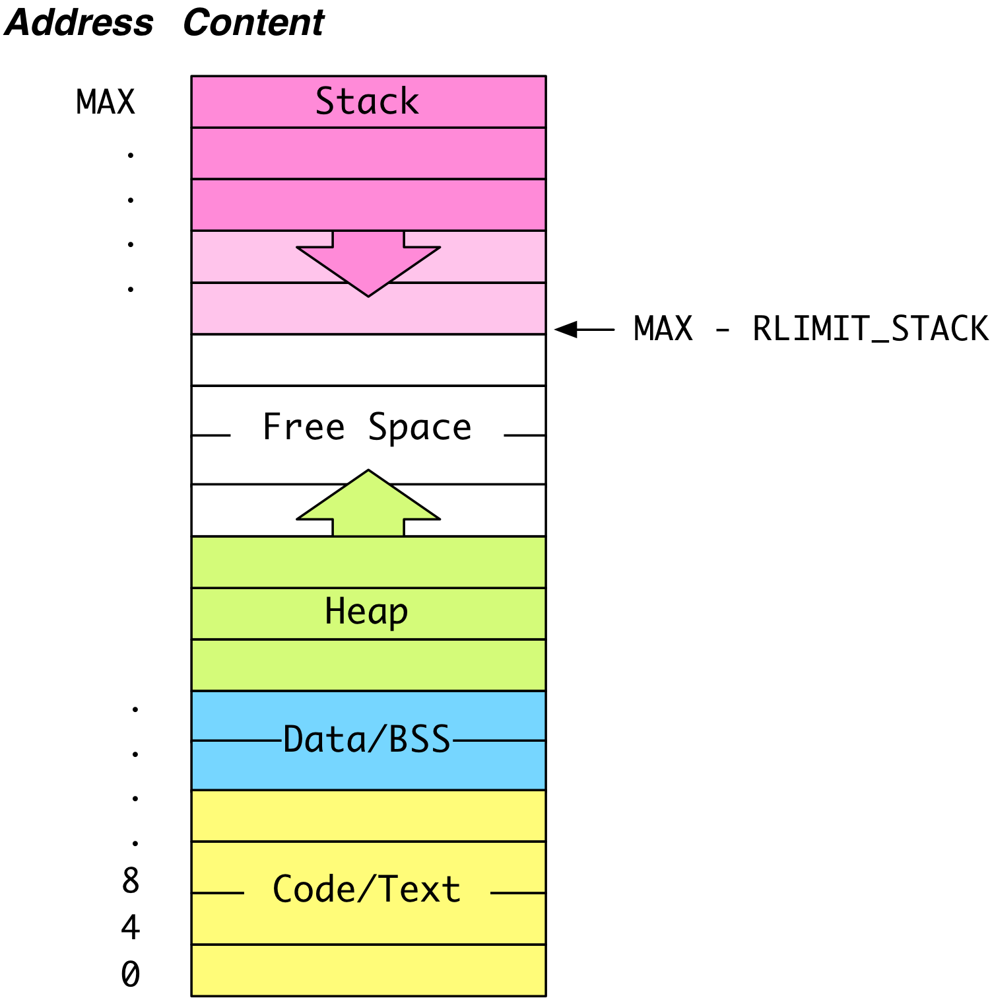

## CS 475 - Operating Systems

### Hwk: Dynamic Memory Allocation

Pointers are still a bit mysterious, because we still haven't seen the need for them yet. Indeed, with exception to `swap()`, all the previous code examples can be done easily without pointers. In this section, we introduce the prevailing motivation for pointers: dynamic memory allocation.

#### ZyBooks Reading

- Chap 10.5 - 10.12: pointers

#### Student Outcomes

- To understand the motivation for dynamic memory allocation.
- To become familiar with memory management functions:`malloc()`, `realloc()`, and `free()`.
- To make system calls.

#### Instructions

Open your VS Code and get connected to your Remote Development environment. 

  - Once you're logged in, you can open a terminal from the `Terminal` menu.

##### Part 1: Motivation

Using the last primer as a motivating example, recall that we stored a fixed-size array (heap) of Employees, whose information was entered by the user. But in general, the number of employees we need to store is not known until runtime. To deal with this issue, we define the max number of employees `MAX` as a constant, and then we ask the user for the number of employees they expect to have in this particular run:

```c
#include <stdio.h>
#include "employee.h"

#define MAX 100000

int getNumEmployees() {
    int num;
    do {
        printf("Number of employees you need to store: ");
        scanf("%d", &num);
    } while (num > MAX || num <= 0);
    return num;
}

int main(int argc, char *argv[]) {
    int i;
    Employee my_employees[MAX];             // create array to hold 100,000 employees
    int num_employees = getNumEmployees();  // how many does the user *really* need?

    // fill employee info
    for (i = 0; i < num_employees; i++) {
        //(code omitted)
    }
}
```

**The code above is undesirable for several reasons.** First, `MAX` is entirely arbitrary and defined at the programmer's discretion. Second, a company can never have more than `MAX` employees: the program would either not run, or will fail when a user tried to start with more. Third, for the runs that do not require anywhere close to
MAX employees, this program ends up wasting quite a bit of space.

Okay. You might think the above example seems contrived. After all, why didn't we ask the user for the number of employees first, and then create the array using that size. Consider the following code:

```c
#include <stdio.h>
#include "employee.h"

int getNumEmployees() {
    int num;
    do {
        printf("Number of employees you need to store: ");
        scanf("%d", &num);
    } while (num <= 0);
    return num;
}


int main() {
    // Just ask for the array size first
    int num_employees = getNumEmployees();
    Employee my_employees[num_employees]; // just create an array that holds num_employees

    // (code omitted)
}
```

While it's true that this code works in Java, **this code is even less desirable than the one before it!** It may crash the C program at unexpected times! It's really important to understand why (stack overflow), so we need to have a handle on how the OS manages a process' memory during execution.

##### Part 2: Address Spaces

When your program is in execution (known as a **process**), the OS gives it a virtual address space. Think of this space as the process' very own sandbox. It's where all its resources (variables, open files, etc.) will live. We'll assume that the OS organizes and orders the address space in the following **segments**:



- **Code (Text) Segment** stores the binary (executable file) currently running. It is placed near the lowest address.

- **Data Segment** stores global and static variables that have been initialized with a non-zero or non-NULL value. The related BSS segment stores uninitialized global and static variables.

- **Heap** stores data allocated by the process during runtime (i.e. with `malloc()` or `calloc()` in C and with new operator in C++ and Java). It grows "upward"

- **Program Stack** stores data (e.g., local variables, function parameters, return addresses) needed to keep track of program execution and scope of function calls. It is placed at the top of the address space, and grows "downward".

###### How the Program Stack Works (And What Is a Stack Overflow?)

When a process is created, the OS allocates `RLIMIT_STACK` bytes for the stack in that process' address space. A user cannot increase this stack size, but can decrease it. Here's how the stack is used:

- From `main()`, where the program starts running, its command-line arguments and local variables are pushed onto the stack, which grows downwards towards the address `MAX - RLIMIT_STACK`. This data, together with the return address make up what is known as `main()`'s *stack frame*. When `main()` calls another method, a new stack frame is created, and its return address, arguments, and local variables are pushed onto the stack. When a function returns, all the data in its frame are popped off the stack, and we jump back to the return address that was also pushed on, thus restoring the caller's **scope**.

- **Stack Overflow**: The stack is allowed to grow and shrink so as long as it stays within the bounds imposed by `RLIMIT_STACK`. Unfortunately, violating this threshold is all too easy. Take a look at the following example, which contains an infinite recursion:

  ```c
  #include <stdio.h>

  void f(int depth) {
      printf("depth = %d\n", depth);
      f(depth+1);
  }

  int main() {
      f(1);
      return 0;
  }
  ```

- Unlike a program that gets stuck in an infinite loop, programs infinite recursions _will_ eventually crash. Let's check why. Let's see the output of a run of this program:

  ```c
  ...
  depth = 393031
  depth = 393032
  depth = 393033
  depth = 393034
  depth = 393035
  Segmentation fault
  ```

- The dreaded **segmentation fault**, a historical umbrella term that means your program tried to access an invalid memory location in its address space. In this particular example, each call to `f(..)` involves pushing the return address followed by pushing int depth on the stack. The stack breaches the `RLIMIT_STACK` limit with the *393036th* recursive call to `f(..)`. When the program tries to push a frame beyond that threshold, the memory-management unit of the OS detects this problem and throws the segmentation fault. The OS kills the offending process, causing it to crash.

  - Indeed, an infinite recursion always crashes the program because the program continues to use up space (on the stack). In contrast, an infinite loop might not eat up stack frames, and that's probably why you've rarely seen an infinite loop be terminated by the OS.

<!-- - What's my machine's `RLIMIT_STACK` you ask? This value varies across systems. To find out what this value is on your machine, you can use the shell command `ulimit`. The `-a` option shows all resource limits defined by your OS. If you're only interested in the stack size, you can specify the `-s` flag.

  ```
  $ ulimit -s
  10240
  ```

- The number reported by `ulimit` is in KB ($$2^{10}$$ bytes), so my machine gives each running process a 10MB stack. -->

##### Part 3: Revisiting the Problem of Unknown Array Sizes at Runtime

Now that we understand how the stack is managed, we return to the original problem of dealing with array sizes that are unknown until runtime. Here's the problematic code we saw earlier:

- The problem is on **Line 19**:

    ```c
    Employee my_employees[num_employees];
    ```

  If the user entered a large enough number for `num_employees`, a segmentation fault can occur when the runtime tries to push an `Employee` array of that size onto the stack.

- Check out the output for the following two runs:

  ```
  $ ./employees
  Number of employees you need to store: 2
  Enter a name: David
  Enter salary: 30000

  Enter a name: Michelle
  Enter salary: 40000

  [name=Michelle, sal=40000], [name=David, sal=30000]
  ```

  ```
  $ ./employees
  Number of employees you need to store: 2000000
  Segmentation fault
  ```

  The first time I run the program, I only needed to create two `Employee` objects, which fits on the stack without issue. Thinking my program can scale, the second run, I create two million `Employees`, but the program crashes immediately due to stack overflow.

- Clearly, a program that crashes depending on an arbitrary input should be avoided, and is why you should avoid creating unknown-sized arrays on the _stack_. That foreshadows a different location that can store arbitrarily-sized structures.

##### Part 4: Heap to the Rescue!

- To deal with the stack-overflow problem, we need to allocate unknown-sized memory off the stack, in some large, free area of memory. The **Heap** segment in the address space serves this  purpose. Instead, when we need a new array, struct, string, etc., during runtime, we'll create a pointer on the stack to refer to some location on the **heap** where this potentially large structure will reside.

- In fact, allocating memory on the heap is actually what Java does every time the `new` keyword is used to create an Object. In this section, we'll see how C supports memory allocation (and deallocation) on the heap.

- There are four important memory allocation functions you should know. To gain access to them, we need to first `#include <stdlib.h>`. These functions are:

  1.  `void* malloc(size_t size)`: allocates `size` contiguous bytes on the heap, and returns a pointer to the first byte. Note that `size_t` is just a `typedef` alias to `unsigned int`. Importantly, because the returned pointer is `void *`, the programmer must cast it to the desired data type before dereferencing (think the generic `Object` type in Java). On failure, `NULL` is returned.

  2.  `void* calloc(size_t num, size_t size)`: is an alternative function to  `malloc()`. It takes as input an unsigned integer `num` (number of elements) and `size` (number of bytes per element). It attempts to allocate `num * size` bytes on the heap. One difference from `malloc()` is that it will also initialize the entire allocated block to zeroes. On success, it returns a `void*` pointer to the first byte of the newly allocated block. On failure, `NULL` is returned.

  3.  `void* realloc(void *ptr, size_t size)`: is used to change the size of an already-allocated block of memory on the heap. It takes as input a generic `void*` pointer to a block of memory, and a new `size`, which may be smaller or larger than the current allocation. On failure, `NULL` is returned. Caveat: the location of the allocated block might change, which is why a `void*` pointer to a potentially different starting address is returned.

  4.  `void free(void *ptr)`: is used to deallocate, or free-up, the space that was previously allocated on the heap. It takes as input a pointer to the already-allocated memory block, and returns nothing. Important! It is extremely important to free up memory when it is no longer being used (Unlike Java, C does not garbage collect user-allocated memory automatically). When a user fails to free up un-used space, it leads to memory leaks, which can be very hard to track down after the fact.

- As an exercise, let's see how I could refactor the problematic employee code so that it allocates the array on the heap.

  ```c
  #include <stdio.h>
  #include <string.h>
  #include <stdlib.h> //for malloc(), free(), ...
  #include "employee.h"

  int getNumEmployees() {
    int num;
    do {
       printf("Number of employees you need to store: ");
       scanf("%d", &num);
    } while (num <= 0);
    return num;
  }

  int main() {
    int num_employees = getNumEmployees();
    Employee *my_employees = (Employee*) malloc(num_employees * sizeof(Employee));  // on the heap!

    //fill employee info
    int i;
    for (i = 0; i < num_employees; i++) {
        strcpy(my_employees[i].name, getName());
        my_employees[i].salary = getSalary();
    }

    //(code omitted)

    free(my_employees); // deallocate space after we're done!
    return 0;
  }
  ```

- In the code:

  - On **Line 3**: the `stdlib.h` library is imported to gain access to memory allocation functions.

  - On **Line 17:** there's a lot of information on this line. Let's break it up into pieces and talk about each one separately.

      ```c
      Employee *my_employees = (Employee*) malloc(num_employees * sizeof(Employee));  // on the heap!
      ```

    Remember the goal is to create an array that contains `num_employees` elements of `Employee`. Therefore, we need to use `malloc()` to request `num_employees * sizeof(Employee)` bytes on the heap.

    - For example, assume that the `Employee` struct is declared as follows:

      ```c
      #define MAX_NAME_LEN 16

      typedef struct Employee {
          char name[MAX_NAME_LEN];
          int salary;
      } Employee;
      ```

    - Then `sizeof(Employee) == 20` because `name` is a char array of length 16 and `salary` is an 4-byte integer. Therefore, `malloc()` is going to try to allocate a block of `num_employees * 20` bytes on the heap, and return the address of the first byte of this block.

    - Next, we cast whatever `malloc()` returns to a pointer to Employee, `(Employee*)`. Remember that `malloc()` is type-agnostic; it doesn't care about what kind of data you intend to store in the newly allocated memory. Therefore, it returns a `void*` pointer, which means we need to cast it into the desired pointer type. Without the cast, C wouldn't know what the byte boundaries are for each `Employee` object to do pointer-arithmetic. Furthermore, it wouldn't be able to associate `.name` with the first 16 bytes, and `.salary` with the last four bytes.

  - On **Line 21-25**:

    ```c
    //fill employee info
    int i;
    for (i = 0; i < num_employees; i++) {
        strcpy(my_employees[i].name, getName());  // assign the name using strcpy()
        my_employees[i].salary = getSalary(); // assign the salary
    }
    ```

    Remember from the previous primer that we learned the array-index syntax `my_employees[i]` is really a short-hand for `*(my_employees+i)`? Because of the earlier cast, C knows to skip `sizeof(Employee) == 20` bytes every time `i` is incremented. How convenient that we can use the array-index syntax in this context to dereference each 20-byte block as an `Employee`!

  - On **Line 30 (important word on Garbage Collection)**: This line _frees_ up the `num_employees * sizeof(Employee)` bytes off the heap, so that the space can be reclaimed and used by another part of the process. Be careful! After freeing it, `my_employees` now points to an invalid address. If you try to dereference `my_employees` now (as in Lines 21-25), you'll receive a **segmentation fault**!

    - If your program doesn't free up memory that's no longer being used, then the memory remains allocated on the heap! You can never reclaim this memory because there are no longer any pointers referencing its location.

    - This is called a **memory leak**, which will cause your program to eat up increasing amounts of memory over time, sucking up system resources.

    - While "garbage collection" is automatically handled by many modern languages like Java, we don't have that luxury in C! It is completely up to the programmer to decide when free memory from the heap. Be sensitive to this when programming!

##### Part 4: Dynamic Memory Allocation

All right, so we've seen how to create an array on the heap, but still, this is assuming that the user would at some point know the size of the array. But `malloc()` is more general than that. It can be used to allocate _any_ amount of memory on the heap, even a single `int`, `double`, or `struct`. It all simply depends on what _data type_ the programmer can casts the returned `void*` pointer into.

In the code below, we use `malloc()` to create 4 bytes (`sizeof(int)`) on the heap. `malloc()`, as always will return the address of the 0th byte that it allocated. We then tell C to interpret the 4 bytes as an `int` by simply casting the address into an `int*` pointer, which is then stored in `p`.

```c
int *p = (int*) malloc(sizeof(int));
*p = 0; // initialize the content referred by p to 0
```

The true strength of `malloc()` lies in allowing us to create and manage dynamic data structures that are unbounded in size, like linked lists and trees. Assume we've declared the following `struct` for a Linked List node:

```c
/** Here's a node for a linked list, say */
typedef struct Node {
    int data;
    struct Node *next;
} Node;
```

We can also use `malloc()` to create a single `struct` element, as follows.

```c
// here's how to construct a Node element
Node *newNode = (Node*) malloc(sizeof(Node));

// here's how to initialize it (note the '->' operator!!!!)
newNode->data = 0;
newNode->next = NULL;
```

Notice the new operator `->` that can be used to access pointers to `struct`s. It automatically dereferences the pointer. The alternative way to access `data` and `next` was to use the dereferencing operator and dot-notation, as follows:

```c
(*newNode).data = 0;
(*newNode).next = NULL;
```

The arrow (->) operator provides a cleaner syntax, and is generally used for dereferencing members in struct pointers!

##### Example: Binary Search Trees (BST)

Having taken CS 261, I'm assuming that you have a working knowledge of BST's properties, so I won't be spending time describing the actual algorithms. The important thing is that you understand the implementation details in C.

1. Download BST project:

   ```
   git clone https://github.com/davidtchiu/cs475-hwk3-bst-example
   ```

2. Structs: We'll assume for simplicity that a BST node holds an integer key, and has pointers to a left and right child nodes. Open up the header file `bst.h`:

   ```c
   /**
   *  Each BST node has an integer key,
   *  and pointers to its parent, left child, and right child.
   */
   typedef struct BSTNode {
       int key;
       struct BSTNode *parent; //pointer to parent
       struct BSTNode *left;   //pointer to left childs
       struct BSTNode *right;  //pointer to right child
   } BSTNode;

   /** BST struct stores just a pointer to the root node */
   typedef struct BST {
       BSTNode *root;  //pointer to root of tree
   } BST;
   ```

3. Insertion:

   ```c
   /**
    * Creates a new BSTNode holding val, then inserts val into tree rooted at root
    * @param root  Pointer to a binary search tree
    * @param val   Value to be inserted
    */
   void insert(BST *tree, int val) {
       //create and initialize new node
       BSTNode *newNode = (BSTNode*) malloc(sizeof(BSTNode));
       newNode->key = val;
       newNode->left = NULL;
       newNode->right = NULL;

       //find node to attach newNode
       if (tree->root == NULL) {
           tree->root = newNode;
       }
       else {
           //loop to find where to insert the new node
           BSTNode *currentNode = tree->root;
           BSTNode *parentNode = NULL;
           while (currentNode != NULL) {
               parentNode = currentNode;
               if (key > currentNode->key) {
                   currentNode = currentNode->right;   //descend down right subtree
               }
               else {
                   currentNode = currentNode->left;    //descend down left subtree
               }
           }
           //link up newNode
           if (key > parentNode->key) {
               parentNode->right = newNode;
           }
           else {
               parentNode->left = newNode;
           }
       }
   }
   ```

   - On **Line 8**: creates a `BSTNode` on the heap, referenced by `newNode`.

   - On **Lines 9-11 (Important)**:  the arrow syntax I introduced earlier. The arrow syntax is used to access data members referenced by a `struct` pointer. Its syntax `p->val` is just a short-hand for `(*p).val`.

   - On **Lines 14-16**: is the trivial case where there is no root node. We simply set the `newNode` as the tree's root.

   - On **Lines 18-29**: iterates to search for the node (`parentNode`) to insert `newNode` under.

   - On **Lines 30-36**: inserts `newNode` as a child under the `parentNode`.

4. Freeing up memory. Recall from earlier that garbage collection is super important to avoid **memory leaks**. For instance, if we were writing the `remove()` function, you'll need to remember to `free()` the `BSTNode` being deleted. In this example below, we want to clear everything off the existing tree.

   ```c
   /**
    * Frees up space allocated by BST
    * @param tree Pointer to the tree
    */
   void freeTree(BST *tree) {
       freeTreeNode(tree->root);
   }

   /**
    * Recursive helper function
    */
   void freeTreeNode(BSTNode *node) {
       if (node != NULL) {
           if (node->left == NULL && node->right == NULL) {     //leaf
               printf("Freeing %d\n", node->key);
               free(node);
           }
           else {   //non-leaf node
               freeTreeNode(node->left);
               freeTreeNode(node->right);
               printf("Freeing %d\n", node->key);
               free(node);
           }
       }
   }
   ```
<!-- 
###### Do these exercises (not graded):

1. Implement `int min(BST *tree)` and `int max(BST *tree)`, which input a pointer to the `BST` and returns the min and max values in the BST, respectively.

2. Implement `int treeSum(BST *tree)`, which inputs a pointer to the `BST`, adds up all the node values and returns the sum.

3. Implement `void printInOrder(BST *tree)`, which inputs a pointer to the `BST` and uses in-order traversal to print all values in ascending order.

4. Implement `void delete(BST *tree, int key)`, which inputs a pointer to the `BST`, and deletes the node with the given value. Remember to `free()` up the deleted node. (Remember from your CS II course that there are 3 cases to handle.) -->

##### Assignment: ls2 -- A Recursive `ls` (Graded)

1. As you know,  the `ls` (when given no other command-line arguments) command lists all files and directories in your current working directory, `.`. Your task is to write a recursive version of the `ls` command so that it not only lists all files/directories in the current working directory, but also traverses all subdirectories. Name your program `ls2`, and it should run in *two modes*:

  - **Mode 1:** The first mode runs when the user does not pass in a command-line
  argument to `main()`. It should recursively show all files' name and size (in bytes) and
  descend down all subdirectories. You do not need to worry about displaying anything
  other than regular files and directories.
  
  - **Mode 2:** The second mode runs when the user passes a single command-line argument,
  `filename`. Your program should only show files with names exactly matching the given `filename`. It should also include all the directories (and subdirectories) that contain files with names matching the given argument. The program should avoid showing the directory chain if the file is not found in its subdirectory.

2. You will want to check out the following Unix system calls for C through `#include <unistd.h>`:
  `opendir()`, `readdir()`, `chdir()`, `closedir()`, and more.
    - When you read the contents of a directory, ignore any references to `.` and `..`

3. To test what a file actually is (a regular file? a link? a directory?) and to get information on the file (how big is it?) you'll want to look into using `lstat()` provided in `#include <sys/stat.h>` 
    - [sys/stat.h](https://pubs.opengroup.org/onlinepubs/007908799/xsh/sysstat.h.html)
    - Note that the second parameter of `lstat()` accepts an *output parameter* (remember what those are from the previous assignment?), where it will store a `struct` with the file/directory's information.
      - One of the fields in the output struct is a `mode_t st_mode`. You can run the following tests on this field to check if the file that you `lstat()`ed is a *regular file* or a *directory* using `IS_REG(mode_t m)` and `IS_DIR(mode_t m)` functions respectively. You can ignore all other types of files.

4. One decision you'll need to make that is related to dynamic memory allocation is how to store the list of strings that you'll eventually need to print out. This is particularly the case for running **mode 2** of your program, where a non-match of a file in any subdirectory means you wouldn't want to print the parent directories either!
    - You could, for instance, create a linked list of strings using a new `struct` that you define (akin to my BST example), or perhaps just simply a resizable array of strings would do? 
    - I'll leave the choice up to you, but don't forget to `free()` everything up that you `malloc()` as soon as you're done using that memory!

5. Other header files you may want to look into before getting started on this assignment:
    - [dirent.h](https://pubs.opengroup.org/onlinepubs/7908799/xsh/dirent.h.html) for `DIR` type for representing a directory stream.
    - [sys/types.h](https://pubs.opengroup.org/onlinepubs/009695399/basedefs/sys/types.h.html) for `mode_t`.

6.  Your `ls2` program only needs to list the files in the current working directory. That is, you do not have to give it an argument to recursively list files in any arbitrary directory. 

##### Sample outputs:

Mode 1 example. No command-line argument.
```bash
$ ./ls2
ls2.c (930 bytes)
ls2.exe (23022 bytes)
Asmt1/ (directory)
    simCache.c (1342 bytes)
    simCache.exe (34981 bytes)
    JavaDir/ (directory)
        simCache.java (987 bytes)
        simCache.class (43222 bytes)
    FunDir/ (directory)
        moo.exe (4567876 bytes)
        bark.exe (432 bytes) 
        meow.txt (77337733 bytes)
        simCache.exe (34981 bytes)
Asmt4/ (directory)
```

Mode 2 example for `ls2 simCache.exe`:

```bash
$ ./ls2 simCache.exe
  Asmt1/ (directory)
    simCache.exe (34981 bytes)
    FunDir/ (directory)
        simCache.exe (34981 bytes)
```

#### Grading

```
This assignment will be graded out of 20 points:
[5pt] User input is properly handled.
[2pt] Negative operands are properly handled.
[4pt] push() is dynamically allocates a stack element and pushes it on the top of the stack.
[4pt] pop() removes the top element, returns the stored value, and is free from memory leaks.
[1pt] size() returns the the number of elements on the stack.
[4pt] RPN algorithm is properly implemented.
```

#### Submitting Your Assignment

After you have completed the homework, use the following to submit your work on Canvas. I assume you wrote your program inside your virtual machine. There are two options to submit your work.

1. If you pushed all your code to a Github repository. Make sure your repo is public, and simply submit the URL to your repo on Canvas.

2. If you'd rather submit a "zipped" file on Canvas, do the following:

   - From the Terminal, navigate to the directory that contains your homework directory.
   - Navigate to the directory that contains your homework directory.
   - Zip up your homework directory: `tar -czvf <file_name>.tar.gz <homework_dir>`

     - For example, if my homework directory is called `hwk3/`, and I want the zipped file to be called `hwk3.tar.gz`, use: `tar -czvf hwk3.tar.gz hwk3/`
     - You can un-zip this file later using: `tar -xzvf <file_name>.tar.gz`

   - Navigate to our course on Canvas, and find the assignment submission box.

   - Click on Submit Assignment, and you should be able to "browse" for your file

   - When you've selected the proper file, click Submit Assignment again to upload it.

3. You may submit as often as you'd like before the deadline. I will grade the most recent copy.

#### Credits

Written by David Chiu. 2022.
