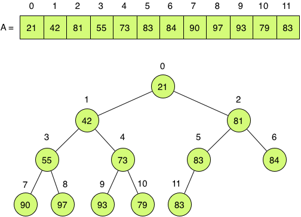
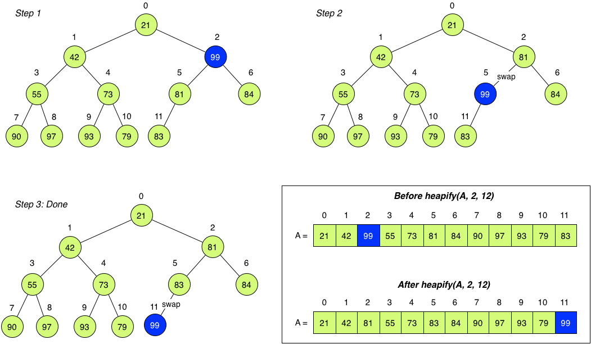

## CS 161 - Intro to Computer Science

### Hwk: Dynamic Memory Allocation

Pointers are still a bit mysterious, because we still haven't seen the need for them yet. Indeed, with exception to `swap()`, all the previous code examples can be done easily without pointers. In this section, we introduce the prevailing motivation for pointers: dynamic memory allocation.

#### ZyBooks Reading

- Chap 10.5 - 10.12: pointers

#### Student Outcomes

- To understand process address space.
- To understand the motivation for dynamic memory allocation.
- To become familiar with memory management functions:`malloc()`, `realloc()`, and `free()`.

#### Instructions

Open your virtual machine, and log in. Open up a Terminal window to the shell. If you don't know what I'm referring to, complete [Hwk 0](../hwk0.vb).

##### Part 1: Motivation

Using the last primer as a motivating example, recall that we stored a fixed-size array (heap) of Employees, whose information was entered by the user. But in general, the number of employees we need to store is not known until runtime. To deal with this issue, we define the max number of employees `MAX` as a constant, and then we ask the user for the number of employees they expect to have in this particular run:

```c
#include <stdio.h>
#include "employee.h"

#define MAX 100000

int getNumEmployees() {
    int num;
    do {
        printf("Number of employees you need to store: ");
        scanf("%d", &num);
    } while (num > MAX || num <= 0);
    return num;
}


int main() {
    int i;
    Employee my_employees[MAX];             // create array of 100000 employees
    int num_employees = getNumEmployees();  // what do they *really* need?

    // fill employee info
    for (i = 0; i < num_employees; i++) {
        //(code omitted)
    }
}
```

**The code above is undesirable for several reasons.** First, `MAX` is entirely arbitrary and defined at the programmer's discretion. Second, a company can never have more than `MAX` employees: the program would either not run, or will fail when a user tried to start with more. Third, for the runs that do not require anywhere close to
MAX employees, this program ends up wasting quite a bit of space.

Okay. You might think the above example seems contrived. After all, why didn't we ask the user for the number of employees first, and then create the array using that size. _"Enough with the tomfoolery David, we've been doing it this way in Java for years,"_ is what you're likely thinking. Consider the following code:

```c
#include <stdio.h>
#include "employee.h"

int getNumEmployees() {
    int num;
    do {
        printf("Number of employees you need to store: ");
        scanf("%d", &num);
    } while (num <= 0);
    return num;
}


int main() {
    // Just ask for the size first
    int num_employees = getNumEmployees();
    Employee my_employees[num_employees];

    // (code omitted)
}
```

While it's true that this code works in Java, **this code is even less desirable than the one above it!** It may crash the C program at unexpected times. It's really important to understand why (stack overflow), so we need to have a handle on how the OS manages a process' memory during execution.

##### Part 2: Process Address Space

When your program is in execution (known as a **process**), the OS assigns it a virtual address space. Think of this space as the process' very own sandbox. The specific implementation may vary across systems, but for simplicity and consistency with lectures, we'll assume that the OS organizes and orders the address space in the following **segments**:

    

    - **Code (Text) Segment** stores the binary (executable file) currently running. It is placed near the lowest address.

    - **Data Segment** stores global and static variables that have been initialized with a non-zero or non-NULL value. The related BSS segment stores uninitialized global and static variables.

    - **Heap** stores data allocated by the process during runtime (i.e. with `malloc()` or `calloc()` in C and with new operator in C++ and Java). It grows "upward"

    - **Program Stack** stores data (e.g., local variables, function parameters, return addresses) needed to keep track of program execution and scope of function calls. It is placed at the top of the address space, and grows "downward".

###### How the Program Stack Works (And What Is a Stack Overflow?)

When a process is created, the OS allocates `RLIMIT_STACK` bytes to store the program stack. A user cannot increase this stack size, and can only decrease it. Here's how the stack is used:

- From the `main()` function, where the program starts running, its command-line arguments and local variables are pushed onto the stack, which grows downwards towards the address `MAX - RLIMIT_STACK`. This data, together with the return address make up what is known as `main()`'s Stack Frame. When `main()` calls another method, a new stack frame is created, and its return address, arguments, and local variables are pushed onto the stack. When a function returns, all the data in its frame are popped off the stack, and we jump back to the return address that was also pushed on, thus restoring the caller's scope.

- Stack Overflow: The stack is allowed to grow and shrink so as long as it stays within the bounds imposed by `RLIMIT_STACK`. Unfortunately for programmers, violating this rule is all too easy. Take a look at the following example, which contains an infinite recursion:

  ```c
  #include <stdio.h>

  void f(int depth) {
      printf("depth = %d\n", depth);
      f(depth+1);
  }

  int main() {
      f(1);
      return 0;
  }
  ```

- I'm sure you've probably written a few infinite recursions by mistake. Unlike a program that gets stuck in an infinite loop, programs infinite recursions _will_ eventually crash. Why? Weren't you taught that an infinite recursion is semantically equivalent to an infinite loop? Well yes, but let's see the output of a run of this program:

  ```c
  ...
  depth = 393031
  depth = 393032
  depth = 393033
  depth = 393034
  depth = 393035
  Segmentation fault
  ```

- The dreaded segmentation fault, a historical umbrella term that means your program tried to access an invalid location in its address space. In this particular example, each call to `f()` involves pushing the return address followed by pushing int depth on the stack. The stack breaches the `RLIMIT_STACK` limit with the 393036th recursive call to `f()`. When the program tries to push a frame beyond that threshold, the memory-management unit within the OS detects this problem and throws the segmentation fault. The OS kills the offending process.

  - Indeed, an infinite recursion always crashes the program because the program continues to use up space (on the stack). In contrast, an infinite loop might not, and that's probably why you've rarely seen an infinite loop be terminated by the OS.

- What's my machine's `RLIMIT_STACK` you ask? This value varies across systems. To find out what this value is on your machine, you can use the shell command `ulimit`. The `-a` option shows all resource limits defined by your OS. If you're only interested in the stack size, you can specify the `-s` flag.

  ```
  $ ulimit -s
  10240
  ```

- The number reported by `ulimit` is in KB ($$2^{10}$$ bytes), so my machine gives each running process a 10MB stack.

##### Part 3: Revisiting the Problem of Unknown Array Sizes

Now that we understand how the stack is managed, we return to the original problem of dealing with array sizes that are unknown until runtime. Here's the problematic code we saw earlier:

- The problem is on **Line 19**:

  ```c
  Employee my_employees[num_employees];
  ```

  If the user entered a large enough number for `num_employees`, a segmentation fault can occur when the runtime tries to push an `Employee` array of that size onto the stack.

- Check out the output for the following two runs:

  ```
  $ ./employees
  Number of employees you need to store: 2
  Enter a name: David
  Enter salary: 30000

  Enter a name: Michelle
  Enter salary: 40000

  [name=Michelle, sal=40000], [name=David, sal=30000]
  ```

  ```
  $ ./employees
  Number of employees you need to store: 2000000
  Segmentation fault
  ```

  The first time I run the program, I only needed to create two `Employee` objects, which fits on the stack without issue. Thinking my program can scale, the second run, I create two million `Employees`, but the program crashes immediately due to stack overflow.

- Clearly, a program that crashes depending on an arbitrary input should be avoided, and is why you should avoid creating unknown-sized arrays on the _stack_. That foreshadows a different location that can store arbitrarily-sized structures.

##### Part 4: Heap to the Rescue

- To deal with the stack-overflow problem, we need to allocate unknown-sized memory off the stack, in some large, free area of memory. The **Heap** segment in the address space serves this exact purpose. Instead, when we need a new array, struct, (or object), during runtime, we'll create a pointer on the stack to refer to some location on the heap where this potentially large structure will reside.

- In fact, allocating memory on the heap is exactly what Java does every time the `new` keyword is used to create an object. In this section, we'll see how C supports memory allocation (and deallocation) on the heap.

- There are four important memory allocation functions we should know. To gain access to them, we need to first #include <stdlib.h>. These functions are:

  1.  `void* malloc(size_t size)`: allocates `size` contiguous bytes on the heap, and returns a pointer to the first byte. Note that `size_t` is just a `typedef` alias to `unsigned int`. Importantly, because the returned pointer is `void *`, the programmer must cast it to the desired data type before dereferencing (think the generic `Object` type in Java). On failure, `NULL` is returned.

  2.  `void* calloc(size_t num, size_t size)`: is a alternative to using `malloc()`. It takes as input an unsigned integer `num` (number of elements) and `size` (number of bytes per element). It attempts to allocate `num * size` bytes on the heap. One difference from `malloc()` is that it will also initialize the entire allocated block to zeroes. On success, it returns a `void*` pointer to the first byte of the newly allocated block. On failure, `NULL` is returned.

  3.  `void* realloc(void *ptr, size_t size)`: is used to change the size of an already-allocated block of memory on the heap. It takes as input a generic `void*` pointer to a block of memory, and a new `size`, which may be smaller or larger than the current allocation. On failure, `NULL` is returned. Caveat: the location of the allocated block might change, which is why a `void*` pointer to a potentially different starting address is returned.

  4.  `void free(void *ptr)`: is used to deallocate, or free-up, the space that was previously allocated on the heap. It takes as input a pointer to the already-allocated memory block, and returns nothing. Important! It is extremely important to free up memory when it is no longer being used (Unlike Java, C does not garbage collect user-allocated memory automatically). When a user fails to free up un-used space, it leads to memory leaks, which can be very hard to track down after the fact.

- As an exercise, let's see how I could refactor the problematic employee code so that it allocates the array on the heap.

  ```c
  #include <stdio.h>
  #include <string.h>
  #include <stdlib.h> //for malloc(), free(), ...
  #include "employee.h"

  int getNumEmployees() {
    int num;
    do {
       printf("Number of employees you need to store: ");
       scanf("%d", &num);
    } while (num <= 0);
    return num;
  }

  int main() {
    int num_employees = getNumEmployees();
    Employee *my_employees = (Employee*) malloc(num_employees * sizeof(Employee));  // on the heap!

    //fill employee info
    int i;
    for (i = 0; i < num_employees; i++) {
        strcpy(my_employees[i].name, getName());
        my_employees[i].salary = getSalary();
    }

    //(code omitted)

    free(my_employees); //deallocate space after we're done!
    return 0;
  }
  ```

- In the code:

  - On **Line 3**: the `stdlib.h` library is imported to gain access to memory allocation functions.

  - On **Line 16**: we ask the user to input the number of employees

  - On **Line 17:** there's a lot of information on this line. Let's break it up into pieces and talk about each one separately.

    ```c
    Employee *my_employees = (Employee*) malloc(num_employees * sizeof(Employee));  // on the heap!
    ```

    Remember the goal is to create an array that contains `num_employees` elements of `Employee`. Therefore, we need to use `malloc()` to request `num_employees * sizeof(Employee)` bytes on the heap.

        - For example, assume that the `Employee` struct is declared as follows:

          ```c
          #define MAX_NAME_LEN 16

          typedef struct Employee {
              char name[MAX_NAME_LEN];
              int salary;
          } Employee;
          ```

        - Then `sizeof(Employee) == 20` because `name` is a char array of length 16 and `salary` is an 4-byte integer. Therefore, `malloc()` is going to try to allocate a block of `num_employees * 20` bytes on the heap, and return the address of the first byte of this block.

        -  Next, we cast whatever `malloc()` returns to a pointer to Employee, `(Employee*)`. Remember  that `malloc()` is type-agnostic; it doesn't care about what kind of data you intend to store in the newly allocated memory. Therefore, it returns a `void*` pointer, which means we need to cast it into the desired pointer type. Without the cast, C wouldn't know what the byte boundaries are for each `Employee` object to do pointer-arithmetic. Furthermore, it wouldn't be able to associate `.name` with the first 16 bytes, and `.salary` with the last four bytes.

  - On **Line 21-25**:

    ```c
    //fill employee info
    int i;
    for (i = 0; i < num_employees; i++) {
        strcpy(my_employees[i].name, getName());
        my_employees[i].salary = getSalary();
    }
    ```

    Remember from the previous primer that we learned the array-index syntax `my_employees[i]` is really a short-hand for `*(my_employees+i)`? Because of the earlier cast, C knows to skip `sizeof(Employee) == 20` bytes every time `i` is incremented. How convenient that we can use the array-index syntax in this context to dereference each 20-byte block as an `Employee`!

  - On **Line 30**: frees up the `num_employees * sizeof(Employee)` bytes from the heap, so that the space can be reclaimed and used by another part of the process. Be careful! at this point, `my_employees` now points to an invalid address. If you try to dereference `my_employees` now (as in Lines 21-25), you'll receive a segmentation fault.

##### Part 4: Dynamic Data Structures (Binary Search Tree)

All right, so we've seen how to create an array on the heap, but still, this is assuming that the user would at some point know the size of the array. But `malloc()` is more general than that. It can be used to allocate _any_ amount of memory on the heap, even a single `int`, `double`, or `struct`. It all simply depends on what _data type_ the programmer can casts the returned `void*` pointer into.

In the code below, we use `malloc()` to create 4 bytes (`sizeof(int)`) on the heap. `malloc()`, as always will return the address of the 0th byte that it allocated. We then tell C to interpret the 4 bytes as an `int` by simply casting the address into an `int*` pointer, which is then stored in `p`.

    ```c
    int *p = (int*) malloc(sizeof(int));
    *p = 0; // initialize it to 0
    ```

In the example below, I show that we can also use `malloc()` to create a single `struct` element.

    ```c
    /** Here's a node for a linked list, say */
    typedef struct Node {
        struct Node *next;
        int data;
    } Node;
    ```

    ```c
    // here's how to construct it
    Node *newNode = (Node*) malloc(sizeof(Node));

    // here's how to initialize it (note the '->' operator)
    newNode->data = 0;
    newNode->next = NULL;
    ```

The true strength of `malloc()` lies in allowing us to create and manage dynamic data structures that are unbounded in size, like linked lists and trees. Having taken CS 261, I'm assuming that you have a working knowledge of BST's properties, so I won't be spending time describing the actual algorithms. The important thing is that you understand the implementation details in C.

##### Assignment: HeapSort (Graded)

Your boss has decided that she needs to make cuts to the company's budget. She's tasked you with providing her a list of employees, sorted in _descending_ order of their salaries. Luckily, you remember Heapsort from your Algorithms or CS II class, and decide to use it...

Heaps are a representation of arrays and are useful as the basis for the Heapsort algorithm. Heaps are also the backbone for Priority Queues, an important data structure which finds uses in many applications (including in OS). Your goal is to implement Heapsort using a min-heap. A min-heap is an array of $$n$$ elements
$$A[0],...,A[n−1]$$ that can be viewed as a binary tree (not necessarily a binary search tree), with the following properties:

- The root of the heap is $$A[0]$$.
- For an array index `i`,
- $$parent(i) = \lfloor (i-1)/2 \rfloor$$ (except for the root, which has no parent)
- $$left\_child(i) = 2(i+1)−1$$
- $$right\_child(i) = 2(i+1)$$
- The _min-heap property_ says: For every node $$A[i]$$ except for the root, the value of $$A[i]$$ is greater than or equal to the value of its parent, i.e., $$A[parent(i)] \le A[i]$$. The figure below shows an example of a min-heap of size 12.\
  

Note that we're only mapping an array to a binary tree's structure. Thus, all functions operate on arrays, and no binary tree is ever constructed.

###### Starter Code

Starter code for this assignment is provided on the github repo. You are not required to submit your code to me on Github, but it's strongly recommended that you do.

- If you want to submit your code on Github, do this step. If not, you may skip this step. Make sure you already have a Github account. Login to github, and go here: [https://github.com/davidtchiu/cs475-hwk2-heapsort](https://github.com/davidtchiu/cs475-hwk2-heapsort). Choose to _*fork*_ this repository over to your github account to obtain your own copy. Copy the Github URL to _your_ newly forked project. Then follow the rest of the instructions below. From your Ubuntu virtual machine, open a terminal, and _*clone*_ your forked Github repo down to your local working directory using:

```

git clone <your-github-url-for-this-project>

```

- If you aren't planning to submit your assignment via a Github link, then you can simply download the starter files onto your Unbuntu virtual machine using:

```

git clone https://github.com/davidtchiu/cs475-hwk2-heapsort

```

- This should download the starter code to your virtual machine, in a directory called `cs475-hwk2-heapsort`. After you've done this, you can work freely from VS Code or any other editor. You should see these files inside your new homework directory:

###### Working Solution

I have included a working solution of my program along with the starter code. The binary executable file is called `heapsortSol`. You can run it from the terminal by first navigating in to the Hwk directory and typing the command `./heapsortSol`. This is how your solution should behave when it's done.

###### Program Requirements

1. Download the required file Hwk2_Heapsort.zip. Inside, you should find the following files:

- `Makefile`
- `employee.h` contains the definition of the Employee structure and declarations of several functions
- `heap.h` contains the function declarations related to the heap
- `heap.c` contains the stubs for the functions defined in `heap.h`
- `main.c ` contains the `main()` function

2. Implement the following functions inside `heap.c`:

- `void heapify(struct Employee *A, int i, int n)`: This function inputs a pointer to an array
  `A`, an index `i`, and the size of the array `n`. The function assumes the trees that rooted at
  `left_child(i)` and `right_child(i)` already satisfy the min-heap property, but that `A[i]`
  may be larger than its children. This function should trickle `A[i]`
  down in place such that the tree rooted at `i` satisfies the min-heap property.

  In the figure below, you can see how `heapify()` works. Here, `A[2]` violates the min-heap property, and a call to
  `heapify(A, 2, 12)` is made to produce the following:\
   

- In Step 2, the out-of-place element `A[2]` is swapped with the smaller of the two children, `A[5]`. However, the tree rooted at
  `A[5]` no longer satisfies min-heap property. Thus, a recursive call to heapify on
  `A[5]` corrects the subtree. You should therefore recursively correct the subtrees until you hit a leaf.

- `void buildHeap(struct Employee *A, int n)`: Given a pointer to an array
  `A` of size `n`, this function will leave the tree rooted at `A[0]` satisfying the min-heap property. Because leaf nodes trivially satisfy the property, only the non-leaf nodes need to be heapified. It's pertinent to know that the last non-leaf node is located at
  index $$\lfloor n/2 \rfloor$$. Run `heapify()` on `A[n/2]` down to `A[0]`.

  The before-and-after of this function call is shown below:\
   

- `void swap(struct Employee *e1, struct Employee *e2)`: Inputs pointers to two Employees, and swaps them.

- `void printHeap(struct Employee *A, int n)`: Prints all values in the array referenced by pointer `A`.

- `void heapsort(struct Employee *A, int i, int n)`: This function inputs a pointer to an unsorted array of Employees and the size of that array and sorts it in descending order of their salary. Here's the sketch:
  ```
  Build min-heap over A
  Repeat the following until n < 0:
    Swap root of heap with element n−1.
    Now smallest element is sorted into place.
    Heapify up to element n−1
    Decrement n by 1
  ```

3. Implement the following inside `main.c`:

- Define a constant called `MAX_EMPLOYEES` that will serve as the maximum length of your array.

- `int main()`: The driver function should create an array of `MAX_EMPLOYEES` elements, and fill it with values from the user. Below, a sample interaction for `MAX_EMPLOYEES` of 5.

4. Here's a sample output:

````

Name: David
Salary: 60000
Enter another user (y/n)? y

Name: Gabe
Salary: 75000
Enter another user (y/n)? y

Name: Katie
Salary: 92000
Enter another user (y/n)? y

Name: Gabe
Salary: 40000
Enter another user (y/n)? y

Name: Joan
Salary: 86000

[id=Katie sal=92000], [id=Joan sal=86000], [id=Gabe sal=75000], [id=David sal=60000], [id=Gabe sal=40000]

```

#### Grading

```

This assignment will be graded out of 20 points:

[1pt] Appropriate constants have been defined.
[6pt] Heapify is properly implemented.
[6pt] BuildHeap is properly implemented to build a min-heap.
[6pt] Heapsort sorts employees by descending order of their salary.
[1pt] Your program receives user-input, and does basic error checking.
[1pt] The README is written and placed in your project directory. Your program observes
good style and commenting.

```

#### Submitting Your Assignment

After you have completed the homework, use the following to submit your work on Canvas. I assume you wrote your program inside your virtual machine. There are two options to submit your work.

1. If you pushed all your code to a Github repository. Make sure your repo is public, and simply submit the URL to your repo on Canvas.
2. If you'd rather submit a "zipped" file on Canvas, do the following:

   - From the Terminal in your virtual machine,
   - Navigate to the directory that contains your homework directory.
   - Zip up your homework directory: `tar -czvf <file_name>.tar.gz <homework_dir>`

     - For example, if my homework directory is called `hwk1/`, and I want the zipped file to be called `hwk2.tar.gz`, use: `tar -czvf hwk2.tar.gz hwk1/`
     - You can un-zip this file later using: `tar -xzvf <file_name>.tar.gz`

   - Navigate to our course on Canvas, and find the assignment submission box.

   - Click on Submit Assignment, and you should be able to "browse" for your file

   - When you've selected the proper file, click Submit Assignment again to upload it.

3. You may submit as often as you'd like before the deadline. I will grade the most recent copy.

#### Credits

Written by David Chiu. 2022.
```
````
