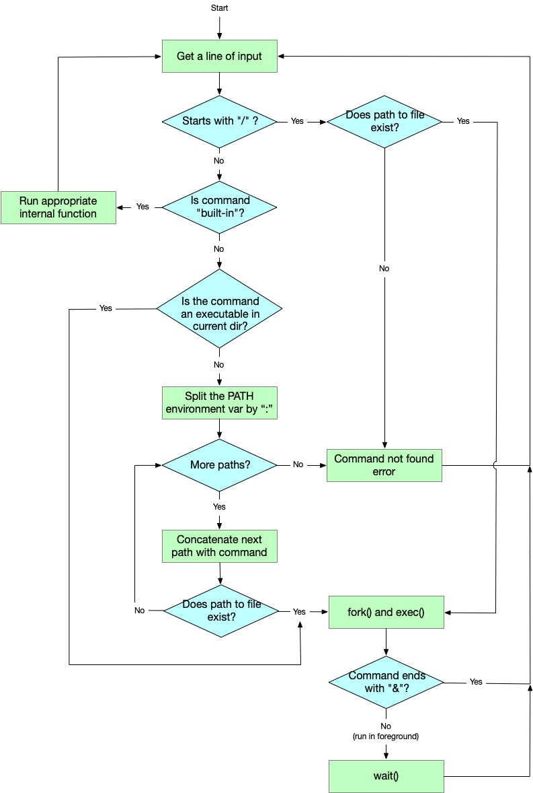

## CS 475 - Operating Systems

### Hwk 4: David Shell (dsh)

A _shell_ is an interactive command-line environment in which users can issue commands to the OS. Even with modern OS's support of point-and-click GUIs, many still prefer to use the shell. Today, many shells exist and are supported by Unix-based systems, but the Bourne-Again Shell (bash) is probably the most widely used.

Your goal for this assignment is to create your very own shell, David Shell (`dsh`), named after your favorite OS Professor.


#### Student Outcomes

- To understand how a simple command-line interface to the OS is implemented.
- To work with environment variables with `getenv()`
- To become familiar with process creation with `fork()` and `execv()`
- To become familiar with parent-child synchronization with `wait()`

#### Starter Code

Starter code for this assignment is provided on the github repo. You are not required to submit your code to me on Github, but it's strongly recommended that you do.

- Login to github, and go here: [https://github.com/davidtchiu/os-dsh](https://github.com/davidtchiu/os-dsh). 

- Click on the green **Use this template** button  and select the **Create new repository** option. In the next page, give your repository a good name (the "suggestion" they give is fine). My only request is that you *don't* name it to be the same as mine. This is hide your homework solution from Google searches.

- This will create your own copy of the repository with the starter code I provided! Copy the URL of your repo from the browser window.

- Now from VS Code, open a terminal, and _*clone*_ your new Github repo down to your local working directory using:

  ```
  git clone <your-github-url-for-this-project>
  ```


#### Working Solution

I have included a working solution of my program along with the starter code. The binary executable file is called `dshSol`. You can run it from the terminal by first navigating in to the Hwk directory and typing the command `./dshSol`. 

#### Preliminary: Access of Environment Variables

Before we get started, we should first cover what *environment variables* are within shells. I tend to think of shells to be a suped-up command-line interface. They are the user interface to the OS before there were windows and desktops. There are things that the shell needs to remember about you so that it's customized to your liking. Many of these customizations are stored in the shell's **environment variables**. On one hand, these variables can hold values that make the shell more convenient to use (for instance, remembering the path to your "home" directory), and on the other, they store values that customize the command-line environment to your personal taste (for instance, assigning various colors to files and directories.)

There are certain environment variables that are pretty standardized, including `$HOME`, `$PATH`, `$SHELL`, `$PWD`, and so on.

- If you're curious to see what's stored in an environment variable, you can use the `echo $<VAR>` command. For instance, the following example shows that `/home/dchiu` is stored in `HOME`.

    ```
    $ echo $HOME
    /home/dchiu
    ```

- Try echoing `$SHELL` (what shell am I using?), `$PWD` (where am I currently?), `$PATH` (what are the known paths to executable files?), and so on, ...

- Importantly for this assignment, to return the value of an environment variable as a string, you can use the function [getenv()](https://man7.org/linux/man-pages/man3/getenv.3.html), provided in `#include <stdlib.h>`.


#### Handling Input

1. As soon as `dsh` starts, it should repeatedly provide the user with a command-line prompt: `dsh> ` Check out the example below:

    ```
    $ ./dsh
    dsh>
    ```

    From the Terminal, I run the David Shell program using `./dsh` and it immediately vives me the `dsh>` prompt. I am now in the David Shell environment, and am able to issue commands just like other when you're inside other shell.

2. At the `dsh>` prompt, the user would be able to enter a command which David Shell should attempt to execute as a *separate* process.

   - Some commands may be followed by a list of arguments (for instance, `ls -l ../` and `ps au`), so you will have to read in the entire line as a string and tokenize (split) it by whitespace. **You may assume that arguments are separated by a single space**, ignoring tabs, consecutive spaces, etc. For accepting a whole line of input, I recommend looking into [fgets()](https://www.cplusplus.com/reference/cstdio/fgets/), which has the following signature:

    ```c
    char* fgets(
      char* str, /* OUT */
      int num,   /* IN  */
      FILE* stream /* IN */
    )
    ```

    This function will read `num` characters from the `stream`, and place it in a pre-allocated string buffer `str`. The `stream`, in our case, is simply input as `stdin` (the standard input device). The method will return a pointer to `str`. In your program, if the user's input is longer than 256 characters, you should ignore it and output an error (command too long). 

    Example:
    ```c
    char *line = (char*) malloc(256); // create an empty buffer to store the input
    
    // reads up to 256 characters into the buffer
    if (fgets(line, 256, stdin) == NULL) {
      exit(0);  // exit the program if EOF is input
    }
    ```
    
      - You too may assume that user input will occupy no more than 256 characters.
      - Keep in mind that `fgets(..)` will gobble up everything you enter, including the trailing newline character from hitting the `enter` key!
      - `fgets()` will also return `NULL` if you give it an end-of-file (EOF) signal on input. This can be done using `control+d`. When we detect this, we simply `exit(0)`.

3. Once you have the input line, you should *trim* it (that is, remove all preceding and trailing white space). If the trimmed input is an empty string, you should simply re-prompt the user. To this end, I would write a function to trim the input string, and test its length.

##### Understanding Program Execution and Full-Path Resolution

After the line of input is read, `dsh` will need to verify that the command entered is *valid*. There's an easy way to tell if it's valid, but first, we need to understand how file system paths work. To create a process and run a program, you need to construct its **full path** in the file system. An full path to a program, say `ls`, might look like this:

  ```
  /bin/ls
  ```

To locate the `ls` program, the OS needs to first traverse to the "root" directory or folder (that's the initial `/`), and from there, traverse into the `bin` directory. Then from `/bin`, to look for a file named `ls` in there. It's really nice when the user types out the full path to the program they want to run, but that's usually not going to be the case. (Try typing `/bin/ls` in your terminal. It works as advertised!) We typically only type `ls`, and it works, which means that David Shell must do some behind-the-scenes work to figure out _where_ to look for `ls`.

This is all pointing to a couple of modes of execution we need to support. The user could either give the full path to an executable file, or the user might simply give the name of the executable file they want to run.

1.  **Mode 1 (full path is given):** Suppose the user types in the full path to an executable. You know they typed a full path if their input starts begins with a `'/'` character! First, check to see if the given path even exists. To do this in C, I would first include the `unistd.h` file, and use its `access()` function:

    ```c
    if (access(path, F_OK | X_OK) == 0) {
        // File exists and is executable! Can run!
    }
    else {
        // No good! File doesn't exist or is not executable!
        // Alert the user and re-prompt
    }
    ```

    - If the executable isn't found or if it can't be executed (see above snippet), then simply output an error to the screen, and re-display the `dsh>` prompt.

    - If the executable is found, then there are two further options for execution:

      - **Run in foreground:** Execute the file using `fork()` and `execv()` as you learned in class. The call to `execv()` requires the *full path* to the executable, which the user already gave you. Commands may have an arbitrary number of arguments that follow it, which are delimited by whitespace. You'll need to input the command-line arguments into a NULL-terminated array of strings, and pass it along to `execv()`.  When running a process in the foreground, the parent process (that is, `dsh`) must `wait()` for the child process to finish. Therefore, you would not expect to see the `dsh>` shell prompt again _until_ the child process terminates.

          - This is the usual mode of execution when you're on the terminal!

      - **Run in background:** If the last character in a valid command is an `&` symbol, it indicates that the executable file is to be run in the background. In other words, when the David Shell forks a child, the shell should **not** wait for the child to terminate. After forking, the OS will run the new process concurrently with `dsh`. This means that you'll see `dsh>` being re-displayed immediately by the parent (`dsh`) process, leading to possibly strange output to the screen: If the child process also prints to the terminal, the outputs will interleave.

        - Running processes in the background is useful when you're multitasking, and need to spin off a program, but get your David Shell prompt back so you can run other programs!

2.  **Mode 2 (full-path construction):** This case triggers when the input does _not_ start with a `/`. Now we've got some work to do before we can even `fork` and `exec`! We need find the _true_ location of the given command, and we'll use the following steps. The technical term for this process is called *Path Resolution*:

    - First, we check to see if the executable file can be found in the current working directory. That is, the location of where your shell thinks you're in. Look into using `getcwd()`, defined in `unistd.h`. Concatenate the user's input to the  the current working directory, and see if it exists. If so, fork and execute it right away as per the procedure given above. If not, then move on to the next step.
      
      - For instance, if I typed `ls2` and my current working directory is `/home/dchiu`, then the first place my program would be `/home/dchiu/ls2`. Of course, this executable file may not exist in my current directory... read on!

    - If it cannot be found in the current working directory, then there are other paths in which it can be found. These paths are stored in the environment variable `PATH`.

    - For example, a `PATH` might hold this value:
      ```
      /opt/local/bin:/opt/local/sbin:/usr/local/bin:/usr/bin:/bin:/usr/sbin:/sbin:/opt/X11/bin:/usr/texbin
      ```
      What you're seeing here is a `:`-delimited string that separates all the different locations to look for the executable file. You need to `strcpy()` this string and split it up by `:` using `strtok()`. Next, concatenate the user's input string to the end of each token. 
      
      So, if I typed `ls2`, then the first location to try would be `/opt/local/bin/ls2`, the second place to try is `/opt/local/sbin/ls2`, and so on, until you find it. As soon as you detect that a full path to the executable exists, then fork and execute it! If you've tried all the paths without finding the executable, then you must output some kind of a `Command not found` error message and re-prompt for the next command.

##### Support of Built-in Commands

Some commands are not meant to invoke another program. Instead, they are to be handled directly by the shell by calling functions that you built-in. For example, when a user inputs `exit`, your shell is not supposed to attempt to find an executable named `exit` in the user's PATH!  In this case, `dsh` should simply terminate by exiting the loop. These special commands are called "builtins."

Here is a list of built-in commands that David shell needs to support.

- `exit` should exit David Shell.

- `pwd` should print the current working directory. Look into `getcwd()`, defined in `unistd.h`.

- `cd [path]` should change the current working directory to the optionally given path. If path is not given, then David Shell should change the working directory to the user's home directory, stored in the environment variable `HOME`. Look into the `chdir()` function, defined in `unistd.h`.


##### Flowchart of Activities

Phew! That's a lot to take in. The figure below shows the abstract flowchart for this program. This should (hopefully) give you a better idea of what all needs to be done.



##### Hints and Tips

This assignment can be tricky to get started, because there are so many pieces that need to come together. **You are warned to start early.** If I were doing this assignment, I'd probably work on things in this order:

1. First, you need to figure out how to allocate an array of strings. This is important for invoking the `execv()` system call later on, and for the `split()` function (see next bullet point). Because strings are themselves arrays, then an array of strings is essentially a 2D array (or a pointer to pointers to `chars`). You can create an array of `num` strings as follows:

    ```c
    // this creates num pointers to strings
    char **array = (char**) malloc(num * sizeof(char*));

    // this loops through each array element and instantiates
    // an array of chars of length CAPACITY
    for (int i = 0; i < num; i++) {
      array[i] = (char*) malloc(CAPACITY * sizeof(char));
    }

    // now I can assign strings to individual array elements
    for (int i = 0; i < num; i++) {
      strcpy(array[i], "hello world");
    }
    ```

2.  Write a function `char** split(char *str, char *delim)`, that exhibits similar behavior as Java String's `split(..)`. Your function should input a string `str`, and a string delimiter, and return an array of substrings (tokens) split on the given delimiter. 

    - First, figure out the number of tokens that you will end up with. I would do this by counting the number of instances of the delimiter found in `str`. The number of tokens is just 1 plus that number and call this value `numTokens`.

    - Now use the previous bullet point to allocate `numTokens+1` pointers to chars. Then write your loop to malloc `numTokens` arrays of chars. (Yes, it is crucial that you only loop up to `numTokens`, and not `numTokens+1`).

    - Use the string function `strtok()` to loop through all of the tokens, and assign each to a corresponding element in your new array by using `strcpy()`. 

    - Because the user of your function wouldn't know the size of the array that you're returning, make sure you set the final element of your array to `NULL`. (This is why I had you malloc `NUMTOKENS+1` spots in the first place). Here's how you might use your new method:

    ```c
    //split cmd on whitespace!
    char cmd[] = "git add .";
    char **terms = split(cmd, " ");

    // print out all the tokens
    int i = 0;
    while (terms[i] != NULL) {
      printf("%s\n", terms[i]);
      i++;
    }
    ```

    Should result in the output below:

    ```
    git
    add
    .
    ```

    This function is a huge workhorse for this assignment.

3.  Write the main command-prompt loop to repeatedly accept input. Test the `split(..)` function you just wrote on various inputs, including empty string.

    - You should be using `fgets()` to accept user inputs. Remember that the "enter" key is logged as a `'\n'` character at the end of the string! You'll probably want to truncate that newline character as soon as you obtain the user input, and that's as simple as putting the `'\0'` character in its place.

4.  Work on handling the built-in commands next.

5.  Work on command execution when given the full-path to an executable. (Mode 1)

6.  Finally, work on execution when given just the name of an executable. (Mode 2: path resolution)


#### Example Output

This example assumes there's a file named `feelGood.c` in my current working directory. (Yes, this file
is given to you as part of the initial code base for the assignment.) The full path to the executable, `cat`, is given. This causes _Mode 1_ to run, meaning that the shell will not do a search of the PATH environment variable for `cat`. 
Further, the argument `feelGood.c` is given in an array to `execv()`. Specifically the array should contain
`["/usr/bin/cat", "feelGood.c", NULL]`.  The `cat` executable will simply print the contents of  `feelGood.c`  to
the terminal. As there is no trailing `&` (ampersand), `/usr/bin/cat` is executed and David Shell waits for it
to finish before re-prompting. Therefore, you will see all the outputs of `cat` before the next `dsh>` prompt.

```
dsh> /usr/bin/cat feelGood.c
#include <stdio.h>
#include <unistd.h>
int main() {
  while (1) {
    printf("Students think you're inspiring!\n");
    sleep(4);
  }
  return 0;
}
dsh>
```

Next, I enter `NotARealCommand`, which David Shell to invoke _Mode 2_ and search for 
`NotARealCommand` in all the known paths of my `PATH` environment variable. At this point, the shell has also determined that `NotARealCommand` is not a built-in command. This file is not found in any of the paths (and is not a built-in), and therefore the error is printed and the shell re-prompts for the next input.

```
dsh> NotARealCommand -o
ERROR: NotARealCommand not found!
dsh>
```

In the snippet below, I enter `ls -l`, which causes my shell to invoke _Mode 2_ and search for the 
`ls` binary in all the known paths listed in my `PATH` environment variable. The `ls` binary is of course 
found (on my machine, inside  `/usr/bin/`). Further, the `-l` is given in a NULL-terminated array to `execv()`. Specifically the array should contain `["/usr/bin/ls", "-l", NULL]`. As there is no trailing `&`, the `ls` is executed and the shell waits for it
to finish before re-prompting. (Therefore, you will see all the outputs of `ls -l` before the next `dsh>` prompt.)
```
dsh> ls -l
total 56
-rw-rw-r-- 1 dchiu dchiu   112 Feb 15  2023 Makefile
-rw-rw-r-- 1 dchiu dchiu    17 Jan 13  2023 README.md
-rw-rw-r-- 1 dchiu dchiu   323 Feb 15  2023 dsh.c
-rw-rw-r-- 1 dchiu dchiu   128 Feb 15  2023 dsh.h
-rwxrwxr-x 1 dchiu dchiu 30656 Feb 15  2023 dshSol
-rw-rw-r-- 1 dchiu dchiu   149 Feb 15  2023 feelGood.c
-rw-rw-r-- 1 dchiu dchiu   301 Jan 13  2023 main.c
dsh>
```

Assuming, once again that `feelGood.c` is in the current working directory. This sequence below will first compile `feelGood.c` into a binary executable called `feelGood`. The next line runs `feelGood` in the background (the trailing `&` is given). This means that the shell will not wait for `feelGood` to finish (and it won't finish, as `feelGood` runs an infinite loop). Note that I am given the prompt back immediately, but `feelGood`'s output is interleaved with the shell's. In fact, even *after* I exit David Shell, `feelGood` continues to run as  an independent process!! You should figure out how to terminate `feelGood` :)
```
dsh> gcc -Wall feelGood.c -o feelGood
dsh> ./feelGood &
dsh> ls -l
total 56
-rw-rw-r-- 1 dchiu dchiu   112 Feb 15  2023 Makefile
-rw-rw-r-- 1 dchiu dchiu    17 Jan 13  2023 README.md
-rw-rw-r-- 1 dchiu dchiu   323 Feb 15  2023 dsh.c
-rw-rw-r-- 1 dchiu dchiu   128 Feb 15  2023 dsh.h
-rwxrwxr-x 1 dchiu dchiu 30656 Feb 15  2023 dshSol
-rwxrwxr-x 1 dchiu dchiu   149 Feb 15  2023 feelGood
Students think you're inspiring!
-rw-rw-r-- 1 dchiu dchiu   149 Feb 15  2023 feelGood.c
-rw-rw-r-- 1 dchiu dchiu   301 Jan 13  2023 main.c

dsh> exit
$
Students think you're inspiring!
Students think you're inspiring!
Students think you're inspiring!
Students think you're inspiring!
```

#### Grading

```
This assignment will be graded out of 80 points:

[40pt] User input is properly handled, and invalid commands (not found in PATH or
    current working directory) generates an error.

[25pt] Running a valid command works as expected (in-foreground vs. in-background too).

[5pt] cd [path] works as expected, by changing the current directory to the path
    (if given), or $HOME (if not given).

[3pt] exit and pwd works as expected

[2pt] Your program observes good style and commenting.

[5pt] Your program is free of memory leaks and dangling pointers.
```

#### Submitting Your Assignment
1. Commit and push your code to your Github repo. Make sure your repo is public.

2. On canvas, simply submit the URL to your Github repo. No other form of submission is accepted.


#### Credits

Written by David Chiu. 2022.
