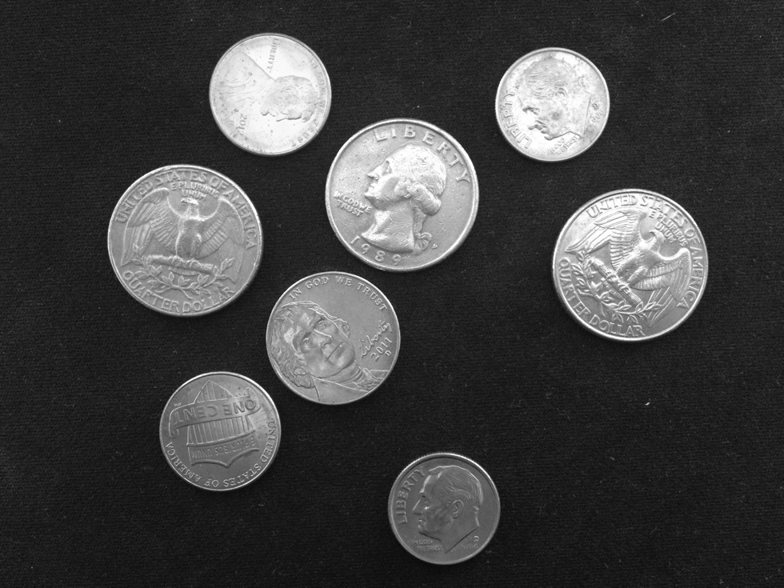
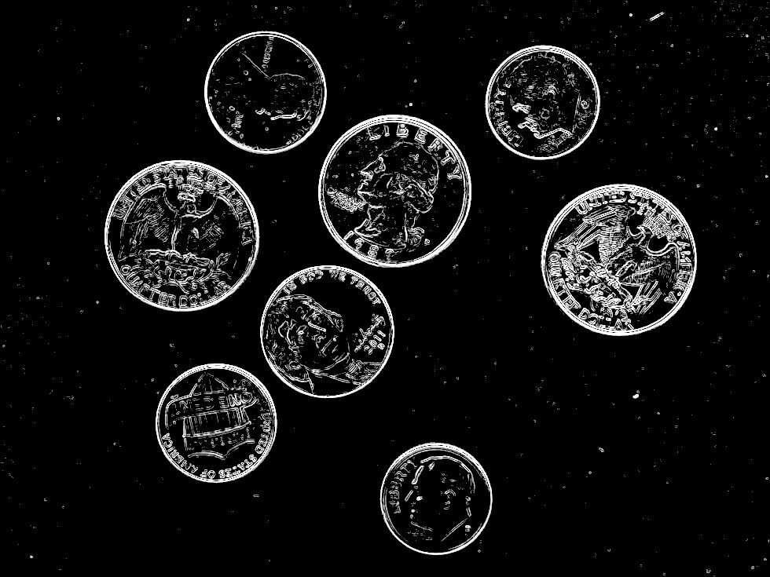
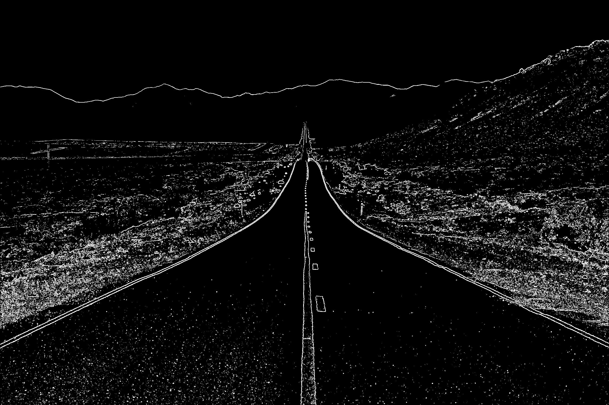
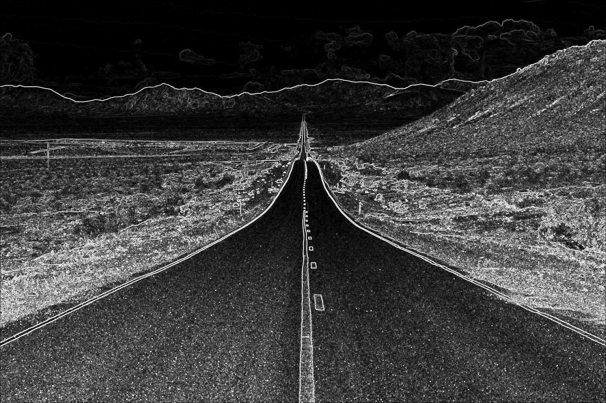

## CS 475 - Operating Systems

### Hwk: Parallel Edge Detection with `pthread`
Ever wonder how self-driving cars detect lanes and boundaries to navigate safely on roads? Or how doctors use advanced imaging techniques to identify tumors with pinpoint accuracy? Edge detection enables these breakthroughs by highlighting the boundaries and transitions within images, making it possible to extract such meaningful information. 




The goal of this assignment is to implement a **multithreaded Sobel filter** to perform edge detection on grayscale images using the `pthread` library in C.


#### Student Outcomes

- To write a parallel, multi-threaded program using the `pthread` library with real-world application.
- To work with the data-parallel paradigm.
- Exposure to "embarassingly parallel" problems. 

#### Starter Code

Starter code for this assignment is provided on the github repo. You must do these steps in order to submit your work to me on github.

- Login to github, and go here: [https://github.com/davidtchiu/os-sobel](https://github.com/davidtchiu/os-sobel). 

- **Please do not fork from my repository!** Instead, click on the green **Use this template** button  and select the **Create new repository** option. In the next page, give your repository a good name (the "suggestion" they give is fine). My only request is that you *don't* name it to be the same as mine. This is hide your homework solution from Google searches.

- This will create your own copy of the repository with the starter code I provided! Copy the URL of your repo from the browser window.

- Now from VS Code, open a terminal, and _*clone*_ your new Github repo down to your local working directory using:

  ```
  git clone <your-github-url-for-this-project>
  ```


- This should download the starter code in a directory named after your Github repository. 


#### Working Solution

I have included a working solution of my program along with the starter code. The binary executable file is called `sobelSol`. You can run it from the terminal by first navigating in to the homework directory and typing the command `./sobelSol`. 


#### Preamble: Understanding Sobel Filters

In image processing, **Sobel Filters** are one of the most popular methods for performing edge detection due to their simplicity and effectiveness. The Sobel filter applies a pair of _convolution kernels_ to an image to compute the intensity gradients in both the horizontal and vertical directions. These gradients highlight regions of the image where the intensity changes significantly, which often corresponds to edges.

The Sobel operator uses two $$3 \times 3$$ convolution kernels that detect changes in intensity along the horizontal and vertical directions of an image:

$$K_x =
\begin{bmatrix}
-1 & 0 & 1 \\
-2 & 0 & 2 \\
-1 & 0 & 1
\end{bmatrix}
~~~~~~~
K_y =
\begin{bmatrix}
-1 & -2 & -1 \\
 0 &  0 &  0 \\
 1 &  2 &  1
\end{bmatrix}
$$

##### How to Apply Sobel Filters over an Image (Convolution)
The input image is essentially a 2D array where each cell, or "pixel", is an integer between 0 (black) and 255 (white). Here's a step-by-step explanation of how it's done. **"Convolution"** is the process of sliding the two Sobel kernels across all pixels in the image and performing the following steps at each pixel:

   1. For a pixel at position $$[i,j]$$, it will have 8 neighbor pixels surrounding it.
      
      - The exception are the pixels that ride along the four borders of the image.
      - Your algorithm will need to exclude these border pixels from processing.

   2. Center the $$K_x$$ kernel over each pixel and multiply each of the nine kernel values with the corresponding pixel value and sum up these products. The sum is called the pixel's horizontal "gradient", $$G_x$$.

   3. Repeat this process for the $$K_y$$ kernel to produce the vertical gradient, $$G_y$$.

   4. Combine that pixel's two gradient components using this formula: $$G = \sqrt{G_x^2 + G_y^2}$$. For any value of $$G$$ greater than 255, clamp it down to 255. For all other values of $$G$$, compare $$G$$ to the threshold that was input on the program's command-line. If $$G$$ is less than the threshold, set the corresponding pixel of the output 2D array to 0 (black), otherwise, set it to $$G$$.

   5. Repeat this process for every pixel to produce the output 2D array. For any pixel that sits along the border of an image, set its value in the output 2D array to 0 (black).

##### Convolution: A Running Example

Let's say we start with the following $$5\times 5$$ grayscale image:

   ```c
   34  45  60  90 120
   40  50  70 100 130
   50  55  75 110 140
   70  80  95 120 160
   90 100 110 140 180
   ```

1. For the pixel at position, say, $$[2,1]$$ (value 55), its region (including its 8 neighbors) is:

   ```c
   40  50  70
   50  55  75
   70  80  95
   ```

2. Apply the horizontal kernel $$K_x$$ to produce that pixel's horizontal gradient $$G_x$$.

   ```c
   (-1 * 40) + (0 * 50) + (1 * 70) +
   (-2 * 50) + (0 * 55) + (2 * 75) +
   (-1 * 70) + (0 * 80) + (1 * 95)
   == 70
   ```

3. Apply the vetical kernel $$K_y$$ to produce that pixel's vertical gradient $$G_yx$$.

   ```c
   (-1 * 40) + (-2 * 50) + (-1 * 70) +
   ( 0 * 50) + ( 0 * 55) + ( 0 * 75) +
   ( 1 * 70) + ( 2 * 80) + ( 1 * 95)
   == 90
   ```

4. Combine the components: $$G = \sqrt{G_x^2 + G_y^2} = \sqrt{70 + 90} \approx 114$$. Now over in the output 2D array, assign the value `114` to position $$[2,1]$$.

5. Repeat this process for every pixel to produce the output 2D array, and remember to set any border pixel  to 0 (black).

   ```c
   0  0  0   0    0
   0  50 70  100  0
   0  55 75  110  0
   0  80 95  120  0
   0  0  0   0    0
   ```

6. Now suppose the **threshold** was input as 80 on the command line. The final output 2D array would be:

   ```c
   0  0  0   0    0
   0  0  0   100  0
   0  0  0   110  0
   0  80 95  120  0
   0  0  0   0    0
   ```


#### Side Note: "Embarassingly Parallel"
The nature of this program is called "embarassingly parallel" in industry and academia. It isn't meant to be a derogatory term. It simply suggests that the parallelization of these problems is straightforward. The "embarrassment" here is more of a playful nod to how easy these problems are to parallelize compared to more complex ones that require significant coordination, synchronization, and/or locking between threads or processes. (More on those later :)

As any good parallel programmer would, you should still verify this to be the case for this assignment. On a piece of paper, trace and depict how the sobel filter process would work across the input image. Pay attention to how the new output image (2D array) is calculated. Do you ever have to read any other cells from the *same* array that you're writing to?

#### Program Requirements

1. The program should accept the following required command-line arguments. If any of the following parameters are missing, print an error message and do not attempt to run the program.
     - The filename of the input image (e.g., `pics/input.jpg`).
     - The number of threads to use for processing.
     - A pixel threshold for emphasizing edges (0-255).

     Insufficient parameters:
     ```bash
     ./sobel pics/input.jpg
     > Usage: ./sobel <input-file> <num-threads (>= 1)> <threshold (0-255)>
     ```

     Acceptable command:
     ```bash
     ./sobel pics/input.jpg 4 120
     ```

      Your `main(int argc, char *argv[])`. Command-line arguments can be accessed through `argc` and `argv`. Specifically, `argc` refers to the number of arguments given on the command line, including the command to run the executable itself. `argv` is a string array containing the arguments (much like `String[] args` in Java). Once you parse out the command line arguments, store the mode (sequential vs. parallel) as an integer in the `mode` global, and store the dimension of your matrices in the `size` global.

2. **Images**: Input images are provided in the `pics/` directory. All images are grayscale jpegs. You're welcome to upload your own too. The processed image should also be saved in the `pics/` directory with `-sobel` appended to the filename.


3. **Globals**: Several global variables have been declared/defined in `main.c`:
   - `int Kx[3][3]`: Defines the horizontal kernel.
   - `int Ky[3][3]`: Defines the vertical kernel.
   - `unsigned char **input_image`: The 2D array representing the input image.
   - `unsigned char **output_image`: The 2D array representing the output image.
   - `width` and `height`: Store the dimensions (in pixels) of the image (automatically populated).
   - `num_threads`: Stores the number of threads you should spawn (given on command line).
   - `unsigned char threshold`: Stores the pixel threshold (given on command line).

4. **Reading JPEG Images**: The `stbi_load()` function is provided for you to read a `.jpg` file into a 1D array for processing. You can read in an image stored in `filename` (such as `pics/cat.jpg`) as follows:

   ```c
   unsigned char *data = stbi_load(filename, &width, &height, NULL, 1);
   ```
   The code above will automatically `malloc()` a 1D array of `unsigned char`s (recalling that `unsigned chars` can handle values of 0-255). This array represents all the pixels in the jpg image given by the `filename`. It also populates the `width` and `height` global variables with the dimensions of the jpg. If the call fails, it returns `NULL` to `data`.

6. **Remapping of 1D Array to 2D Array**: It's unnatural to think about an image as a 1D array, in which all the rows of the image are just appended to each other. You could re-map this 1D array to a 2D array of `height` rows and `width` columns as follows:

   ```c
   input_image = (unsigned char**) malloc(sizeof(unsigned char*) * height);
   for (int i = 0; i < height; i++) {
      // assign each row the proper pixel offset
      input_image[i] = &data[i * width];
   }
   ```
   That will remap the 1D array `data` into the 2D `input_image` (a global). Now you can access the pixel at position `[i,j]` using `input_image[i][j]`.

7. **Output Image**: You can't make changes to the pixel values directly to `input_image[..][..]` because it would screw up the gradient calculations for  pixels downstream. Therefore, you should `malloc()` an 2D array of `height` rows and `width` columns that store `unsigned chars`, and assign it to the global, `unsigned char **output_image`.


   The `**` syntax may at first seem confusing. However, recall that an array is just a pointer. So, an array of pointers can be interpreted to be a pointer to pointers. (If you ever needed a 3 dimensional array, then you would use `***`, and so on.)
   
      ```c
      // malloc a size 'height' array of pointers
      output_image = (unsigned char**) malloc(sizeof(unsigned char*) * height);

      // iterate through each row and malloc a size 'width' array
      for (int i = 0; i < height; i++) {
         output_image[i] = (unsigned char*) malloc(sizeof(int) * width);
      }
      // Now we have a 2D array, accessible via output_image[x][y]!!
      ```

8. **Parallelized Convolution:** It is highly recommended that you write the Sobel convolution algorithm serially before trying to parallelize it. Test the serial function on the images to ensure that it works, and that you understand the convolution algorithm. When you're ready, your `main()` function must split the convolution work evenly among the specified number of threads. The most straightforward way is to have each thread be responsible for processing a fraction of the rows in the image.


      - Because all globals and any memory allocated on the heap are shared across threads, you do not need to explicitly transfer the 2D arrays to each thread! Nice!

      - The only things that each thread requires (as an input argument to the thread function) are its "range of work." As I showed in class, this is usually done through allocating a `struct` and putting information inside that `struct` before passing it to each corresponding thread. For instance, if I want each thread to compute a set of rows in the image, I would prepare a `struct` that has each thread's assigned `starting` row, and `ending` row.
      
      - If you forget how to do this, refer to the examples I gave in class: [Parallel Sum](https://github.com/davidtchiu/cs475-parSum) and [Parallel Sort](https://github.com/davidtchiu/cs475-parInsertionSort).

      - FYI: our server supports 16 cores. While Amdahl's Law states that we'll never achieve 16 time speedup, we should get pretty close! The larger the image, the better the speedup!


8. **Writing JPEG Images**: The `stbi_write_jpg()` function is also provided for you to export a 1D array as a `.jpg` file. You can export an image as follows:

   ```c
   stbi_write_jpg(outfilename, width, height, 1, array1D, 80);
   ```
   The code above will export the pixels represented in the `array1D` as the file indicated by the string `outfilename`. The `width` and `height` are globals and should not have chanaged from earlier. The next argument, `1`, indicates the image to be output as greyscale. The final argument `80` is the JPEG quality (ranges from 1 to 100).

   If you remapped to a 2D array in the earlier step, you have to map it back into a 1D array before you can call this function:
   ```c
   // This code re-maps output_image[][] down to a 1D array
    unsigned char *array1D = (unsigned char*) malloc(width * height * sizeof(unsigned char));
    for (int i = 0; i < height; i++) {
        for (int j = 0; j < width; j++) {
            array1D[i * width + j] = output_image[i][j];
        }
    }
   ```

9. Don't forget that you'll need to free up these arrays (`array1D`, `input_image`, `output_image`) before your program exits. Note: To free any malloc'd 2D array, you need to individually free every row, then free the original pointer, as follows.

   ```c
   // free each row
   for (int i = 0; i < height; i++) {
      free(arrayName[i]);
      arrayName[i] = NULL;  // dangling pointer
   }
   // free original array
   free(arrayName);
   arrayName = NULL;  // dangling pointer
   ```


#### Example Output

The outputs below are from using our server, so your timed results (in seconds) should be similar to mine. I'm using a threshold of 180 on the road.jpg picture. You might play with different thresholds (0 to 255). The lower the threshold (approaching 0), the more sensitive the algorithm becomes (i.e., edges that are less definitive and profound in the original image will be detected).

```bash
$ ./sobel pics/road.jpg 1 180
Loaded pics/road.jpg. Height=1500, Width=2250
Time taken (thread count = 1): 0.066707 sec
Saved as pics/road-sobel.jpg

$ ./sobel pics/road.jpg 2 180
Loaded pics/road.jpg. Height=1500, Width=2250
Time taken (thread count = 2): 0.034112 sec
Saved as pics/road-sobel.jpg

$ ./sobel pics/road.jpg 4 180
Loaded pics/road.jpg. Height=1500, Width=2250
Time taken (thread count = 4): 0.017804 sec
Saved as pics/road-sobel.jpg

$ ./sobel pics/road.jpg 8 180
Loaded pics/road.jpg. Height=1500, Width=2250
Time taken (thread count = 8): 0.009435 sec
Saved as pics/road-sobel.jpg

$ ./sobel pics/road.jpg 16 180
Loaded pics/road.jpg. Height=1500, Width=2250
Time taken (thread count = 16): 0.005540 sec
Saved as pics/road-sobel.jpg
```

Pay attention to the times taken. It should reduce as the number of threads increase. To get the speedup, simply divide the 1-thread version by the parallel version. For example, if I wanted to see how much speedup I'm getting with the 8-thread version, I calculate $$0.066707 sec / 0.009435 sec = 7.07\times$$ speedup on this particular image. That's pretty good!


The pics, for comparison: left = original, right = sobel (threshold: 180), bottom = sobel (threshold: 5). You can see how the right-most picture depicting low-thresholds picks up on more details, detecting edges that are more subtle in the original picture, such as the outline of the clouds and details in the mountains. If the application is for a car's _lane departure_ feature, you might prefer a higher threshold (lower sensitivity) to ignore details and to prevent tricking your car into thinking something is a lane boundary when it's not! 






#### Grading

```
This assignment will be graded out of 70 points:

[5pts] User input is properly handled, and invalid commands generates an error.

[5pts] The program outputs the processed image as a .jpg in the pics/ directory.
The new file must append "-sobel" to its original name. For instance, "pics/cat.jpg"
produces "pics/cat-sobel.jpg"

[20pts] pthreads are managed properly. Each thread is input a struct
that includes the beginning and the ending rows for which it is responsible.

[40pts] The Sobel convolution algorithm is correctly implemented.

   [5pts] Border pixels are set to 0.

   [15pts] Kernels Kx and Ky are applied to each pixel when applicable to
                determine its gradient.

   [5pts] The gradient is clamped to 255 if it exceeds 255.
   
   [5pts] The gradient is thresholded as explained in the assignment.

   [10pts] Each thread only does the predefined amount of work. The thread's
           "work" function is properly written and compiles without warnings.

[5pts] Your program is free of memory leaks and dangling pointers.
```

#### Submitting Your Assignment

1. Commit and push your code to your Github repo. Make sure your repo is public (or private and accessible by me).

2. On canvas, simply submit the URL to your Github repo. No other form of submission is accepted.

#### Credits

Written by David Chiu. 2022.
