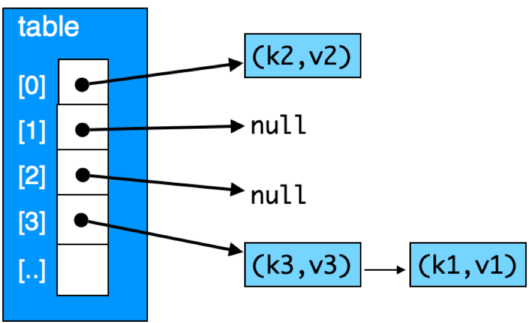

## CS 475 - Operating Systems

### Hwk: Thread-Safe HashMap

HashMaps (also called Hash Tables or Dictionaries) are one of the most versatile and powerful data structures due to its support of O(1) operations. Besides arrays, they are quite possibly the most ubiquitous data structures in use today.

But have you ever wondered why Java offers both a `Hashtable<K,V>` class and a `HashMap<K,V>` class? If you compare their interfaces and behaviors, they have the same functionality. When would you prefer one over another? This choice, it turns out, has everything to do with synchronization and multithreading. A `HashMap<K,V>` cannot be *safely*  accessed by multiple threads. It has  no built-in synchronization mechanisms that avoid race conditions when many threads are concurrently calling `put`, `get`, and `delete` on it. If you're ever writing a multithreaded program, you must use its thread-safe counterpart, `Hashtable<K,V>`.

When programming, you should always check the documentation to ensure that the data structure is thread safe. (For instance, another thread-safe approach includes using `Vector<E>` instead of `ArrayList<E>`.) On the other hand, if you know that your program will always be single-threaded, then a `HashMap<K,V>` would not only suffice, but it would  be preferable, because it has been implemented without any synchronization considerations. Same goes for `ArrayLists`.

#### Thread Safety 
A data structure is called *thread-safe* if it can be accessed by multiple threads concurrently without leaving the structure in an unstable (incorrect) state. Take an unsafe linked list, for instance. Assume that a node in a linked list has a `data` and a `next` field, as usual. The `LinkedList` structure itself only stores a pointer to the head node. The (unsynchronized) code to remove the head node may look something like the following:

   ```c
   void* removeHead(LinkedList *list) {
      if (list->head == NULL) {
         return NULL;   // do nothing!
      }
      Node *oldHead = list->head;
      void* retval = oldHead->data; // save for return
      list->head = oldHead->next;   // update the head
      free(oldHead);  // deallocate old head node
      return retval;
   }
   ```

Suppose a linked list currently stores `[A,B,C,D,E]`, then two calls to `removeHead()` should yield `A` and `B` respectively. We don't care whether `A` and `B` ends up in T1's hands or T2's, but these calls should leave `[C,D,E]` remaining in the list. But consider the following scenario:

   ```
   Thread T1 and T2 concurrently call removeHead(list)
   T1 sees that there's a head element, with data A
   T1 saves an oldHead pointer to the current head
   T1 saves A for later return
   T2 sees that there's a head element, with data A (!! Race Here !!)
   T2 saves an oldHead pointer to the current head (oldHead still gets A.)
   T2 saves A for later return (!! Nope. Should've gotten B !!)
   T1 updates the head element to B
   T2 updates the head element to B (!! Wrong !!)
   T1 frees oldHead
   T1 returns A
   T2 frees oldHead (!! Double-free Error !!)
   T2 returns A
   ``` 

In this scenario, `A` is incorrectly returned by both threads, and the list is still `[B,C,D,E]`. And that's just *one* way (among many) that things could go wrong. (TBH most races would probably end in a seg-fault.) To make this linked list thread-safe, each thread *should have* locked out access to the list so that another thread can't enter and run  the critical section. 

In this assignment, you are to provide a thread-safe hashmap library for C.


#### Student Outcomes

- To implement a classic dynamically allocated hashmap in C.
- To understand the concept of thread safe structures.
- To be exposed to synchronization of threads using mutex locks.

#### Starter Code

Starter code for this assignment is provided on the github repo. You are not required to submit your code to me on Github, but it's strongly recommended that you do.

- Login to github, and go here: [https://github.com/davidtchiu/os-hash](https://github.com/davidtchiu/os-hash). 

- **Please do not fork from my repository!** Instead, click on the green **Use this template** button  and select the **Create new repository** option. In the next page, give your repository a good name (the "suggestion" they give is fine). My only request is that you *don't* name it to be the same as mine. This is hide your homework solution from Google searches.

- This will create your own copy of the repository with the starter code I provided! Copy the URL of your repo from the browser window.

- Now from VS Code, open a terminal, and _*clone*_ your new Github repo down to your local working directory using:

  ```
  git clone <your-github-url-for-this-project>
  ```


- This should download the starter code in a directory named after your Github repository. 


#### Working Solution

I have included a working solution of my program along with the starter code. The binary executable file is called `hashtestSol`. You can run it from the terminal by first navigating in to the Hwk directory and typing the command `./hashtestSol`. 

#### Introduction: HashMap Structure and Functions

In this assignment you are to create a thread-safe (ts) hashmap library `ts_hashmap_t`. A hashmap can be implemented using an array of linked-lists of key-value entries, as follows:



Here are some properties you should keep in mind while programming:

   - **Entries** Each key-value pair must be encapsulated in a `ts_entry_t` struct. Besides the key and value, the struct also stores a pointer to the next struct, allowing us to form a linked list of entries. The struct is declared in `ts_hashmap.h`:

      ```c
      // A hashmap entry stores the key, value
      // and a pointer to the next entry
      typedef struct ts_entry_t {
         int key;
         int value;
         struct ts_entry_t *next;   // pointer to next entry
      } ts_entry_t;
      ```

   - **HashMap Structure** There are two basic hashmap implementations: open-addressing vs. chaining. You will consider the chaining approach for this assignment. In this approach (which is pictured above), you will allocate a fixed array (`table`) of pointers to a list of key-value entries. The size of this array (i.e., the maximum number of lists you can have) is given as the `capacity` of your hashmap. The `size` refers to the number of entries stored in the map.

      ```c
      // A hashmap contains an array of pointers to entries,
      // the capacity of the array, and the size (number of entries stored)
      typedef struct ts_hashmap_t {
         ts_entry_t **table;  // pointer to an array of entry pointers
         int capacity;  // size of the table (table[] array length)
         int size;      // number of entries currently stored
         int numOps;    // the number of operations (put, get, del) performed
      } ts_hashmap_t;
      ```

      - While a true hashmap allows for any type of data to serve as both key and value, to simplify our implementation, we will assume that all keys and values are `int`s.

      - If you have time, you should look into how to support arbitrary key and value types.

   - **Index Calculation** In the example above, to calculate the array index, you take the `key` of the entry and (1) cast it into an `unsigned int`, then (2) modulo by the size of the array. That should tell you which array position to hone in on. Because the array element points to the head of the entry list (or `NULL`), you can then walk the list of entries to search for a key.


#### Program Requirements

1. Take a look over `main.c`, which is not to be modified unless when debugging. This program stress tests your hashmap. Each thread runs the same number of operations against your hashmap. These operations have a 50% chance to be a `put()` and 25% chance each to be a `get()` or `del()`. Each hash-key is randomly generated and limited to the given maximum value (see below) so as to induce sufficient amounts of hash conflicts. The program accepts  3 arguments on the command line:
    ```bash
    $ ./hashtest <threads> <ops per thread> <hashmap capacity> <max key>
    ```
   - The `threads` argument tells your program how many threads it must create to randomly get/put/del keys.
   - The `ops per thread` argument is how many hashmap operations each thread will run.
   - The `hashmap capacity` argument is the size of the table array that your hashmap should initialize.
   - The `max key` argument is the maximum value that the hashtest simulator will generate. All keys are in the range `[0, max key]`.

   The relationship of `max key` to this simulator is an important one. If you recall that hashmaps do not allow duplicate keys, `max key` is also the maximum number of elements that can be stored in the map. Therefore, you don't want your `max key` to be too low. I've been testing with values ranging between 500 to 1000.

2. Most of your work will go in `ts_hashmap.h` and `ts_hashmap.c`. In `ts_hashmap.h`, you'll need to make any changes you see as necessary to the defined structs in order to support synchronization.

3. In `ts_hashmap.c` you must provide the implementations for following thread-safe functions:

   - `ts_hashmap_t *initmap(capacity)`: returns a pointer to a new thread-safe hashmap. The initial  size of the array should be allocated to `capacity`. This function **does not** need to be thread-safe.

   - `int get(ts_hashmap_t *map, int key)`: searches for the given `key` and returns the associated value if found. Otherwise, return constant `INT_MAX`.

   - `int put(ts_hashmap_t *map, int key, int value)`: inserts a new entry that contains the given `key` and `value` and return constant `INT_MAX`. If the `key` already exists, then its associated value is replaced with the given `value` and the old value is returned. 

   - `int del(ts_hashmap_t *map, int key)`: deletes an entry that contains the given `key` and return the previously associated value. If the `key` did not exist, return the constant `INT_MAX`. 


3. **Thread Synchronization Considerations** I would start by playing around with the locking mechanism just to get used to them. To explore locks, you'll need to `#include <pthread.h>`. A (self blocking) lock is of the type `pthread_mutex_t`, and you can use the constructor `pthread_mutex_init(..)` to initialize it. Once initialized, you can use `pthread_mutex_lock(..)` and `pthread_mutex_unlock(..)`. 

   Once you feel pretty good about how to use locks, you'll want determine how you'll enforce mutual exclusion in the hashmap functions. Should you introduce one lock for each hashmap (would that make the lock too contentious?) Multiple locks per hashmap? How would this decision affect the parallel performance of your hashmap? Where do you declare the lock(s) to ensure that all threads can access them? Once you have your locks declared in initialized in the right place, you'll just have to go back into the hashmap functions and add in the lock/unlock calls to enforce mutual exclusion. 

   **Important** Users of your hashmap library must not be burdened with the creation and management of any locks on their own. That is, users should be totally oblivious to the fact that locks even exist in your library (just like when we use a `HashTable<K,V>` in Java, we don't realize it's thread safe -- the API stays the same!). Therefore, all of the management of your locks should all be encapsulated in the above functions, hidden  from users.


5. The goal of this assignment is to implement the locking system offering the highest performance to handling massive numbers of threads (possibly 1000s). Your implementation must of course be impervious to race conditions and memory errors.

6. Finally, you'll want to make sure that the number of operations done on the map (stored in the `numOps` field) is equal to `threads * ops per thread` after the run. Each of the put, get, and del functions must increment this field (beware of races).

7. You are welcome to add any number of functions to your implementation.

#### Hints
- You should begin by implementing and testing the single-threaded version without synchronization. You can do this by just spawning a thread count of 1 in the command-line prompt.

- Pay particular attention to memory management. Nodes are possibly created in `put()` and freed in `del()`. Be careful of ordering -- don't try to free a node before it's been completely unlinked from the map. In case of `del()`, you also need to return the old value, so make sure you save that value in a temporary variable before freeing the node and returning!

- Speaking of memory management, you'll need to free up the memory allocated to your `pthread_lock_t` object(s) when you're done. To do this, use `pthread_mutex_destroy()`. It frees the resources for you, so you will not need to `free()` them explicitly after calling this function.

- You might also experiment with [spin locks](https://docs.oracle.com/cd/E26502_01/html/E35303/ggecq.html),  `pthread_spinlock_t`. Warning: The VS Code editor's C plugin doesn't recognize `pthread_spinlock_t`, so it thinks there's an error as you code along, but your code will compile.


#### Example Output
In the output below, my tester spawns the given number of threads from the command line. Each thread has a 33% chance of doing either a `del`, `get`, or `put`. Then a random key between 0 and 99 is generated for that chosen operation. Each thread runs this in a loop 100 times. Obviously, due to the randomness of the tests I'm running, the outputs below are mine alone. Because I'm not running the experiments multiple times and taking the average elapsed time, your mileage may vary per run, and you may have to repeat your runs to get numbers closer to mine.

If race conditions were present, you would likely get a segmentation fault and/or duplicated keys during the test. The number of operations, which is one of the map's fields, may also be lower than you expected if there is a race. Finally, via valgrind, you may also get invalid read/write memory errors from valgrind in the multithreaded version (but not in the single threaded version) if races exist.

##### Single Threaded Experiments (No Lock Contention, Baseline)
Run config: threads=1, ops per thread=10000, capacity=1, maxkey=500.
```
./hashtest 1 10000 1 500
-----------------------------------------------
Profiling Run:
  gets      = 3017 (30%)
  put adds  = 1675 (17%)
  put reps  = 3357 (34%)
  del succ  = 1313 (13%)
  del fail  = 638 (6%)
  total ops = 10000 (expected = 10000)
  map size  = 362 (expected = 362)
----------------------------------------------
time elapsed = 4.958868 ms
time per op  = 0.000496 ms
```
Run config: threads=1, ops per thread=10000, **capacity=100**, maxkey=500.
Should be much faster due to increased capacity of the hash map (and no lock contention).
```
$ ./hashtest 1 10000 100 500
-----------------------------------------------
Profiling Run:
  gets      = 3017 (30%)
  put adds  = 1675 (17%)
  put reps  = 3357 (34%)
  del succ  = 1313 (13%)
  del fail  = 638 (6%)
  total ops = 10000 (expected = 10000)
  map size  = 362 (expected = 362)
----------------------------------------------
time elapsed = 1.072884 ms
time per op  = 0.000107 ms
```

Run config: threads=1, ops per thread=10000,  **capacity=500**, maxkey=500
Should be much faster still, but just slightly.
```
$ ./hashtest 1 10000 500 500
-----------------------------------------------
Profiling Run:
  gets      = 3017 (30%)
  put adds  = 1675 (17%)
  put reps  = 3357 (34%)
  del succ  = 1313 (13%)
  del fail  = 638 (6%)
  total ops = 10000 (expected = 10000)
  map size  = 362 (expected = 362)
----------------------------------------------
time elapsed = 0.685930 ms
time per op  = 0.000069 ms
```

##### 250 Threaded Experiments (Moderate Lock Contention)

Run config: threads=250, ops per thread=10000, capacity=1, maxkey=500
```
$ ./hashtest 250 10000 1 500
-----------------------------------------------
Profiling Run:
  gets      = 749951 (30%)
  put adds  = 357777 (14%)
  put reps  = 891281 (36%)
  del succ  = 357423 (14%)
  del fail  = 143568 (6%)
  total ops = 2500000 (expected = 2500000)
  map size  = 354 (expected = 354)
----------------------------------------------
time elapsed = 4200.046062 ms
time per op  = 0.001680 ms
```

Run config: threads=250, ops per thread=10000, **capacity=100**, maxkey=500
```
$ ./hashtest 250 10000 100 500
-----------------------------------------------
Profiling Run:
  gets      = 749493 (30%)
  put adds  = 357862 (14%)
  put reps  = 891599 (36%)
  del succ  = 357509 (14%)
  del fail  = 143537 (6%)
  total ops = 2500000 (expected = 2500000)
  map size  = 353 (expected = 353)
----------------------------------------------
time elapsed = 2740.302801 ms
time per op  = 0.001096 ms
```

Run config: threads=250, ops per thread=10000, **capacity=500**, maxkey=500
```
$ ./hashtest 250 10000 500 500
-----------------------------------------------
Profiling Run:
  gets      = 750742 (30%)
  put adds  = 357652 (14%)
  put reps  = 891437 (36%)
  del succ  = 357295 (14%)
  del fail  = 142874 (6%)
  total ops = 2500000 (expected = 2500000)
  map size  = 357 (expected = 357)
----------------------------------------------
time elapsed = 2515.760899 ms
time per op  = 0.001006 ms
```

##### 1000 Threaded Experiments (High Lock Contention)
Run config: threads=1000, ops per thread = 10000, capacity=1, maxkey=500
```
$ ./hashtest 1000 10000 1 500
-----------------------------------------------
Profiling Run:
  gets      = 3001437 (30%)
  put adds  = 1428471 (14%)
  put reps  = 3569624 (36%)
  del succ  = 1428110 (14%)
  del fail  = 572358 (6%)
  total ops = 10000000 (expected = 10000000)
  map size  = 361 (expected = 361)
----------------------------------------------
time elapsed = 17850.777149 ms
time per op  = 0.001785 ms
```

Run config: threads=1000, ops per thread = 10000, **capacity=100**, maxkey=500
```
$ ./hashtest 1000 10000 100 500
-----------------------------------------------
Profiling Run:
  gets      = 3000261 (30%)
  put adds  = 1428957 (14%)
  put reps  = 3570287 (36%)
  del succ  = 1428604 (14%)
  del fail  = 571891 (6%)
  total ops = 10000000 (expected = 10000000)
  map size  = 353 (expected = 353)
----------------------------------------------
time elapsed = 22595.696926 ms
time per op  = 0.002260 ms
```

Run config: threads=1000, ops per thread = 10000, **capacity=500**, maxkey=500
```
$ ./hashtest 1000 10000 500 500
-----------------------------------------------
Profiling Run:
  gets      = 2998904 (30%)
  put adds  = 1430204 (14%)
  put reps  = 3569200 (36%)
  del succ  = 1429845 (14%)
  del fail  = 571847 (6%)
  total ops = 10000000 (expected = 10000000)
  map size  = 359 (expected = 359)
----------------------------------------------
time elapsed = 13976.146936 ms
time per op  = 0.001398 ms
```

#### Mystery Bonus Opportunity!
A mysterious amount of extra credit will be extended to you for completion of each of the following:
- **Difficulty = Mild:** Storage of generics. Currently the map only stores ints for keys and values. Can you figure out how to store any data type? A `void*` pointer will be your friend.
- **Difficulty = Spicy:** Write a `rehash()` function.  This function must double the hash table capacity and "re-hash" all the existing elements into the new table. This function should be called after each time `put()` adds a new element to the map.This function keeps track of the map's current load factor $$L = elements / capacity$$ (that is, the average list size.) You should rehash when $$L \ge 0.75$$.
- Do one or two of the items (without race conditions) and find out how many mystery bonus points I'll award you!
- Please indicate somewhere in your submission if you have completed either of these bonus opportunities, and tell us how to test.


#### Grading

```
This assignment will be graded out of 100 points:

[5pt] Handling of user input.

[10pt] initmap() dynamically allocates a new hashmap. All 
fields are initialized.

[10pt] The numOps count is correct at the end of the run.

[15pt] A thread-safe version of get() is implemented. 

[15pt] A thread-safe version of put() is implemented. 

[25pt] A thread-safe version of del() is implemented. 

[5pt] All locking mechanisms should be hidden from users.

[15pt] Your program is free of memory leaks and dangling pointers.

[+??pt] Support of generics. (Mild Bonus)

[+??pt] Support of rehash(). (Spicy Bonus)
```

#### Submitting Your Assignment
1. Commit and push your code to your Github repo. Make sure your repo is public (or private and accessible by me).

2. On canvas, simply submit the URL to your Github repo. No other form of submission is accepted.

#### Credits

Written by David Chiu. 2022.
