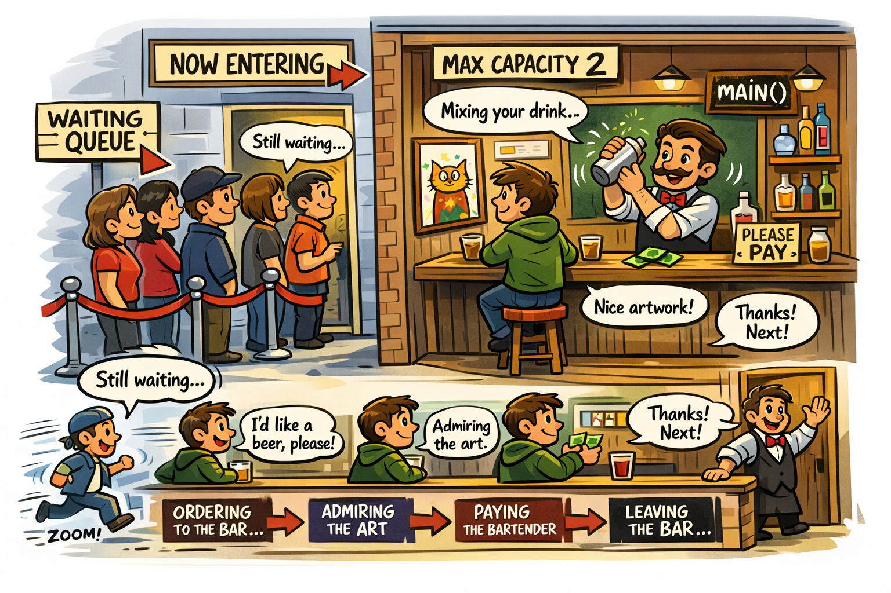

## CS 475 - Operating Systems

### Hwk 7: The Bartender Problem (Semaphores)

A bar down the street recently hired me to study their operation's efficiency, and to this end, they asked me to write a bar simulator. However, before I could finish writing the program, I got distracted by a "Out for Milk" note that I left for myself on the fridge, and I haven't been able to do anything since! I need your help to finish this code for me and I'll split my earnings with you. I got things started, so take a look at the starter code to see how I've broken things down. You just need to add synchronization mechanisms, wait times, and some good comments (I recommend starting with the comments to gain a good understanding of the code).

<div align="center">

</div>

#### Student Outcomes

- To work with semaphores for synchronization.
- To understand how to enforce synchronization and coordination of threads.

#### Starter Code

Starter code for this assignment is provided on the github repo. You must do these steps in order to submit your work to me on github.

- Login to github, and go here: [https://github.com/davidtchiu/os-thebar](https://github.com/davidtchiu/os-thebar). 

- **Please do not fork from my repository!** Instead, click on the green **Use this template** button  and select the **Create new repository** option. In the next page, give your repository a good name (the "suggestion" they give is fine). My only request is that you *don't* name it to be the same as mine. This is hide your homework solution from Google searches.

- This will create your own copy of the repository with the starter code I provided! Copy the URL of your repo from the browser window.

- Now from VS Code, open a terminal, and _*clone*_ your new Github repo down to your local working directory using:

  ```
  git clone <your-github-url-for-this-project>
  ```


- This should download the starter code in a directory named after your Github repository. 


#### Working Solution

I have included a working solution of my program along with the starter code. The binary executable file is called `thebarSol`. You can run it from the terminal by first navigating in to the Hwk directory and typing the command `./thebarSol`. This is how your solution should behave when it's done.

#### The Bartender Problem

Simulate a bar establishment with the following ground rules for customers and the bartender.

- **The Bar**

  - Contains the `main()` method, which inputs an integer command-line argument `num` the number of Customers.
  - The establishment is so small, it only has a max capacity of 2: the Bartender and one other Customer. All other Customers wait in a queue outside the bar.

- **Bartender Rules**

  - The Bartender waits until a customer arrives at (and enters) the bar.
  - When a customer places an order, it takes the Bartender a random amount of time between 5 ms and 1000 ms (You'll want to look into `usleep()`) to make the drink.
  - When the drink is made the bartender waits for the customer to pay. (While mixing the drink, the customer is browsing some  wall art done by a local artist.)
  - After receiving payment, the Bartender waits until the next customer to come and order.

- **Customer Rules**
  - Each Customer takes a random amount of time between 20 ms and 5000 ms to travel to the bar.
  - If there's already another Customer inside the bar, customers have to wait outside until the bar is empty before entering.
  - Once inside, the Customer can order their drink, and afterwards, the Customer browses the wall art for a random amount of time between 3ms and 4000ms.
  - If their drink is not ready by the time they are done admiring the art, they must continue waiting until the bartender has signaled that they're finished.
  - When the bartender is finished mixing, the customer pays the bartender.
  - After the bartender confirms that the payment was received, the customer leaves the bar and lets the next customer in.

#### Semaphores in C
Recall that semaphores in C are a lot like files: they are represented by "handles," created and opened through system calls, and manipulated only via a defined API. Just as you use open, read, write, and close for files, you use functions like `sem_open`, `sem_wait`, `sem_post`, and `sem_close` to interact with semaphores. This abstraction allows the OS to manage synchronization across multiple processes, and not just between threads.

Two important header files are needed whereever you use semaphores: `semaphore.h` and `fcntl.h`. Here are the useful semaphore functions:

- `sem_t* sem_open(const char *name, int oflag, mode_t mode, unsigned int initialValue)` -- Creates a new semaphore with the given name, mode, and initial value. Important: the given name must begin with a `"/"` and the initial value must be non-negative.
- `int sem_post(sem_t *s)` -- Signals (increments) the semaphore
- `int sem_wait(sem_t *s)` -- Waits on (then decrements) the semaphore
- `int sem_close(sem_t *s)` -- Closes connection to the semaphore
- `int sem_unlink(char *name)` -- Removes the semaphore by its name

The following example gives you an idea of how to use these functions.

```c
//declare this in shared space
sem_t* mutex;

//create a semaphore called mutex, with an initial value of 1
mutex = sem_open("/mutex", O_CREAT, 0600, 1);

//wait on the semaphore
sem_wait(mutex);

//<<do some critical-section stuff>>

//let someone else in the critical section
sem_post(mutex);

//cleanup: remove semaphores
sem_close(mutex);
sem_unlink("/mutex");
```

- It is worth noting that, online tutorials on C's semaphores sometimes use functions that have now been deprecated.

  - `sem_init()` -- deprecated: use `sem_open()` instead.
  - `sem_destroy()` -- deprecated: use `sem_close()` to close, then use `sem_unlink()` to destroy instead.

#### Example Output for 1 customer

```
Customer:										| Employee:
Traveling	Arrived		Ordering	Browsing	Register	Leaving	| Waiting	Mixing		At Register	Payment Recv
----------------------------------------------------------------------------------------+-----------------------------------------------------------
Cust 0											|
											| Bartender
		Cust 0									|
				Cust 0							|
						Cust 0					|
											| 		Bartender
											| 				Bartender
								Cust 0			|
											| 						Bartender
										Cust 0	|
```

#### Example Output for 2 customers

```
Customer:										| Employee:
Traveling	Arrived		Ordering	Browsing	Register	Leaving	| Waiting	Mixing		At Register	Payment Recv
----------------------------------------------------------------------------------------+-----------------------------------------------------------
Cust 0											|
Cust 1											|
											| Bartender
		Cust 1									|
				Cust 1							|
						Cust 1					|
											| 		Bartender
											| 				Bartender
								Cust 1			|
											| 						Bartender
											| Bartender
										Cust 1	|
		Cust 0									|
				Cust 0							|
						Cust 0					|
											| 		Bartender
											| 				Bartender
								Cust 0			|
											| 						Bartender
										Cust 0	|
```

#### Grading

```
This assignment will be graded out of 75 points:
[10pt] Threads are correctly spawned and reaped. Semaphore creation and
       removal are correctly managed.

[30pt] Proper bartender-to-customer coordination is implemented.
       (e.g., customers cannot leave before bartender receives payment).

[30pt] Your solution satisfies the three critical section properties:
      - Mutual exclusion: Only one customer gets into the bar at a time.
      - Progress: No mutual waiting (deadlock) when the no other customer is in the bar.
      - Bounded wait: No customer thread should starve. Once they've arrived, they will
        eventually get into the bar and leave.

[5pt] Your program is free of memory leaks and dangling pointers.
```

#### Submitting Your Assignment

1. Commit and push your code to your Github repo. Make sure your repo is public (or private and accessible by me).

2. On canvas, simply submit the URL to your Github repo. No other form of submission is accepted.

#### Credits

Written by David Chiu and Jason Sawin. Last modified 2026.
