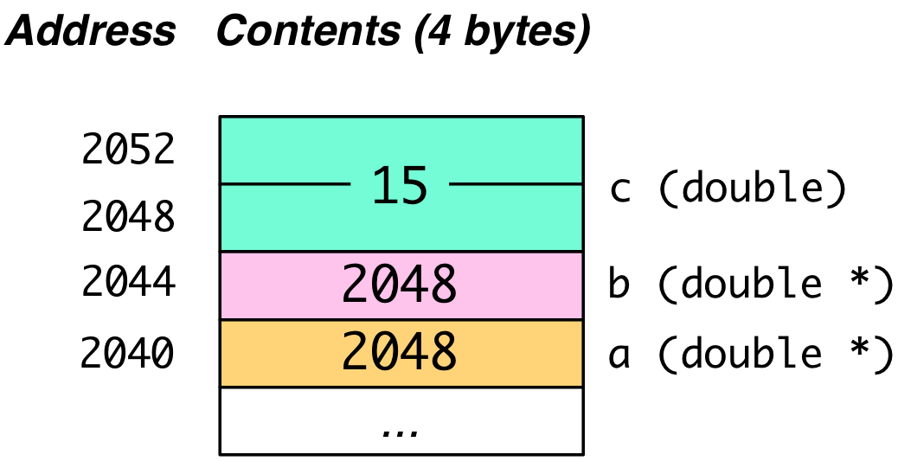

## CS 475 - Operating Systems

### Lab 2: Structs, Arrays, and Pointers

This is the second part of a multi-part primer on C. In this tutorial-assignment, you'll gain an appreciation for the way values and variables are stored in memory. You'll be introduced to pointers, as well as the connection between pointers and arrays.

#### Related Reading

- [Dive into Systems Chapter 2.1-2.3](https://diveintosystems.org/book/C2-C_depth/index.html)

#### Student Outcomes

- To understand how values and variables are stored in memory.
- To be familiar with the usage of `struct`s.
- To be familiar with type aliasing (`typedef`)
- To be familiar with pointers and references.
- To understand the connection between pointers and arrays.


#### Instructions

Open your VS Code and get connected to your Remote Development environment. If you don't know what I'm referring to, complete [Hwk 0](../hwk0.vscode).

  - Once you're logged in, you can open a terminal from the `Terminal` menu.


##### Part 0: Structs and Typedef

C is not an object-oriented language, but it does support object-like elements called `struct`. I like to think of `struct`s as classes in Java with only public fields and no methods. Let's see how it's used.

- To create a struct in C, you can use the following syntax:

  ```c
  struct structName {
      type0 field0;
      type1 field1;
      // ... other fields
      typeN fieldN;
  };
  ```

  Usually, the declaration of structs is done in a `.h` file that can be included anywhere the struct is referenced. Once a `struct` has been declared you can use it as a "cookie-cutter" to create "instances" of that type. For example, the following code uses a `struct` to store a point:

  ```c
  #include <stdio.h>
  #include <math.h>

  /**
   * Define a Point struct
   */
  struct Point {
      double xCoord;
      double yCoord;
  };

  /**
  * Finds distance between two points
  * @param u one point
  * @param v another point
  * @return distance between points u and v
  */
  double getDistance(struct Point u, struct Point v) {
      return sqrt(pow(u.xCoord - v.xCoord, 2) + pow(u.yCoord - v.yCoord, 2));
  }


  int main(int argc, char *argv[]) {
      struct Point p, q;  //declare two Points (yes the struct keyword is required -- for now)

      //set Points' location
      p.xCoord = 0;
      p.yCoord = 0;
      q.xCoord = 5.1;
      q.yCoord = 10.75;

      printf("The distance from p to q is: %.3f\n", getDistance(p,q));
      return 0;
  }
  ```

- **Important**

  - A `struct`'s fields (called *data members* in C) are assumed `public`. There is no such thing as `private` or `protected` in C. 
  - Like Java, data members are accessed using dot-notation (`var.field`). You'll see a very different notation once we start talking about pointers to structs though.

##### Important Aside: Aliasing Type Names with `typedef`

C allows us to give different names to data types. For instance, I could create an type alias `employee_t` to stand for `unsigned short int`, and use `employee_t` everywhere in my code, to improve code understanding. We do this using the following syntax:

```c
typedef <data type> <alias>;
```

- Let's alias `employee_t` to represent an `unsigned short int`. This makes for much more readable and manageable code:

  ```c
  #include <stdio.h>

  typedef unsigned short int employee_t;   //alias employee_t to unsigned short int

  /**
  * Returns a pointer to a string containing an employee's name
  */
  int getSalary(employee_t id) {
      //(code omitted)
  }

  /**
  * Main function
  */
  int main(int argc, char *argv[]) {
      employee_t employeeID;
      printf("Enter an employee id: ");
      scanf("%u", &employeeID);   // read input as unsigned int (%u) into employeeID.

      int salary = getSalary(employeeID);

      // (code omitted)

      return 0;
  }
  ```

- **Important** Typedefs are often used in conjunction with `structs`. For example, it's mildly annoying that we have to declare a `Point` variable named `p` using `struct Point p;` syntax. Using `typedef` totally optional here, but it *would* make the syntax a little more familiar to what we're used to seeing in Java, and certainly easier on the eyes:

  ```c
  typedef struct <structName> {
      //members
  } <structName>;
  ```

  We can now declare the `Point` struct as follows,

  ```c
  typedef struct Point {
      double xCoord;
      double yCoord;
  } Point;
  ```

  and now we can declare using `Point p;` and access its elements just like before: `p.xCoord` and `p.yCoord`.


##### Part 1: Understanding Variables - Data Types

A variable is a symbol that is associated with: (a) its data type and (b) its location in memory. To understand pointers, we need to have a grasp on both. We'll start discussion with the former. Consider the following code snippet:

```c
char letter = 'p';
int days = 365;
double amt = 90000.75;
```

Although high-level languages like C, Java, etc., hide it from us, the three variables have to exist *somewhere* in your computer's memory. Let's take a look at a make-believe snapshot of my computer's memory as it runs the code shown above.
You might recall from your architecture class that a **CPU word** is a unit of data transfer between memory and CPU. In these tutorials, we'll assume that a word is a block of four contiguous bytes (i.e., 32-bits).

In the figure below, only a word's start address is shown, but know that each byte within the word is addressable too. When a CPU requests the byte located at a certain address, say `1117`,  the *full* word ranging from address `1116` to `1119` is retrieved from memory and brought into one of the CPU's registers. The CPU then extracts the desired byte at `1117`. All of this is done behind the scenes hidden from the programmer.\

 

**Important C Operator: `sizeof()`**
Notice from the figure above that that an `int` takes up four contiguous bytes, a `char` requires just one byte, and a `double` requires eight. The specific space requirements for each data type actually vary across architectures, so how did I know these storage requirements apply to my machine? C provides an important operator `sizeof()` for this purpose. It inputs the name of a variable, a data type, or an expression, and returns the size in bytes that it occupies in memory. Let's see what it does.

```c
#include <stdio.h>

int main(int argc, char *argv[])
{
    char letter = 'p';
    int days = 365;
    double amt = 90000.75;
    double nums[10];

    printf("\n*** sizes of data types ***\n");
    printf("size of char: %lu bytes\n", sizeof(char));
    printf("size of short: %lu bytes\n", sizeof(short));
    printf("size of int: %lu bytes\n", sizeof(int));
    printf("size of long: %lu bytes\n", sizeof(long));
    printf("size of float: %lu bytes\n", sizeof(float));
    printf("size of double: %lu bytes\n", sizeof(double));
    printf("size of long double: %lu bytes\n", sizeof(long double));

    printf("\n*** sizes of vars ***\n");
    printf("size of letter: %lu bytes\n", sizeof(letter));
    printf("size of days: %lu bytes\n", sizeof(days));
    printf("size of amt: %lu bytes\n", sizeof(amt));
    printf("size of nums array: %lu\n", sizeof(nums));

    printf("\n*** sizes of constants and expressions ***\n");
    printf("size of 50: %lu bytes\n", sizeof(50));
    printf("size of '#': %lu bytes\n", sizeof('#'));
    printf("size of 54.999: %lu bytes\n", sizeof(54.999));
    printf("size of hello: %lu bytes\n", sizeof("hello"));
    printf("size of 3/2: %lu bytes\n", sizeof(3/2));
    printf("size of 0.5 * 400 / 2: %lu bytes\n", sizeof(0.5 * 400 / 2));

    return 0;
}
```

When I compile and run it, I get the following output.

```
*** sizes of data types ***
size of char: 1 bytes
size of short: 2 bytes
size of int: 4 bytes
size of long: 8 bytes
size of float: 4 bytes
size of double: 8 bytes
size of long double: 16 bytes

*** sizes of vars ***
size of letter: 1 bytes
size of days: 4 bytes
size of amt: 8 bytes
size of nums array: 80

*** sizes of constants and expressions ***
size of 50: 4 bytes
size of '#': 4 bytes
size of 54.999: 8 bytes
size of hello: 6 bytes
size of 3/2: 4 bytes
size of 0.5 * 400 / 2: 8 bytes
```

1. The unsigned integer that is returned by `sizeof()` is the number of bytes required to store that data. A couple other things worth pointing out about the code:

   <!-- - The `%lu` specifier means unsigned long integer, which is what is returned by `sizeof()`. In fact, if you dig into `sizeof()`, you'll see that it actually returns a type called size_t, which is an alias to an unsigned long. -->

   - **Lines 10-17**: We're now introduced to a few more data types (`short`, `long`, `long double`), which are all variants of the four original primitives. 

   - **Line 23:** shows how `sizeof()` can be used to determine the size of the array `nums` in bytes: 80, or `(10 * sizeof(double))`, bytes.

     ```c
     printf("size of nums array: %lu\n", sizeof(nums));
     ```

   <!-- - Line 27: a character constant is represented as an `int` (4 bytes on my machine). -->

   - **Line 28:** shows that a floating-point literal is interpreted as a `double`, not a `float`. (This is also true in Java.)

     ```c
     printf("size of 54.999: %lu bytes\n", sizeof(54.999));
     > 80
     ```

   - **Line 29**: the string literal `"hello"` occupies 6 bytes (not 5!) Why do you think this is?

     ```c
     printf("size of hello: %lu bytes\n", sizeof("hello"));
     > 6
     ```

   - **Line 30**: holds the result of an integer expression, which returns an `int`

     ```c
     printf("size of 3/2: %lu bytes\n", sizeof(3/2));
     > 4
     ```

   - **Line 31**: holds the result of a mixed arithmetic expression, which returns a `double`

     ```c
     printf("size of 0.5 * 400 / 2: %lu bytes\n", sizeof(0.5 * 400 / 2));
     > 8
     ```

2. Remember the `sizeof()` operator for later and for the future lab tutorial. `sizeof()` is one of the important built-in operators in C.

3. One of the benefits of a typed language like C and Java should be somewhat apparent now. When a programmer declares a variable's type, the executable files knows *exactly* how many contiguous bytes to read and write memory.

- **Practice Questions (not graded):**

  - Although a `char` requires just one byte of storage, most CPUs will insist on wasting, or "padding" the remaining 3 bytes (see figure above). Why do you think CPUs prefer this, instead of, say, having `amt` start from address `1117` to save you space? *(Ans: It's all about word-alignment. Recall that a unit of transfer between memory and CPU is a word. If we didn't pad the remaining unused bits of the word, then the start of the next data will begin in the same word, and must span across two words.)*

  - What is the point of an `unsigned integer`, and when would it be appropriate to declare an unsigned variable? Does it take up more space for an integer to be signed vs. unsigned? Does Java support unsigned integers? *(Ans: Recall from architecture that the most-significant bit, called the sign-bit, determines the +/- sign of that number. But the sign-bit wastes a bit! So a regular `int` can cover the range $$[-2^{31}, 2^{31}-1]$$), and an `unsigned int` can cover $$[2^{32}-1]$$. If you know that a value cannot be negative (such as salary or phone numbers), it is appropriate to use unsigned ints.*

  - If a `struct X` element was declared to contain a `char`, a `long`, and an array of 100 `doubles`, what is the size of each instance of `struct X`? *(Essentially, each instance of `struct X` would require 1 + 8 + 100 * 8 = 809 bytes, but it will actually take up 812 bytes for preserving word alignment)*

##### Part 2: Understanding Variables - Addressing

Every piece of data in your program, including variables and literals (e.g., 2, 3.14, etc.), is stored in two pieces: (1) its content, and (2) its address. We generally only have control over its content. It's up to your OS to find a location in memory for it. It is possible, however, for programmers to ask the system for the addresses of your data. This section focuses on the support for working with a variable's location in C. In particular, we will focus on three new syntax: the address-of operator (`&var`), the pointer-declaration operator (`type *var`), and the de-reference operator (`*var` and `var->field`).

1. Let's now consider the code below. Read through it before moving on.

   ```c
   char letter = 'p';
   int days = 365;
   double amt = 90000.75;

   int *ptr;       //declare pointer to an int
   ptr = &days;    //point ptr at days
   printf("There are %d days\n", days);
   printf("There are %d days\n", *ptr);

   (*ptr)--;   //decrement days by 1
   printf("There are now %d days\n", days);
   printf("There are now %d days\n", *ptr);

   //print addresses
   printf("Location of days: %p\n", &days);
   printf("Location of ptr: %p\n", &ptr);
   printf("Value of ptr: %p\n", ptr);
   ```

2. In this simplified example, we'll assume that the operating system places `days` in bytes **1112** to **1115**, `letter` in byte **1116**, and `amt` in bytes **1120** to **1127**.

3. Here is an example output when this program is executed.

   ```
   There are 365 days
   There are 365 days
   There are now 364 days
   There are now 364 days
   Location of days: 0x458
   Location of ptr: 0x8A2C
   Value of ptr: 0x458
   ```

4. Let's now go back and explain the source code.

   - On **Line 5**, we see a new kind of variable-declaration syntax:

     ```c
     int *ptr;       //declare pointer to an int
     ```

     This declares a new variable named `ptr`, and unlike anything we've seen before, it holds a memory address, which references an `int` value. In other words, `ptr` is a pointer to an integer. Of course, `ptr` is itself a variable that requires storage, and our figure shows that `ptr` itself is located in byte addresses `35372` to `35375`.

   - On **Line 6**:

     ```c
     ptr = &days;    //point ptr at the address of days
     ```

     The operator `&var` returns the address of `var`. Even though `day` occupies four bytes because it is an `int`, only the address of its first byte (**1112**) is returned. Thus, `ptr = &days` will assign **1112** to `ptr`. That's how pointers (called "references" in Java) work! They're just variables that store addresses to data.

   - **Line 8** introduces an important operation, called **dereferencing**.

     ```c
     printf("There are %d days\n", *ptr); // *ptr is used to chase the pointer to the content!
     ```

     Dereferencing is used when we're interested in uncovering the _content_ that's referenced by `ptr`. If we simply output the value of `ptr`, we'd still get **1112**, which is not what we want in this case. Therefore, when the objective is to "follow" the pointer to its destination, we use the  dereferencing operator `*var`, where `var` is a pointer variable. **(This irks me a bit, because the * operator now has 3 interpretations in C: multiply,  declaration of a pointer variable, and pointer dereference. Expect this to lead to headaches down the line.)**

   - On **Line 10**:

     ```c
     (*ptr)--;   //decrement the content of 'days' by 1
     ```

     Okay this is a strange one. `ptr` is first dereferenced to get the content `365`. It is then decremented to `364` and written back. *(What's the order of precedence? What would `*ptr--` do? What about `*(p--)`?)*

   - On **Lines 15-17**: shows that we can use the output specifier, `%p` to print an address (in hexadecimal).

     ```c
     printf("Location of days: %p\n", &days);
     printf("Location of ptr: %p\n", &ptr);
     printf("Value of ptr: %p\n", ptr);
     ```

     The addresses of `days` (0x458 == 1112) and `ptr` (0x8A2C == 35372) are first printed. This is followed by printing the contents of `ptr`, which unsurprisingly, stores the address of `days`.

- *Important:* In the examples above, we showed that the `&` operator returns only the address of the *first byte* of `days`, even though `days`  occupies the following three bytes as well. When we dereference `*ptr` on **Line 8** and **Line 12**, the system was *smart* enough to know that the next three bytes are part of `days` value. Had the program read anymore than three additional bytes, we would've gotten a much larger number, and had it read fewer than three bytes, it would've truncated our number. How the heck does the system know **exactly three** more bytes (and not zero, or one, or seven, or 1000) trailed first byte? (Ans: This is why we declare data types in the first place! When we told C that `days` is an `int`, the C compiler translates `int` to something equivalent to a 32-bit `DWORD` in the underlying assembly language. The compiler would also translate `double` to a 64-bit `QUAD WORD`, and so on.)

- **Practice Problems (not graded)**

  - We know that a pointer to an int (`int*`) occupies 4 bytes on my machine by calling `sizeof(int*)`. What would the size be for a pointer to a `char`, or a pointer to a `double`, or a pointer to some `struct` on my machine? 

  - You can also create a pointer to a `void` data type, which seems odd at first. Do some searching on the web, and figure out what a `void*` pointer means, and why it's useful. (Hint: Think generics in Java).

##### Part 3: Pointer Basics

Let's put everything together. There are three basic pointer concepts you have to master to succeed in this class:

1. Address-of Operator: Given a variable var, `&var` returns the address of var's location in memory.

2. A pointer variable stores the address of some data. This data can be a variable, an array, or even another pointer... To declare a pointer, you use the following syntax:

   ```c
   dataType *ptr;          //pointer to a dataType
   dataType *ptr1, *ptr2, *ptr3;   //multiple pointers
   ```

   When assigning a pointer `q` to another pointer `p`, it causes them both to point to the same data.

   ```c
   double *a = NULL, *b = NULL;
   double c = 10;
   b = &c; // point b at c
   a = b;  // point a at c
   ```

   - Memory contents after the declaration:\
     

   - Memory contents after the assignment statements on Lines 3, 4:\
     

   - You must first `#include <stdlib.h>` to get access to the `NULL` constant.

3. Dereferencing Operator: Given an already-declared pointer `ptr`, we use `*ptr` to access the value at the location referenced by `ptr`. As I lamented earlier, I wish we chose a different syntax for dereferencing, because `*ptr` already has a different meaning!
   ```c
   *b = 15; // dereference b! c is now 15
   *a += 5; // dereference a! c is now 20
   ```

- Memory contents after  `*b = 15`.\
  

- Memory contents after `*a += 5`.\
  

- **Practice Questions (not graded):**

  - What value does the `NULL` constant hold? Try printing out.
  
  - What happens to your program when you try to dereference a pointer to `NULL`? *(Ans:  In Java, you'd get the NullPointerException thrown, but there are no such things as Exceptions in C... This really is something you should try out in C.)*

  - **Do this. For real.** Write a function `void compareAndAssign(int n, int m, int *larger, int *smaller)` that puts the larger of `n` and `m` in `larger` and the smaller value in `smaller`. How would you call this function? (If you need help figuring this out, read on to the next section and try again.)

##### Part 3: Pointers as Input Parameters

1. Consider the following function used to swap the values of two integer variables:

   ```c
   void swap(int *x, int *y) {
     int tmp = *x;  // dereference x and store value in tmp
     *x = *y;
     *y = tmp;      // you don't need to deference `tmp` (why)?
   }

   // later on ...

   int a = 10, b = 20;
   swap(&a, &b);
   printf("%d\n", a); // 20
   printf("%d\n", b); // 10
   ```

   How would you call this function? The method inputs two pointer parameters. Therefore, you have to pass the addresses of (using `&`) the variables you want to swap. Trace execution of calling `swap()` by drawing out the memory contents like you saw me do in earlier examples.
   
2. This version of swap doesn't work.  Can you see why?

   ```c
   void swap2(int *x, int *y) {
       int *tmp = x;
       x = y;
       y = tmp;
   }

   //(code omitted)
   //...
   int a = 4, b = 3;
   swap2(&a, &b); //swap?
   ```

3. Consider a final version of swap that accepts two variables (not pointers) as input. Will this method work? Trace its execution.

   ```c
   void swap3(int x, int y) {
       int *x_ptr = &x;
       int *y_ptr = &y;
       int tmp = *x_ptr;
       *x_ptr = *y_ptr;
       *y_ptr = tmp;
   }

   //(code omitted)
   //...
   int a = 4, b = 3;
   swap3(a,b); //swap?
   ```

##### Part 4: Function "Output" Parameters
Have you ever wished that a function/method could return more than one thing? To do this Java, you always had to create a new class that stored multiple values, or returned an array. You can also do any of the above in C, but pointers give us another way to emulate "returning" multiple values (without actually calling `return` to do it).

 **"Output Parameters"**: An output parameter refers to a pointer that is input into a function, and the function modifies its contents before exiting. After the function call, one just needs to dereference the pointer to obtain the updated value(s).

   - You've also seen this in action already when you used `scanf()` to accept user input. For example, when `scanf("%d", &var)` is used, we input the address of `var` (i.e., a pointer), and we expect the contents of `var` to have changed afterwards.

   - I strongly recommend that you clearly name and comment when a parameter is an output parameter. For instance:

     ```c
     void sum(int inX, int inY, int* outSum) {
       *outSum = inX + inY;
     }
     ```

   - In practice you often see the above function written out like this:

     ```c
     void sum(
       int x,    /* IN */
       int y,    /* IN */
       int* sum  /* OUT */) {
       *sum = x + y;
     }
     ```

   - Here's another example:

     ```c
     #include <stdio.h>

     typedef struct Student {
      float gpa;
      char name[25];
     } Student;

     /**
     * Clears a GPA to 0
     * @param gpaOut (OUT) A pointer to the GPA to be cleared
     */
     void clearGPA(float *gpaOut) {
       //de-reference pointer, clear the value
       *gpaOut = 0.0;
     }

     int main(int argc, char *argv[]) {
       Student stu;

       printf("Enter a name: ");
       scanf("%s", &stu.name);  //value expected in stu.name
       printf("Enter a GPA: ");
       scanf("%f", &stu.gpa);

       printf("Name: %s, GPA: %.2f\n", stu.name, stu.gpa);
       clearGPA(&stu.gpa);  //stu.gpa gets cleared
       printf("Name: %s, GPA: %.2f\n", stu.name, stu.gpa);

       return 0;
     }
     ```

     ```
     Enter a name: David
     Enter a GPA: 4.0
     Name: David, GPA: 4.00
     Name: David, GPA: 0.00
     ```

##### Part 5: Connection to Arrays (Pointer Arithmetic)
In this section, we'll explore the relationship between pointers and arrays (and strings).
    
1.  Study the following source file, then compile and run it.

    ```c
    #include <stdio.h>

    #define BUFFERSIZE 4

    int main(int argc, char* argv[])
    {
        int arr[BUFFERSIZE] = {9,8,7,6};
        int i;

        printf("*** where is arr[0] stored? ***\n");
        printf("arr[0] location: %p\n", &arr[0]);

        printf("\n*** where is arr stored? ***\n");
        printf("arr location: %p\n", arr);

        printf("\n*** print out contents using pointer arithmetic ***\n");
        for (i = 0; i < BUFFERSIZE; i++)
            printf("%d ", *(arr+i));

        printf("\n\n*** print out contents using familiar subscript syntax ***\n");
        for (i = 0; i < BUFFERSIZE; i++)
            printf("%d ", arr[i]);

        return 0;
    }
    ```

2.  Arrays represent a contiguous sequence of elements in memory. It is therefore not surprising to find `arr` being represented as in the figure below, with each `int` element occupying 4 bytes. When compiled and executed, this program outputs something akin to the following:

    

    ```
    *** where is arr[0] stored? ***
    arr[0] location: 0x4318

    *** where is arr stored? ***
    arr location: 0x4318

    *** print out contents using pointer arithmetic ***
    9 8 7 6

    *** print out contents using familiar subscript syntax ***
    9 8 7 6
    ```

3.  Looking at the source code,

    - **Lines 11 and 14**: Suppose we want to find the address of the 0th
      element in `arr`. We can simply apply the `&` operator on element `arr[0]` to get its address:

      ```c
      printf("arr[0] location: %p\n", &arr[0]);
      ```

      The code on **Line 14**, however, may be slightly unexpected, and it's equivalent! There's no address-of operator (that's not a typo!)

      ```c
      printf("arr location: %p\n", arr);
      ```

      It would appear that an array's variable name is **already** a pointer to the location of its 0th element! By the way, `0x4318` is hexadecimal for `17176` (for the figure below).

    - **Line 16-18**: Knowing this, let's try something else. Because  `arr` is just a pointer, can we also dereference it to access the array elements? Yes!!

      - `*(arr+0)`, or simply, `*arr` returns 9!

      **Pointer Arithmetic** Exciting! How would we access the array element at index 1? The runtime is smart enough to know that the next element is 4 bytes away because the array was declared to store `int`s. So adding 1 to the pointer will automatically skip the next 3 bytes and move the pointer to the next item in the array!

      - `*(arr+1)` returns 8
      - `*(arr+2)` returns 7
      - `*(arr+3)` returns 6

    - **Line 20-22 (Important!)** Finally, the array indexing syntax `[i]` we're all familiar with, is merely a convenience for programmers: Indeed, `arr[i]` is _actually_ just a shorthand for `*(arr+i)`

      - (Full circle now -- Zero-based Addressing): This may have only come up briefly in a previous course, but now we can appreciate why array indices are **0-based** in just about every language, and it's due to pointer arithmetic! If we store the first item in location `[1]`, then the C compiler would need to subtract 1 when performing each array index lookup. That's just an unnecessary overhead!

4.  **Arrays are passed into functions by reference:** Now that we know an array variable is just the address of its 0th element, take a look at the following functions that manipulate the array. Each of the following functions have the same effect (initializes all elements to -1)! Make sure you read through each and understand why.

    ```c
    void initArray(int A[], const int SIZE) {
      int i;
      for (i = 0; i < SIZE; i++) {
          A[i] = -1;
      }
    }

    void initArray2(int *A, const int SIZE) {
      int i;
      for (i = 0; i < SIZE; i++) {
          A[i] = -1;
      }
    }
    ```

    **Important side note:** Because arrays are passed as pointers, you can now appreciate why modifications to arrays persist after the function terminates (this is also true in Java!).

<!-- 5.  Here's another example with char arrays (strings). Take a look at the code below, where we define a function `strToUpper(char *s)`:

    ```c
    #include <stdio.h>

    /**
    * Converts given string to upper case
    * @param s A pointer to a string
    */
    void strToUpper(char *s) {
        while (*s) {
            if (*s >= 'a' && *s <= 'z') {
                *s -= 32;   //convert character to to upper case (offset by -32 in ASCII)
            }
            s++;    //move to next character
        }
    }

    int main(int argc, char *argv[]) {
        char univ[] = "puget sound";
        strToUpper(univ);
        printf("%s\n", univ);
        return 0;
    }
    ```

    - **Line 7**: the input parameter `char *s` declares a pointer to a `char`, which we know can _also_ be interpreted as the 0th element in an array of chars. Strings are always input into functions with a type of `char *`.

    - **Line 9:** checks the dereferenced value of pointer `s` to see if we've reached the end of the string. This syntax looks strange, so let's unpack it.
      - Recall that `*s` is an attempt to dereference the pointer `s`.
      - `s` is initially pointing to the 0th character in the string. Once dereferenced, it will return the character at that location, which generally has a non-zero value (recall that any non-zero value is interpreted to be `true`).
      - Remember that all strings must end with the null character `'\0'`, which has an integer value of `0` (implying boolean `false`).
      - Putting it all together: the loop will run for each character in the string, until the null character is reached.

    - **Line 11-12:** checks to see if the character currently being pointed to by s is a lower case letter, and if it is, subtract by 32, which is the offset from its upper-case counterpart.

    - **Line 13:** this will move to pointer to the next element in sequence in memory. Because `s` points to a `char`, we know from pointer arithmetic that the `++` operator moves the pointer (since `sizeof(char) == 1`).

    - **Line 19:** The main function creates a string and we assume it is placed in bytes 272372 to 272383.

    - **Line 20 (and Line 7):** calls `strToUpper(univ)`, which implicitly creates a pointer variable `s` that refers to the first character in `univ`. The memory contents at this point is shown below:\
      \
      Right before `strToUpper()` returns, the memory contents are shown below:\
      \
      Every time `s++` is called (Line 13), it increments the pointer to the next character in `univ`. Eventually, `s` points to `univ[11]`, allowing it to break out of the loop. -->

<!-- 
###### Do these exercises (not graded):

- The following is a well-known function. What does it do?
  ```c
  void mystery(char *s, char *t) {
     while (*s++ = *t++) { //assignment, not equivalence (i.e., not a typo)
         ;
     }
  }
  ```
- Using pointer arithmetics, implement the string function `strcat(char *s, char *t)`, which concatenates the string referred to by `t` to the end of the string referred to by `s`. -->

#### Credits

Written by David Chiu. 2022.
