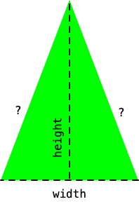

## CS 161 - Intro to Computer Science

### Lab: Variables and Scope

In this lab, you'll get familiarized with the concepts of data types, variables, assignment statements, and scope. You'll be modifying the `Triangle` shape class to add some functionalities.

#### Student Outcomes

- To understand variable assignment statements
- To understand the difference between local and object (instance) scope
- To understand the lifetime of certain variables


#### Required Files

The following file(s) have been provided for this lab.

- [Lab_Triangle.zip](Lab_Triangle.zip)


#### Part 1: Instance Variables

**Read this, don't skim**

In Java (and other programming languages), a **variable** is a storage unit for data. Think of variables as boxes in which you can assign values. Before you can use a variable, the programmer must first declare the nature of data the box can store (called its **Data Type**). You have already seen several common data types: `int`, `double`, `String`, and `boolean`. The programmer should also give each variable a good name to avoid confusion later on. 

The particular kind of variable that we have been using thus far in lectures is used to store an object's state. We call these **instance variables** or **fields**. Later in lab, we'll introduce you to a couple other types of variables, each with different usages. Recall the basic class syntax, shown below.

```java
/**
 * Some comment about the class as a whole.
 * @author David
 */
public class SomeClassName {
    /* INSTANCE VARIABLES GO HERE */

    /* CONSTRUCTORS GO HERE */

    /* METHODS GO HERE */
}
```

You can declare any number of instance variables in your class. When you need one, you must first declare it using the following syntax:

```java
private data-type variable-name;
```


1. Open up the Triangle class, find the section of code (usually towards the top of the class) that lists all the instance variables. Modify it to store 2 new instance variables: `area` and `perimeter`. It doesn't matter if these go first or last in line of your instance-variable segment. Before you declare each one, you ought to be thinking ahead --- what nature of data does each hold? Integers? Strings? Doubles? Something else? (We're talking triangles after all... do you remember how to calculate areas and perimeters of triangles? What kind of value do you need to capture?) Choose the right data types, and declare `area` and `perimeter` two now.

2. Back in the BlueJ project window, click the compile button, and then *instantiate* a new `Triangle` object. Then inspect its state by double-clicking on the new object. You should see the two new instance variables you just declared, but alas, they show up as zeroes.

    - It's important to use this moment to reflect. Even though you gave these instance variables good names that indicate what they are, they don't just magically get values. (Computers are morons!) It's up to *the programmer* to assign values to these instance variables, and to always keep track of them if the triangle ever changes size.

3. Let's start by thinking about all the places where the `area` and `perimeter` need to be assigned values.

    - The first place is in the code that runs when `Triangles` get created -- Remember that we called the object-creation code the **constructor**. Find the constructor code, which usually appears right after all your instance variables. It should look something like this:

      ```java
      public Triangle() {
        // code omitted here
      }
      ```

    - Update the constructor code to assign values to `area` and `perimeter`. The syntax to assign a value to a variable is:

        ```java
        variable-name = expression;
        ```
        where `expression` is some Java or mathematical expression. For instance, if I were assigning the area of a *square*, my expression would be `area = width * length;` (assuming `width` and `length` are the instance variable's names.)

      - You may want to lookup (on Google) on how to calculate the area and perimeter of an *isosceles triangle*, given its `height` and `width`. Here's a hint for perimeter though. In the figure below, you know the width and height of the Triangle, so you just need to figure out the length of the sides, which you can determine using Pythagorean Theorem.

          - If you need to take the square root of some value `xxxx`, you can use the Java method `Math.sqrt(xxxx)`. Also, to take `a` to the `b`th power ($$a^b$$), you can use `Math.pow(a, b)`. 

        


4. Compile your source code, and instantiate a new `Triangle` to see if your `area` and `perimeter` instance variables are now populating. If you did everything above correctly, you should've gotten `600.0` for area and roughly `112.11` for perimeter.

5. Is this the only place where a triangle's `area` and `perimeter` need to be assigned? Wasn't there a method to *change* a triangle's size? Find *that* method, and make sure you reassign values to `area` and `perimeter` in there to reflect the new dimensions. Test again to make sure everything's working.

#### Part II: Local Variables
We know that instance variables store an object's current *state*. But that's not the only kind of variable that exists. In Java, there are actually four kinds of variables:
  - **Instance Variables:** These variables are used to store values pertaining to an object's state. They exist until the object is deleted (or when your program terminates).
  - **Local Variables:** These variables are used for temporary storage within a method or constructor. They exist until you exit the segment of code (that is, the code within curly braces `{` ... `}`) in which the local variable was declared.
  - **Input Parameters:** These variables are used to accept input data in order to run a method or constructor. They exist  until the method or constructor exits.
  - **Static Variables** (We'll cover these later in the semester)

In this section, let's focus on local variables, so you can appreciate when they should be used.

1. Find the `moveHorizontal()` method in your source code. Here's what it should look like:
    ```java
    public void moveHorizontal(int distance) {
        erase();
        xPosition += distance;
        draw();
    }
    ```
    - Studying its algorithm, this method does nothing more than simply erasing the Triangle off the canvas, updating the `xPosition`, then drawing the Triangle back on the canvas. The erasing and re-drawing happens so quickly that it appears as if the Triangle moved places instantly.

2. Suppose we now want the Triangle to output (print) its *old* coordinate position before the Triangle moved. To do that, we need to *save* its old x and y positions *before* they get updated in the `moveHorizontal()` code. To save the current positions, we'll need to introduce two variables  (one for each coordinate).

3. For now, add two **instance variables** near the top of the source code, and you can name them `oldXPosition` and `oldYPosition`. Go back to your notes (or book) to see the syntax for declaring new instance variables. 

4. Then go back in your `moveHorizontal()` method, and assign the current x and y positions to the `oldXPosition` and `oldYPosition` instance variables anytime before `xPosition` is updated.

5. Now, below the call to `draw()`, print out the old positions and the new positions. Recall that, to print something to the screen, you can use this syntax:

    ```java
    System.out.println("string-you-want-printed");
    ```
    But if you need to evaluate variables in your print-out, then you need to concatenate (`+`) the variables to the string you want printed. For instance:
    ```java
    System.out.println("string-you-want-printed" + some-variable + "more-string" + another-variable);
    ```

    For instance, the following will print something to the effect of: `"Old X is 50"` on the *same* line.
    ```java
    System.out.println("Old X is " + oldXPosition);
    ```
    Play with the string to print both old X and old Y values on the *same* line.

6. Test it out and see if everything's working before moving on.

7. Once everything checks out, inspect the `Triangle`'s state and you should see the `oldXPosition` and `oldYPosition` instance variables. **But this begs the question:** Why are a Triangle's *old* positions even stored as part of its state? *You should always ask yourself these questions when you declare new variables:*
    - Would the object benefit from memorizing these new values in the future? Should these variables be an intrinsic part of the object's state of existence? (If so, the variable should be an instance variable.)
    - Are the new variables used in only one or two methods, and serve no purpose elsewhere? Is it okay for these variables to be destroyed as soon as the method exits? (If so, the variable should be a local variable.)

8. The purpose of these questions is to gauge whether you need variables everywhere, or just inside a method or two.

    - In our case, `oldXPosition` and `oldYPosition` serve a very specific purpose inside only one method!
    - This suggests that `oldXPosition` and `oldYPosition` do not need to be instance variables.

9. Remove the two instance variables `oldXPosition` and `oldYPosition` from the top of your source code. Go back in your `moveHorizontal()` method and declare the variables within. The major difference in syntax is that, you must remove the `private` keyword when declaring local variables. This ought to do:

    ```java
    public void moveHorizontal(int distance) {
        //declare local variables (there's no private keyword!)
        int oldXPosition;
        int oldYPosition;
 
        // remainder code omitted
    }
    ```

10. After you've made these changes, compile and create another `Triangle`. Move it around horizontally to ensure that the print-outs are working. Now double-click on the `Triangle` object and you should find that the `oldXPosition` and `oldYPosition` instance variables are no longer a part of its state.

    - **Tip: Keep the set of instance variables as tidy as possible.** Less state (i.e., fewer instance variables) is generally preferable. Having too many instance variables could mean that the programmer may lose track of variables and have too much to manage in the future.


#### Part III: Input Parameters
The last type of variables in Java are called "input parameters." These allow users to provide values (values given to input parameters are called **arguments**) to a constructor or a method. 

1. Find the `moveHorizontal()` method again, and you only need to examine the first line of the method. Here it is:

    ```java
    public void moveHorizontal(int distance)
    ```

2. This method accepts one input parameter `int distance`. In fact, this method can't even be executed until the caller inputs a valid argument for `distance`. 
    - If your method or constructor accepts multiple input parameters, then you must separate each one with a comma.
    - The `distance` parameter captures the given argument, and it can be treated as a local variable in the code for `moveHorizontal()`.

3. Therefore, input parameters are nothing more than local variables to the method, except that they capture the values of given arguments! Input parameters are destroyed when the method finishes.

4. Write a new `public Triangle(int startingHeight, int startingWidth)` constructor that accepts the starting height and width. You may name these input parameters `startingHeight` and `startingWidth` (honestly, you can name them whatever you like as long as their names make sense and are legal). 
    
    - Next, assign the instance variables `height` and `width` to these starting values in order to save them.
    
    - All other instance variables still need to be assigned to the old values, so you can basically copy and paste the old constructor. 
    
5. Test out your code to ensure that you can now create Triangles of customized `height` and `width`.

    - You might as well ensure that the perimeter and areas still check out too!

6. Create a new method `changeSizeAndColor()` that accepts 3 parameters, a different `width`, `height`, and `color`. Put in the code to change its size and color concurrently. To help do this, you should be calling existing methods instead of copying-and-pasting code.
    
#### Part IV: Writing Effective Comments

I've mentioned that effective commenting is an important habit for programmers to form. The reason is for documenting your code for posterity. There are generally two types of comments that I look for when grading: *line comments* and *Javadocs comments*.

**Line comments** are free-form. They are used to describe blocks of code that you write. Their syntax is easy to remember. For instance:

```java
public void moveHorizontal(int distance) {
    // This is a line comment!
    erase();
    xPosition += distance;
    draw();

    // This is another line comment!
}
```
Use line comments whenever you've written a chunk of code and its purpose and function may not be obvious.

**Javadocs (block) comments** are more structured. You should write a Javadocs comment on top of every class definition, on top of each constructor, and on top of each method. For instance. Here's an example class comment:

```java
/**
 * This is a class that simulates cars. blah blah blah
 * @author David
 * @version 1/26/2023
 */
public class Car {
    // code omitted
}
```

Here's a Javadocs comment for a method:

```java
/**
 * This method moves a Triangle horizontally by the 
 * given distance.
 * 
 * @param distance A distance (in pixels) to displace
 */
public void moveHorizontal(int distance) {
    // This is a line comment!
    erase();
    xPosition += distance;
    draw();
}
```

Note the use of `@tags` in the Javadocs comments. Go ahead and add comments to the new constructor and method that you wrote for this lab. If your method or constructor requires multiple input parameters, then you should list each `@param` in your Javadocs comment on a separate line.

#### Grading

```
This assignment will be graded out of 2 points, provided that:

- You were in attendance and on-time.
- Your Triangle class is fully modified.
```

#### Submitting Your Assignment
Follow these instructions to submit your work. You may submit as often as you'd like before the deadline. I will grade the most recent copy.

- Navigate to our course page on Canvas and click on the assignment to which you are submitting. Click on "Submit Assignment."

- Upload all the files ending in `.java` from your project folder.

- Click "Submit Assignment" again to upload it.

#### Credits

Written by David Chiu. 2023.

#### Lab Attendance Policies

Attendance is required for lab. Unexcused absence = no credit even if you turned in the lab. Unexcused tardiness = half credit.
